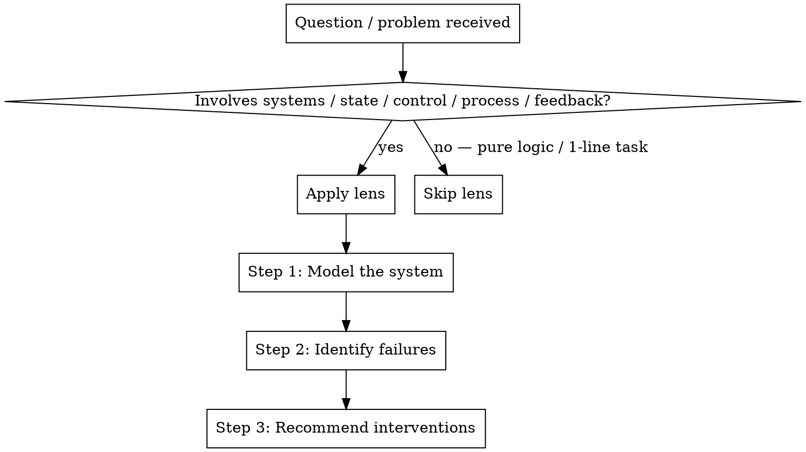

# Cybernetics Lens — Qian Xuesen 工程控制论应用方法论

A reusable analytical lens for system / architecture / process / debug problems.
Distilled from Qian Xuesen's *Engineering Cybernetics* (1954, 钱学森《工程控制论》).
Used by `wayne-cybernetics` (explicit invocation), `wayne-mind-explode` (during system
design), `wayne-code-review` (during architectural review).

---

## Foundational Quote

> 工程控制论的目的是把工程实践中所经常运用的设计原则和试验方法加以整理和总结，
> 取其共性，提高成科学理论，使科学技术员获得更广阔的眼界，用更系统的方法去观察
> 技术问题，去指导千差万别的工程实践。
> — 钱学森《工程控制论》

> Engineering Cybernetics aims to organize the design principles used in engineering
> practice into a discipline, exhibit the similarities between different areas of
> engineering practice, and emphasize the power of fundamental concepts.
> — Qian Xuesen, *Engineering Cybernetics* preface (1954)

The lens applies the **same 8 principles** across:
- 代码架构 (code architecture)
- 调试 / 根因分析 (debugging / RCA)
- 流程设计 (process / workflow design)
- 知识管理 (knowledge / documentation systems)
- 提示词工程 (prompt / agent control plane)

---

## How to Apply (Decision Tree)



**Step 1 — Model the system.** Always run Principle #1 first. If you cannot name
Plant / Controller / Setpoint / Disturbance / Feedback, stop and ask.

**Step 2 — Identify failures.** Walk principles #2–#8 as diagnostic checks. Each
principle has a one-line diagnostic question.

**Step 3 — Recommend interventions.** Each violation maps to a concrete action.

---

## The 8 Principles

### 1. 系统建模 (System Identification)

> 找出能够完全描述系统状态的全体变量，区分为输入量、受控量和控制量等同类别，
> 把表现为机械的、电的、光的、声的各种物理信号形式的变量从各种随机因素和噪声中
> 提取出来，确定各变量在各种不同条件下的变化规律。
> — 钱《工程控制论》第三章 系统辨识

**Diagnostic**: Can you name all 5?
- **Plant** (受控对象) — what is being controlled
- **Controller** (控制器) — what issues control signals
- **Setpoint** (设定值) — desired state
- **Disturbance** (扰动) — what perturbs the system
- **Feedback** (反馈) — how state-of-plant returns to controller

If you can't name them, you don't yet understand the problem.

| Domain | Plant | Controller | Setpoint | Disturbance | Feedback |
|---|---|---|---|---|---|
| Code | runtime | code structure + tests | spec | edge cases, requirements drift | tests, observability |
| Debug | failing system | telemetry + repro | bug fixed | unknown failure modes | log signal, repro pass/fail |
| Process | team | SLA / runbook | on-time delivery | priorities, attrition | retros, metrics |
| KB | knowledge graph | docs + indexing | findability | drift, turnover | search hit rate, dead links |
| Prompt | LLM agent | CLAUDE.md + skills + hooks | desired behavior | context pressure, model drift | user correction, hook denial |

---

### 2. 可观测性 (Observability)

> 能观测性是指系统内部行为由输出的可反映性，是控制系统分析和综合的基础，
> 构成控制论中有决定意义的基本特性。
> — 钱学森，可观测性定义

**Diagnostic**: If this rule / state / behavior is violated, can I observe it externally within N seconds?

If no → the rule is **open-loop noise**, not a constraint. Either make it observable or delete it.

| Domain | Observable form | Unobservable form (bad) |
|---|---|---|
| Code | unit test, type check, lint | code comment "TODO: don't do X" |
| Debug | repro command + assertion | "I think the bug is in module Y" |
| Process | dashboard alert, SLA monitor | runbook step "remember to do X" |
| KB | broken-link checker, search log | doc page that may or may not exist |
| Prompt | hook denial, tool-output regex | CLAUDE.md rule LLM may ignore |

**Test**: write the observation command. If you can't write it, the thing is unobservable.

---

### 3. 可控性 (Controllability)

> 一个系统是否可控，本质是问：通过控制输入能否在有限时间内把系统从任意初始状态
> 驱动到任意目标状态。

**Diagnostic**: Does this control input actually cause behavior change? Or does the system ignore it?

LLM agents under context pressure ignore prompts. Humans under deadline ignore docs. Both make those control inputs **non-effective**, not weaker.

| Control type | Effectiveness | When to use |
|---|---|---|
| Hook / mechanical gate | Closed-loop, deterministic | Critical invariants (commit format, no-prod-write) |
| Code (validator, type) | Closed-loop, deterministic | Semantic constraints |
| Test | Closed-loop, after-the-fact | Behavior verification |
| Prompt rule | Open-loop, hopeful | Default behavior, philosophy |
| Doc / comment | Open-loop, hopeful | Reference, education |
| Verbal agreement | Open-loop, ephemeral | Negotiation, alignment |

**Closed-loop > open-loop.** When a rule MUST hold, mechanize it. ([claude-ctrl thesis](https://github.com/juanandresgs/claude-ctrl): *"an instruction that lives only in model context is not a constraint"*.)

---

### 4. 单一控制源 (Single Source of Truth)

> 多个控制器同时对同一被控变量发出指令时，系统输出由信号冲突的解析方式决定，
> 而非任一控制器的预期。
> — 派生原理 (control contention theorem)

**Diagnostic**: How many places declare this rule / state / configuration?

> 1 = drift risk. The system's output becomes a tie-break of which copy wins, not a function of intent.

| Domain | Single SoT example | Multi-source anti-pattern |
|---|---|---|
| Code | one pydantic model, derived views | same field in 3 dataclasses, all liable to drift |
| Config | one .env, app reads it | env var + config.json + CLI flag for same param |
| Process | one Jira board, doc references it | Slack thread + email + Jira all carry "the plan" |
| KB | one canonical doc, others link | same content copied to 3 wiki pages |
| Prompt | CLAUDE.md (Layer 0), skills inherit | 9 skills declare Language Rules, drift |

**Action**: if N > 1, pick the canonical, demote others to references.

---

### 5. 分层控制 (Hierarchical Control)

> 控制论从基础理论 → 技术科学 → 应用技术三个层次组织。
> — 钱学森《论技术科学》(1957)

**Diagnostic**: At what layer does this rule / decision / state belong?

| Layer | Lifetime | Change rate | Examples |
|---|---|---|---|
| L0 — Invariants | Always-on | Slow (~years) | KISS, SSoT, language rules, commit format |
| L1 — Stage controllers | Per workflow stage | Medium (~months) | wayne-plan workflow, code-review process |
| L2 — Templates / shared subroutines | Per artifact | Fast (~weeks) | plan-template.md, lesson-template.md |
| L3 — Instance | Per task | Very fast (~hours) | this PR's plan.md, this checkpoint |

**Anti-pattern**: putting L0 invariants in L1 stage docs (drift), or putting L3 specifics in L0 (bloat).

| Domain | Correct stratification |
|---|---|
| Code | L0: type system / lint; L1: module conventions; L2: code templates; L3: this function |
| Debug | L0: scientific method; L1: bisect protocol; L2: repro template; L3: this bug's hypothesis |
| Process | L0: company values; L1: team SLAs; L2: incident template; L3: this incident |
| KB | L0: KB schema; L1: tag taxonomy; L2: note templates; L3: this note |
| Prompt | L0: CLAUDE.md; L1: wayne-* skills; L2: shared lens / templates; L3: this session |

---

### 6. 信噪比 (Signal-to-Noise)

> 在有限带宽信道中，每比特噪声压缩等量信号容量。
> — 信息论延伸 (Shannon, applied to control)

**Diagnostic**: How much attention does this consume vs how much control value does it provide?

System prompt / LLM context / human attention are all **finite-bandwidth channels**.
Adding a low-value rule **displaces** a high-value rule — the channel doesn't grow.

| Domain | Signal | Noise (cuts signal) |
|---|---|---|
| Code | targeted test, named function | dead code, generic comments, "TODO 2019" |
| Debug | minimum repro, hypothesis under test | "tried lots of things", everything-grep |
| Process | one priority of the week | 17 OKRs all P0 |
| KB | searchable lessons | 200-line meeting notes nobody reads |
| Prompt | one clear rule per behavior | 4 paraphrases of the same rule across 9 files |

**Test**: would deleting this line cause the LLM / engineer / process to fail?
- If yes: signal, keep.
- If no: noise, cut.

---

### 7. 最小作用 (Minimum Control Effort)

> 以最小代价（能量、时间、资源）达成控制目标。
> — 钱《工程控制论》第八章 最优控制

**Diagnostic**: What's the smallest rule set that achieves the desired outcome?

Each added rule is overhead (S/N tax + drift surface). Stop adding when the marginal rule prevents fewer failures than it creates.

| Domain | Minimum-effort form |
|---|---|
| Code | smallest abstraction that captures the variation; delete configs whose default is right |
| Debug | one targeted change per iteration, observe the delta |
| Process | smallest checklist that catches the failure mode |
| KB | shortest note that conveys the lesson; don't restate |
| Prompt | shortest rule that changes LLM behavior; verify with eval, not feel |

**Test**: PR's net line count negative? 3 PRs in a row positive → time for a cleanup PR. (See CLAUDE.md "Delete > Add".)

---

### 8. 反馈与稳定 (Feedback Stability)

> 没有反馈通道的系统是开环的，初始扰动无法被纠正，长期不可避免发散。

**Diagnostic**: Does this rule / decision / change have a feedback channel? How fast does the loop close?

Open-loop systems drift. Closed-loop systems with slow feedback oscillate. Tight closed-loop is stable.

| Domain | Open-loop (drifts) | Closed-loop (stable) | Feedback latency |
|---|---|---|---|
| Code | code without tests | code + tests + CI | seconds (test) → minutes (CI) |
| Debug | guess + ship | hypothesis + repro + verify | seconds (repro) |
| Process | "let's try this for a quarter" | weekly retro on the change | 1 week |
| KB | write doc, never check usage | search-log analytics | 1 month |
| Prompt | edit prompt, hope for best | A/B eval before/after | hours (eval suite) |

**Action**: every important change needs a feedback channel. If you can't think of one, the change is open-loop and will drift.

---

## Cross-Cutting Diagnostic Questions

When applying the lens to any problem, walk this checklist:

```
□ Step 1: System modeling — name Plant / Controller / Setpoint / Disturbance / Feedback
□ Step 2: Observability — can violations be observed externally?
□ Step 3: Controllability — does the control input actually change behavior?
□ Step 4: SoT — how many declarations of this rule/state? (N > 1 = drift)
□ Step 5: Stratification — at what layer (L0-L3) does this belong?
□ Step 6: S/N — value provided vs attention consumed?
□ Step 7: Minimum effort — smallest rule set that works?
□ Step 8: Feedback — what channel closes the loop? How fast?
```

Failing checks are findings. Each finding gets a recommended intervention.

---

## Worked Example — How CLAUDE.md Refactor Used the Lens

Applied to Wayne's CLAUDE.md + wayne-* skills (May 2026 refactor):

| Step | Finding | Action |
|---|---|---|
| #1 modeling | Plant=LLM, Controller=CLAUDE.md+wayne-*, Setpoint=Wayne behavior, Disturbance=context pressure, Feedback=user correction | named explicitly |
| #2 observability | most prompt rules are open-loop — LLM may ignore | identified hook candidates (commit, uv, .venv, mcp blocks) |
| #3 controllability | "no git commit" via prompt = open-loop; via hook = closed-loop | logged hook migration as follow-up |
| #4 SoT | Language Rules in 9 places (CLAUDE.md + 8 wayne-*) | centralized to CLAUDE.md, added Inherits-from header |
| #5 stratification | invariants (L0) mixed with stage workflow (L1) and inline templates (L2) | restructured into 3 layers; templates moved to wayne-X/templates/ |
| #6 S/N | inline templates (~325 lines per skill load) crowded out workflow signal | extracted templates → only loaded when writing |
| #7 min effort | many redundant restatements added zero control value | net -193 lines per-load context |
| #8 feedback | refactor itself has no eval (TODO: round-trip test) | added Phase 6 audit checks (grep + line count) |

**Result**: 9 drift points → 1; per-load context −193 lines; no behavior change expected; testable via grep audit + round-trip pipeline test.

---

## References

- 钱学森《工程控制论》(1954 英文版,1958 中文版,2007 上海交大新版) — primary source
- 钱学森《论技术科学》(1957) — three-tier framework (基础理论 / 技术科学 / 应用技术)
- 上海交通大学钱学森图书馆 — http://www.qianxslib.sjtu.edu.cn
- Wikipedia 中文 — 工程控制论 — https://zh.wikipedia.org/zh-hans/工程控制论
- engineering.org.cn — 钱学森与控制论
- juanandresgs/claude-ctrl — modern application of cybernetics to LLM control planes
- Norbert Wiener, *Cybernetics: or Control and Communication in the Animal and the Machine* (1948) — foundational source
