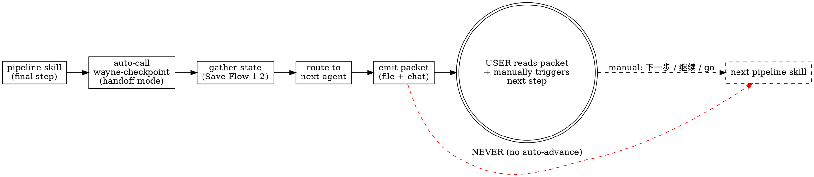

# Wayne Checkpoint

Save and resume working state. Project-scoped — everything stays in `.wayne/checkpoints/`.

This skill only specifies the save / resume / list checkpoint workflow and the
pipeline handoff workflow.

Read `_shared/pipeline-id-contract.md` before copying pipeline artifacts. Preserve
IDs byte-for-byte; checkpoint never renumbers or reclassifies upstream rows.

## Files Written

checkpoint and handoff-packet markdown files at `.wayne/checkpoints/`.

## Commands

| Command | Action |
|---------|--------|
| `/wayne-checkpoint` or `/wayne-checkpoint save` | Save current state |
| `/wayne-checkpoint resume` | Load most recent checkpoint, resume |
| `/wayne-checkpoint list` | Show all checkpoints |
| `/wayne-checkpoint handoff` | Emit a handoff packet for the next pipeline stage (returns the packet only; never advances). Also auto-called by other Wayne pipeline skills as their final step. |

## Save Flow

### Step 1: Gather State

```bash
echo "=== BRANCH ==="
git rev-parse --abbrev-ref HEAD 2>/dev/null
echo "=== STATUS ==="
git status --short 2>/dev/null
echo "=== DIFF STAT ==="
git diff --stat 2>/dev/null
echo "=== STAGED ==="
git diff --cached --stat 2>/dev/null
echo "=== RECENT LOG ==="
git log --oneline -10 2>/dev/null
```

### Step 2: Gather Pipeline State

Use exact artifact paths supplied by the caller or already recorded by the active
pipeline stage. Never select an owner by modification time, filename order, heading,
or ID-shaped text. In a standalone save, discover candidates only to locate them;
if more than one could be active, ask which exact path is authoritative.

For each supplied artifact, record its repository-relative path, owner, SHA-256,
and observed state. Decision counts, unit progress, and E statuses are derived
snapshots for orientation only. The decision log, plan, and test matrix remain the
only owners; a checkpoint never becomes their replacement.

### Step 3: Summarize Context

Using git state plus the complete supplied artifacts and conversation history,
produce:

1. **Title** — 3-6 words describing the work (infer from context, don't ask)
2. **Pipeline stage** — where in the Wayne pipeline this work currently is
3. **Summary** — 1-3 sentences on the goal and current progress
4. **Decisions made** — key decisions from the log, with rationale
5. **Remaining work** — concrete next steps in priority order
6. **Notes** — gotchas, blockers, open questions, dead ends tried

Use AI contextual reading for stage, intent, decisions, and remaining work.
Deterministic checks may validate paths, hashes, schema, and literal state fields;
keywords, headings, checkbox counts, and ID scans cannot decide artifact meaning.

### Step 4: Write Checkpoint

```bash
mkdir -p .wayne/checkpoints

# Self-contained gitignore (one-time setup)
[ -f .wayne/.gitignore ] || echo "*" > .wayne/.gitignore

TIMESTAMP=$(date +%Y%m%d-%H%M%S)
echo "TIMESTAMP=$TIMESTAMP"
```

Write to `.wayne/checkpoints/{TIMESTAMP}-{title-slug}.md`.

**Read first, then write:** `templates/checkpoint-template.md` relative to this
skill directory.

The template is the canonical structure. Required sections:
- frontmatter: `title`, `status`, `branch`, `timestamp`, `pipeline_stage`, `pipeline_phase`, `decision_log`, `plan`, `spec`, `files_modified`
- `## Working on:` (title)
- `### Summary` (1-3 sentences)
- `### Pipeline State` (Stage, Phase, Last action, Next action)
- `### Artifact References` (exact paths, owners, hashes, and observed states)
- `### Decision Progress` (derived summary linked to the decision log)
- `### Implementation Progress` (derived summary linked to the plan)
- `### Wave Progress (if parallel execution)` (table)
- `### Per-Task Review Status` (table)
- `### Remaining Work` (priority-ordered next steps)
- `### Notes` (gotchas, blockers, dead ends)
- `### Deferred Decisions` (unresolved questions from wayne-mind-explode)

**Ownership:** checkpoint summaries are never pipeline input. On resume, consumers
must re-read the referenced authoritative artifacts and verify their hashes/state;
they may not use copied decisions, checkboxes, or E statuses as the current truth.

Confirm to user (in Chinese):

```
检查点已保存
════════════════════════════
标题:     {title}
分支:     {branch}
文件:     .wayne/checkpoints/{filename}
修改文件: {N} 个
阶段:     {pipeline stage}
════════════════════════════
```

---

## Resume Flow

### Step 1: Find Checkpoints

```bash
if [ -d .wayne/checkpoints ]; then
  find .wayne/checkpoints -maxdepth 1 -name "*.md" -type f 2>/dev/null | xargs ls -1t 2>/dev/null | head -10
else
  echo "NO_CHECKPOINTS"
fi
```

### Step 2: Load and Present

Read the most recent checkpoint (or user-specified one). Treat its summaries as
historical observations, not current pipeline state. Present in Chinese:

```
恢复检查点
════════════════════════════
标题:     {title}
分支:     {branch}
保存时间: {timestamp}
阶段:     {pipeline stage}
════════════════════════════

### 摘要
{summary}

### 待完成工作
{remaining work items}

### 注意事项
{notes}
```

If current branch differs from checkpoint branch, warn:
"这个检查点保存在 `{branch}` 分支。你现在在 `{current}` 分支。"

### Step 3: Verify Pipeline Artifacts Still Exist

Check that every exact referenced decision log, plan, spec, and authoritative test
matrix exists and compare its current hash with the checkpoint hash:
```bash
[ -f "{decision_log_path}" ] && echo "DECISIONS: OK" || echo "DECISIONS: MISSING"
[ -f "{plan_path}" ] && echo "PLAN: OK" || echo "PLAN: MISSING"
[ -f "{spec_path}" ] && echo "SPEC: OK" || echo "SPEC: MISSING"
[ -f "{test_matrix_path}" ] && echo "TEST_MATRIX: OK" || echo "TEST_MATRIX: MISSING"
```

If any are missing, stop. If a hash changed, re-read the current owner and report
the drift before resuming; never restore or override it from checkpoint content.

### Step 4: Auto-Resume Pipeline

Based on `pipeline_stage` from the checkpoint, **automatically invoke** the correct
Wayne skill — don't just suggest, actually invoke it via the Skill tool.

| Stage | Auto-invoke | What it gets |
|-------|-------------|--------------|
| `brainstorm` | `wayne-mind-explode` | Decision log path, resume from last question |
| `plan` | `wayne-plan` | Spec + decision log paths, resume from last phase |
| `work` | **`wayne-work`** | Plan path + checkpoint's Implementation Units as task input. Wayne-work reads the checkpoint's unit status and skips completed units. |
| `review` | `wayne-code-review` | Auto-run dual-voice review |
| `verify` | `wayne-verify` | Exact authoritative test-matrix path and current E statuses |
| `ship` | `wayne-ship` | Auto-run commit flow |
| `compound` | `wayne-compound` | Auto-run lessons capture |

**For `work` stage (most common resume):**

1. Read the exact authoritative plan referenced by the checkpoint
2. Derive current completed/pending units from that plan; use checkpoint progress
   only to explain drift
3. Read the full next unit and its current source artifacts
4. Invoke `wayne-work` with the plan path — wayne-work will:
   - Skip units completed in the current authoritative plan
   - Resume from the next pending unit
   - Treat checkpoint Wave Progress as historical evidence, not live worker state
   - Read unresolved decisions from the current decision log

```
告诉用户:
"从检查点恢复，自动继续 wayne-work。
已完成: I1, I2
下一个: I3 — {goal}
启动中..."
```

Then invoke: `Skill(skill: "wayne-work")`

**Before auto-invoking, ask only if branch mismatch:**
If current branch differs from checkpoint branch, ask first:
```
A) 切换到 {checkpoint_branch} 分支然后继续
B) 在当前分支 {current_branch} 继续
C) 只是需要上下文，不继续工作
```

If no branch mismatch, auto-invoke immediately — no question needed.

---

## List Flow

```bash
if [ -d .wayne/checkpoints ]; then
  find .wayne/checkpoints -maxdepth 1 -name "*.md" -type f 2>/dev/null | xargs ls -1t 2>/dev/null
else
  echo "NO_CHECKPOINTS"
fi
```

Read frontmatter of each file. Present as table (in Chinese):

```
检查点列表
════════════════════════════════════════════
#  日期        标题                 阶段      状态
─  ──────────  ───────────────────  ────────  ──────────
1  2026-04-14  auth-middleware      work      in-progress
2  2026-04-13  email-notifications  review    in-progress
3  2026-04-12  dashboard-redesign   compound  completed
════════════════════════════════════════════
```

---

## Handoff Mode

Handoff mode is the skill's **second role**: it is the handoff conductor between
Wayne pipeline stages. Each pipeline skill, as its FINAL step, auto-calls
wayne-checkpoint in handoff mode. Handoff mode gathers state (the same gathering
the Save Flow does) and emits a standardized **handoff packet** that tells the
user — and the next stage — exactly how to continue.

Handoff = checkpoint + routing on top. It reuses Save Flow Steps 1-2 (Gather
State, Gather Pipeline State) verbatim, then adds routing.

### Mode A: return-only, no nesting (non-negotiable)

The handoff agent ONLY RETURNS a handoff packet. It NEVER calls the next
agent/skill itself, and it NEVER nests another agent. The real next step is
ALWAYS triggered manually by the user.

This is locked by design — it keeps control with the user and avoids nested-agent
context blowup. Handoff mode therefore differs from Resume Flow Step 4
(Auto-Resume), which DOES auto-invoke: Resume is a deliberate user-driven "pick up
where I left off", Handoff is an end-of-stage emit that must not advance anything.



### When it is called

- **Auto:** the final step of every pipeline skill (wayne-mind-explode,
  wayne-plan, wayne-work, wayne-code-review, wayne-verify, wayne-ship), plus a
  caller-approved route from a non-linear front door such as `wayne-triage`.
  Those skills are edited separately to add the call; this skill defines what
  the call DOES.
- **Manual:** `/wayne-checkpoint handoff` when the user wants the packet on demand.

### H1. Gather referenced state

Reuse **Save Flow → Step 1 (Gather State)** and **Step 2 (Gather Pipeline
State)** exactly. No duplicate logic — the snapshot is the checkpoint snapshot.

### Step 2: Route to Next Agent

Determine the current pipeline stage from the calling skill or an explicit resume
request. Standalone inference reads the complete referenced artifacts and must stop
when ownership is ambiguous; artifact age or lexical tokens cannot select a stage.
Then look up the next agent:

| Current stage | Next agent |
|---------------|------------|
| `mind-explode` | `wayne-plan` |
| `plan` | `wayne-work` |
| `work` | `wayne-code-review` |
| `code-review` | `wayne-verify` |
| `verify` | `wayne-ship` |
| `ship` | `wayne-compound` |

For a non-linear caller such as `wayne-triage`, do not reinterpret its verdict.
Require the caller to supply `pipeline_stage`, `route`, one repository-relative
`snapshot`, and exactly one `next_agent`. The target must be one available
`wayne-*` Skill slug, never a verdict, chain, or external owner. If no internal
target applies or validation fails, write no packet and return
`NO_WAYNE_HANDOFF: <route> — <reason>`.

### Step 3: Build the Packet

Assemble the four required parts plus the optional goal:

1. **snapshot** — current git state plus exact repository-relative artifact paths,
   owners, hashes, and derived progress observed from those owners. It never embeds
   a second authoritative decision, unit, or E-status table.
2. **next agent** — from the routing table above.
3. **next prompt** — a SELF-CONTAINED routing prompt for the next step. Name the
   branch, snapshot and authoritative plan/spec/matrix paths, scope, acceptance
   criteria, and out-of-scope. Preserve meaning through AI reading of the complete
   owners; do not rebuild it from headings, keywords, ID scans, or checkpoint
   summaries. Do not write "continue from before".
4. **goal (OPTIONAL)** — a success-criteria / Goal-Driven block (per CLAUDE.md
   "Goal-Driven Execution"). Include ONLY when concrete success criteria are
   extractable. When present, the next step may loop autonomously toward the goal;
   when absent, the next step follows its prompt/plan steps strictly.
5. **trigger: manual** — ALWAYS. The packet states the user must manually fire the
   next step (e.g. say "下一步" / "继续" / "go").

**Optional-goal toggle.** When generating a packet, offer the user the choice to
include or drop the goal block. Default: include it if concrete success criteria
are extractable; otherwise omit it. (Use `AskUserQuestion`, Chinese, only when the
goal is borderline — do not interrogate when the default is obvious.)

### Step 4: Persist + Surface

```bash
mkdir -p .wayne/checkpoints

# Self-contained gitignore (one-time setup) — same as Save Flow
[ -f .wayne/.gitignore ] || echo "*" > .wayne/.gitignore

TIMESTAMP=$(date +%Y%m%d-%H%M%S)
echo "TIMESTAMP=$TIMESTAMP"
```

Write the packet to `.wayne/checkpoints/{TIMESTAMP}-handoff-{stage}-to-{next}.md`
(same directory as checkpoints, same gitignore).

**Read first, then write:** `templates/handoff-packet.md` relative to this skill
directory.

The template is the canonical structure. It shares frontmatter and table
conventions with `checkpoint-template.md` so formats flow between skills without
re-parsing.

**Surface in chat** so the user sees the next agent and can trigger it (in
Chinese):

```
交接包已生成
════════════════════════════
当前阶段: {current stage}
下一步:   {next agent}
触发方式: 手动 — 说"下一步" / "继续" / "go"
目标块:   {已包含 / 已省略}
文件:     .wayne/checkpoints/{filename}
════════════════════════════
```

### Step 5: Return — do NOT advance

Return the packet and STOP. Do not invoke the next skill. Wait for the user to
manually trigger the next step.

---

## Auto-Suggest

Proactively suggest saving a checkpoint when:
- Session is ending or context is getting long
- User is about to switch to a different task
- Before a risky operation
- At the end of any Wayne pipeline skill

---

## Integration with Wayne Pipeline

Checkpoint has two relationships with the pipeline:

1. **Orthogonal (save/resume):** it can save/resume at any stage.
2. **Handoff conductor:** each pipeline skill auto-calls it as its final step to
   emit a handoff packet that standardizes the transition to the next stage —
   without advancing it (Mode A, return-only).

The `pipeline_stage` field tells **resume** which skill to suggest, and tells
**handoff** which skill is the next agent (see Handoff Mode → Step 2 routing
table). Note `wayne-verify` is a runtime-verification stage between
`wayne-code-review` and `wayne-ship`.

| Pipeline stage | Resume suggests | Handoff routes to (next agent) |
|----------------|-----------------|--------------------------------|
| `brainstorm` / `mind-explode` | Invoke `wayne-mind-explode`, continue grilling | `wayne-plan` |
| `plan` | Invoke `wayne-plan`, continue from last phase | `wayne-work` |
| `work` | Invoke `wayne-work`, resume from next pending unit | `wayne-code-review` |
| `review` / `code-review` | Invoke `wayne-code-review` | `wayne-verify` |
| `verify` | Invoke `wayne-verify` | `wayne-ship` |
| `ship` | Invoke `wayne-ship` | `wayne-compound` |
| `compound` | Invoke `wayne-compound` | — (pipeline end) |

**Resume vs Handoff:** Resume auto-invokes the next skill (user-driven "pick up");
Handoff only emits a packet and waits for a manual trigger (end-of-stage emit).

---

## Key Principles

- **Project-scoped** — `.wayne/checkpoints/`, not `~/.gstack/`. Travels with the repo.
- **Append-only** — never overwrite or delete existing checkpoints
- **Read-only** — never modifies code, only reads state and writes checkpoint files
- **Pipeline-aware** — captures which Wayne skill was active and what phase
- **Infer, don't interrogate** — use git + pipeline artifacts + conversation to fill in context
- **Handoff never advances** — handoff mode returns a packet only (Mode A, no nesting); the user always triggers the next step manually
- **Chinese for output, English for files**
