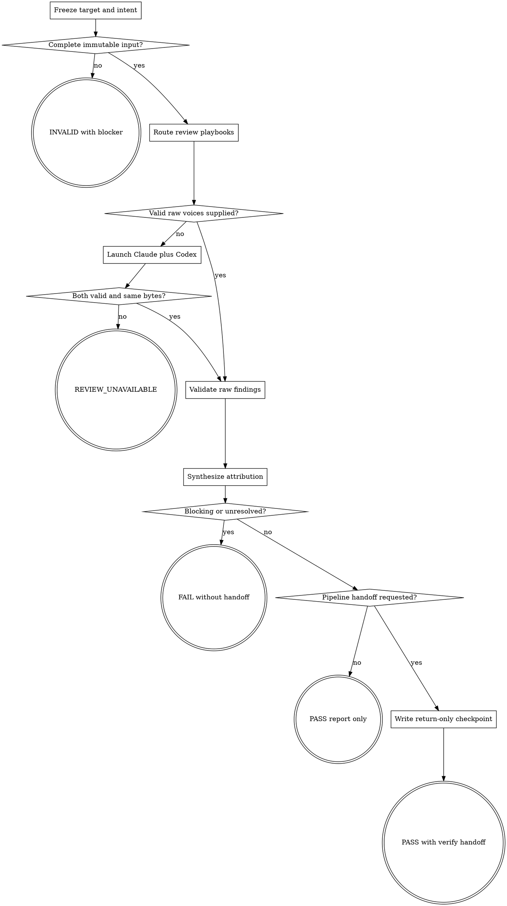

# Wayne Code Review

Produce an evidence-backed static verdict from the same immutable target reviewed
independently by Claude and Codex.

## Boundary

Own target freezing, review-type routing, dual-provider evidence, static-only findings,
synthesis, and review verdict. A review request authorizes no source, test, Git,
checkpoint, or external-system mutation. Never auto-fix; report recommendations for
the user to approve in a separate implementation turn.

Do not run the application or claim runtime behavior. `wayne-verify` owns runtime;
`wayne-ship` owns commits and publication. A standalone or explicit review-only
request returns a report only. A valid clean Wayne-pipeline review may emit one
return-only checkpoint to `wayne-verify`, but never invokes it.

## Review routes

Explicit user scope wins. Otherwise select `general` plus only playbooks earned by
observable diff/spec signals. The adapter loads selected sections from
[review playbooks](references/review-playbooks.md); do not send every playbook.

| Signal | Route |
|---|---|
| explicit security/trust review | `security` |
| state owner, config/event/registry change, or re-architecture | `dataflow`, `architecture` |
| shared state, ordering, retry, cancellation, transaction, lifecycle | `concurrency` |
| hot loop, I/O, query, allocation, cache, load/capacity claim | `performance` |
| test/coverage/assertion/fixture change | `tests` |
| public API, schema, config, persistence, migration, compatibility | `api-migration` |
| general review or no narrower signal | `general`, `intent-scope`, `tests` |

For explicit narrow scope, run only the named route; use approved sources as its
evidence and add `intent-scope` only when the user requests intent/scope review.
Exclude unrelated findings. If no route fits, return
`INVALID: REVIEW_TYPE_UNSUPPORTED` with the missing scope.

## Flow

## Process

### A. Freeze target and intent

Resolve repository root and caller-selected base without fetching or guessing a
remote branch. Capture base SHA, head SHA, dirty path/mode/content manifest, and
approved plan/spec paths. Freeze one full-index binary patch and its SHA-256 before
review. Empty diff stops with `INVALID: NOTHING_TO_REVIEW`; conflicting or missing
required intent stops with the exact artifact and owner.

The patch, selected source excerpts, intent summary, route, mutation policy, and
[finding schema](references/reviewer-schema.json) form one provider-neutral packet.
No reviewer rereads a moving ref or receives the main agent's findings.

For a synthesis-only request with immutable Claude and Codex artifacts that declare
the same frozen patch hash, validate those two inputs and enter F without relaunching
reviewers. Missing identity/hash/schema evidence is INVALID; never invent a voice.

### C. Route playbooks

Choose literal route tokens from the table and record the observed signal for each;
`dataflow / re-architecture` is `dataflow`, not an implicit architecture route.
Security-only means security evidence only; general cleanup is not a finding. For
a re-architecture, include its intended producer→seam→consumer flow in the packet.

### D. Launch exactly two heterogeneous voices

Run the bundled `scripts/run_dual_review.py` once with repository, frozen base, and
review type/routes. When `WAYNE_REVIEW_OUTPUT_DIR` is set, do not override it; that
path owns the evidence. The adapter must start exactly one Claude process and one
Codex process in parallel with the same payload hash and read-only permissions. The
primary host model is not a review voice and same-family subagents cannot substitute.

Do not manually recreate, replace, or repair adapter artifacts. Missing binary,
authentication/provider error, timeout, malformed output, reused session, changed
payload, serial execution, or repository drift makes the result
`REVIEW_UNAVAILABLE`; preserve the exact provider reason and do not synthesize a
clean or dual-confirmed verdict.

### F. Validate raw findings

Require the adapter manifest plus immutable Claude and Codex raw/normalized outputs.
Each finding has `severity`, `confidence`, `category`, `file`, `line`, `problem`,
concrete `evidence`, and `fix`; the only severities are `CRITICAL` and
`INFORMATIONAL`. `NO FINDINGS` is valid only with an empty finding list. Verify file,
line, and causal evidence against the frozen target before accepting a finding.

Wrong-value, exploit, corruption, contract break, or reachable failure is CRITICAL.
Pure dead surface, maintainability, or unproven risk is INFORMATIONAL. A claim that
needs runtime observation is labeled `runtime: UNVERIFIED`, not promoted by static
analysis.

### G. Synthesize attribution

Deduplicate by causal mechanism and affected behavior, not line alone. Preserve:

- agreement only when both raw artifacts independently contain the same mechanism;
- Claude-only and Codex-only findings with their true source;
- contradictions with both positions and `UNRESOLVED`, without choosing a winner;
- original confidence unless dual evidence justifies at most +1, capped at 10.

Report status, patch hash, intent, routes, source validity, findings by severity and
source, agreements, disagreements, runtime boundary, and mutation/scope proof.
Recompute all counts from raw artifacts. Recommendations remain user decisions.

### J. Gate the handoff

`FAIL` covers any unresolved CRITICAL or contradiction affecting correctness,
safety, ownership, compatibility, or the approved intent. `PASS` requires two valid
voices, no unresolved blocker, a clean scope audit, and internally consistent counts.
`REVIEW_UNAVAILABLE` and `INVALID` are never PASS.

Only a clean PASS with a requested Wayne pipeline transition may invoke
`wayne-checkpoint` in return-only mode with patch hash, sources, routes, findings,
residual risks, and `next_agent: wayne-verify`. Surface the packet path; never start
runtime verification.

## Red lines

- Never accept one model family twice as two voices.
- Never let either voice see peer output or main structured findings.
- Never treat provider failure as `NO FINDINGS` or a successful single-voice review.
- Never edit code, tests, Git state, or checkpoint state during standalone review.
- Never hand off an invalid, unavailable, blocked, or unresolved review.
