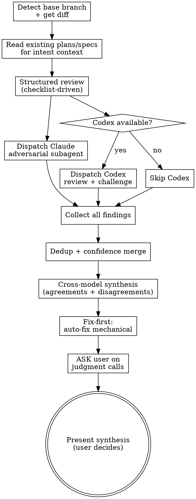

# Wayne Code Review

Dual-voice code review: structured analysis + adversarial cross-model challenge.
Two independent reviewers see the same diff with fresh eyes. Neither knows what the other found.
You synthesize, the user decides.

## Inherits from ~/.claude/CLAUDE.md

This skill inherits the Wayne control-plane invariants and does not redeclare them. The following are assumed and MUST NOT be repeated below:

- Language Rules (Chinese to user, English to files)
- Engineering Principles (KISS / YAGNI / DRY / SSoT / Fail-Loud / Push-Don't-Poll / Delete>Add)
- Code Standards (uv run python, markdown tables)
- Behavior Baselines (Think Before / Simplicity / Surgical / Goal-Driven)
- Skill invocation rule (proportional effort)

This skill only specifies the dual-voice code review workflow.

## Files Written

review reports, finding logs, code comments. Severity tags `[CRITICAL]` / `[INFORMATIONAL]`, confidence scores, file:line references stay English in Chinese prose.

## Checklist

You MUST create a task for each and complete in order:

1. **Detect base branch + get diff** — determine what to review
2. **Structured review (you)** — checklist-driven analysis of the diff
3. **Dispatch Claude adversarial subagent** — fresh context, no checklist bias
4. **Dispatch Codex review** — cross-model independent opinion (if available)
5. **Synthesize dual voices** — merge findings, highlight agreements/disagreements
6. **Fix-first resolution** — auto-fix mechanical issues, ask about judgment calls
7. **Present to user** — user decides on all recommendations

## Process Flow



**Note:** Claude adversarial subagent and Codex dispatch should be launched **in parallel** (both in the same Agent tool call) for speed.

---

## Phase 1: Detect Base Branch + Get Diff

```bash
# Detect base branch
BASE=$(gh pr view --json baseRefName -q .baseRefName 2>/dev/null) || \
BASE=$(git symbolic-ref refs/remotes/origin/HEAD 2>/dev/null | sed 's|refs/remotes/origin/||') || \
BASE="main"
echo "BASE: $BASE"

# Get SHAs
git fetch origin "$BASE" --quiet
BASE_SHA=$(git merge-base origin/"$BASE" HEAD)
HEAD_SHA=$(git rev-parse HEAD)
echo "BASE_SHA: $BASE_SHA"
echo "HEAD_SHA: $HEAD_SHA"

# Diff stats
git diff origin/"$BASE" --stat
DIFF_LINES=$(git diff origin/"$BASE" --stat | tail -1 | grep -oE '[0-9]+' | head -1)
echo "DIFF_LINES: $DIFF_LINES"
```

If no diff exists, stop: "Nothing to review."

---

## Phase 2: Intent Context

Before reviewing code quality, understand **what was supposed to be built**.

1. Read commit messages: `git log origin/$BASE..HEAD --oneline`
2. Read PR description if exists: `gh pr view --json body -q .body 2>/dev/null`
3. Glob for plan/spec files in `docs/` — read any that reference this branch or topic
4. Check `TODOS.md` if it exists

Produce a 1-line intent summary. This frames the entire review.

---

## Phase 3: Structured Review (You)

Run `git diff origin/$BASE` and analyze the full diff against these categories:

### Critical Categories (block shipping)

| Category | What to check |
|----------|---------------|
| **SQL & Data Safety** | Raw SQL interpolation, missing transactions, schema assumptions |
| **Race Conditions** | TOCTOU, concurrent writes, missing locks |
| **Auth & Trust Boundary** | LLM output used without validation, user input trusted |
| **Shell Injection** | Unsanitized input in shell commands |
| **Error Swallowing** | Catch blocks that silently discard errors |

### Informational Categories (flag but don't block)

| Category | What to check |
|----------|---------------|
| **N+1 Queries** | Loop-based DB calls, missing eager loading |
| **Type Coercion** | Implicit type conversions, missing validations |
| **Missing Edge Cases** | Empty state, null handling, boundary conditions |
| **Documentation Staleness** | Code changed but docs not updated |
| **Test Coverage Gaps** | New logic without corresponding tests |

### Finding Format

```
[SEVERITY] (confidence: N/10) file:line — description
  Fix: recommended action
```

Confidence calibration:
- **9-10**: Verified by reading specific code. Concrete bug demonstrated.
- **7-8**: High confidence pattern match.
- **5-6**: Moderate. Show with caveat.
- **3-4**: Low. Appendix only.

---

## Phase 4: Dual Voice Dispatch

Both reviewers get the **exact same prompt** — same question, same diff command, same output format. They are independent and see nothing from each other or from your structured review. This is how you get genuine dual-voice coverage.

### The Shared Prompt

```
You are an adversarial code reviewer with fresh eyes. You have no prior context about this code.

Run `git diff origin/{BASE}` to see the full diff.

Think like an attacker and a chaos engineer. Find every way this code will fail in production:
- Edge cases and boundary conditions
- Race conditions and concurrency bugs
- Security holes and trust boundary violations
- Resource leaks and failure modes
- Silent data corruption
- Logic errors that produce wrong results silently
- Error handling that swallows failures
- Missing validations on inputs
- Assumptions that will break under load

For each finding, output exactly this format:
SEVERITY: CRITICAL or INFORMATIONAL
CONFIDENCE: 1-10
FILE: path
LINE: number (if applicable)
PROBLEM: one-line description
FIX: recommended action (or INVESTIGATE if needs human judgment)

No compliments. No preamble. No summary. Just the problems, one per block.
If no issues found, output exactly: NO FINDINGS
```

### Dispatch Both In Parallel

Launch both in a **single message** with two tool calls so they run concurrently:

**Voice 1 — Claude Subagent:**
Dispatch via Agent tool with `subagent_type: "general-purpose"`. Pass the shared prompt above verbatim.

**Voice 2 — Codex:**
First check availability:
```bash
which codex 2>/dev/null && echo "CODEX_AVAILABLE" || echo "CODEX_NOT_AVAILABLE"
```

If available, dispatch via Bash (same prompt):
```bash
_REPO_ROOT=$(git rev-parse --show-toplevel)
codex exec "{THE_SHARED_PROMPT}" -C "$_REPO_ROOT" -s read-only 2>/tmp/codex-review-err.txt
```

Timeout: 300000ms (5 min).

**If Codex unavailable or fails:** Continue with Claude-only review. Note: "Codex not available — single-voice adversarial review only."

### Wait + Gather

After both complete, collect their raw outputs separately. Do NOT merge yet — Phase 5 handles synthesis.

---

## Phase 5: Cross-Model Synthesis

After both voices return, synthesize findings.

### Dedup by fingerprint

For each finding, compute fingerprint: `{file}:{line}:{category}`

Group by fingerprint:
- **Agreed (both found it)**: Boost confidence +1 (cap 10). Tag: "DUAL-VOICE CONFIRMED"
- **Claude-only**: Present normally
- **Codex-only**: Present normally
- **Contradictions**: Flag explicitly — "Claude says X, Codex says Y"

### Synthesis Output (in Chinese)

```
DUAL-VOICE CODE REVIEW SYNTHESIS
==================================================
意图: {1-line intent summary}
差异: {diff stats}
审查来源: Claude structured + Claude adversarial + Codex {if ran}

## 高置信度发现 (多个来源一致)
{findings agreed by 2+ sources}

## Claude 独有发现
{findings only Claude found}

## Codex 独有发现
{findings only Codex found}

## 分歧点
{contradictions between reviewers — present both sides}
==================================================
```

### User Sovereignty Rule

When Claude and Codex agree on a finding, that agreement is a **recommendation, not a decision**. Present it. The user decides. Never say "both models agree so we should do X" and act. Say "both models recommend X — do you want to proceed?"

---

## Phase 6: Fix-First Resolution

Every finding gets action — not just a report.

### Auto-fix (mechanical, safe)

Directly fix these without asking:
- Typos in comments/strings
- Missing null checks on obvious paths
- Import ordering
- Unused variable removal
- Missing type annotations (if project uses them)

Output: `[AUTO-FIXED] file:line — what was fixed`

### Ask (judgment calls)

Batch remaining findings into ONE AskUserQuestion (in Chinese):

```
我自动修了 N 个机械问题。还有 M 个需要你做决定:

1. [CRITICAL] (confidence: 9/10) app/models/user.rb:42 — 状态转换有竞争条件
   推荐修复: 加 WHERE status = 'draft' 到 UPDATE
   → A) 修  B) 跳过

2. [INFORMATIONAL] (confidence: 7/10) app/services/gen.rb:88 — LLM 输出写入 DB 前没有类型校验
   推荐修复: 加 JSON schema 验证
   → A) 修  B) 跳过

RECOMMENDATION: 两个都修 — #1 是真实竞争条件，#2 防止静默数据损坏。
```

If a finding has **contradictions** between Claude and Codex, present both sides and let the user choose:
```
3. [分歧] file:line
   Claude 认为: {Claude's view}
   Codex 认为: {Codex's view}
   → A) 按 Claude 来  B) 按 Codex 来  C) 都不改
```

### Apply approved fixes

Apply fixes for user-approved items. Never commit — that's the user's call.

---

## Phase 7: Final Report

After all fixes applied, produce final summary:

```
REVIEW COMPLETE
═══════════════
Issues found: N (X critical, Y informational)
Auto-fixed: N
User-fixed: N
Skipped: N
Sources: Claude structured ✓ | Claude adversarial ✓ | Codex ✓/✗

Scope check: {CLEAN / DRIFT / MISSING}
Remaining concerns: {list or "none"}
```

---

## Integration with Other Skills

### After wayne-mind-explode (brainstorming)

If a spec/plan exists from brainstorming, cross-reference the diff against it:
- What was planned vs what was actually built?
- Any plan items missing from the diff?
- Any diff changes not in the plan?

### Before shipping

This skill reviews. It does NOT commit, push, or create PRs.
After review passes, the user can invoke `/ship` or commit manually.

### With superpowers requesting-code-review

This skill **replaces** `superpowers:requesting-code-review` — it does everything that skill does (SHA-based diff, plan traceability, severity classification) plus the dual-voice cross-model review.

---

## Key Principles

- **Two voices, one synthesis** — independent reviewers catch each other's blind spots
- **User sovereignty** — reviewer agreement is a recommendation, not a decision
- **Fix-first** — auto-fix the mechanical stuff, only ask about real judgment calls
- **Confidence matters** — every finding has a number, not just "maybe"
- **No compliments** — just the problems and the fixes
- **Chinese for discussion, English for artifacts** — questions in Chinese, findings in English
