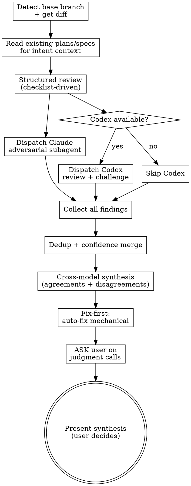

# Wayne Code Review

Dual-voice code review: structured analysis + adversarial cross-model challenge. Two independent reviewers see the same diff with fresh eyes. Neither knows what the other found. You synthesize, the user decides.

## Inherits from ~/.claude/CLAUDE.md

This skill inherits the Wayne control-plane invariants and does not redeclare them. The following are assumed and MUST NOT be repeated below:

- Language Rules (Chinese to user, English to files)
- Engineering Principles (KISS / YAGNI / DRY / SSoT / Fail-Loud / Push-Don't-Poll / Delete&gt;Add)
- Code Standards (uv run python, markdown tables)
- Behavior Baselines (Think Before / Simplicity / Surgical / Goal-Driven)
- Skill invocation rule (proportional effort)

This skill only specifies the dual-voice code review workflow.

## Scope: Static Only

This skill is **STATIC** — it reads and analyzes the diff to find issues; it **never runs the application**. Runtime / e2e verification — actually executing the feature along the real user path to confirm it works — is `**wayne-verify`'s** job, a separate sibling skill that runs AFTER this one and BEFORE `wayne-ship`. "Does the code look correct?" is answered here; "does the feature actually work?" is answered by `wayne-verify`. Passing this review is necessary but NOT sufficient to ship.

## Files Written

review reports, finding logs, code comments. Severity tags `[CRITICAL]` / `[INFORMATIONAL]`, confidence scores, file:line references stay English in Chinese prose.

## Checklist

You MUST create a task for each and complete in order:

1. **Detect base branch + get diff** — determine what to review
2. **Structured review (you)** — checklist-driven analysis of the diff
3. **Dispatch Claude adversarial subagent** — fresh context, no checklist bias
4. **Dispatch Codex review** — cross-model independent opinion (if available)
5. **Synthesize dual voices** — merge findings, highlight agreements/disagreements
6. **Fix-first resolution** — auto-fix mechanical issues, ask about judgment calls
7. **Present to user** — user decides on all recommendations

## Process Flow


```dot
digraph review {
    rankdir=TB;

    "Detect base branch\n+ get diff" [shape=box];
    "Read existing plans/specs\nfor intent context" [shape=box];
    "Structured review\n(checklist-driven)" [shape=box];
    "Dispatch Claude\nadversarial subagent" [shape=box];
    "Codex available?" [shape=diamond];
    "Dispatch Codex\nreview + challenge" [shape=box];
    "Skip Codex" [shape=box];
    "Collect all findings" [shape=box];
    "Dedup + confidence merge" [shape=box];
    "Cross-model synthesis\n(agreements + disagreements)" [shape=box];
    "Fix-first:\nauto-fix mechanical" [shape=box];
    "ASK user on\njudgment calls" [shape=box];
    "Present synthesis\n(user decides)" [shape=doublecircle];

    "Detect base branch\n+ get diff" -> "Read existing plans/specs\nfor intent context";
    "Read existing plans/specs\nfor intent context" -> "Structured review\n(checklist-driven)";
    "Structured review\n(checklist-driven)" -> "Dispatch Claude\nadversarial subagent";
    "Structured review\n(checklist-driven)" -> "Codex available?";
    "Codex available?" -> "Dispatch Codex\nreview + challenge" [label="yes"];
    "Codex available?" -> "Skip Codex" [label="no"];
    "Dispatch Claude\nadversarial subagent" -> "Collect all findings";
    "Dispatch Codex\nreview + challenge" -> "Collect all findings";
    "Skip Codex" -> "Collect all findings";
    "Collect all findings" -> "Dedup + confidence merge";
    "Dedup + confidence merge" -> "Cross-model synthesis\n(agreements + disagreements)";
    "Cross-model synthesis\n(agreements + disagreements)" -> "Fix-first:\nauto-fix mechanical";
    "Fix-first:\nauto-fix mechanical" -> "ASK user on\njudgment calls";
    "ASK user on\njudgment calls" -> "Present synthesis\n(user decides)";
}
```

**Note:** Claude adversarial subagent and Codex dispatch should be launched **in parallel** (both in the same Agent tool call) for speed.

---

## Phase 1: Detect Base Branch + Get Diff

```bash
# Detect base branch
BASE=$(gh pr view --json baseRefName -q .baseRefName 2>/dev/null) || \
BASE=$(git symbolic-ref refs/remotes/origin/HEAD 2>/dev/null | sed 's|refs/remotes/origin/||') || \
BASE="main"
echo "BASE: $BASE"

# Get SHAs
git fetch origin "$BASE" --quiet
BASE_SHA=$(git merge-base origin/"$BASE" HEAD)
HEAD_SHA=$(git rev-parse HEAD)
echo "BASE_SHA: $BASE_SHA"
echo "HEAD_SHA: $HEAD_SHA"

# Diff stats
git diff origin/"$BASE" --stat
DIFF_LINES=$(git diff origin/"$BASE" --stat | tail -1 | grep -oE '[0-9]+' | head -1)
echo "DIFF_LINES: $DIFF_LINES"
```

If no diff exists, stop: "Nothing to review."

---

## Phase 2: Intent Context

Before reviewing code quality, understand **what was supposed to be built**.

1. Read commit messages: `git log origin/$BASE..HEAD --oneline`
2. Read PR description if exists: `gh pr view --json body -q .body 2>/dev/null`
3. Glob for plan/spec files in `docs/` — read any that reference this branch or topic
4. Check `TODOS.md` if it exists

Produce a 1-line intent summary. This frames the entire review.

---

## Phase 3: Structured Review (You)

Run `git diff origin/$BASE` and analyze the full diff against these categories:

### Critical Categories (block shipping)

| Category | What to check |
| --- | --- |
| **SQL &amp; Data Safety** | Raw SQL interpolation, missing transactions, schema assumptions |
| **Race Conditions** | TOCTOU, concurrent writes, missing locks |
| **Auth &amp; Trust Boundary** | LLM output used without validation, user input trusted |
| **Shell Injection** | Unsanitized input in shell commands |
| **Error Swallowing** | Catch blocks that silently discard errors |

### Informational Categories (flag but don't block)

| Category | What to check |
| --- | --- |
| **N+1 Queries** | Loop-based DB calls, missing eager loading |
| **Type Coercion** | Implicit type conversions, missing validations |
| **Missing Edge Cases** | Empty state, null handling, boundary conditions |
| **Documentation Staleness** | Code changed but docs not updated |
| **Test Coverage Gaps** | New logic without corresponding tests |

### Optional: Cybernetics Lens (for architectural / structural review)

If the diff touches architecture (new modules, control flow, state management, multi-component interaction, control-plane changes), apply the cybernetics lens to surface structural issues a line-by-line review misses:

**Read first:** [the cybernetics lens](../_shared/cybernetics-lens.md)

Look for: multiple SoTs for same state (Principle #4), open-loop rules with no verification (Principle #2/#3), L0/L1/L2 stratification violations (Principle #5), new redundancy points / drift sources (Principle #4 + #7).

Skip for pure logic/bugfix diffs (no structural surface). Findings from the lens go into the Critical or Informational categories per severity.

### Mandatory: Producer-Judge Check

Not optional, and the "pure logic/bugfix" skip above does not reach it. Whenever the diff touches a gate, validator, classifier, parser, a schema some producer writes to, or the code that assembles any of their inputs, apply cybernetics-lens §4a:

- the author's instructions are **generated** from the same constant the judge checks, never copied from it — the copy that drifts is the one nobody re-reads;
- the rule shows its literal form, and that example round-trips through the judge in a test ("numbered" and `### R1` are different instructions);
- the judge actually receives what it rules on — read the code that assembles its input, not only the code that decides. A judge ruling on content it cannot see is guessing, which reads as a strict or flaky gate;
- a schema field a producer must populate carries a description, or the producer never learns it exists.

CRITICAL when the mismatch can refuse or accept real work; a green suite never covers it, because a unit test asserts the validator's behavior and never asks whether the author was told.

### Optional: Dataflow Lens (producer / consumer)

If the diff adds, moves, or rewires a piece of state — a field, config slot, registry entry, extractor, event, cache key — trace it end to end. Every producer needs a consumer and every consumer needs a producer; a mismatch is a bug or dead weight.

Look for:

- **Orphan producer** — value is written / declared / registered but nothing reads it. Verify by grepping for readers, not by assuming. A field with only a `def` / assignment and zero call sites is false coverage. (`delete > add`: wire it or remove it.)
- **Dead consumer** — code reads / resolves / dispatches on state that no producer ever populates. Consumer guards silently no-op (`if x is None: return`), so the path is permanently unreachable — looks wired, never runs.
- **Producer/consumer semantic drift** — same logical state produced in one place and consumed in another with _different semantics_ (different default, different units, different enum encoding, hardcoded literal on one side vs resolved value on the other). This is the SSoT drift bug class: two encodings of one concept that will disagree.
- **Dual path to the same state** — consumer reads the state directly (e.g. via `getattr`) while a dedicated resolver/accessor for that same state exists and is bypassed. Two read paths drift independently.

**Severity by consequence, not by category:**

- CRITICAL when a real consumer gets a _wrong value_ at runtime — e.g. a hardcoded literal in shared code so a second caller/tenant/team hits the wrong behavior the moment it exercises the path, or a default that silently misroutes.
- INFORMATIONAL when the finding is pure dead surface (orphan producer, unreachable consumer) with no wrong-result path today — a `delete > add` candidate.

Verify every dataflow claim by grep before filing it: "produced at X, consumed at Y (or: no consumer found)". A dataflow finding without both endpoints named is not yet a finding. Findings land in the Critical or Informational categories per the consequence rule above.

**Re-arch check (when the diff rewires an existing flow).** If Phase 2 intent shows this is a re-architecture — moving state to a new owner, routing a value through a new seam, replacing a hardcoded literal with a resolved lookup — the diff must make the dataflow flow the way the re-arch _intends_, end to end. Half-migrations are the CRITICAL bug here:

- Old path left live alongside the new one → two producers, drift (the thing the re-arch was supposed to eliminate is still there).
- New path wired at the producer but a consumer still reads the old source (or vice versa) → the re-arch silently doesn't take effect on that path.
- New seam declared but zero consumers routed through it → orphan seam, false "done".

Concrete shape (TRACE example): moving a team-specific value out of shared core into a team plugin slot means every consumer must read it via `resolve_*(ctx)` against the bound team — a diff that adds the slot but leaves any consumer on the old shared-core constant/YAML literal has NOT completed the re-arch, and the second team still hits the wrong value. Check every sibling consumer, not just the one the diff touched.

### Finding Format

```
[SEVERITY] (confidence: N/10) file:line — description
  Fix: recommended action
```

Severity and confidence use [the reviewer protocol](references/reviewer-protocol.md) definitions — the same ladder the dispatched voices are given, so a 9 means the same thing in every source you merge in Phase 5.

---

## Phase 4: Dual Voice Dispatch

Both dispatched voices receive the **same bytes**: [the reviewer protocol](references/reviewer-protocol.md) verbatim, then the target and output envelope below. Never retype the criteria per voice and never hand one voice an extra hint — two voices reading different prompts are not two opinions about one question. Neither sees the other's output, nor your structured review from Phase 3.

**When the diff is a re-arch** (Phase 2 intent shows a flow being rewired), append the 1-line intent summary to the shared prompt for BOTH voices — so the "does the dataflow flow the way the architecture intends" probe has something to check against. Append the same text to both; keep them identical. For a pure logic/bugfix diff, leave the prompt as-is.

### The Shared Prompt

Send the contents of `references/reviewer-protocol.md` verbatim, then append exactly this and nothing more:

```
REVIEW TARGET
Run `git diff origin/{BASE}` to see the full diff. Review only the changes it contains.
{1-line intent summary — include only when Phase 2 showed this diff is a re-arch}

OUTPUT
For each finding, output exactly this block:
SEVERITY: CRITICAL or INFORMATIONAL
CONFIDENCE: 1-10
FILE: path
LINE: number (if applicable)
PROBLEM: one-line description
FIX: recommended action (or INVESTIGATE if needs human judgment)

One block per finding, nothing before or after them.
If no issues found, output exactly: NO FINDINGS
```

### Dispatch Both In Parallel

Launch both in a **single message** with two tool calls so they run concurrently:

**Voice 1 — Claude Subagent:** Dispatch via Agent tool with `subagent_type: "general-purpose"`. Pass the shared prompt above verbatim.

**Voice 2 — Codex:** First check availability:

```bash
which codex 2>/dev/null && echo "CODEX_AVAILABLE" || echo "CODEX_NOT_AVAILABLE"
```

If available, dispatch via Bash (same prompt):

```bash
_REPO_ROOT=$(git rev-parse --show-toplevel)
codex exec "{THE_SHARED_PROMPT}" -C "$_REPO_ROOT" --dangerously-bypass-approvals-and-sandbox 2>/tmp/codex-review-err.txt
```

Timeout: 3600000ms (60 min).

**If Codex unavailable or fails:** Continue with Claude-only review. Note: "Codex not available — single-voice adversarial review only."

**A degraded review is not the gate.** A single-voice run is still worth having and is still reported, but it is a working review, not a merge gate. The formal gate is the saved Pi workflow `wayne-code-review-flow`: it freezes one patch with a `sha256` that both voices read, requires two valid voices from different model families, and returns exactly `GATE: PASS` or `GATE: FAIL`. When a change must not merge without a gate verdict, run that workflow — a Claude-only pass here never substitutes for it.

### Wait + Gather

After both complete, collect their raw outputs separately. Do NOT merge yet — Phase 5 handles synthesis.

---

## Phase 5: Cross-Model Synthesis

After both voices return, synthesize findings.

### Dedup by fingerprint

For each finding, compute fingerprint: `{file}:{line}:{category}`

Group by fingerprint:

- **Agreed (both found it)**: Boost confidence +1 (cap 10). Tag: "DUAL-VOICE CONFIRMED"
- **Claude-only**: Present normally
- **Codex-only**: Present normally
- **Contradictions**: Flag explicitly — "Claude says X, Codex says Y"

### Synthesis Output (in Chinese)

```
DUAL-VOICE CODE REVIEW SYNTHESIS
==================================================
意图: {1-line intent summary}
差异: {diff stats}
审查来源: Claude structured + Claude adversarial + Codex {if ran}

## 高置信度发现 (多个来源一致)
{findings agreed by 2+ sources}

## Claude 独有发现
{findings only Claude found}

## Codex 独有发现
{findings only Codex found}

## 分歧点
{contradictions between reviewers — present both sides}
==================================================
```

### User Sovereignty Rule

When Claude and Codex agree on a finding, that agreement is a **recommendation, not a decision**. Present it. The user decides. Never say "both models agree so we should do X" and act. Say "both models recommend X — do you want to proceed?"

---

## Phase 6: Fix-First Resolution

Every finding gets action — not just a report.

### Auto-fix (mechanical, safe)

Directly fix these without asking:

- Typos in comments/strings
- Missing null checks on obvious paths
- Import ordering
- Unused variable removal
- Missing type annotations (if project uses them)

Output: `[AUTO-FIXED] file:line — what was fixed`

### Ask (judgment calls)

Batch remaining findings into ONE AskUserQuestion (in Chinese):

```
我自动修了 N 个机械问题。还有 M 个需要你做决定:

1. [CRITICAL] (confidence: 9/10) app/models/user.rb:42 — 状态转换有竞争条件
   推荐修复: 加 WHERE status = 'draft' 到 UPDATE
   → A) 修  B) 跳过

2. [INFORMATIONAL] (confidence: 7/10) app/services/gen.rb:88 — LLM 输出写入 DB 前没有类型校验
   推荐修复: 加 JSON schema 验证
   → A) 修  B) 跳过

RECOMMENDATION: 两个都修 — #1 是真实竞争条件，#2 防止静默数据损坏。
```

If a finding has **contradictions** between Claude and Codex, present both sides and let the user choose:

```
3. [分歧] file:line
   Claude 认为: {Claude's view}
   Codex 认为: {Codex's view}
   → A) 按 Claude 来  B) 按 Codex 来  C) 都不改
```

### Apply approved fixes

Apply fixes for user-approved items. Never commit — that's the user's call.

---

## Phase 7: Final Report

After all fixes applied, produce final summary:

```
REVIEW COMPLETE
═══════════════
Issues found: N (X critical, Y informational)
Auto-fixed: N
User-fixed: N
Skipped: N
Sources: Claude structured ✓ | Claude adversarial ✓ | Codex ✓/✗

Scope check: {CLEAN / DRIFT / MISSING}
Remaining concerns: {list or "none"}
```

---

## Phase 8: Handoff

As the final step, auto-call `**wayne-checkpoint` in handoff mode** to emit a handoff packet with **next agent = `wayne-verify`**. The packet carries a self-contained next prompt (branch, plan/spec paths, what runtime "done" looks like), the current snapshot, and an optional goal block. The handoff-packet mechanism is fully defined in `wayne-checkpoint` — this skill only invokes it; it does not implement or advance it.

This is **Mode A: return-only**. The packet is surfaced to the user; it does NOT auto-invoke `wayne-verify`. The user manually triggers the next step (e.g. says "下一步" / "继续" / "go").

The packet carries the gate state and never claims one this skill did not obtain: name the `wayne-code-review-flow` verdict when that workflow was run, and record it as outstanding when it was not. A findings-free report here is not a `GATE: PASS`.

---

## Integration with Other Skills

### After wayne-mind-explode (brainstorming)

If a spec/plan exists from brainstorming, cross-reference the diff against it:

- What was planned vs what was actually built?
- Any plan items missing from the diff?
- Any diff changes not in the plan?

### Before shipping

This skill reviews statically. It does NOT run the app, commit, push, or create PRs.

The ship chain is: **wayne-code-review (working review)** → **`wayne-code-review-flow` (static gate)** → **wayne-verify (runtime gate)** → **wayne-ship (commit)**. This skill finds, synthesizes, and resolves findings; the static gate verdict is the workflow's `GATE: PASS` over one frozen patch with two valid model families; `wayne-verify` then proves the feature actually runs. No single one of them is sufficient to ship.

```
wayne-code-review → wayne-code-review-flow → wayne-verify → wayne-ship
 (working review)        (static gate)       (runtime gate)   (commit)
```

---

## Key Principles

- **Two voices, one synthesis** — independent reviewers catch each other's blind spots
- **User sovereignty** — reviewer agreement is a recommendation, not a decision
- **Fix-first** — auto-fix the mechanical stuff, only ask about real judgment calls
- **Confidence matters** — every finding has a number, not just "maybe"
- **No compliments** — just the problems and the fixes
- **Chinese for discussion, English for artifacts** — questions in Chinese, findings in English
