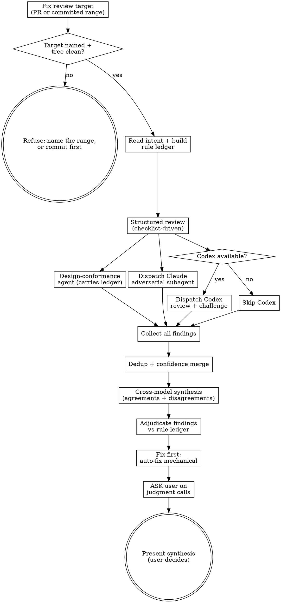

# Wayne Code Review

Dual-voice code review: structured analysis + adversarial cross-model challenge. Two independent reviewers see the same diff with fresh eyes. Neither knows what the other found. You synthesize, the user decides.

## Inherits from ~/.claude/CLAUDE.md

This skill inherits the Wayne control-plane invariants and does not redeclare them. The following are assumed and MUST NOT be repeated below:

- Language Rules (Chinese to user, English to files)
- Engineering Principles (KISS / YAGNI / DRY / SSoT / Fail-Loud / Push-Don't-Poll / Delete&gt;Add)
- Code Standards (uv run python, markdown tables)
- Behavior Baselines (Think Before / Simplicity / Surgical / Goal-Driven)
- Skill invocation rule (proportional effort)

This skill only specifies the dual-voice code review workflow.

## Scope: Static Only

This skill is **STATIC** — it reads and analyzes the diff to find issues; it **never runs the application**. Runtime / e2e verification — actually executing the feature along the real user path to confirm it works — is `wayne-verify`'s job, a separate sibling skill invoked deliberately when runtime proof is wanted, not a stage this review advances into. "Does the code look correct?" is answered here; "does the feature actually work?" is not, so passing this review is necessary but NOT sufficient to ship.

## Files Written

review reports, finding logs, code comments. Severity tags `[CRITICAL]` / `[INFORMATIONAL]`, confidence scores, file:line references stay English in Chinese prose.

## Checklist

You MUST create a task for each and complete in order:

1. **Fix the review target** — an open PR or an explicit committed range, resolved to `BASE_SHA..HEAD_SHA`; refuse if it was not given or the tree is dirty
2. **Read intent + build the rule ledger** — plan/spec, plus every `AGENTS.md` / `CLAUDE.md` governing a touched path
3. **Structured review (you)** — checklist-driven analysis of the diff, judged against the ledger
4. **Dispatch the design-conformance agent** — the repository sweep, and the only dispatch that carries the ledger
5. **Dispatch Claude adversarial subagent** — fresh context, no checklist bias
6. **Dispatch Codex review** — cross-model independent opinion (if available)
7. **Synthesize + adjudicate** — merge findings, then rule on each against the ledger
8. **Fix-first resolution** — auto-fix mechanical issues, ask about judgment calls
9. **Present to user** — user decides on all recommendations

## Process Flow


```dot
digraph review {
    rankdir=TB;

    "Fix review target\n(PR or committed range)" [shape=box];
    "Target named +\ntree clean?" [shape=diamond];
    "Refuse: name the range,\nor commit first" [shape=doublecircle];
    "Read intent + build\nrule ledger" [shape=box];
    "Structured review\n(checklist-driven)" [shape=box];
    "Design-conformance\nagent (carries ledger)" [shape=box];
    "Dispatch Claude\nadversarial subagent" [shape=box];
    "Codex available?" [shape=diamond];
    "Dispatch Codex\nreview + challenge" [shape=box];
    "Skip Codex" [shape=box];
    "Collect all findings" [shape=box];
    "Dedup + confidence merge" [shape=box];
    "Cross-model synthesis\n(agreements + disagreements)" [shape=box];
    "Adjudicate findings\nvs rule ledger" [shape=box];
    "Fix-first:\nauto-fix mechanical" [shape=box];
    "ASK user on\njudgment calls" [shape=box];
    "Present synthesis\n(user decides)" [shape=doublecircle];

    "Fix review target\n(PR or committed range)" -> "Target named +\ntree clean?";
    "Target named +\ntree clean?" -> "Refuse: name the range,\nor commit first" [label="no"];
    "Target named +\ntree clean?" -> "Read intent + build\nrule ledger" [label="yes"];
    "Read intent + build\nrule ledger" -> "Structured review\n(checklist-driven)";
    "Structured review\n(checklist-driven)" -> "Dispatch Claude\nadversarial subagent";
    "Structured review\n(checklist-driven)" -> "Codex available?";
    "Codex available?" -> "Dispatch Codex\nreview + challenge" [label="yes"];
    "Codex available?" -> "Skip Codex" [label="no"];
    "Dispatch Claude\nadversarial subagent" -> "Collect all findings";
    "Dispatch Codex\nreview + challenge" -> "Collect all findings";
    "Skip Codex" -> "Collect all findings";
    "Structured review\n(checklist-driven)" -> "Design-conformance\nagent (carries ledger)";
    "Design-conformance\nagent (carries ledger)" -> "Collect all findings";
    "Collect all findings" -> "Dedup + confidence merge";
    "Dedup + confidence merge" -> "Cross-model synthesis\n(agreements + disagreements)";
    "Cross-model synthesis\n(agreements + disagreements)" -> "Adjudicate findings\nvs rule ledger";
    "Adjudicate findings\nvs rule ledger" -> "Fix-first:\nauto-fix mechanical";
    "Fix-first:\nauto-fix mechanical" -> "ASK user on\njudgment calls";
    "ASK user on\njudgment calls" -> "Present synthesis\n(user decides)";
}
```

**Note:** Claude adversarial subagent and Codex dispatch should be launched **in parallel** (both in the same Agent tool call) for speed.

---

## Phase 1: Fix the Review Target

The target is always already committed. `wayne-work` commits per unit, so by the time this runs the work exists as commits — review those, never the working tree. A target that cannot be named by SHA cannot be confirmed afterwards, and a review whose scope nobody can restate is not a review.

Take one of two inputs, and never invent either:

- an open PR — `gh pr view --json number,baseRefName,headRefOid`;
- an explicit commit range — `<base>..<head>`, such as the parent of the first unit commit through `HEAD`.

```bash
TARGET="${1:?refuse: name the PR or commit range to review}"   # e.g. 412, main..HEAD, HEAD~4..HEAD
case "$TARGET" in
  *..*)
    BASE_SHA=$(git rev-parse --verify "${TARGET%%..*}^{commit}")
    HEAD_SHA=$(git rev-parse --verify "${TARGET##*..}^{commit}")
    ;;
  *)  # PR number or URL — resolve it to the same immutable pair, never review "the PR" loosely
    command -v gh >/dev/null || { echo "refuse: gh unavailable; pass an explicit <base>..<head> range" >&2; exit 1; }
    PR_NUM=$(gh pr view "$TARGET" --json number -q .number)
    BASE_REF=$(gh pr view "$TARGET" --json baseRefName -q .baseRefName)
    HEAD_SHA=$(gh pr view "$TARGET" --json headRefOid -q .headRefOid)
    git fetch -q origin "$BASE_REF" "pull/${PR_NUM}/head"
    BASE_SHA=$(git merge-base "origin/${BASE_REF}" "$HEAD_SHA")
    ;;
esac
[ -n "$BASE_SHA" ] && [ -n "$HEAD_SHA" ] || { echo "refuse: could not resolve '$TARGET' to a commit pair" >&2; exit 1; }
echo "REVIEWING: ${BASE_SHA}..${HEAD_SHA}"
git log --oneline "${BASE_SHA}..${HEAD_SHA}"
git diff --stat "${BASE_SHA}" "${HEAD_SHA}"
```

Stop and refuse — do not fall back, do not guess — when:

- no PR or range was given. Inferring a base is exactly how a review silently covers the wrong commits;
- `git status --porcelain` is non-empty. Uncommitted and untracked files are not in the range, so the report would describe something other than what is on disk. Name those paths and stop; they get committed or stashed first;
- the range is empty: "Nothing to review."

`BASE_SHA..HEAD_SHA` is fixed here and is the only target for every later phase. The final report names that exact pair.

---

## Phase 2: Intent Context and the Rule Ledger

Before reviewing code quality, understand **what was supposed to be built** and **what this repository already decided**. Both are yours to read. The voices dispatched in Phase 4 get the protocol and the diff and nothing else, so the project's own rules are context only you hold — which is exactly why deciding whether a reported symptom is a real issue _here_ is your job in Phase 5, never theirs.

### Intent

1. Read commit messages: `git log --oneline $BASE_SHA..$HEAD_SHA`
2. Read PR description if exists: `gh pr view --json body -q .body 2>/dev/null`
3. List plan/spec files as the range had them — `git ls-tree -r --name-only "$HEAD_SHA" -- docs` — and read any that reference this branch or topic with `git show "$HEAD_SHA:<path>"`. Where the range changed or deleted one, read `git show "$BASE_SHA:<path>"` as well
4. `git show "$HEAD_SHA:TODOS.md" 2>/dev/null`, if the range carries one

Discovery and reading both go through the object store here for the same reason the rule files do: judging an old range against whatever spec happens to be checked out today produces a confident review of a change nobody made.

Produce a 1-line intent summary. This frames the entire review.

### Rules

Repository rules nest and the deeper file wins. Collect them along the paths this diff actually touches — the directory of every changed file, then each of its ancestors up to the repository root:

```bash
# rule files present at either endpoint, along every touched path
git diff --name-only "$BASE_SHA" "$HEAD_SHA" | xargs -r -n1 dirname | sort -u \
| while read -r dir; do
    while :; do
      for f in AGENTS.md CLAUDE.md; do
        [ "$dir" = "." ] && p="$f" || p="$dir/$f"
        for sha in "$BASE_SHA" "$HEAD_SHA"; do
          git cat-file -e "$sha:$p" 2>/dev/null && { echo "$p"; break; }
        done
      done
      [ "$dir" = "." ] && break
      dir=$(dirname "$dir")
    done
  done | sort -u
```

Read each one out of the object store — `git show "$HEAD_SHA:<path>"`, and `git show "$BASE_SHA:<path>"` for the version this range started from — never off the working tree. An explicit range's `HEAD_SHA` is routinely not the checked-out commit, and rules read from disk would judge an old range by today's conventions. A path can exist at only one endpoint, which is why both are probed: one present at `BASE_SHA` and gone at `HEAD_SHA` is not an absent doc, it is a **deleted** one, and deleting the doc that described a design is itself a design change that owes a reason. The difference between the two versions is exactly what the design-change check in Phase 3 rules on.

Add whatever equivalent this repo keeps its conventions in, plus the plan/spec from above, then write the **rule ledger**: one row per rule that bears on a changed line.

| Rule | Source | Governs |
| --- | --- | --- |
| state owner is the session store, no per-view copies | `docs/AGENTS.md:14` | `app/views/**` |

A rule nobody can map back to a hunk is noise and stays out; an ancestor rule a deeper file overrides stays out too — record the winner, not the history. Fail loud on the rest: a rule file you could not read gets named in the final report, because a review that quietly ran without the project's rules answered a different question than the one asked.

---

## Phase 3: Structured Review (You)

Run `git diff $BASE_SHA $HEAD_SHA` and analyze the full diff against these categories:

### Critical Categories (block shipping)

| Category | What to check |
| --- | --- |
| **SQL &amp; Data Safety** | Raw SQL interpolation, missing transactions, schema assumptions |
| **Race Conditions** | TOCTOU, concurrent writes, missing locks |
| **Auth &amp; Trust Boundary** | LLM output used without validation, user input trusted |
| **Shell Injection** | Unsanitized input in shell commands |
| **Error Swallowing** | Catch blocks that silently discard errors |

### Informational Categories (flag but don't block)

| Category | What to check |
| --- | --- |
| **N+1 Queries** | Loop-based DB calls, missing eager loading |
| **Type Coercion** | Implicit type conversions, missing validations |
| **Missing Edge Cases** | Empty state, null handling, boundary conditions |
| **Documentation Staleness** | Code changed but docs not updated |
| **Test Coverage Gaps** | New logic without corresponding tests |

### Mandatory: Conformance to the Rule Ledger

The Phase 2 ledger is the spec you review against — not your taste, and not the average of what other repositories do. Every conformance finding names two places or it is not a finding: the rule at `source file:line`, and the code at `diff file:line`.

Per governed hunk, exactly one of three:

- **Conforms** — nothing to report. Silence here is the normal case.
- **Violates** — the code contradicts a rule still in force and nothing in the range says otherwise. CRITICAL when the rule guards a runtime contract (state ownership, fail-loud, layer boundary, forbidden dependency); INFORMATIONAL when it is a convention nothing breaks at runtime.
- **Changes the design** — the diff moves state to a new owner, crosses a module or layer boundary, alters an interface contract, or replaces an existing mechanism. That is legitimate; what makes it legitimate travels with the diff:
  - **where a doc describes the affected design** — a ledger rule file, or a design doc under `docs/` — it is updated **inside this same range** and says **why**. Compare it across `BASE_SHA..HEAD_SHA`: a doc left describing the replaced design is drift, and the next reader follows the doc; an update with no reason cannot be weighed the next time the rule gets in someone's way. Where no doc describes it, this half does not apply: no finding, and nothing to say about it — the report's `Rules read` line already carries what was and was not there. Never turn the absence into a demand that the project start writing design docs; that is not this review's call.
  - **always** — the new design **holds against the design still in force everywhere else**. A doc records intent; it never migrates code. Walk the seams the diff did not touch: sibling consumers of the state that moved, call sites still assuming the old ownership, ordering, lifetime, units, or nullability, persisted rows and configs and schemas written under the old rules, and any other doc still describing the replaced mechanism. Where the project keeps no design docs — the common case — reconstruct the old design from the code: `git grep -n <pattern> "$HEAD_SHA"`, never the working tree, which may sit on another commit. A missing doc is not permission, and silence is not compatibility. Name the survivors you found by `file:line`.

A stale or unexplained doc where one exists is CRITICAL — it leaves a rule whose origin nobody can reconstruct, pointing the next reader at a design that is gone. A change that contradicts the surviving design is CRITICAL with or without docs; that is the repository disagreeing with itself at runtime, the change that reviews clean and breaks a caller nobody re-read. Neither is auto-fixed: the doc text and the reason are the author's words, not yours, and a migration is real work the user scopes. State what you found plainly — "justification present at `docs/AGENTS.md:14`", "no design doc governs `app/jobs/`", "3 unmigrated readers of the old owner" — and let the user decide.

### Dispatch: the design-conformance agent

Judging that last outcome is a repository sweep — every sibling consumer, every doc still describing the old mechanism, every caller holding the old invariant — and running it inline burns the context you need for judgment. Delegate the sweep; keep the verdict.

Dispatch one subagent carrying [the design conformance protocol](references/design-conformance.md) verbatim, then exactly this and nothing more:

```
TARGET
Run `git diff {BASE_SHA} {HEAD_SHA}`. Read file bytes with `git show {HEAD_SHA}:<path>` — the working tree may sit on another commit.

INTENT
{1-line intent summary}

RULE LEDGER
{the Phase 2 table, verbatim}

OUTPUT
One block per finding, nothing before or after them:
SEVERITY: CRITICAL or INFORMATIONAL
CONFIDENCE: 1-10
FILE: path
LINE: number (if applicable)
PROBLEM: one-line description
FIX: recommended action (or INVESTIGATE if needs human judgment)
If no issues found, output exactly: NO FINDINGS
```

This is a third finding source, never a third voice: a different prompt asking a different question, so its agreement with a Phase 4 voice is never counted as cross-model confirmation. Launch it in the same parallel batch as the Phase 4 dispatch — nothing there depends on it and it depends on nothing there. If it fails or comes back empty-handed, say so in the final report and run the sweep yourself; a skipped sweep nobody reported is how a half-migration ships.

### Optional: Cybernetics Lens (for architectural / structural review)

If the diff touches architecture (new modules, control flow, state management, multi-component interaction, control-plane changes), apply the cybernetics lens to surface structural issues a line-by-line review misses:

**Read first:** [the cybernetics lens](../_shared/cybernetics-lens.md)

Look for: multiple SoTs for same state (Principle #4), open-loop rules with no verification (Principle #2/#3), L0/L1/L2 stratification violations (Principle #5), new redundancy points / drift sources (Principle #4 + #7).

Skip for pure logic/bugfix diffs (no structural surface). Findings from the lens go into the Critical or Informational categories per severity.

### Mandatory: Producer-Judge Check

Not optional, and the "pure logic/bugfix" skip above does not reach it. Whenever the diff touches a gate, validator, classifier, parser, a schema some producer writes to, or the code that assembles any of their inputs, apply cybernetics-lens §4a:

- the author's instructions are **generated** from the same constant the judge checks, never copied from it — the copy that drifts is the one nobody re-reads;
- the rule shows its literal form, and that example round-trips through the judge in a test ("numbered" and `### R1` are different instructions);
- the judge actually receives what it rules on — read the code that assembles its input, not only the code that decides. A judge ruling on content it cannot see is guessing, which reads as a strict or flaky gate;
- a schema field a producer must populate carries a description, or the producer never learns it exists.

CRITICAL when the mismatch can refuse or accept real work; a green suite never covers it, because a unit test asserts the validator's behavior and never asks whether the author was told.

### Optional: Dataflow Lens (producer / consumer)

If the diff adds, moves, or rewires a piece of state — a field, config slot, registry entry, extractor, event, cache key — trace it end to end. Every producer needs a consumer and every consumer needs a producer; a mismatch is a bug or dead weight.

Look for:

- **Orphan producer** — value is written / declared / registered but nothing reads it. Verify by grepping for readers, not by assuming. A field with only a `def` / assignment and zero call sites is false coverage. (`delete > add`: wire it or remove it.)
- **Dead consumer** — code reads / resolves / dispatches on state that no producer ever populates. Consumer guards silently no-op (`if x is None: return`), so the path is permanently unreachable — looks wired, never runs.
- **Producer/consumer semantic drift** — same logical state produced in one place and consumed in another with _different semantics_ (different default, different units, different enum encoding, hardcoded literal on one side vs resolved value on the other). This is the SSoT drift bug class: two encodings of one concept that will disagree.
- **Dual path to the same state** — consumer reads the state directly (e.g. via `getattr`) while a dedicated resolver/accessor for that same state exists and is bypassed. Two read paths drift independently.

**Severity by consequence, not by category:**

- CRITICAL when a real consumer gets a _wrong value_ at runtime — e.g. a hardcoded literal in shared code so a second caller/tenant/team hits the wrong behavior the moment it exercises the path, or a default that silently misroutes.
- INFORMATIONAL when the finding is pure dead surface (orphan producer, unreachable consumer) with no wrong-result path today — a `delete > add` candidate.

Verify every dataflow claim by grep before filing it: "produced at X, consumed at Y (or: no consumer found)". A dataflow finding without both endpoints named is not yet a finding. Findings land in the Critical or Informational categories per the consequence rule above.

**Re-arch check (when the diff rewires an existing flow).** If Phase 2 intent shows this is a re-architecture — moving state to a new owner, routing a value through a new seam, replacing a hardcoded literal with a resolved lookup — the diff must make the dataflow flow the way the re-arch _intends_, end to end. Half-migrations are the CRITICAL bug here:

- Old path left live alongside the new one → two producers, drift (the thing the re-arch was supposed to eliminate is still there).
- New path wired at the producer but a consumer still reads the old source (or vice versa) → the re-arch silently doesn't take effect on that path.
- New seam declared but zero consumers routed through it → orphan seam, false "done".

Concrete shape (TRACE example): moving a team-specific value out of shared core into a team plugin slot means every consumer must read it via `resolve_*(ctx)` against the bound team — a diff that adds the slot but leaves any consumer on the old shared-core constant/YAML literal has NOT completed the re-arch, and the second team still hits the wrong value. Check every sibling consumer, not just the one the diff touched.

### Finding Format

```
[SEVERITY] (confidence: N/10) file:line — description
  Fix: recommended action
```

Severity and confidence use [the reviewer protocol](references/reviewer-protocol.md) definitions — the same ladder the dispatched voices are given, so a 9 means the same thing in every source you merge in Phase 5.

---

## Phase 4: Dual Voice Dispatch

Both dispatched voices receive the **same bytes**: [the reviewer protocol](references/reviewer-protocol.md) verbatim, then the target and output envelope below. Never retype the criteria per voice and never hand one voice an extra hint — two voices reading different prompts are not two opinions about one question. Neither sees the other's output, nor your structured review from Phase 3.

**When the diff is a re-arch** (Phase 2 intent shows a flow being rewired), append the 1-line intent summary to the shared prompt for BOTH voices — so the "does the dataflow flow the way the architecture intends" probe has something to check against. Append the same text to both; keep them identical. For a pure logic/bugfix diff, leave the prompt as-is.

**The rule ledger goes to the design-conformance agent, never to these two.** Do not append it to either prompt. A voice runs on a small context budget and spends it best on the diff and the code around it; feeding it the repository's rule tree buys a shallower reading of the change and a paraphrase of rules you already hold. These two report symptoms. Which symptoms are real issues _in this repository_ is decided in Phase 5, against the ledger — by you, with the design agent's sweep in hand.

### The Shared Prompt

Send the contents of `references/reviewer-protocol.md` verbatim, then append exactly this and nothing more:

```
REVIEW TARGET
Run `git diff {BASE_SHA} {HEAD_SHA}` to see the full diff. Review only the changes it contains.
{1-line intent summary — include only when Phase 2 showed this diff is a re-arch}

OUTPUT
For each finding, output exactly this block:
SEVERITY: CRITICAL or INFORMATIONAL
CONFIDENCE: 1-10
FILE: path
LINE: number (if applicable)
PROBLEM: one-line description
FIX: recommended action (or INVESTIGATE if needs human judgment)

One block per finding, nothing before or after them.
If no issues found, output exactly: NO FINDINGS
```

### Dispatch Both In Parallel

Launch both in a **single message** with two tool calls so they run concurrently:

**Voice 1 — Claude Subagent:** Dispatch via Agent tool with `subagent_type: "general-purpose"`. Pass the shared prompt above verbatim.

**Voice 2 — Codex:** First check availability:

```bash
which codex 2>/dev/null && echo "CODEX_AVAILABLE" || echo "CODEX_NOT_AVAILABLE"
```

If available, dispatch via Bash (same prompt):

```bash
_REPO_ROOT=$(git rev-parse --show-toplevel)
codex exec "{THE_SHARED_PROMPT}" -C "$_REPO_ROOT" --dangerously-bypass-approvals-and-sandbox 2>/tmp/codex-review-err.txt
```

Timeout: 3600000ms (60 min).

**If Codex unavailable or fails:** Continue with Claude-only review. Note: "Codex not available — single-voice adversarial review only."

**A degraded review is not the gate.** A single-voice run is still worth having and is still reported, but it is a working review, not a merge gate. The formal gate is the saved Pi workflow `wayne-code-review-flow`: it freezes one patch with a `sha256` that both voices read, requires two valid voices from different model families, and returns exactly `GATE: PASS` or `GATE: FAIL`. When a change must not merge without a gate verdict, run that workflow — a Claude-only pass here never substitutes for it.

### Wait + Gather

After both complete, collect their raw outputs separately. Do NOT merge yet — Phase 5 handles synthesis.

---

## Phase 5: Cross-Model Synthesis

After both voices and the design-conformance agent return, synthesize findings.

### Dedup by fingerprint

For each finding, compute fingerprint: `{file}:{line}:{category}`

Group by fingerprint:

- **Agreed (both voices found it)**: Boost confidence +1 (cap 10). Tag: "DUAL-VOICE CONFIRMED"
- **Claude-only**: Present normally
- **Codex-only**: Present normally
- **Design-conformance agent**: Present normally, tagged `DESIGN`. Never fold it into the dual-voice agreement count — it read a different prompt, so overlap with a voice confirms nothing about either.
- **Contradictions**: Flag explicitly — "Claude says X, Codex says Y"

### Adjudicate against the ledger

Neither adversarial voice saw the rule ledger — only you and the design-conformance agent did — so one of their findings can be right about the bytes and wrong about this repository. Rule on every merged finding, theirs and your own:

| Verdict | Test | Action |
| --- | --- | --- |
| `RULE-BACKED` | a ledger rule already answers it and the code drifted from it | real finding; the fix is "match the rule", and the rule is cited |
| `NO GOVERNING RULE` | nothing in the ledger speaks to it | real finding when its own evidence stands; say plainly that it rests on reviewer judgment, not on project policy |
| `RULE-CONTRADICTED` | it contradicts a rule still in force — a voice demanding `argparse` where the project mandates `click` | never fix it; report it as suppressed, naming the rule `file:line` |

Suppressing silently is how the identical false positive returns at every review, so the rule that killed a finding is always named. "Both models flagged it" does not overturn a rule either: agreement between two voices that never read the rule is one blind spot counted twice. A `RULE-CONTRADICTED` finding reaches the user only when it carries risk that was not on the table when the rule was written — that is the one thing that reopens a settled decision.

When the project keeps a decision log — a `wayne-mind-explode` or `wayne-plan` run — [finding adjudication](../_shared/finding-adjudication.md) is the fuller taxonomy for this same job, with that log as the frozen source. Most repositories keep none, and then the three verdicts above are the whole story.

### Synthesis Output (in Chinese)

```
DUAL-VOICE CODE REVIEW SYNTHESIS
==================================================
意图: {1-line intent summary}
差异: {diff stats}
审查来源: Claude structured + Claude adversarial + Codex {if ran} + design-conformance {✓/✗}
规则来源: {rule files read, or "none found"}

## 高置信度发现 (多个来源一致)
{findings agreed by 2+ sources}

## Claude 独有发现
{findings only Claude found}

## Codex 独有发现
{findings only Codex found}

## 设计一致性发现 (design-conformance agent)
{rule violations, design changes missing their doc or reason, surviving consumers of the old design}

## 分歧点
{contradictions between reviewers — present both sides}

## 被项目规则否决的发现
{findings suppressed by a documented rule — each naming the rule file:line}
==================================================
```

### User Sovereignty Rule

When Claude and Codex agree on a finding, that agreement is a **recommendation, not a decision**. Present it. The user decides. Never say "both models agree so we should do X" and act. Say "both models recommend X — do you want to proceed?"

---

## Phase 6: Fix-First Resolution

Every finding gets action — not just a report.

### Auto-fix (mechanical, safe)

Directly fix these without asking:

- Typos in comments/strings
- Missing null checks on obvious paths
- Import ordering
- Unused variable removal
- Missing type annotations (if project uses them)

Output: `[AUTO-FIXED] file:line — what was fixed`

Never in this set: anything the ledger governs. A conformance violation, a design change, and a rule-suppressed finding are judgment calls even when the edit looks mechanical — the first two change what the project decided, and the third only the user can waive.

### Ask (judgment calls)

Batch remaining findings into ONE AskUserQuestion (in Chinese):

```
我自动修了 N 个机械问题。还有 M 个需要你做决定:

1. [CRITICAL] (confidence: 9/10) app/models/user.rb:42 — 状态转换有竞争条件
   推荐修复: 加 WHERE status = 'draft' 到 UPDATE
   → A) 修  B) 跳过

2. [INFORMATIONAL] (confidence: 7/10) app/services/gen.rb:88 — LLM 输出写入 DB 前没有类型校验
   推荐修复: 加 JSON schema 验证
   → A) 修  B) 跳过

RECOMMENDATION: 两个都修 — #1 是真实竞争条件，#2 防止静默数据损坏。
```

If a finding has **contradictions** between Claude and Codex, present both sides and let the user choose:

```
3. [分歧] file:line
   Claude 认为: {Claude's view}
   Codex 认为: {Codex's view}
   → A) 按 Claude 来  B) 按 Codex 来  C) 都不改
```

### Apply approved fixes

Apply fixes for user-approved items. Never commit — that's the user's call.

---

## Phase 7: Final Report

After all fixes applied, produce final summary:

```
REVIEW COMPLETE
═══════════════
Issues found: N (X critical, Y informational)
Auto-fixed: N
User-fixed: N
Skipped: N
Sources: Claude structured ✓ | Claude adversarial ✓ | Codex ✓/✗ | design-conformance ✓/✗
Rules read: {N — paths, or "none found"}
Conformance: {CONFORM / VIOLATION×N / DESIGN-CHANGE justified|unjustified}
Suppressed by rule: {N — each naming the rule file:line}

Scope check: {CLEAN / DRIFT / MISSING}
Remaining concerns: {list or "none"}
```

---

## Integration with Other Skills

### After wayne-mind-explode (brainstorming)

If a spec/plan exists from brainstorming, cross-reference the diff against it:

- What was planned vs what was actually built?
- Any plan items missing from the diff?
- Any diff changes not in the plan?

### Before shipping

This skill reviews statically. It does NOT run the app, commit, push, or create PRs.

`wayne-work` commits per unit, so this review runs last, over what those commits produced — the open PR or the explicit range fixed in Phase 1 — and `wayne-ship` opens the PR once the findings are resolved. Nothing here hands off automatically; the user runs the next step.

```
wayne-work → wayne-code-review → wayne-ship
(commit per unit)   (review)       (PR open)
```

The formal gate verdict over that same range is `wayne-code-review-flow`'s `GATE: PASS`; this skill finds, synthesizes, and resolves findings. `wayne-verify` drives the feature along the real user path and is invoked deliberately when runtime proof is wanted — it is not a stage this review advances into.

---

## Key Principles

- **Two voices, one synthesis** — independent reviewers catch each other's blind spots
- **User sovereignty** — reviewer agreement is a recommendation, not a decision
- **Fix-first** — auto-fix the mechanical stuff, only ask about real judgment calls
- **Confidence matters** — every finding has a number, not just "maybe"
- **No compliments** — just the problems and the fixes
- **Chinese for discussion, English for artifacts** — questions in Chinese, findings in English
