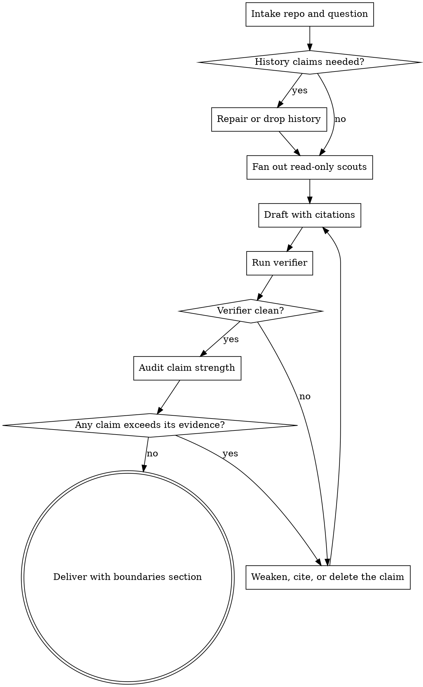

# Codebase Deep Read

Produce a report on a foreign codebase where every `path:line`, every quoted sentence, and every number has been re-checked against the source, and every unverified claim is labelled as such.

## Boundary

`wayne-triage` diagnoses a specific failure. `wayne-code-review` reviews a diff you own. `understand` builds a knowledge graph. This skill reads a repository you did not write and produces prose for a human decision.

## Flow



## Process

### A. Intake repo and question

- Input: a repository path, and the decision the report must serve.
- Record the exact snapshot in the report header: remote, `HEAD` short SHA, commit date, version from the package manifest, licence.
- Action: name which parts you will not read. A report that implies whole-repo coverage is a false claim before you write a word.

### C. Repair or drop history

A shallow clone silently answers `1` to every history question. Check before quoting any:

```bash
test -f .git/shallow && git fetch --filter=blob:none --unshallow --tags origin
git rev-list --count HEAD; git rev-list --count --first-parent HEAD
git rev-list --max-parents=0 --format='%ad %s' --date=short HEAD
```

Plain `--unshallow` fails with `early EOF` on large repositories; `--filter=blob:none` succeeds. If history stays unavailable, delete the history claims — do not infer them from one commit.

Total commits and first-parent commits answer different questions. Never mix denominators, and never infer development velocity, team size, or automation from either. Verify there is exactly one root commit and no author date earlier than it before calling anything an initial commit.

### D. Fan out read-only scouts

Read serially only what you must judge yourself; fan the rest out. Dispatch one scout per independent axis in a single batch, and give every scout the same evidence contract — that contract is owned by [the scout contract](references/scout-contract.md), which also holds the axis table and the rules for reviewing what comes back. Load it before dispatching; a scout sent without it returns prose you cannot verify.

Verify: each scout returned `path:line` for its load-bearing claims, not only prose.

### E. Draft with citations

- Copy bytes for any sentence carrying an argument. A one-word paraphrase drift inverts meaning: `no provider forks` and `no consumer forks` describe opposite savings.
- Recompute every scout number yourself with `wc -l`, `grep -c`, or `find | wc -l`. Read-tool line counts differ from `wc -l` by one.
- Check the arithmetic of every table that has a total.
- Hunt for the repository's own documentation being wrong about its own code, and report it. This is the highest-value paragraph in the report and it is never in the docs.

### F. Run verifier

Every verbatim source quote in the report is a blockquote whose entire payload is one code span:

```markdown
> `exact bytes copied from the file`
```

The verifier treats any other non-empty blockquote as a format error, because a bold or plain-text blockquote cannot be bound to source bytes and would escape the coverage gate. Keep the report's own callouts out of blockquote form.

```bash
uv run <skill-dir>/scripts/verify_citations.py <report.md> \
  --root <repo> --stop-at "## <verification section heading>" \
  --require-quote-coverage --quote '<path>:<line>:<exact literal>'
```

Bind every quote yourself with its own `--quote`; the tool never guesses which file a blockquote came from, and coverage is an exact set difference over literal text. `--stop-at` keeps the verification section out of its own count, and errors when the marker is absent.

Load [the verification recipe](references/verification.md) for the remaining flags — aliases, placeholders, declared-missing links — and for what the result is allowed to claim.

Verify: exit code `0`. Every unresolved reference is a defect in the report, not in the tool.

### G. Audit claim strength

Mechanical verification proves a quote exists. It proves nothing about the argument built on it. For each load-bearing claim, separate three things and state which you have:

| Layer       | Question                                       |
| ----------- | ---------------------------------------------- |
| Documented  | What does the repository claim?                |
| Implemented | What does the code actually do?                |
| Enforced    | Does anything fail when the claim is violated? |

A claim that is documented and implemented but unenforced is a convention, not a guarantee — say so. Check the scope of every superlative: a "100% coverage" gate usually excludes whole trees; an "invariant asserts it" usually gates on a marker only some call sites set; a capability demonstrated only by a test that is skipped without an API key is demonstrated, but not on every merge.

Before recommending that anything be deleted, search the repository for a decision record covering it. An unused extension point with a written decision saying "mechanism open" is a scoped choice, not dead code.

### R. Weaken, cite, or delete the claim

Change one claim at a time and re-run F. Prefer weakening to deleting: "true but unenforced" is more useful than silence.

### Z. Deliver with boundaries section

The report ends with what would change a reader's trust:

- corrections made during the work, with the original wrong version — including your own;
- contradictions found in the subject's own documentation;
- what was not read, and what was not executed. A report built from reading configuration must say no build or test was run.

State the verification scope precisely: cited locations exist and quoted bytes are present. That establishes nothing about whether the interpretation is correct.

## Red lines

- Do not claim "every factual claim is verified" when only citations were checked.
- Do not let the verification section count itself.
- Do not quote a line number from a read-tool preview without `wc -l` confirming the file is that long.
- Do not present a subordinate's finding without re-checking the one or two claims the conclusion rests on. A confident debunk that was itself wrong costs more than the original error.
