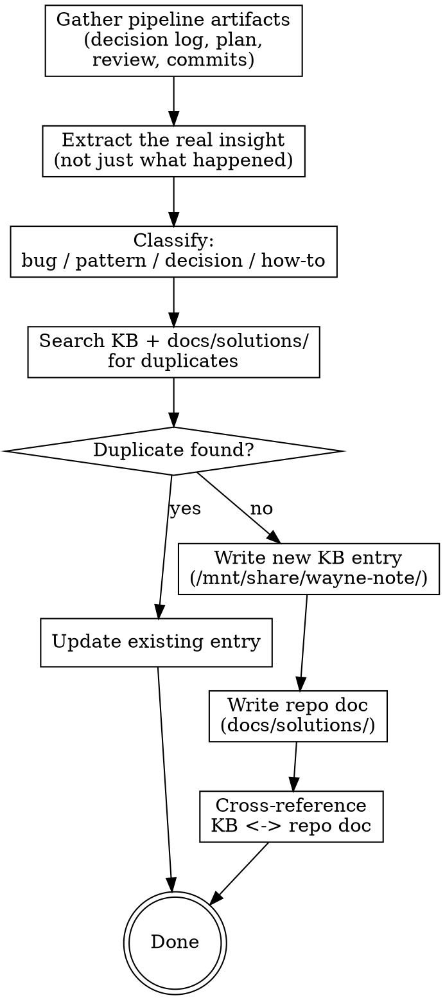

# Wayne Compound

Each solved problem should make the next one easier.
This skill captures what was learned and saves it where it can be found later.

This skill only specifies the lesson-capture / KB-write / repo-doc workflow.

## Files Written

KB entries (`/work/kb/`), solution docs (`docs/solutions/<category>/`), decision log updates. Category names / frontmatter keys / section headers stay English in Chinese prose.

## Checklist

1. **Gather pipeline artifacts** — decision log, plan, review findings, commit messages
2. **Extract the learning** — what was the real insight?
3. **Classify** — bug fix, pattern, decision, how-to?
4. **Check for duplicates** — MANDATORY before writing. Search KB and docs/solutions/ first. If anything similar exists, UPDATE or MERGE, do not create a new file. Specifically:
   - grep both the title AND the trigger keywords across `/mnt/share/wayne-note/`
   - list all lessons with `grep -rl "^type: lesson" /mnt/share/wayne-note/how-to/ --include="*.md"` — **read every existing lesson title + trigger before deciding to write new**
   - check the current repo's `docs/solutions/`
   - **Bias strongly toward update/merge over new file.** Default action when in doubt is "extend an existing lesson", not "write a new one". A KB with 30 sharp lessons beats one with 60 overlapping ones.
   - **Merge criteria** — collapse two lessons into one when ANY of these hold:
     * Same root cause expressed in different surfaces (e.g. CLI dispatch owner + thread-reply dispatch owner = "secondary surface shares dispatch owner")
     * One lesson is a specific technique that the other already lists as a sub-lesson (e.g. `shape_key()` granular repaint is a sub-lesson of dashboard hotfix collapse)
     * Two lessons cite the same decision letter / invariant / contract from different angles (e.g. contract-vs-cosmetic + cosmetic-auto-fix-triage both about OBS routing)
   - **When merging**: keep the broader title, expand `trigger:` to cover both scenarios, add sections for each empirical instance with its own anchor (commit SHA, review seq, date), preserve all anti-patterns + prevention bullets from both, then `git rm` the absorbed file and rewrite cross-references.
   - Only write a NEW file when: (a) the topic genuinely is not covered by any existing lesson, AND (b) merging it into the closest existing lesson would dilute that lesson's trigger past usability.

Search terms only locate candidates. Read each candidate's complete trigger,
scope, cause, and prevention before an AI semantic duplicate decision; keyword,
title, tag, or similarity overlap alone never forces merge or new-file status.
5. **Write to KB** — `/mnt/share/wayne-note/` (primary, Obsidian-compatible)
6. **Write to repo** — `docs/solutions/` (secondary, in-repo discovery)
7. **Cross-reference** — link between KB entry and repo doc

## Process Flow



---

## Phase 1: Gather Pipeline Artifacts

Read the exact decision log, plan, spec, review, verification, and commit references
carried by the ship handoff or explicitly supplied by the user. Validate their
paths and hashes before extracting lessons. Never select an artifact by modification
time, filename order, heading, or ID-shaped text. If a standalone run has multiple
plausible artifact sets, ask which shipped change is authoritative.

For each artifact found, read it and extract:

| Source | What to extract |
|--------|----------------|
| **Decision log** | Key decisions, rationale, surprises, things that changed mid-process |
| **Plan** | Original approach vs what actually happened |
| **Review findings** | Issues caught by dual-voice review, contradictions between Claude/Codex |
| **Commit messages** | The [why] and [how] from each commit |
| **Conversation** | Investigation steps, dead ends, breakthroughs |

---

## Phase 2: Extract the Real Insight

The goal is NOT to document what happened. It's to document **what was learned**.

Ask yourself:
- What would have saved time if we'd known it before starting?
- What assumption turned out to be wrong?
- What pattern emerged that applies beyond this specific case?
- What was the non-obvious part of the solution?
- What dead end should future-us avoid?

Distill into:
- **One-line takeaway** — the insight in one sentence
- **Context** — when does this apply?
- **Detail** — the full explanation with code examples if relevant
- **Anti-pattern** — what NOT to do (if applicable)

---

## Phase 3: Classify

| Category | KB folder | docs/solutions/ folder | When to use |
|----------|-----------|----------------------|-------------|
| **Bug fix** | `how-to/` | `runtime-errors/` or specific category | Solved a bug with non-obvious root cause |
| **Pattern** | `research/` | `patterns/` | Discovered a reusable approach |
| **Decision** | `decisions/` | — (decision log suffices) | Made an architectural or design choice with rationale |
| **How-to** | `how-to/` | `integration-issues/` | Figured out how to do something that wasn't documented |
| **Pitfall** | `how-to/` | specific category | Found a trap that others will fall into |

---

## Phase 4: Check for Duplicates

Search both knowledge stores:

```bash
# Search KB
grep -r "<keywords>" /mnt/share/wayne-note/ --include="*.md" -l 2>/dev/null

# Search docs/solutions
grep -r "<keywords>" docs/solutions/ --include="*.md" -l 2>/dev/null
```

If a related entry exists:
- Read it
- Decide: **update** (same problem, better insight) or **new** (different angle)
- If updating, preserve the existing structure and add the new context

---

## Phase 5: Write to KB (as a Lesson)

**Primary store:** `/mnt/share/wayne-note/<folder>/<kebab-title>.md`

**Read `/mnt/share/wayne-note/SCHEMA.md` first** — it defines the Write Protocol and lesson
frontmatter spec. This phase defers to SCHEMA. Don't re-implement reindex /
log / commit logic here.

Compound writes a **lesson** — a regular KB page with two extra frontmatter
fields (`type: lesson` + `trigger`) so future workflow skills can recall it.

### Folder placement

| Category | Folder |
|----------|--------|
| Bug fix / pitfall | `wayne-note/how-to/<kebab-title>.md` |
| Reusable pattern | `wayne-note/research/<kebab-title>.md` |
| Architectural decision | `wayne-note/decisions/<kebab-title>.md` |

### Lesson format (per SCHEMA.md)

**Read first, then write:** `templates/lesson-template.md` relative to this skill
directory.

The template is the canonical structure. Required sections:
- frontmatter: `title`, `date`, `tags`, `source`, `pipeline: wayne`, `type: lesson`, `trigger`, `related`
- `## Summary` (one-line takeaway)
- `## Context` (when does this apply?)
- `## Detail` (subsections: What Happened / The Insight / Code Examples)
- `## Anti-Patterns`
- `## Prevention`
- `## References` (decision log, plan, repo doc)

The `trigger` field is mandatory — see "Writing a good `trigger`" below.

### Writing a good `trigger`

This field is what `wayne-mind-explode` and `wayne-plan` use to recall the
lesson before related work starts. Write it as a future-tense scenario.

| Bad | Good |
|-----|------|
| `"asyncio bug"` | `"用 asyncio 配合 multiprocessing 时"` |
| `"SQLAlchemy issue"` | `"改 SQLAlchemy 查询性能或评估 N+1 风险时"` |
| `"CLI bug"` | `"给 Click CLI 加新 subcommand 或新 option 时"` |

Bad triggers describe the problem in past tense (useless for recall).
Good triggers describe the **scenario where the lesson applies** (matches
future user intent).

### Confirm `trigger` with the user (MANDATORY pause)

After drafting the lesson file but **before** running reindex / log / commit,
stop and show the user the proposed `trigger` field for confirmation:

> 这条 lesson 的 trigger 我写成：
> > "<draft trigger>"
>
> 这是未来 wayne-mind-explode / wayne-plan 召回这条 lesson 的关键。
> OK 直接用 / 改成 ... / 我来重写

Why this matters: `trigger` is the recall key. A bad trigger means future
workflow skills will miss this lesson when it's most relevant. The user knows
best what future scenarios should remind them of this. One short interaction
now saves countless missed recalls later.

Update the file in place if the user revises it, then proceed.

### Then follow the Write Protocol

After `trigger` is confirmed, follow `/mnt/share/wayne-note/SCHEMA.md` Write Protocol:
reindex → append log.md (action: `lesson`) → git commit → report files.

---

## Phase 6: Write to Repo

**Secondary store:** `docs/solutions/<category>/<filename>.md`

This is for in-repo discovery — agents working in this repo can find it without
accessing the personal KB.

**Read first, then write:** `${HOME}/.claude/skills/wayne-compound/templates/solution-doc-template.md`

The template is the canonical structure. Required sections:
- frontmatter: `title`, `date`, `problem_type` (bug|pattern|pitfall|how-to), `module`, `tags`
- `# <Title>`
- `## Problem` (1-2 sentences)
- `## Root Cause`
- `## Solution` (with code examples)
- `## Prevention`
- `## Related` (link back to KB)

Create directory if needed:
```bash
mkdir -p docs/solutions/<category>/
```

---

## Phase 7: Cross-Reference

Link the two entries:
- KB entry's `References` section → repo doc path
- Repo doc's `Related` section → KB entry path
- If a decision log exists, add a final row: `| compound | Learning captured | see KB + docs/solutions/ | — | — |`

---

## Integration with Wayne Workflow

```
wayne-mind-explode → wayne-plan → wayne-work → wayne-code-review → wayne-verify → wayne-ship → wayne-compound
     (WHAT)            (HOW)        (BUILD)      (STATIC GATE)      (RUNTIME GATE)  (COMMIT)     (LEARN)
```

This is the closing step. It reads everything upstream produced and distills
the non-obvious insights into searchable, reusable knowledge.

### What makes Wayne compound different from CE compound:

| Aspect | CE compound | Wayne compound |
|--------|-------------|----------------|
| **Primary store** | `docs/solutions/` only | `/mnt/share/wayne-note/` (Obsidian) + `docs/solutions/` |
| **Input** | Conversation history | Full pipeline: decision log + plan + review + commits |
| **Decision trace** | None | Links back to specific decisions in the log |
| **Specialized reviews** | Auto-dispatches domain experts | Skip (user can run manually) |
| **Auto-trigger** | "it's fixed" phrases | Same + after `wayne-ship` |

---

## Key Principles

- **Insight over narrative** — capture what was learned, not what happened
- **Two stores, cross-linked** — KB for personal recall, repo for team discovery
- **Duplicate-aware** — update existing entries, don't create duplicates
- **Pipeline-aware** — reads the full Wayne decision trail
- **Chinese for discussion, English for artifacts**
