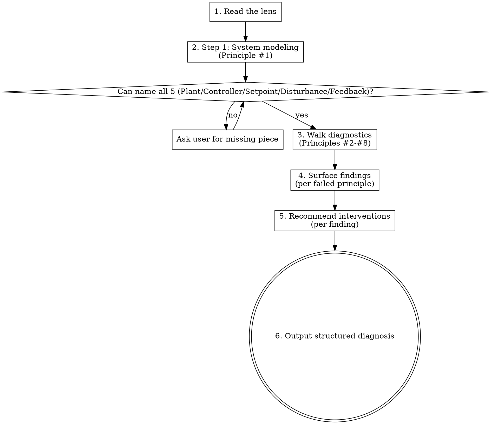

# Wayne Cybernetics

Apply the cybernetics lens to a system / architecture / process / debug problem.

This skill is a **diagnostic walker** — it reads the lens, surfaces its 8 principles
as questions against the user's problem, and outputs a structured diagnosis with
recommended interventions. Cross-domain: code, debug, process, KB, prompt-engineering.

This skill only specifies the cybernetics-lens application workflow.

## Files Written

diagnosis report (markdown, in conversation or to a file the user names), KB research entries (`/mnt/share/wayne-note/research/`), decision log entries when the diagnosis informs a design choice.

## Applicability

Use this lens when the problem involves:
- **Systems** — code architecture, service topology, multi-component interaction
- **State / control** — where state lives, how it changes, who owns it
- **Process / workflow** — handoffs, SLAs, runbooks, escalation paths
- **Debug** — system-level failures (not single-line bugs), unstable behavior, cascading failures
- **Knowledge management** — docs, KB, control planes, prompt systems
- **Drift** — anything that "keeps slowly going wrong"

Skip for:
- Single-line bug fixes (use `investigate` or just fix it)
- Pure logic problems (no state / control surface)
- Tasks under ~10 lines of change

## Process



## Phase 1 — Read the Lens

**Mandatory first step.** Read the lens file before doing anything else:

```
../_shared/cybernetics-lens.md
```

This is the SoT for the 8 principles + diagnostic questions + cross-domain examples.

Do NOT improvise from memory — the lens is the canonical methodology.

## Phase 2 — System Modeling (Principle #1)

Apply Principle #1 first, always. Name all 5:
- Plant (受控对象)
- Controller (控制器)
- Setpoint (设定值)
- Disturbance (扰动)
- Feedback (反馈)

If the user has not given enough context to name all 5, **stop and ask**. Use AskUserQuestion (in Chinese) for the missing piece. Do not guess.

Use the system-modeling table in the final report format below. Confirm it with the
user before proceeding to Phase 3.

## Phase 3 — Walk Diagnostics (Principles #2-#8)

For each of the 7 remaining principles, run the lens's diagnostic question against the user's problem:

| # | Principle | Diagnostic |
|---|---|---|
| 2 | Observability | If violated, can it be observed externally within N seconds? |
| 3 | Controllability | Does this control input actually cause behavior change? |
| 4 | Single SoT | How many places declare this rule / state? > 1 = drift risk |
| 5 | Stratification | At what layer (L0-L3) does this belong? |
| 6 | S/N | Value provided vs attention consumed? |
| 7 | Minimum effort | Smallest rule set that achieves the outcome? |
| 8 | Feedback | What channel closes the loop? How fast? |

For each, judge: pass / fail / N/A. Note evidence (file:line, observation, count, etc.).

## Phase 4 — Surface Findings

For every principle that failed, write a finding. Use this format:

```
### Finding F{N}: {one-line title}

**Principle**: #{N} {name}
**Evidence**: {file:line / count / observation}
**Severity**: HIGH | MED | LOW
**Why it fails**: {one-paragraph explanation tied to the principle's diagnostic}
```

Sort findings by severity (HIGH first).

## Phase 5 — Recommend Interventions

For each finding, propose an intervention:

```
### Intervention I{N} (for F{N}): {action}

**Type**: refactor | hook | doc | new SoT | delete | restructure
**Effort**: {time estimate}
**Reduces**: {which principle violations this addresses}
**Risk**: {what could go wrong}
**Verification**: {how we'd check the intervention worked}
```

Multiple interventions may be valid for one finding — list options, mark recommended.

## Phase 6 — Output Structured Diagnosis

Final report in Chinese (to user) — markdown, can be saved to a file the user names:

```markdown
# Cybernetics Diagnosis: {topic}

## 系统建模
{Phase 2 output}

## Findings
{Phase 4 output, sorted HIGH → LOW}

## Recommended Interventions
{Phase 5 output, mapped to findings}

## Out of Scope (intentionally not addressed)
{Note anything the lens revealed but user said is out of scope}

## Open Questions
{Anything the lens couldn't answer without more information}
```

If user asks "save this", write to `/mnt/share/wayne-note/research/YYYY-MM-DD-{slug}-cybernetics-diagnosis.md` with appropriate frontmatter.

## Integration with Other Wayne Skills

- **wayne-mind-explode**: during Phase 3 (Grill the User), if topic involves systems/control/state/process, the grill questions should be informed by this lens. mind-explode will Read this lens directly.
- **wayne-code-review**: during architectural review, optionally apply this lens. code-review may Read this lens.
- **wayne-plan**: planning a system-level refactor? this lens informs the spec's architecture section.
- **wayne-compound**: capturing a lesson about a control-plane failure? cite the principle that was violated.

## Key Principles (Meta)

- **Lens is canonical**: do not improvise principles. Read the lens.
- **Step 1 always first**: cannot diagnose what you cannot model.
- **Findings need evidence**: file:line / count / observation. No vibes.
- **Interventions need verification**: every recommendation states how to check it worked.
- **Cross-domain by design**: same principles for code / debug / process / KB / prompt — that's the value of the lens.
- **Lens itself follows lens**: this skill is the controller, the lens file is the SoT (Principle #4), it lives at L2 shared layer (Principle #5).
