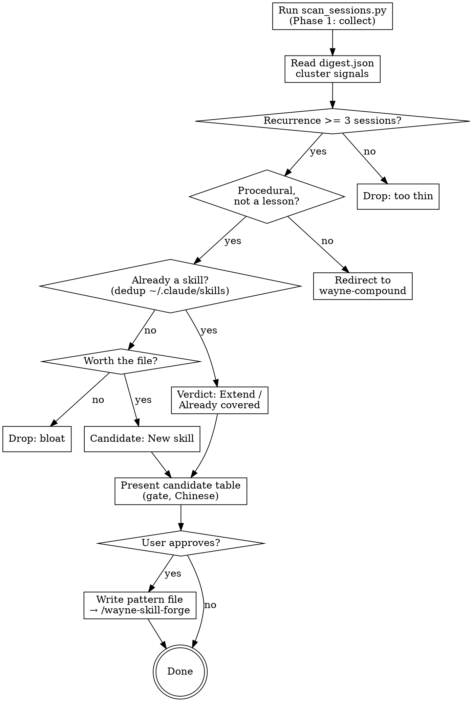

# Wayne Distill · sessions → new skills

> "重复做三次还没写进 SKILL.md 的工作流，就是欠的一个 skill。"

Mines recurring, hand-run workflows from session history and turns the
worth-it ones into skills. Evidence-gated, dedup-first, never auto-writes.

## Inherits from ~/.claude/CLAUDE.md

Inherits the Wayne control-plane invariants; does NOT redeclare them:

- Language Rules (Chinese to user, English to files/paths/labels)
- Engineering Principles (KISS / YAGNI / DRY / SSoT / Fail-Loud / Delete>Add)
- Code Standards, Behavior Baselines, proportional-effort skill rule

This skill only specifies the scan → cluster → gate → write-pattern workflow.

## Boundary vs neighbors (read before running)

| Skill | Input | Output |
|---|---|---|
| **wayne-distill** | the WHOLE session history | **pattern** files (evidence + verdict) |
| wayne-skill-forge | one pattern file | the actual `SKILL.md` (house style) |
| wayne-compound | ONE just-solved problem | lessons / KB entries / solution docs |
| waynejing | Wayne's instructions corpus | a persona |

If the recurring thing is a *lesson* ("don't do X again"), it belongs in
wayne-compound, not here. wayne-distill only promotes *repeatable procedures*.
distill **discovers + writes the pattern**; it does NOT write the SKILL.md —
that's `wayne-skill-forge`, the single owner of how a skill is written.

## When to Run

- **Manual:** `/wayne-distill` (all projects) or `/wayne-distill <keyword>` to
  focus candidates on one theme.
- **Periodic:** good as a weekly/scheduled audit (CronCreate) — history only
  grows; new repeated workflows surface over time.

**Skip when:** history is thin (< ~10 sessions) or you just ran it and nothing
crossed the threshold. Do not lower the threshold to manufacture candidates.

## Flow



## Process Flow

### Phase 1 — Collect (deterministic, scripted)

Run the collector. It is stdlib-only; runs anywhere with `python3`.

```bash
python3 ~/.claude/skills/wayne-distill/scripts/scan_sessions.py
# focus / tune:  --min-sessions 3   --projects-dir ~/.claude/projects
#                --codex-dir ~/.codex/sessions   -v
```

Reads BOTH agents' transcripts — Claude `~/.claude/projects/*/*.jsonl` and
Codex `~/.codex/sessions/*/*/*/rollout-*.jsonl` — pools them as one evidence
set, writes `/tmp/wayne-distill-digest.json`, prints a summary. Codex
worker/subagent runs (`source="exec"` or a subagent payload) are
machine-authored harness prompts, not your intent — dropped, mirroring the
Claude `isSidechain` exclusion (`codex_spawned_skipped` reports the count).
Either dir may be absent (warns, scans the other); both absent crashes. The
digest holds: per-session `agent` + `first_prompt` + tool/skill counts, a
`sessions_by_agent` tally, and cross-session recurrence signals
(`recurring_tool_ngrams`, `recurring_prompt_keywords` with example prompts,
`recurring_prompt_bigrams`, `skill_usage`). **Do not** hand-parse raw jsonl —
the script is the only reader.

### Phase 2 — Cluster & judge (you, the runtime)

Read `/tmp/wayne-distill-digest.json`. Cluster the signals into candidate
*workflows*, weighting `recurring_prompt_keywords[].examples` and per-session
`first_prompt` heavily; treat generic tool n-grams (`Read > Bash`) as weak
support only — they shape a workflow, they don't define one.

**Promotion criteria — ALL must hold:**

1. **Recurrence ≥ 3 sessions** (the configured threshold). One session run 3×
   is NOT 3 sessions — count distinct `session` ids.
2. **Procedural** — expressible as a repeatable "do X → Y → Z", not a one-off
   ask and not a lesson ("don't…", → wayne-compound instead).
3. **Not already a skill** — MANDATORY overlap check (the upgrade-vs-create
   decision). For EVERY surviving candidate:
   - List `~/.claude/skills/*/SKILL.md`; read each candidate-adjacent `name` +
     `description` (don't skim — read the closest 3-5 in full).
   - Name the single closest existing skill and state the overlap in one line.
   - **Decide:** overlap ⇒ **upgrade** the closest skill (verdict *Extend* /
     *Already covered*), NOT a new file. No real overlap ⇒ *New*.
   - Delete>Add: when an *Extend* and a *New* both fit, choose *Extend*. A new
     skill must earn its file against the closest sibling, not merely differ.
   - (`skill_usage` in the digest shows which skills already absorb this work —
     a high-usage neighbor is a strong upgrade target.)
4. **Worth the file** — distilling it must save real future effort; a skill
   nobody will re-trigger is bloat (Delete>Add).

**Verdicts** (per candidate):

| Verdict | Meaning |
|---|---|
| New skill | ≥3 sessions, procedural, uncovered, worth it → write pattern, forge builds |
| Extend `<skill>` | covered-ish; propose a section/edit to an existing SKILL.md |
| Already covered | an existing skill handles it; drop |
| Too thin | < 3 sessions or one-off; drop |
| → wayne-compound | it's a lesson, not a procedure; redirect |

### Phase 3 — Propose (gate — never auto-write)

Present a candidate table to the user and STOP for approval:

```
| # | Candidate skill | Closest existing skill (overlap) | Verdict (New / Extend) | Sessions | Evidence (sample prompts) | Why a skill |
```

The **Closest existing skill** column is mandatory — every row names what it was
checked against, so the upgrade-vs-create call is visible, not implicit.

Explain the call in plain Chinese first (per CLAUDE.md decision-point rule),
then let the user pick which to forge. **distill never writes a SKILL.md — it
writes a *pattern* file and hands that to `wayne-skill-forge`.**

### Phase 4 — Write the pattern (the output is a pattern, NOT a skill)

distill's deliverable is a **pattern file** per approved *New skill* — the
distilled "do X → Y → Z" plus the evidence forge needs. distill writes this
file; it does NOT write the SKILL.md. `wayne-skill-forge` does.

Write each approved candidate to `/tmp/wayne-distill-patterns/<kebab-name>.md`:

```md
# pattern: <kebab-name>
- verdict: New
- recurrence: <N> sessions  (<session-id>, <session-id>, …)
- triggers (bilingual): <phrases mined from evidence>
- closest existing skill: <name> — <one-line overlap; why New not Extend>
- evidence (sample prompts):
  - "<prompt>"
  - "<prompt>"
- rough steps: <do X → Y → Z observed in the evidence>
```

Then invoke `/wayne-skill-forge` — it reads the pattern file, runs the
house-style build + its own user gate before writing the SKILL.md.

For *Extend* verdicts: write the pattern with `verdict: Extend` + the target
skill name; forge proposes the concrete diff and applies only on approval — no
new file.

## Anti-patterns

- Lowering `--min-sessions` to fabricate candidates. Threshold is evidence.
- Proposing a candidate that duplicates an existing `wayne-*` (dedup is mandatory).
- Scaffolding a `SKILL.md` here instead of handing to `wayne-skill-forge`.
- Promoting a *lesson* — that's wayne-compound's job.
- Parsing raw jsonl yourself instead of using the collector.
