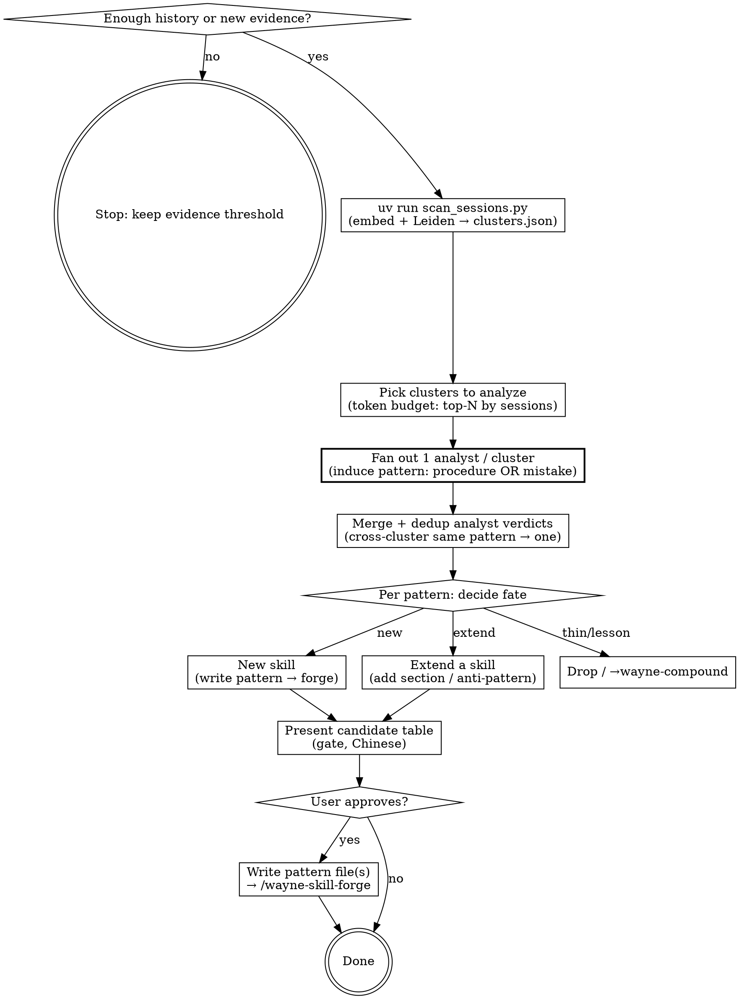

# Wayne Distill · sessions → new skills

> "重复做三次还没写进 SKILL.md 的工作流，就是欠的一个 skill。"

Mines recurring patterns from session history — reusable workflows AND
recurring agent mistakes — and turns the worth-it ones into skills (or
anti-patterns on existing skills). Semantic, evidence-gated, dedup-first,
never auto-writes.

## Boundary vs neighbors (read before running)

| Skill | Input | Output |
|---|---|---|
| **wayne-distill** | the WHOLE session history | **pattern** files (evidence + verdict) |
| wayne-skill-forge | one pattern file | the actual `SKILL.md` (house style) |
| wayne-compound | ONE just-solved problem | lessons / KB entries / solution docs |
| waynejing | Wayne's instructions corpus | a persona |

distill mines two pattern kinds — reusable *procedures* (things you re-run by
hand) and recurring *agent mistakes* (things you keep correcting). Both are
patterns; their FATE is decided per-pattern AFTER induction, not pre-sorted:
a new skill, an anti-pattern grafted onto an existing skill, or — for a pure
one-off *lesson* — a redirect to wayne-compound. distill **discovers + writes
the pattern**; it does NOT write the SKILL.md — that's `wayne-skill-forge`, the
single owner of how a skill is written.

Before collection, stop when history is thin (< ~10 sessions) or the last run
found no new threshold-crossing evidence. Do not lower thresholds to manufacture
candidates.

## Flow



## Process Flow

### Phase 1 — Collect + cluster (scripted, semantic)

Bare `/wayne-distill` spans all projects; `/wayne-distill <keyword>` narrows
candidate analysis to one theme without changing the evidence thresholds.

Run the collector with `uv run` — the PEP 723 header pulls its deps
(sentence-transformers / leidenalg / igraph / numpy). NOT stdlib-only anymore;
the semantic engine earns the deps. First run downloads the embedding model
(~470 MB, multilingual MiniLM) then caches it; embedding is CPU-forced.

```bash
uv run ~/.claude/skills/wayne-distill/scripts/scan_sessions.py
# tune: --min-sessions 3  --threshold 0.45  --resolution 1.2
#       --projects-dir ~/.claude/projects  --codex-dir ~/.codex/sessions  -v
```

Reads BOTH agents' transcripts — Claude `~/.claude/projects/*/*.jsonl` and
Codex `~/.codex/sessions/*/*/*/rollout-*.jsonl` — pools every human prompt as
one evidence set, drops machine-authored junk (system reminders, task
notifications, security-review harness, Codex `source="exec"` spawns), embeds
each prompt with a multilingual model, builds a kNN cosine-similarity graph,
and runs **Leiden** community detection. Writes
`/tmp/wayne-distill-clusters.json` and prints the ranked communities.

Why prompt-level + embedding, not the old word-frequency digest: a recurring
workflow is often scattered mid-session across sessions whose top topic is
something else (image-gen hid this way and word-freq missed it entirely,
because `[a-zA-Z]{4,}` never matched the Chinese "生成图片"). Embedding clusters
by MEANING across 中文/English; Leiden finds communities without a preset K.

The digest holds: `communities` (each with `rank`, `sessions` = # distinct
sessions spanned = recurrence, `prompts` = member count, and up to 18
`representative_prompts` nearest the centroid), plus weak lexical cross-checks
(`skill_usage`, `recurring_prompt_keywords`). **Do not** hand-parse raw jsonl
or re-embed — the script is the only reader/embedder.

### Phase 2 — Analyst fan-out (LLM induction, Trace2Skill-style)

Leiden gives communities, not verdicts. A community groups semantically-near
prompts; whether it's a real pattern is a judgment call the embedding can't
make. So fan an LLM **analyst** over the communities — one analyst per cluster
(or per small batch) — mirroring Trace2Skill's parallel patch proposal. The
cheap Leiden pass did the O(1000-prompt) work; the LLM only reads ~24 clusters'
representative prompts, not the raw corpus. That ratio is the whole point.

**MANDATORY: run every analyst as a fresh `Agent` subagent — NEVER induce in
the main agent.** Dispatch the analysts via the `Agent` tool (one per cluster or
small batch), each with a self-contained prompt (the cluster's representative
prompts + the skill-inventory temp-file path + the promotion criteria below).
Do NOT read the clusters into the main context and eyeball the verdicts yourself
— that is the failure this rule exists to prevent.

Why this is not optional:
- **A clean subagent judges each cluster on its own evidence.** The main agent
  is polluted by everything already in this session (the user's current task,
  earlier clusters, your own running hypotheses) — it anchors, conflates
  "already discussed" with "already a skill", and silently drops real patterns.
  Witnessed: a main-agent pass dismissed the image-gen cluster as "covered by
  frontend/visual skills" when no skill covered it — exactly the miss distill's
  own docstring names as the reason to embed. A fresh subagent with only that
  cluster in front of it would not have made that call.
- **Isolation = independence.** Parallel subagents don't cross-contaminate;
  each verdict stands on its cluster, which is the whole point of fan-out.
- **Context budget.** Raw cluster prompts stay out of the main window; only the
  distilled verdicts return.

If you find yourself about to write the candidate table directly from clusters
you read in the main agent, STOP — you skipped the fan-out. Re-dispatch as
subagents.

**Token budget (control the LLM cost).** Clusters are ranked by session count.
Analyze the top-N by recurrence, not all — default N ≈ 24 clusters is fine for
one pass, but for a big corpus cap it (e.g. top 15) and `log()` what was
dropped. Each analyst reads at most 18 representative prompts, not the whole
member list. State the budget you used.

**Prep once:** list `~/.claude/skills/*/SKILL.md`, read the `name` +
`description` of each, and write a one-screen skill inventory to a temp file.
Every analyst reads it to dedup against — the upgrade-vs-create decision needs
the existing set in front of it.

**Each analyst, per cluster, induces a PATTERN** — and a pattern is one of TWO
kinds (do NOT pre-sort; the analyst decides which, or both, from the prompts):

- **procedure** — a reusable "do X → Y → Z" you re-run by hand.
- **agent mistake** — a thing you keep *correcting* the agent on (the fail-ish
  "不对 / 又错了 / 你改出 bug 了 / 漏改了" prompts). Trace2Skill's error analyst:
  only promote a mistake whose mechanism is explainable; a one-off slip that
  can't be causally generalized is discarded, not a pattern.

**Promotion criteria — ALL must hold (same bar for both kinds):**

1. **Recurrence ≥ 3 sessions** — count distinct `session` ids in the cluster,
   not prompt count. A 30-prompt cluster from 2 sessions is thin.
2. **Coherent + generalizable** — one procedure, or one class of mistake with a
   nameable cause. A semantic grab-bag or pure chatter ("不会吧", "commit",
   "fix it") is NOT a pattern even at high session count.
3. **Dedup vs existing skills** — name the single closest existing skill, state
   the overlap in one line. Overlap ⇒ prefer *Extend*; no overlap ⇒ *New*.
   Delete>Add: a New skill must earn its file against the closest sibling.
4. **Worth it** — distilling saves real future effort; a skill nobody
   re-triggers is bloat.

**Then, per surviving pattern, decide its FATE** (this is the per-pattern
decision you insisted on — fate is chosen AFTER the pattern is understood, not
pre-assigned by kind):

| Verdict | Meaning | Kind it usually fits |
|---|---|---|
| New skill | uncovered, worth it → write pattern, forge builds | procedure, or a preventive check-list skill for a recurring mistake |
| Extend `<skill>` | covered-ish → propose a section/edit, OR graft an **anti-pattern** onto an existing skill | mistake that guards an existing skill's territory |
| Already covered | an existing skill handles it; drop | either |
| Too thin | < 3 sessions or one-off; drop | either |
| → wayne-compound | a pure lesson, not a repeatable pattern; redirect | mistake with no procedure to attach |

A recurring **mistake** is not automatically an anti-pattern appendix — if
preventing it needs its own do-X-before-Y checklist, that's a *New* preventive
skill. Judge fate per pattern; don't downgrade by reflex.

**Merge across clusters before proposing.** Leiden may split one pattern into
several clusters (image-gen fractured into slide-gen / icon / cursor-figure).
If ≥2 clusters induce the same pattern, MERGE them into one candidate whose
recurrence is the union of their sessions — recurring edits across independent
clusters is *stronger* evidence, per Trace2Skill's merge step.

### Phase 3 — Propose (gate — never auto-write)

Present a candidate table to the user and STOP for approval:

```
| # | Pattern | Kind (procedure / mistake) | Closest existing skill (overlap) | Fate (New / Extend / →compound) | Sessions | Evidence (sample prompts) | Why |
```

The **Closest existing skill** column is mandatory — every row names what it was
checked against, so the upgrade-vs-create call is visible, not implicit. The
**Kind** and **Fate** columns make the per-pattern fate decision explicit.

Explain the call in plain Chinese first (per CLAUDE.md decision-point rule),
then let the user pick which to forge. **distill never writes a SKILL.md — it
writes a *pattern* file and hands that to `wayne-skill-forge`.**

### Phase 4 — Write the pattern (the output is a pattern, NOT a skill)

distill's deliverable is a **pattern file** per approved *New skill* — the
distilled "do X → Y → Z" plus the evidence forge needs. distill writes this
file; it does NOT write the SKILL.md. `wayne-skill-forge` does.

Write each approved candidate to `/tmp/wayne-distill-patterns/<kebab-name>.md`:

```md
# pattern: <kebab-name>
- verdict: New            # New | Extend <skill>
- kind: procedure         # procedure | mistake
- recurrence: <N> sessions  (<session-id>, <session-id>, …)
- triggers (bilingual): <phrases mined from evidence>
- closest existing skill: <name> — <one-line overlap; why New not Extend>
- evidence (sample prompts):
  - "<prompt>"
  - "<prompt>"
- rough steps: <do X → Y → Z observed in the evidence>
# for kind: mistake, ALSO capture:
- the mistake: <what the agent kept getting wrong>
- the guard: <the check/step that prevents it — this is what the skill enforces>
```

Then invoke `/wayne-skill-forge` — it reads the pattern file, runs the
house-style build + its own user gate before writing the SKILL.md.

For *Extend* verdicts: write the pattern with `verdict: Extend` + the target
skill name; forge proposes the concrete diff and applies only on approval — no
new file. An **anti-pattern graft** (a recurring mistake guarding an existing
skill's territory) is an Extend whose diff adds a bullet to that skill's
Anti-patterns section.

## Anti-patterns

- Lowering `--min-sessions` (or `--threshold`) to fabricate candidates. The
  thresholds are the evidence bar.
- Inducing patterns in the main agent instead of dispatching fresh `Agent`
  subagents — the polluted main context anchors and silently drops real
  patterns (this is how the image-gen cluster got wrongly dismissed as
  "already covered"). One clean subagent per cluster is mandatory, not an
  optimization.
- Trusting a Leiden community as a verdict without an analyst — clusters are
  raw material; a high session count on a chatter cluster is still chatter.
- Pre-sorting patterns by kind into fixed fates (all mistakes → anti-patterns).
  Fate is decided per pattern AFTER induction — a recurring mistake can warrant
  its own preventive skill.
- Skipping the cross-cluster merge — proposing image-gen as 3 separate
  candidates because Leiden split it. Merge same-pattern clusters first.
- Fanning an analyst over every cluster with no token budget — cap to the top-N
  by recurrence and `log()` what was dropped.
- Proposing a candidate that duplicates an existing skill (dedup is mandatory).
- Scaffolding a `SKILL.md` here instead of handing to `wayne-skill-forge`.
- Re-embedding or hand-parsing raw jsonl instead of using the collector.
