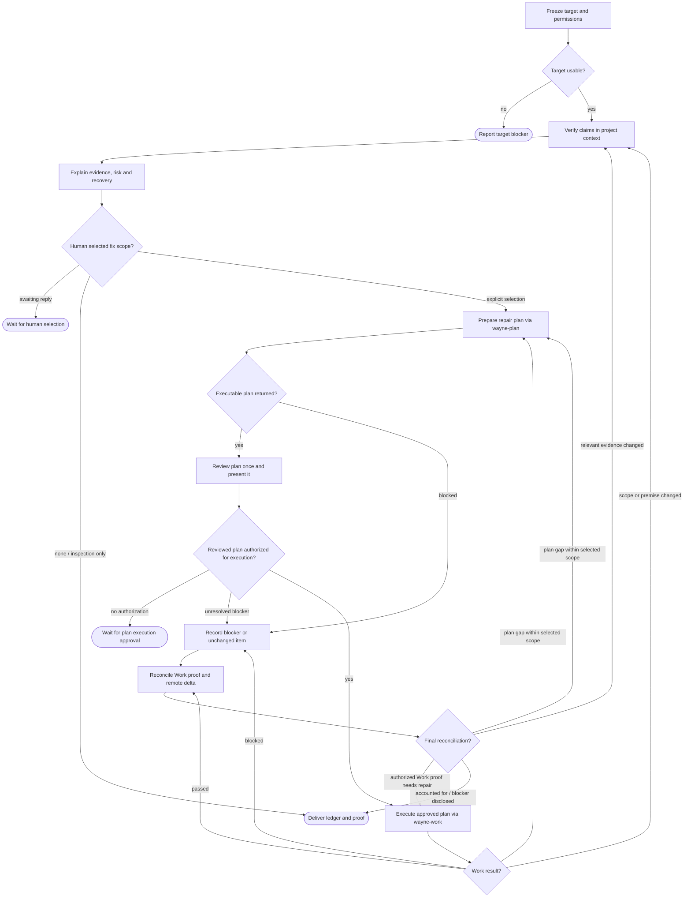

# Wayne Fix Review

Treat review comments as hypotheses; deliver verified local fixes and an evidence-backed disposition for every claim.

## Boundary

Own comment verification, the human scope decision, and final finding dispositions. `wayne-plan` owns the repair plan; `wayne-work` owns implementation and execution proof. A request only to inspect comments ends at the decision briefing. `wayne-code-review` produces new reviews; this skill consumes existing ones. Local proof is not a merge-gate verdict.

Use `verify-review-findings` for validity-only report triage with no repair stage, `review-finding-timeline-forensics` for a standalone stale-review investigation, and `prove-the-regression-test` for a standalone test-proof audit.

Commit, push, remote replies, thread resolution, and merge require their own authorization. Preserve granted permissions and explicit exclusions; do not infer publication permission from permission to edit code.

Selection and execution authorization are explicit gates below. Never replace `wayne-work` with an inline repair loop or independently dispatched fix workers. Do not automatically invoke `wayne-code-review`, `wayne-verify`, or `wayne-ship` after Work returns.

## Flow

## Process

### A. Freeze target and permissions

Prefer the named repository and PR number/URL. Otherwise resolve the current branch's PR and recent open PRs for the named topic before inspecting historical merged PRs. A remembered title is not target evidence. Honor an explicitly requested historical PR; do not silently replace it with an open one. Ask only when material ambiguity survives the available repository/provider evidence.

Record the PR URL, actual base/merge-base and head SHAs, branch/state, retrieval time, and local checkout/dirty baseline. Fetch review verdicts, inline threads/replies, and conversation comments completely, following pagination or truncation. A partial stream cannot establish absence. Align inspected source with the pinned head; preserve unrelated work rather than resetting or switching it away. Name unreadable evidence and the coverage it prevents.

### B. Verify claims in project context

Maintain one ledger. Split distinct claims and group duplicate mechanisms without losing original comment IDs/links. Keep truth (real, already fixed, not a defect, latent, unproven), reviewer premise, severity, provenance (introduced, pre-existing, forward-activated), governing contract/author decisions, and action separate.

A cited line is a starting point, not evidence closure. For each claim:

- Read the complete controlling function/branch and relevant producers, callers and downstream consumers. Trace a real entrypoint through valid inputs, configuration and persisted state to the alleged failure and user-visible result. Inspect the guards, schema constraints, transaction/error boundaries and sibling/recovery paths that could change that result; stop at the contract boundary, not an arbitrary line count.
- Attempt to disprove the mechanism: name the strongest applicable upstream validation, unreachable configuration, downstream repair or accepted contract, and show why it blocks the issue or does not. A search miss, reviewer agreement or isolated snippet is not a verdict.
- Obtain claim-appropriate evidence: a focused reproduction or existing incident evidence for behavior, read-only real data for population claims, freshly emitted artifacts for build claims, reviewed/base/current source for regression claims. Identify the command, inputs, environment and observable result. Do not mutate live data or force an impossible state to make a claim true.
- Explain the chain with file/symbol anchors: **entry and conditions → mechanism → persisted/visible consequence**, plus the counterevidence considered. Distinguish runtime-demonstrated from source-established conclusions. If a necessary link is unknown, mark it unproven and name the missing evidence; an unavailable service is neither RED nor refutation. Refuting the reviewer's explanation does not by itself refute the defect.

Assess exposure using this project's active configuration, supported workflows, affected cohort and required state/timing combination. Separate certainty about the mechanism from how often users encounter it. Use measured frequencies only with their source, denominator, environment and observation window; otherwise give a conditional qualitative assessment or say unknown. No invented percentages, no “rare” from no observed incidents, and no downgrade of an integrity contract because one replica has no bad rows.

For apparently fixed items, compare reviewed and current versions. A stale-repost claim requires the specific fix to be an ancestor of the review target, not merely an earlier timestamp. Preserve explicit author declines unless new evidence reopens them. Identify findings activated by another fix and record that dependency; pre-existing or adjacent debt is not automatic repair scope. This stage verifies, not plans or implements.

### U. Explain the findings and wait for scope selection

Show a compact ledger of every claim and a decision brief for each fix group. Do not substitute severity labels or file links for explanations. Each brief must let the user decide without reading the code:

- **Verdict and reason:** what the reviewer alleged, what is actually true, governing contract/provenance, causal evidence and counterevidence, proof strength and remaining uncertainty; preserve all comment links.
- **Trigger and likelihood here:** a concrete user/system scenario, all required conditions, who is exposed under current project configuration, and the evidence-based likelihood from B. Distinguish current reachability from what another fix would activate.
- **Impact and recovery:** what fails or becomes wrong, affected users/data/work, persistence and severity rationale. Explain whether supported retry/restart/rollback/manual repair restores state, prerequisites and side-effect/data-loss risks, and any irreversible or unknown outcome. Cite the recovery path or runbook; do not invent one. Separate preventing recurrence from repairing already-affected state.
- **Choice and scope:** smallest credible fix direction, behavior/files or subsystems affected, compatibility/migration costs, regression risk and dependencies; contrast fixing with deferring or a supported workaround. Recommend with reasons, but leave the decision to the user. This is a decision brief, not a repair plan.

Ask which groups to fix, defer or investigate further, then **end the turn and wait for the answer**. Asking is not consent; silence, a generic “fix the comments”, and invoking this skill do not select all findings. A pending answer is not a decline. Record the user's explicit group selection and exclusions; only then may planning begin. If a dependency requires an unselected group, explain and obtain expanded scope rather than bundling it silently. Reuse a selection already made against this briefing; do not repeatedly ask for unchanged approval.

### P. Prepare the repair plan

Load [the repair-planning and Work integration contract](references/repair-planning.md). Invoke `wayne-plan` under that scoped return-only contract, with the selected ledger, source evidence and existing decisions. Produce a durable executable plan, not a prose recommendation or TODO list. The reference owns unit fields, artifact ownership and caller overrides.

### W. Review once and present the plan

Follow the same reference for one fresh independent plan-review round and adjudication. Present the reviewed plan, exact selected/excluded scope, dependencies and proof before execution. E is explicitly user-triggered: obtain authorization to execute this approved plan through `wayne-work`, reusing an existing explicit grant only if it covers this plan and unchanged scope. A finding selection or plan status of approved is not execution consent. Changed behavior, risk or scope returns to U, not an assumed approval.

On resume, reuse the reviewed plan and settled grants; reconcile only units affected by new evidence. Do not repeat the whole-plan review merely because Work returned.

### E. Execute through wayne-work

Load and invoke `wayne-work` with the approved plan and the reference's Work invocation packet. It owns the implementation loop, plan conformance, waves, verification and integration; merely naming the skill or imitating its steps does not count. Do not repair units outside Work. Preserve its returned unit evidence, changed paths and blockers, then resume here. A plan-only response is not a completed accepted repair.

### F. Record a blocker or unchanged item

Record missing prerequisites, refuted claims, explicit deferrals and exclusions with affected units/dependents and the next action. Preserve unrelated changes and completed proof. Work owns removal of any now-unjustified implementation and continuation of independent authorized work under its scheduling contract. Do not retry an unchanged blocker, silently weaken proof or mark unproven behavior passed.

### G. Reconcile Work proof and remote delta

Reconcile Work's actual patch and combined-check receipt against selected findings and forward-activated claims. Missing or failed execution proof returns to Work within the approved plan; a plan gap returns to P, and changed scope returns to U. Never substitute per-item GREEN for combined verification.

Refresh the remote head and complete comment/reply/verdict streams. Reconcile relevant deltas before claiming current coverage. Do not transfer proof onto an untested head or overwrite local fixes to follow it. If refresh/alignment is blocked, retain the last observed SHA and bound the result. Reopen only affected findings; new findings require human selection, not automatic repairs.

### H. Deliver ledger and proof

Identify the PR, inspected head, final observed remote head, locally tested patch, executed plan path and Work checkpoint path. Return every finding's disposition with links, mechanism/contract evidence and action. Include Work's unit-to-finding mapping, changed paths, exact RED/GREEN and consumer-surface evidence, skipped/blocked checks, deliberate non-changes and remaining decisions.

Distinguish locally fixed, already fixed upstream, deferred, and remotely resolved. Never label the whole review fixed while an accepted in-scope defect or required proof remains open. State which authorized publication actions actually occurred; absent authorization, stop at the verified local result and the proposed next step.
