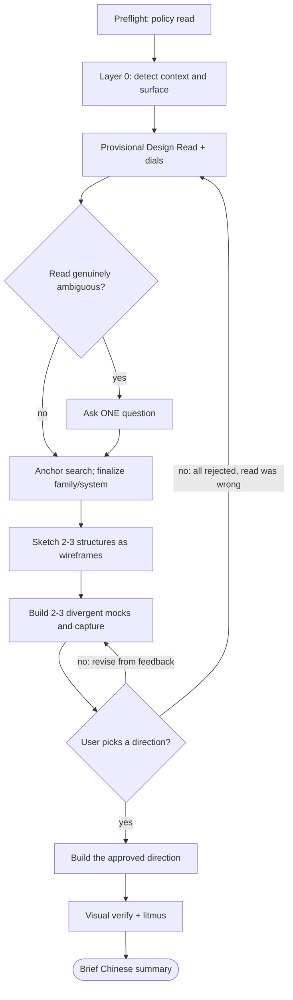

# Wayne Frontend Design

Distinctive, production-grade UI — not AI slop, and not the same aesthetic every time. Classify the surface, read the brief, show real mocks, iterate to approval, then build.

## Files Written

HTML, CSS, JS, JSX, design tokens, comments, DESIGN.md. Severity tags `[CRITICAL]` / `[OVERRIDE]`, mode names (`Existing` / `Partial` / `Greenfield`), surface names (`Marketing` / `Application` / `Operations` / `Component`), dial names, and file:line references stay English inside Chinese prose.

## Authority Hierarchy

Every default in this skill yields, in this order:

1. **Existing design system / codebase patterns** — highest, always respected
2. **User's explicit instructions** — override skill defaults
3. **Skill defaults** — greenfield work, or when the user asks for guidance

## Reference Files

Read the one that matches the step you are on. Do not preload the set.

| Reference | Read at | Owns |
| --- | --- | --- |
| `surface-and-dials.md` | §A-B | surface topology, dial inference, Design Read format |
| `anchor-search.md` | §B | where the reference comes from; priority ladder; brand asset rules |
| `style-recipes/INDEX.md` | §B | 25 vendored anchored recipes. **Read INDEX, then exactly one recipe** |
| `layout-archetypes.md` | §C | app shells, data views, dashboard IA, marketing structures, ASCII sketch format |
| `aesthetic-families.md` | §C | material/direction library, variation axes, pattern vocabulary |
| `craft-foundations.md` | §C, §E | hierarchy, type scale, density, elevation, tokens, self-checks |
| `anti-slop.md` | §E | bias corrections: type, color, shape, layout, app states, imagery, motion, responsive |
| `design-systems.md` | §B, §E | brief → real design system, default stack, perf targets |
| `redesign-audit.md` | §A | redesign detection, audit, preservation, modernisation levers |
| `claude-design-sys-prompt.txt` | §E | output naming, asset copying, React+Babel pinning |
| `agent-browser/` | §C, §F | screenshots, video, authenticated sessions, profiling |

## Flow

Track one task per flow node. Do not build the real thing before node D passes.

## Process

### P. Preflight — policy read

Wayne's global rule (`AGENTS.md`, Frontend) requires reading `https://github.com/VoltAgent/awesome-design-md` **first**, before any UI work. Do it here, and classify the result explicitly as **non-binding, marketing-only evidence**: it is a catalogue of brand and marketing DESIGN.md files with no application, dashboard, or operations patterns. It re-enters at tier 3 of the anchor ladder (§N) and only for `Marketing`. It never selects the style. If the brief did not ask for Linear, do not ship Linear.

### A. Layer 0 — context and surface detection

Use Glob/Grep (not shell) to scan for: design tokens and CSS variables (`--color-*`, `--spacing-*`), component libraries (shadcn, MUI, Chakra, Ant, Radix, in-house), CSS frameworks (`tailwind.config.*`, styled-components theme, CSS modules), typography (`@font-face`, font imports), color scales, animation libraries, and a project `DESIGN.md`.

| Mode | Signals | Behavior |
| --- | --- | --- |
| `Existing` | 4+ signals across categories, or `DESIGN.md` present | Defer fully. Aesthetic opinions yield; structural guidance still applies |
| `Partial` | 1-3 signals | Follow what exists; apply defaults only to uncovered areas |
| `Greenfield` | 0 signals | Full skill guidance |
| `Ambiguous` | contradictory signals | Ask, in Chinese, before proceeding |

Then classify the **surface** — `Marketing` / `Application` / `Operations` / `Component` — per `references/surface-and-dials.md`. Mixed products get one classification per route, not one per repo. The surface decides which composition rules apply and whether external marketing references are relevant at all.

Redesign work also runs the audit in `references/redesign-audit.md` before anything else.

### B. Provisional Design Read and dials

This read is **provisional** — it fixes the problem, not the look. Do not name a final aesthetic family or recipe here; §N does that once a real anchor exists.

State one line before any code:

> Reading this as: `<surface>` — `<kind>` for `<audience>`, primary task `<task>`, used `<frequency / criticality>`, constrained by `<constraints>`. Provisional dials V/M/D.

Set `DESIGN_VARIANCE`, `MOTION_INTENSITY`, `VISUAL_DENSITY` explicitly from the inference table in `references/surface-and-dials.md`. Never leave them implicit or silently at a baseline.

For `Application` / `Operations`, also decide the foundation now: a real design system with mature data patterns usually beats hand-rolled tokens. Check `references/design-systems.md` before committing to a stack.

If the read genuinely diverges, ask exactly **one** question. If you can infer confidently, do not ask.

### N. Anchor search

Never design from thin air. Work the priority ladder in `references/anchor-search.md`: user-supplied assets → their existing product → named industry references → a named anchor's recipe in `references/style-recipes/` → **live search for 3-5 real shipping products** matching the provisional read, verified by URL.

The vendored catalogue is 25 frozen anchors. Defaulting to it instead of searching reproduces the same monoculture this ladder exists to break. Read `style-recipes/INDEX.md` to name a school or borrow concrete token values, never as the first answer, and never more than one recipe file.

Verify unstable facts by search before designing around them. For brand work, assets outrank specs — the logo is non-negotiable. **Every mock direction cites one verified anchor**, or says why none exists for it.

Finalize here: the aesthetic family (`references/aesthetic-families.md`) and, for `Application` / `Operations`, the design system. State what you extracted — palette, type, spacing, radius, shadow, motion, density, copy register — and update any dial the anchor moves. The mocks are judged against this.

### S. Structure sketch

Before any pixels, sketch **2-3 candidate structures as ASCII wireframes** from `references/layout-archetypes.md`: app shell and data views for `Application` / `Operations`, IA pattern and metric tiers for dashboards, hero paradigm and section order for `Marketing`. One line per sketch naming the focal element, the density value, and the state you will show.

Every candidate carries a trace line, so the structure is defensible:

> `<design decision>` ← `<task / data / navigation evidence>` → `<layout archetype>` → `<verified anchor or example>`

Layout follows the primary task, use frequency, navigation breadth and depth, entity and data shape, and the density dial — not visual taste.

Structure comes from the Design Read, not from habit. A wrong structure costs nothing to discard here and everything to discard after a build.

### C. Mock round — show, do not describe

Never present a text-only plan as the checkpoint. Take the surviving sketches and render **2-3 directions that are genuinely far apart** — different structure (`layout-archetypes.md`), different aesthetic family (`aesthetic-families.md`), and/or materially different dials. Apply `craft-foundations.md` to each; a mock with flat hierarchy tells the user nothing. Each direction is a real rendered artifact:

- Each direction is a **disposable scratch artifact** — a standalone file, a Storybook story, or an isolated throwaway route. Never mutate production UI before a direction is selected. Name them `Direction A - <family>`, `B`, `C`
- Real content from the brief. Never Lorem Ipsum, `Acme`, `Jane Doe`, `99.99%`
- Every direction must make these judgeable: type stack, palette, density, spacing rhythm, navigation, the primary task or primary message, and at least one meaningful non-happy state (empty / loading / error / long content)
- `Marketing`: hero plus 2-3 representative sections. `Application` / `Operations`: the primary task view plus one secondary state
- Imagery only where the Design Read makes it relevant. Marketing directions need real images (`anti-slop.md` §6); a data table or console view is the visual itself and needs none. Never a div-based fake screenshot either way
- Fidelity stops at judgement. Full interaction and full state coverage are not required at this stage
- Screenshot each with `references/agent-browser/`; present the images with a one-line Chinese label per direction (family, dials, what it optimises for)

**Reference images.** If the user supplies screenshots or a reference site, analyse it first — layout grammar, type scale, palette, component vocabulary, spacing rhythm — and state what you read. Then generate divergent directions informed by it. Do not silently clone it unless the user asked for a clone.

Before showing, run the swap / squint / signature / token / sameness checks in `craft-foundations.md` §10. A mock that fails the sameness check is a default wearing a label.

Redesign mode also captures the current state as a `Before` frame.

### D. Iterate until satisfied

This is a loop, not a single approval. Take the user's feedback, revise, capture again, present again. Keep going until the user says it is right.

- Feedback that names a direction → refine that one; keep the others available until the user drops them
- Feedback that rejects all → the Design Read was wrong. Redo B, then generate directions on **different** variation axes (`aesthetic-families.md`), not nudged colors on the same family
- Keep every round's file; do not overwrite (`Direction A v2.html`)
- Say what changed each round in one Chinese line. Do not re-explain the design

Do not start the production build until the user has picked.

### E. Build

For multi-screen or multi-route work, first synthesize the approved direction into a project `DESIGN.md`: atmosphere, color roles, type rules, component stylings, layout principles, responsive rules, motion philosophy, and the banned patterns for this project. That file becomes the SSoT for the build and for every later session. Single-page work skips it.

Then implement against the detected system and the dials. Layer 2 defaults below; detail in `craft-foundations.md`, `anti-slop.md`, and `design-systems.md`.

### F. Visual verify

One pass with `references/agent-browser/`. Screenshot the rendered output and check it against the approved mock and the Litmus list. Assess: does it match the direction the user picked, are there broken layouts or unreadable text, does it read as the intended surface. If a headless browser is unavailable, do the Litmus review mentally and say that visual verification was skipped.

Multi-round pixel refinement belongs to `compound-engineering:design:design-iterator`.

## Layer 2 — what the body owns

Everything here yields to an existing system and to the user. Detail lives in the references; only the branch that changes _which_ rules apply lives here.

**Composition branches on surface.** `Marketing`: the first viewport is a poster — whitespace, scale, and one anchor before any chrome. `Application` / `Operations`: workflow hierarchy first, the primary task reachable in one move, density taken from the dial, and loading / empty / error / permission-denied shipped as part of the deliverable rather than a follow-up. `Component`: the host system owns all of it.

**Cardless by default**, on every surface. A card is justified only when the card _is_ the interaction, or when elevation communicates real hierarchy.

**Accessibility and mobile are floors, not defaults.** Semantic elements over div soup; WCAG AA on text, CTA fills, form fields, placeholders and focus rings; visible focus on every interactive element; `prefers-reduced-motion` honoured above dial 3; every multi-column layout declares its collapse below 768px in the same component, and horizontal overflow on mobile is a failure, not a nit.

## Output Conventions

From `references/claude-design-sys-prompt.txt`:

- Filenames descriptive Title Case — `Landing Page.html`, `Dashboard.html`
- Significant revisions copy rather than overwrite (`My Design v2.html`)
- Files over 1000 lines split into smaller JSX files imported by the main file
- Inline React + Babel always uses pinned versions with integrity hashes
- Never `const styles = {...}` — name them `heroStyles`, `terminalStyles`
- Copy the assets you need from a design system; never bulk-copy over 20 files
- Persist playback position in `localStorage` for decks, video, iterables
- Never `scrollIntoView`
- Emoji only if the existing system uses them
- **Ship complete code.** No `// ...`, no `// rest of code`, no `// TODO`, no "the rest follows the same pattern". If output hits a length limit, stop at a clean boundary and say exactly what remains

## Hard Rules

**Quality floor — never ship these**

- Prompt language or AI commentary leaking into the UI
- Text unreadable over its background; CTA text failing contrast against its own fill
- Interactive elements with no visible focus state
- Semantic div soup where real elements exist
- Inventing colors when a palette already exists
- Placeholder identity — Lorem Ipsum, `Acme Corp`, `Jane Doe`, `99.99%`
- Div-based fake screenshots, dashboards, or terminals standing in for a product visual
- A text-only "plan" presented instead of a rendered mock at the §C checkpoint
- Designing with no reference at all without saying so (`anchor-search.md`)
- A colored rectangle or CSS silhouette standing in for a real logo or product photo

**Default against (overridable)** — generic SaaS card grid as the first impression; purple-on-white; dark-mode bias; overused greenfield fonts; hero cluttered with stats, pill clusters, and logo walls; sections repeating one mood in different words; purposeless carousels; competing accents; decorative gradients standing in for content; copy that sounds like design commentary.

## Litmus Checks

Judgment, not a checklist to grep. Apply the ones that fit the surface.

- Is the brand or product unmistakable in the first screen? (`Marketing`)
- Is the primary task obvious and one move away? (`Application` / `Operations`)
- One strong visual anchor, or several competing ones?
- Does scanning headlines alone convey the page?
- Does each section have exactly one job?
- Are the cards actually necessary where used?
- Does motion improve hierarchy, or is it just present?
- Would it still feel premium with every decorative shadow removed?
- Does the copy sound like the product, or like a prompt?
- Does this match the direction the user approved at node D?
- Does it match the existing design system? (`Existing` / `Partial`)
- Swap / squint / signature / token / sameness checks (`craft-foundations.md` §10)

## Final Summary

Extremely brief, in Chinese. Caveats and next steps only. Do not restate what you built — the user can see it.

## Lineage

- **Anthropic Claude Design** (Opus 4.7) system prompt — workflow, output conventions, React+Babel rules
- **anthropics/skills `frontend-design`** — two-pass planning, ASCII wireframes to compare layouts, signature element, named AI-default clusters, copy-as-design-material
- **compound-engineering:frontend-design** — Authority Hierarchy, Layer 0/1/2, Litmus, mode classification
- **Leonxlnx/taste-skill** pack — brief inference, three dials, brief→design-system map, anti-default palette and serif discipline, aesthetic-family playbooks (minimalist / brutalist / soft / brandkit), redesign audit, full-output enforcement
- **ConardLi/garden-skills `web-design-engineer`** (MIT) — anchor priority ladder, verify-facts-first, Asset>Spec brand rules, and the vendored `style-recipes/` catalogue
- **Dammyjay93/interface-design** — craft foundations: focal point, type-scale ratios, density in px, proportions, surface elevation, token naming, self-checks
- **NickCrew/Claude-Cortex `dashboard-designer`** — dashboard archetypes, metric tiers, F/Z/grid IA
- **VoltAgent awesome-design-md** — marketing/brand DESIGN.md corpus; ladder tier 3, `Marketing` only
- **Wayne global rules** (`AGENTS.md`) — bilingual operation, KISS/DRY/YAGNI
- **compound-engineering:agent-browser** — visual verification
