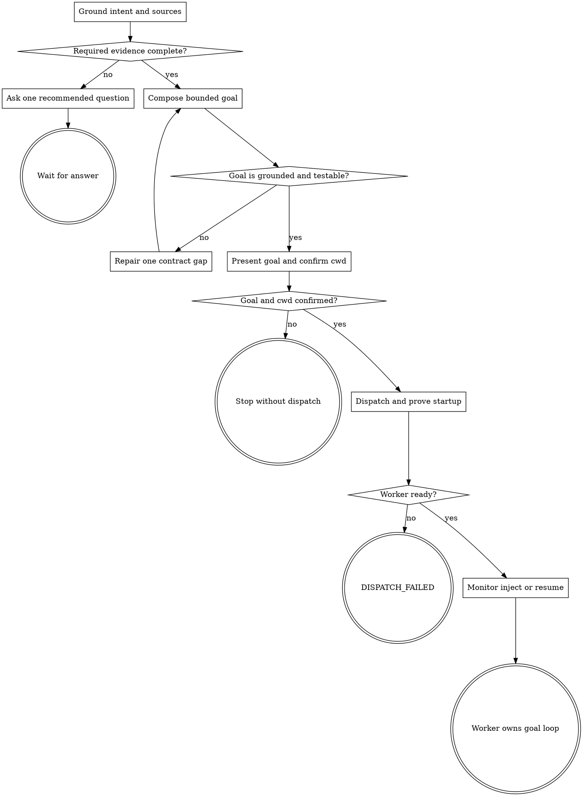

# Wayne Goal Prompt

Produce the smallest self-contained steering goal that lets an autonomous worker
loop to observable completion, then dispatch it only after explicit approval.

## Boundary

Own intent grounding, goal composition, confirmation, and the bundled headless
dispatch lifecycle. `wayne-plan` owns durable implementation planning and
`wayne-work` owns implementation. Never perform the goal's product work here.

Before composition, read the canonical
[goal-prompt template](references/goal-prompt-template.md). Read the
[Alfred exemplar](references/example-alfred-tui.md) only when real terminal/UI,
provider configuration, or secret-forwarding proof needs a contrasting example.
For confirmed dispatch, failure, injection, monitoring, or resume, read
[dispatch runtime](references/dispatch-runtime.md) completely and use the bundled
`scripts/codex-dispatch.sh` and `scripts/codex_goal_driver.py`; do not recreate
their protocol manually.

## Goal contract

Keep the copy-paste goal under roughly 4,000 characters when possible. The table is
a reliable organization guide, not a Markdown grammar. Sections 1, 2, 4, 5, and 6
carry required information; section 3 appears only for an in-flight correction.

| § | Heading | Contract |
|---|---|---|
| 1 | `Goal:` | one outcome sentence, not a task list |
| 2 | `Context:` | framing, definitions, and `Do not` boundaries |
| 3 | `Current correction:` | only the delta from an actual prior attempt |
| 4 | `Tasks:` | numbered work with each constraint at its owning step |
| 5 | `Verification required before completion:` | exact commands plus the real user entrypoint and forbidden substitute |
| 6 | `Completion criteria:` | independently checkable outcomes mapped to §5 |

Never include plaintext secrets; name the environment variable that owns them.
Cut reconstructible narrative before cutting §5 or §6.

## Flow



## Process

### A. Ground intent and sources

Preserve the raw intent. Inspect the target repository for real paths, entrypoints,
commands, tests, and approved plan/spec/decision artifacts before asking. Separate
known evidence from choices only the user owns. Never invent success criteria,
scope, secret values, or a fake verification path.

When an approved plan already owns the work, name its path as the SSoT. In §4 carry
only `<unit ID> — <unit heading or outcome> — implement per <plan path>`. Do not add
sub-bullets that restate the unit. Never copy its step bodies, tables, rationale,
or reconstructible implementation detail. After drafting, compare §4 with the plan
and delete every term sourced only from a unit body, even in “follow the plan's X”;
say `per the plan` instead. Keep §5 and §6 self-contained.

### Q. Ask one recommended question

If a required choice or proof is still missing, ask exactly one Chinese question
in this turn. Lead with `我的建议：` when evidence supports a default, explain why,
then offer the smallest alternatives for that one decision. Do not batch a second
decision, list secondary questions, or invent default criteria; leave later gaps
for later turns. Question cardinality is semantic, not a punctuation count.
Do not emit a partial goal or advance to dispatch; continue from A after the answer.

### C. Compose the bounded goal

Follow the table and template. Inline every boundary at the task it governs. §5
names exact commands and one real entrypoint; state the tempting fake substitute
that is forbidden. Each §6 bullet maps to a §5 observation. Omit Current correction
on a first issue. Keep the goal at most 4,000 characters.

### D. Review the goal

Read the complete grounded sources and goal in context. Confirm that it states one
outcome, preserves task-local boundaries, names real verification commands and the
actual user entrypoint, protects secrets, and maps every completion claim to
observable proof. Headings and the template help navigation; order, wording,
backticks, phrase bans, regex, and section counts do not decide correctness.
Repair one real semantic gap without weakening the evidence contract.

### E. Present and confirm

Return one copy-paste block, then ask in Chinese whether the goal is correct and
which exact cwd owns the run. Before both answers are explicit, do not write a
goal file, start a process, modify product files, or dispatch.

### G. Dispatch and prove startup

After confirmation, write `goal-<slug>.md` inside the target project and run:

```bash
scripts/codex-dispatch.sh dispatch <goal-file> <cwd>
```

The command prints a job ID only after app-server initialization, thread start,
goal setup, and the initial work turn all succeed. If it exits non-zero, report `DISPATCH_FAILED` with
the preserved driver log; never claim a worker started. Run `status <job-id>` and
require the recorded cwd plus a live or completed state.

### M. Monitor, inject, or resume

Consume the job's JSONL stream with `tail`; do not scrape a TUI or repeatedly call
status as a progress loop. Use `inject` for a mid-run review. A paused/blocked goal
keeps the same live thread; use `resume <job-id>` only after that state is observed.
Usage/budget limits and persistent provider failures remain non-complete and loud.

## Red lines

- Never dispatch an unconfirmed goal or guessed cwd.
- Never replace a named real entrypoint with a helper, mock, or direct internal call.
- Never duplicate an approved plan into the goal prompt.
- Never convert provider failure, blocked, usage-limited, or budget-limited state to success.
- Never kill a live worker to simulate resume or create a second job for the same resume.
