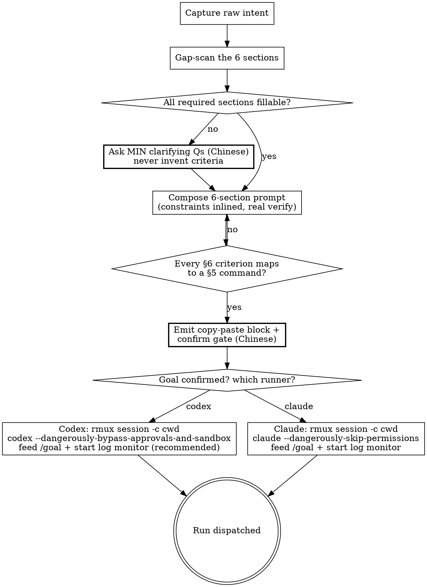

# Wayne Goal-Prompt

> "弱标准逼着 agent 反复问你；强标准让它自己 loop 到验证通过。"

This skill produces a goal prompt **string**, then hands it to a runner. It does
NOT write a plan doc (`wayne-plan`) and does NOT build (`wayne-work`) — the
`/goal` runner does the looping. Compose → confirm → dispatch; this skill never
does the work the goal describes itself.

## Inherits from ~/.claude/CLAUDE.md

Inherits the Wayne control-plane invariants; does NOT redeclare them
(Language / Engineering Principles / Code Standards / Behavior / proportional
effort). This skill only specifies the goal-prompt composition workflow.

## Boundary vs neighbors

A goal prompt is the *steering string* you feed a runner. It sits ABOVE plan:
a goal may name `/wayne-plan -> /wayne-work` as its own skill-chain slot.

| Skill | Input | Output |
|---|---|---|
| **wayne-goal-prompt** | a vague intent | a 6-section goal prompt **string** (ephemeral, paste-ready) |
| wayne-plan | a spec / requirements | a durable, dependency-ordered plan **doc** in `docs/plans/` |
| wayne-work | a plan | code + tests (executes) |
| Codex `/goal` (native) | a goal prompt | a run (the runner — consumes, does not author) |

## The anatomy — 6 sections (the SSoT)

Mined from a golden exemplar. Sections 1/2/4/5/6 required; 3 by-need.

| § | Section | Req | What goes in | Red-line |
|---|---|---|---|---|
| 1 | **Goal** | ✅ | one-line outcome | a sentence, an outcome — NOT a task list |
| 2 | **Context** | ✅ | framing facts, definitions, what-this-is-NOT | each constraint phrased as a `Do not X` red-line |
| 3 | **Current correction** | ◻ | the delta steering an in-flight attempt; concrete config / paths / values | include ONLY when correcting; omit on first issue |
| 4 | **Tasks** | ✅ | numbered steps; constraints inlined AT the step they govern | no constraint dump; secrets via env-var name, never plaintext |
| 5 | **Verification required** | ✅ | exact commands + a real e2e path | name the command; FORBID fake substitutes |
| 6 | **Completion criteria** | ✅ | testable, bulleted done-definition | each bullet checkable — never "works well / looks good" |

The two failure modes the evidence shows: §5 hand-waved ("run the tests") and
§6 unfalsifiable ("works"). Every §6 bullet MUST map to a §5 command.

Template + the golden exemplar live in `references/` — read before composing.

## When a plan doc already exists — reference, don't restate

If the work is already captured in a plan / spec / decision doc, that doc is the
SSoT. The goal prompt **points at it and carries only the steering layer** — it
must NOT re-paste the plan's step bodies, tables, or rationale. Duplication rots
(two sources drift) and bloats the prompt.

- §1/§2: name the doc path as the SSoT ("follow its §N exactly"); state only the
  framing + red-lines a runner needs to not go off-rails.
- §4 Tasks: one line per plan unit (the verb + where it lands), NOT the plan's
  full sub-steps. The runner opens the doc for detail.
- §5/§6: these stay concrete and self-contained — verification commands and
  done-criteria are the steering contract, not plan detail, so they live in the
  prompt in full.

Rule of thumb: if a line is reconstructable by reading the named doc, cut it.
Keep what the runner needs to *steer and verify*, drop what it can *look up*.
A prompt that duplicates the plan is too long by definition.

## When to Run

- **Manual:** `/wayne-goal-prompt <raw intent>`.
- **Auto-trigger:** the bilingual phrases in the description.

**Skip when:** the goal is already 6-section-complete, or the task is trivial
enough that a one-liner genuinely suffices (proportional effort).

## Flow



## Process Flow

1. **Capture intent** — take the raw ask verbatim. → verify: restate it as a
   one-line §1 Goal (outcome, not steps).
2. **Gap-scan** — check each of the 6 sections against what's given; the
   failure-prone three are §5 (exact cmds), §6 (testable), §2 (red-lines).
   → verify: list which required sections you cannot fill.
3. **Ask the minimum** — for each unfillable required section, ask ONE pointed
   question in Chinese. Never silently invent success criteria. → verify: no
   required section left guessed.
4. **Compose** — fill the 6 sections; inline each constraint at the task it
   governs; §5 names real commands + a real e2e path; §6 bullets are testable.
   → verify: every §6 criterion maps to a §5 command.
5. **Emit + confirm gate** — output one copy-paste block; ask the user (Chinese)
   "goal 对不对？对了发给谁去跑？" Do NOT dispatch before the goal is confirmed
   correct. → verify: user confirmed the goal AND named a runner.
6. **Dispatch** — on confirmation, write the prompt to a file, start a detached
   `rmux` session at the goal's project root (`-c <cwd>`), pipe the pane to a log,
   launch the chosen runner, feed it `/goal`, and start a log monitor (see
   Mechanics). → verify: session started at the right cwd, runner+flag paired
   correctly, log monitor running.

## Dispatch — who runs the goal

After the goal is confirmed correct, ask which runner. **Recommend Codex.** Both
runners launch the SAME goal-prompt string inside an **rmux/tmux** session, so the
run is detached, survives this skill's session, and exposes a live pane to monitor.
Only the binary + flag differ.

### Mechanics — same five steps for both runners

1. **Write the prompt to a file.** Never inline a long, multi-line, quoted prompt
   into `send-keys` (shell-quoting hell). Save it, e.g. `/tmp/goal-<slug>.md`.
2. **Start a detached session at the RIGHT cwd.** `-c <project-root>` is the cd —
   the run must start in the repo the goal targets, not where this skill runs.
   ```bash
   SESS="goal-<slug>"
   rmux new-session -d -s "$SESS" -c "<project-root>"
   ```
3. **Pipe the pane to a logfile** — this is the monitor's push source (the runner
   streams its own output to the log; the monitor reads the log, never polls the
   live UI):
   ```bash
   rmux pipe-pane -O -t "$SESS" 'cat >> /tmp/goal-<slug>.log'
   ```
4. **Launch the runner, then feed it the goal.** Boot the TUI, load the prompt via
   paste-buffer, then submit Enter **as a separate, delayed key** — never in the
   same `send-keys` as the paste. The TUI receives a multi-line paste as one
   *bracketed-paste* block; an Enter chained onto it (or fired immediately after)
   lands as a newline INSIDE the input box, not a submit. Wait for the paste to
   settle, send Enter alone, then **verify by capture-pane** that the box emptied —
   if the prompt is still sitting there, send Enter again (and again to clear any
   post-submit overlay, e.g. Codex's "Create a plan?").
   ```bash
   rmux send-keys -t "$SESS" '<runner-launch-line>' Enter   # see table
   sleep 3                                                   # let the TUI boot
   rmux load-buffer  -b goal -t "$SESS" /tmp/goal-<slug>.md
   rmux send-keys    -t "$SESS" '/goal '                     # prefix only, no Enter
   rmux paste-buffer -b goal -t "$SESS"
   sleep 1                                                   # let the paste settle
   rmux send-keys    -t "$SESS" Enter                        # submit — ALONE
   sleep 2; rmux capture-pane -p -t "$SESS" | tail -5        # did it submit?
   # box still shows the prompt? it's queued, not sent — send Enter again:
   rmux send-keys    -t "$SESS" Enter
   ```
   - **Prefer a single-line prompt for the paste.** A goal with embedded newlines
     is the worst case for bracketed-paste submit. If the file is multi-line and
     submit keeps failing, collapse it to one line (or keep the durable detail in
     a plan doc the prompt *references*, per "When a plan doc already exists").
   - **On submit failure, send ONLY Enter — never re-paste.** Re-running
     `paste-buffer` stacks a second copy of the prompt into the box; the fix for a
     swallowed Enter is another Enter, not another paste.
5. **Start the monitor.** Surface progress FROM the logfile on a cadence
   (`tail -n40 /tmp/goal-<slug>.log` or `rmux capture-pane -p -t "$SESS"`) and
   report status back. Don't fire-and-forget.

| Runner | `<runner-launch-line>` |
|---|---|
| **Codex** (recommended) | `codex --dangerously-bypass-approvals-and-sandbox` |
| Claude | `claude --dangerously-skip-permissions` |

- **Why Codex is the default:** it loops unattended under bypass and the piped log
  gives a status channel (push, not poll) — best fit for a hands-off run.
- **The two flags are NOT interchangeable** — `--dangerously-skip-permissions`
  is Claude's; `--dangerously-bypass-approvals-and-sandbox` is Codex's. Pair the
  flag to the runner; never cross them.
- **Always start a monitor.** After dispatch, stand up the logfile monitor so
  progress surfaces without polling the live pane. Don't fire-and-forget.
- **Confirm both the goal AND the cwd before launch.** A wrong goal — or the right
  goal in the wrong directory — run under bypass burns rounds unsupervised.

## Anti-patterns

- **Vague Goal** — `finish this` / `ok continue`; §1 must be an outcome.
- **Hand-waved verify** — "run the tests" instead of the exact command line.
- **Unfalsifiable done** — §6 like "works well / 更好看"; make it checkable.
- **Constraint dump** — red-lines pooled away from the task they govern.
- **Fake substitute** — letting verify swap the real path for a stand-in
  (e.g. "call the CLI instead of driving the TUI") — kills the proof.
- **Dispatch before confirm** — handing the goal to a runner before the user
  confirms it's correct; under bypass that burns rounds unsupervised.
- **Doing the work here** — this skill composes + dispatches; it never performs
  the task the goal describes (that's the `/goal` runner's job).
- **Crossed flags** — `--dangerously-skip-permissions` is Claude's,
  `--dangerously-bypass-approvals-and-sandbox` is Codex's; never swap them.
- **No monitor** — fire-and-forget after launch; always pipe the pane to a log
  and start a monitor on it.
- **Inlined prompt** — pasting a long/multi-line goal straight into `send-keys`
  (quoting hell); write it to a file and `load-buffer`/`paste-buffer` it in.
- **Enter chained to the paste** — `send-keys '...' Enter` or an Enter fired in the
  same breath as `paste-buffer`; the TUI swallows it into the bracketed-paste block
  as a newline. Send Enter ALONE, after a `sleep`, then verify with capture-pane.
- **Re-paste on swallowed Enter** — re-running `paste-buffer` when submit didn't
  take; it stacks a duplicate prompt in the box. The fix for a missed Enter is
  another Enter, never another paste.
- **Assuming dispatch landed** — calling the run started without capture-pane
  confirming the input box emptied and the runner is "Working"/"Pursuing goal".
- **Wrong cwd** — launching the runner where the skill runs instead of the goal's
  project root; always pass `rmux new-session -c <project-root>`.
- **Polling the live pane** — repeatedly `capture-pane`-ing the TUI instead of
  reading the piped logfile the runner streams to.
- **Plaintext secrets** — copying secret values in; pass an env-var name.
- **Plan-restate** — re-pasting a plan doc's steps/tables/rationale into the
  prompt when the doc is the SSoT. Reference it ("follow §N of <path>"); carry
  only the steering layer + self-contained §5/§6. If it's reconstructable from
  the doc, cut it.

> Distilled from 15 sessions on 2026-06-17 by wayne-distill, forged by
> wayne-skill-forge. Anatomy anchored on the Alfred-TUI golden exemplar.
