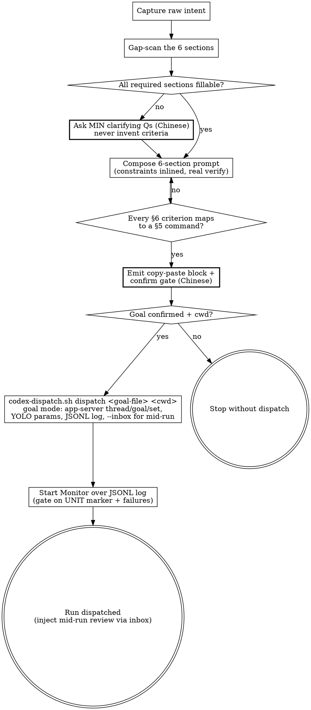

# Wayne Goal-Prompt

> "弱标准逼着 agent 反复问你；强标准让它自己 loop 到验证通过。"

This skill produces a goal prompt **string**, then dispatches it to a headless
Codex worker via `scripts/codex-dispatch.sh`, which drives Codex's real goal
subsystem (`scripts/codex_goal_driver.py` over `codex app-server`). It does NOT
write a plan doc (`wayne-plan`) and does NOT build (`wayne-work`) — the worker does
the looping. Compose → confirm → dispatch; this skill never does the work the goal
describes itself.

## Inherits from ~/.claude/CLAUDE.md

Inherits the Wayne control-plane invariants; does NOT redeclare them
(Language / Engineering Principles / Code Standards / Behavior / proportional
effort). This skill only specifies the goal-prompt composition workflow.

## Boundary vs neighbors

A goal prompt is the *steering string* you feed a runner. It sits ABOVE plan:
a goal may name `/wayne-plan -> /wayne-work` as its own skill-chain slot.

| Skill | Input | Output |
|---|---|---|
| **wayne-goal-prompt** | a vague intent | a 6-section goal prompt **string** (ephemeral, paste-ready) |
| wayne-plan | a spec / requirements | a durable, dependency-ordered plan **doc** in `docs/plans/` |
| wayne-work | a plan | code + tests (executes) |
| `codex-dispatch.sh` / `codex_goal_driver.py` | a goal-prompt file | a detached headless Codex run (the worker — consumes, does not author) |

## The anatomy — 6 sections (the SSoT)

Mined from a golden exemplar. Sections 1/2/4/5/6 required; 3 by-need.

| § | Section | Req | What goes in | Red-line |
|---|---|---|---|---|
| 1 | **Goal** | ✅ | one-line outcome | a sentence, an outcome — NOT a task list |
| 2 | **Context** | ✅ | framing facts, definitions, what-this-is-NOT | each constraint phrased as a `Do not X` red-line |
| 3 | **Current correction** | ◻ | the delta steering an in-flight attempt; concrete config / paths / values | include ONLY when correcting; omit on first issue |
| 4 | **Tasks** | ✅ | numbered steps; constraints inlined AT the step they govern | no constraint dump; secrets via env-var name, never plaintext |
| 5 | **Verification required** | ✅ | exact commands + a real e2e path | name the command; FORBID fake substitutes |
| 6 | **Completion criteria** | ✅ | testable, bulleted done-definition | each bullet checkable — never "works well / looks good" |

The two failure modes the evidence shows: §5 hand-waved ("run the tests") and
§6 unfalsifiable ("works"). Every §6 bullet MUST map to a §5 command.

**Length ceiling: 4,000 chars.** The whole 6-section prompt MUST fit in 4k
characters. The prompt is a *steering string*, not a spec — over 4k means you're
restating plan detail the runner can look up. When you approach the ceiling, cut
by referencing (see "When a plan doc already exists"): point §1/§2/§4 at the doc,
keep only §5/§6 self-contained. §5 and §6 are the steering contract — never trim
them to fit; trim the reconstructable narrative instead. Measure before emitting.

Template + the golden exemplar live in `references/` — read before composing.

## When a plan doc already exists — reference, don't restate

If the work is already captured in a plan / spec / decision doc, that doc is the
SSoT. The goal prompt **points at it and carries only the steering layer** — it
must NOT re-paste the plan's step bodies, tables, or rationale. Duplication rots
(two sources drift) and bloats the prompt.

- §1/§2: name the doc path as the SSoT ("follow its §N exactly"); state only the
  framing + red-lines a runner needs to not go off-rails.
- §4 Tasks: one line per plan unit (the verb + where it lands), NOT the plan's
  full sub-steps. The runner opens the doc for detail.
- §5/§6: these stay concrete and self-contained — verification commands and
  done-criteria are the steering contract, not plan detail, so they live in the
  prompt in full.

Rule of thumb: if a line is reconstructable by reading the named doc, cut it.
Keep what the runner needs to *steer and verify*, drop what it can *look up*.
A prompt that duplicates the plan is too long by definition.

## When to Run

- **Manual:** `/wayne-goal-prompt <raw intent>`.
- **Auto-trigger:** the bilingual phrases in the description.

**Skip when:** the goal is already 6-section-complete, or the task is trivial
enough that a one-liner genuinely suffices (proportional effort).

## Flow



## Process Flow

1. **Capture intent** — take the raw ask verbatim. → verify: restate it as a
   one-line §1 Goal (outcome, not steps).
2. **Gap-scan** — check each of the 6 sections against what's given; the
   failure-prone three are §5 (exact cmds), §6 (testable), §2 (red-lines).
   → verify: list which required sections you cannot fill.
3. **Ask the minimum** — for each unfillable required section, ask ONE pointed
   question in Chinese. Never silently invent success criteria. → verify: no
   required section left guessed.
4. **Compose** — fill the 6 sections; inline each constraint at the task it
   governs; §5 names real commands + a real e2e path; §6 bullets are testable.
   → verify: every §6 criterion maps to a §5 command.
5. **Emit + confirm gate** — output one copy-paste block; ask the user (Chinese)
   "goal 对不对？在哪个 cwd 跑？" Do NOT dispatch before the goal is confirmed
   correct. → verify: prompt is ≤ 4,000 chars (if over, cut by referencing per the
   length-ceiling rule — never trim §5/§6), AND user confirmed the goal AND the cwd.
6. **Dispatch** — on confirmation, write the prompt to a project-local file
   (`goal-<slug>.md`), then run `scripts/codex-dispatch.sh dispatch <goal-file>
   <cwd>` (goal mode, headless under YOLO — no rmux, no send-keys). Then start a
   `Monitor` over the JSONL log gated on the unit marker. → verify: job started at
   the right cwd (`status` shows running), JSONL log growing, Monitor gated on the
   marker running.

## Dispatch — `codex-dispatch.sh` (headless goal mode, no rmux)

After the goal is confirmed correct, dispatch it with `scripts/codex-dispatch.sh`.
ONE mode: **goal**. The script backgrounds `codex_goal_driver.py`, which drives
`codex app-server` over JSON-RPC — NO tmux, no `send-keys`, no `capture-pane`, no
bracketed-paste swallowing. The goal file is read by path; a JSONL event log is
the monitor's push source; jobs are namespaced per-workspace and detached from the
SSH session (`nohup`, PPID→1, no controlling TTY) so a dropped connection never
kills the run.

**Why goal mode only (exec was removed).** A `codex exec` turn is LOCKED once
running — you cannot interleave a message until the turn ends, so mid-run review /
course-correction is impossible. The goal subsystem keeps a live thread that
accepts `thread/inject_items` mid-run. Since the whole point of dispatching to a
worker is to steer it between units (cowork review), the weaker exec path is a
trap, not a convenience. Deleted.

**YOLO is params, not a CLI flag.** The driver sets `sandbox=danger-full-access` +
`approvalPolicy=never` on `thread/start`. This also sidesteps `bwrap`, which fails
`RTM_NEWADDR: Operation not permitted` on some hosts — the failure that makes the
OpenAI codex-plugin's own `task` channel unusable there (it hardcodes
`workspace-write`, offers no `danger-full-access`, so its shells never start).

### Mechanics

```bash
S=".../wayne-goal-prompt/scripts/codex-dispatch.sh"
JOB=$("$S" dispatch <project-root>/goal-<slug>.md <project-root>)   # prints JOB_ID
"$S" status "$JOB"                     # running? goal status? last log
"$S" tail   "$JOB" '>>> UNIT'          # follow the JSONL log, gated on your marker
"$S" inject "$JOB" '@/path/review.md'  # feed a message into the LIVE thread mid-run
"$S" list                              # jobs for this cwd
```

- **Write the goal to a project-local file first** (`goal-<slug>.md`); the driver
  reads it by path — no shell-quoting hell, no paste folding.
- **cwd is explicit and absolutized** — the run starts in the repo the goal
  targets, never where this skill runs. Confirm it before launch.
- **The JSONL log is the push source** — `tail -F` it and grep your marker; never
  poll a live pane (there isn't one).

Under the hood the driver spawns `codex app-server`, handshakes
(`initialize`→`initialized`),
starts a thread with `sandbox=danger-full-access, approvalPolicy=never`, sets the
goal (`thread/goal/set {objective, tokenBudget?}`), kicks it with
`turn/start {input:[{type:"text",text:...}]}` (input is REQUIRED and MUST be the
item array, not a bare string), then blocks on `thread/goal/updated` until
`goal.status=="complete"` (exit 0) or a non-complete terminal status (exit 2).
Every protocol frame is mirrored to `--log` as JSONL for monitoring.

**Mid-run message injection — the reason goal mode is the only mode.** The
`dispatch` command always creates an `--inbox`; feed it with `codex-dispatch.sh
inject <job-id> '<text|@file>'`. The driver injects the message into the LIVE
thread via `thread/inject_items`, then marks it `*.sent`. This is how you feed a
review comment or a course-correction to the worker WHILE it runs — no waiting for
the job to stop, no second process. Verified end-to-end: a message dropped
mid-goal changed the worker's behavior in the same thread.

```bash
"$S" inject "$JOB" 'Fix the SSRF in plan_pointer.py: allowlist the attachment host.'
"$S" inject "$JOB" '@/path/to/review.md'   # or a file, for a long review
```

- The live method is snake_case `thread/inject_items` — the schema file is
  camelCase `ThreadInjectItems` (codegen artifact); the camelCase method name is
  rejected as an unknown variant. Same trap as `turn/start`: trust the live method
  list (`initialize` a bogus method to dump it), not the schema filename.

### Monitoring — always, push not poll

After dispatch, start a `Monitor` over the JSONL log, gated on the unit marker
the goal tells the worker to print (see cowork mode) plus real failure signals:

```
tail -n +1 -F <log> | grep -E --line-buffered \
  '>>> UNIT [0-9]+ DONE|"type":"turn\.failed"|"type":"error"|RTM_NEWADDR'
```

Grep the JSONL structurally — match on event `"type"`/`"method"` fields, NOT bare
words like `goal`/`bwrap`, which appear as ECHOED FILE CONTENT (a read of the goal
file, the plan, or the schema) and produce false positives.

### Unblocking / resuming

- A live goal can go `paused`/`blocked` (transient API drop). The driver keeps the
  thread alive; re-enter the loop by re-issuing `thread/goal/set {status:"active"}`
  (or `codex resume`), NOT a bare off-loop turn. Transient `Reconnecting N/5`
  banners are codex's own retry — leave them alone, do not act on them.
- **If the API is persistently down**, resume is futile — it re-pauses. Leave the
  worker alive to self-reconnect; resume once it recovers. Never kill a live worker
  to "restart clean" — dispatch a NEW job instead.

### Suggested cowork mode — Codex works, Claude monitors + reviews

The hands-off shape for a large, plan-backed build: **Codex is the worker, Claude
(this session) is the monitor + reviewer.** Codex runs the whole build headless via
`codex-dispatch.sh`; Claude does not touch code — it watches the JSONL log and
feeds review comments back between units.

- **Split of duties:**
  - *Codex (worker):* implements every plan unit in dependency order, tests
    as-you-go, commits **one commit per unit** (TRACE format, `-s`, no push/PR),
    and after each unit prints a machine-greppable marker to stdout:
    `>>> UNIT <N> DONE — commit <sha> — U-rows: <ids>`.
  - *Claude (monitor + reviewer):* runs a `Monitor` over the JSONL log grepping for
    that `UNIT N DONE` marker (plus `turn.failed|error` as blocker signals). On each
    marker, review that unit's commit; if there's a problem, feed the comment back
    with `codex-dispatch.sh inject <job-id> '@<review-file>'` — it lands in the LIVE
    thread mid-run (`thread/inject_items`), no waiting for the job to stop. Claude
    does NOT commit or edit; Codex addresses it in a follow-up commit.
- **Bake the contract into the goal prompt** so the worker self-reports without
  Claude polling: a §4 line "after each unit, commit + print the `>>> UNIT N DONE`
  marker, then continue — do NOT stop", and a §6 criterion "exactly N commits, one
  per unit; a reviewer may send comments mid-run — address them in a follow-up
  commit."
- **Push, don't poll:** the marker line is the push event; the monitor gates review
  on it and never scrapes on a timer.
- **Never kill a live worker to restart clean** — dispatch a new job; a running
  worker is doing work.

## Anti-patterns

- **Vague Goal** — `finish this` / `ok continue`; §1 must be an outcome.
- **Hand-waved verify** — "run the tests" instead of the exact command line.
- **Unfalsifiable done** — §6 like "works well / 更好看"; make it checkable.
- **Constraint dump** — red-lines pooled away from the task they govern.
- **Fake substitute** — letting verify swap the real path for a stand-in
  (e.g. "call the CLI instead of driving the TUI") — kills the proof.
- **Dispatch before confirm** — handing the goal to the worker before the user
  confirms it's correct; under YOLO that burns rounds unsupervised.
- **Doing the work here** — this skill composes + dispatches; it never performs
  the task the goal describes (that's the worker's job).
- **No monitor** — fire-and-forget after launch; always start a Monitor over the
  JSONL log gated on the unit marker + failure signals.
- **Grepping echoed content as events** — matching bare words like `goal`, `bwrap`,
  `RTM_NEWADDR` anywhere in the log; those appear as ECHOED FILE CONTENT (a read of
  the goal file / plan / schema) and fire false positives. Match on the JSONL event
  `"type"` / `"method"` field structurally instead.
- **Assuming dispatch landed** — calling the run started without
  `codex-dispatch.sh status` showing `running` and the JSONL log growing.
- **turn/start with a bare-string input** — goal mode's `turn/start` requires
  `input:[{type:"text",text:...}]`, an item ARRAY; a raw string is rejected
  `-32600 expected a sequence`.
- **Wrong completion key** — goal completes at `goal.status == "complete"` (NOT
  `"done"`), pushed via the `thread/goal/updated` notification. Match the method
  exactly (with the slash), not a substring like `goalupdated`.
- **Resume-spamming a dead API** — if the provider is persistently failing, resume
  just re-pauses; leave the worker to self-reconnect (`Reconnecting N/5` is its own
  retry — do not act on it), resume once it recovers.
- **Killing a live worker to restart clean** — a running job is doing work; never
  kill it to escape a glitch. Dispatch a NEW job; only stop jobs THIS dispatch
  created.
- **The codex-plugin `task` channel on a bwrap-restricted host** — the OpenAI
  codex-plugin-cc hardcodes `sandbox=workspace-write` (no `danger-full-access`), so
  its shells hit `RTM_NEWADDR` and never start. Use `codex-dispatch.sh` (real YOLO
  params) instead; the plugin's slash commands are a guide layer, not the runtime.
- **Plaintext secrets** — copying secret values in; pass an env-var name.
- **Plan-restate** — re-pasting a plan doc's steps/tables/rationale into the
  prompt when the doc is the SSoT. Reference it ("follow §N of <path>"); carry
  only the steering layer + self-contained §5/§6. If it's reconstructable from
  the doc, cut it.
- **Over 4k** — a prompt past the 4,000-char ceiling; it's carrying look-up-able
  detail. Cut by referencing the doc, never by trimming §5/§6.

> Distilled from 15 sessions on 2026-06-17 by wayne-distill, forged by
> wayne-skill-forge. Anatomy anchored on the Alfred-TUI golden exemplar.
> Dispatch rewritten 2026-07-15: rmux/TUI `/goal follow` → headless
> `scripts/codex-dispatch.sh` driving `scripts/codex_goal_driver.py` (Codex's real
> goal subsystem over app-server JSON-RPC). An exec mode was prototyped then
> DELETED: a `codex exec` turn is locked while running, so it cannot take mid-run
> messages — goal mode's `thread/inject_items` inbox is the whole point of
> dispatching to a steerable worker. Verified end-to-end (incl. mid-run inject);
> YOLO = `sandbox=danger-full-access` + `approvalPolicy=never` sidesteps bwrap
> `RTM_NEWADDR` and the codex-plugin's hardcoded `workspace-write`.
