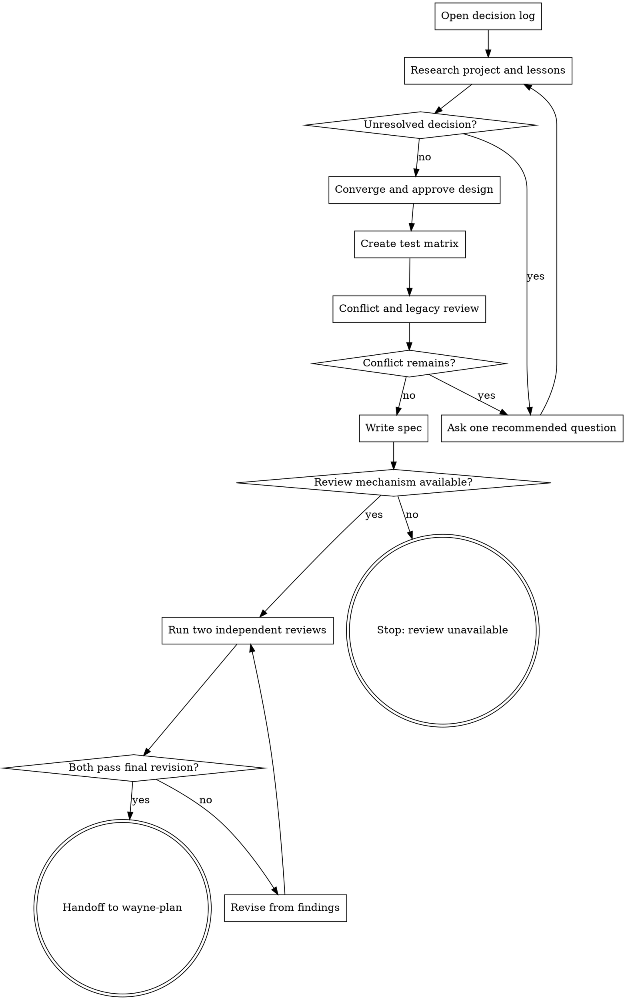

# Wayne Mind Explode

Turn an unresolved idea into approved design inputs for `wayne-plan`.

## Boundary

Own discovery, decision convergence, design approval, test-design delegation,
conflict resolution, spec writing, independent design review, and handoff. Never
implement code or write an implementation plan. Do not commit, branch, push, or
publish unless separately requested.

Create only design artifacts:

- `docs/decisions/YYYY-MM-DD-<topic>-decisions.md`
- `docs/test-matrix/YYYY-MM-DD-<topic>-test-matrix.md` through `wayne-test-design`
- `docs/specs/YYYY-MM-DD-<topic>-design.md`
- the handoff packet owned by `wayne-checkpoint`

## Flow



## Process

### A. Open decision log

Create the log immediately with `Status: in-progress` and this table:

```markdown
| # | Question | Decision | Rationale | Source |
|---|---|---|---|---|
```

Use source values `user`, `codebase`, `web`, `constraint`, or `default`. Append
every discovered or user-made decision before continuing; never reconstruct the
log at the end.

### B. Research project and lessons

Read repository instructions, relevant code, docs, architecture, active plans,
specs, and recent history. Scan Wayne's KB for semantically matching `type: lesson`
entries and their `trigger`; surface matches and log whether the user applies or
skips them. Search the web only when current external facts could change a design
choice, and preserve the source URL in the log.

Answer discoverable questions from those sources. Ask the user only for intent,
priority, risk, or trade-off choices the sources cannot decide.

### D. Ask one recommended question

Interview the user relentlessly until both sides share the same design. Walk every
branch of the decision tree in dependency order. Ask exactly one question, give
`My recommendation:` and its reason, then wait for the user's answer before moving
on. Look up facts in the environment; put decisions to the user. Log each answer
immediately. Never infer precedence between conflicting inputs.

### E. Converge and approve design

Only converge after the user confirms shared understanding. Compare 2-3 viable
approaches against the log, lead with the recommendation, and record the choice.
Present architecture, components, state/data ownership, flows, failure behavior,
boundaries, and verification in reviewable sections. Wait for approval of each
material section and log every revision. Do not advance on assumed approval.

Apply a cybernetics lens when the design involves state/lifecycle, a control plane,
multiple readers or writers, streaming, observability, source-of-truth drift,
feedback/retry, or workflow orchestration. Name Plant, Controller, Setpoint,
Disturbance, and Feedback; record only relevant observability, controllability,
ownership, stability, and minimum-control-effort findings. Skip it for a small
single-file pure-logic change with no persistent state or integration.

### F. Create test matrix

After design approval, invoke `wayne-test-design` with the decision log and settled
design. It solely owns the unit/integration matrix and E2E Verification Contract.
All design-stage E statuses remain `⬜`. Record the returned matrix path.

### G. Conflict and legacy review

Re-read all existing plans, specs, architecture, and repository instructions
against the settled design. Route any contradiction to D and repeat this review.
Trace replaced functionality and classify it `Dead`, `Legacy`, or `Shared`; obtain
and log a user decision for every deletion, deprecation, or migration. Proceed only
with zero unresolved conflicts.

### I. Write spec

Write the approved design to the canonical spec path. Include scope/non-goals,
architecture and ownership, data/control flow, failure and concurrency semantics,
observability, rollback, legacy decisions, and requirement trace. Link the test
matrix as the single source of truth; do not copy either matrix or author a second
E2E contract. Remove every unresolved TBD/TODO before review.

### U. Require an independent-review mechanism

Discover the provider-neutral mechanism available to the current agent and
repository for launching isolated reviewers. Do not hardcode one agent product's
skill names, tools, or home paths. If two independent executions cannot be started,
return `REVIEW_UNAVAILABLE` with the missing capability and stop. Never simulate
two voices in one local analysis or silently downgrade to a single review.

### J. Run two independent reviews

Dispatch the same spec revision to two separate reviewer executions:

- product voice: challenge premise, user value, assumptions, scope, and non-goals;
- engineering voice: challenge ownership, interfaces, failure paths, concurrency,
  observability, rollback, testability, and execution readiness.

Preserve both findings and verdicts. Resolve findings in the spec and decision log,
then rerun. Both voices must pass the same final spec bytes; any later edit makes
both prior passes stale. After both pass, record their outcome only in the decision
log and handoff; if the spec changes even to add review notes, rerun both voices.

### L. Handoff to wayne-plan

Set the decision log to `Status: design-approved` and link the spec and matrix.
Tell the user their paths and that `wayne-plan` is the next agent. Invoke
`wayne-checkpoint` in handoff mode with those artifacts and `next agent:
wayne-plan`; return the packet without auto-advancing. End here.

## Red lines

- No code, scaffolding, implementation plan, or unrequested commit.
- No question whose answer exists in the repository or approved sources.
- No spec before all required decisions and conflicts are resolved.
- No duplicated E2E contract or second test-matrix owner.
- No claimed dual review without two real executions on the final revision.
