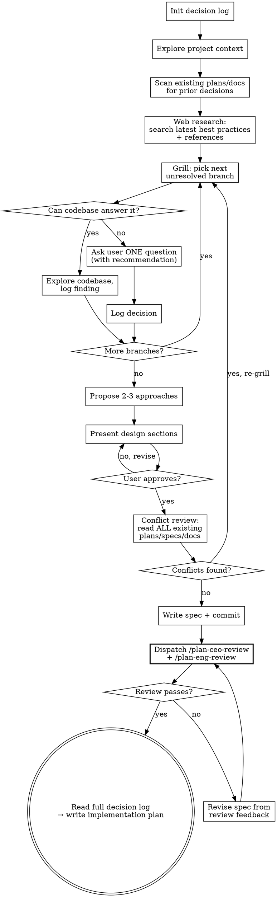

# Brainstorming Ideas Into Designs

Turn ideas into fully formed designs through collaborative but relentless dialogue.
Every decision is logged. Every branch of the design tree is explored. No handwaving allowed.

## Inherits from ~/.claude/CLAUDE.md

This skill inherits the Wayne control-plane invariants and does not redeclare them. The following are assumed and MUST NOT be repeated below:

- Language Rules (Chinese to user, English to files)
- Engineering Principles (KISS / YAGNI / DRY / SSoT / Fail-Loud / Push-Don't-Poll / Delete>Add)
- Code Standards (uv run python, markdown tables)
- Behavior Baselines (Think Before / Simplicity / Surgical / Goal-Driven)
- Skill invocation rule (proportional effort)

This skill only specifies the brainstorming / design / decision-log workflow.

## Files Written

decision logs, specs, plans, code comments, commit messages, KB entries, solution docs.

Structural labels stay English even in Chinese prose: `Q3:`, `My recommendation:`, severity tags, table headers.

<HARD-GATE>
Do NOT write any code, scaffold any project, or take any implementation action until the design is approved and the plan is written. This applies to EVERY project regardless of perceived simplicity.
</HARD-GATE>

## Checklist

You MUST create a task for each of these items and complete them in order:

1. **Recall lessons from KB** — see "Lesson Recall" section below. Surface any
   prior lessons relevant to the topic before brainstorming starts.
2. **Init decision log** — create `docs/decisions/YYYY-MM-DD-<topic>-decisions.md`
3. **Explore project context** — check files, docs, recent commits, existing plans
4. **Grill the user** — relentless branch-by-branch interview, logging every decision
5. **Propose 2-3 approaches** — with trade-offs and your recommendation
6. **Present design** — section by section, get user approval after each
7. **Conflict review** — read ALL existing plans/specs/docs, flag any contradictions
8. **Write spec** — save design doc, commit
9. **Plan review via gstack** — dispatch `/plan-ceo-review` and `/plan-eng-review` on the spec
10. **Read decision log + write plan** — consume full decision history, then create implementation plan

## Lesson Recall (Step 1)

Before grilling the user, scan the KB for past lessons that may apply to the
topic. Lessons are KB pages with `type: lesson` and a `trigger` field describing
when they should be recalled.

**Quick scan:**
```bash
grep -rl "^type: lesson" /mnt/share/kb/ --include="*.md" 2>/dev/null
```

For each candidate file, read its `trigger` field and decide if it matches the
user's topic. Use a quick LLM judgment if grep alone is ambiguous — match
semantically, not just by keyword.

**If matches found**, before any other questions, ask the user:
> 之前有 N 条 lesson 可能跟这次设计相关：
> - <lesson 1 title> — trigger: <一句话>
> - <lesson 2 title> — trigger: <一句话>
> 要先看一下吗？(yes / skip / 看具体哪条)

**If skipped**: log in decision log under the first decision row:
`| 0 | Lesson recall skipped by user | N candidates: [files] | — | — |`

**If reviewed**: include the lessons' anti-patterns and prevention sections
as constraints in the subsequent grilling. Reference them in the decision log
when a design choice comes from a lesson.

## Process Flow



---

## Phase 1: Init Decision Log

Create the decision log file immediately when brainstorming starts:

**Path:** `docs/decisions/YYYY-MM-DD-<topic>-decisions.md`

**Template:**
```markdown
# Decision Log: <Topic>

Started: YYYY-MM-DD HH:MM
Status: in-progress

## Decisions

| # | Question | Decision | Rationale | Source |
|---|----------|----------|-----------|--------|
```

**Source** column values:
- `user` — user made the call
- `codebase` — answered by exploring code
- `web` — informed by web research (include URL)
- `constraint` — forced by existing architecture/dependency
- `default` — used the recommended default

Log EVERY decision — no exceptions. This log is the input for plan creation.

---

## Phase 2: Explore Project Context + Web Research

Before asking the user anything:

### 2.1 Local Research

1. Read project files, docs, recent git history
2. **Scan ALL existing plans and specs** in `docs/` (or wherever the project stores them)
3. Note any prior decisions, architectural constraints, or patterns that will affect this work
4. Log findings as `constraint` or `codebase` decisions

### 2.2 KB Search (Always Run)

Search the personal KB at `/mnt/share/kb/` for prior knowledge relevant to this topic:

```bash
grep -r "<topic keywords>" /mnt/share/kb/ --include="*.md" -l 2>/dev/null | head -10
```

Check for:
- **Prior decisions** in `kb/decisions/` — have we decided something about this area before?
- **Research notes** in `kb/research/` — past evaluations of tools, patterns, approaches
- **How-tos** in `kb/how-to/` — existing runbooks for related workflows
- **Project notes** in `kb/projects/` — context from related projects

If relevant entries found:
- Read them
- Log as `constraint` or `codebase` decisions in the decision log
- Present to user (in Chinese): "KB 里有相关记录: {summary}"
- Use KB knowledge to inform your recommendations during grilling

If nothing relevant, skip silently.

### 2.3 Web Research (Always Run)

Search the web for latest best practices, patterns, and references relevant to the topic.
This runs **before** grilling so you can make informed recommendations.

**What to search for:**
- Current best practices for the technology/pattern being discussed
- Common pitfalls others have encountered with similar approaches
- Latest framework/library documentation if relevant
- Alternative approaches others have used for similar problems
- Recent blog posts, discussions, or case studies

**How to search:**
- Use WebSearch with targeted queries (include the current year for freshness)
- Use WebFetch to read promising results in detail
- Run 2-3 searches in parallel covering different angles

**Example searches for "add real-time notifications":**
```
WebSearch: "real-time notifications best practices 2026"
WebSearch: "SSE vs WebSocket vs polling tradeoffs"
WebSearch: "<framework name> notification system architecture"
```

**Log findings:**
- Add relevant findings to the decision log with source = `web`
- Include URLs for key references
- Note any industry consensus or strong recommendations
- Flag any conflicting advice found across sources

**Present to user (in Chinese):**
After web research, briefly summarize what you found before starting the grill:
```
我搜了一下最新的做法，发现几个有用的参考:
1. [finding 1 + URL]
2. [finding 2 + URL]
3. [finding 3 + URL]

这些会影响我接下来问你的问题。开始吧。
```

---

## Phase 3: Grill the User

This is the core of the skill. Interview the user relentlessly about every aspect of the idea.

### Rules

1. **One question per message.** Never batch questions.
2. **Always provide your recommended answer.** Don't just ask — lead with what you'd pick and why, then ask if they agree or want different.
3. **Explore codebase + web first.** If a question CAN be answered by reading code, reading docs, checking existing patterns, or referencing web research findings — do that instead of asking. Log the finding with appropriate source (`codebase` or `web`). Only ask the user when you genuinely need their input.
4. **Walk the decision tree.** Each answer opens new branches. Track them. Don't leave branches unresolved.
5. **Challenge weak answers.** If the user says "whatever" or "I don't care", push back: "You will care when X happens. Here's what I recommend and why."
6. **Resolve dependencies.** Some decisions depend on others. Identify and resolve in the right order.
7. **Log immediately.** After each decision, append to the decision log before asking the next question.

### What to Grill On

- **Purpose:** What problem does this solve? Who is it for? What does success look like?
- **Scope:** What's in? What's explicitly out? What's deferred to later?
- **Architecture:** Where does this live? What does it touch? What patterns does it follow?
- **Data:** What's the shape? Where's it stored? How does it flow?
- **Edge cases:** What happens when X fails? What about empty state? Concurrent access?
- **Integration:** What existing code does this interact with? Any conflicts?
- **Testing:** How do we know it works? What's the test strategy?
- **Rollback:** If this goes wrong, how do we undo it?

### Question Format

```
**Q{N}: {Question in Chinese}**

My recommendation: {your recommended answer and reasoning — in Chinese}

{If relevant: "我查了代码库，发现: {finding in Chinese}"}

你同意吗？还是想走别的方向？
```

---

## Phase 4: Propose Approaches

After all branches are resolved:

1. Read the full decision log
2. Propose 2-3 approaches that satisfy all logged decisions
3. Lead with your recommendation and explain why
4. Include trade-offs for each approach
5. Log the chosen approach as a decision

---

## Phase 5: Present Design

Present the design section by section. Scale each section to its complexity.

- Ask after each section whether it looks right
- Be ready to revise — new decisions get logged too
- Cover: architecture, components, data flow, error handling, testing

### Design for Isolation

- Break the system into units with one clear purpose
- Each unit: what does it do, how do you use it, what does it depend on?
- Can someone understand a unit without reading its internals?
- Smaller, well-bounded units are easier to reason about and edit reliably

### Working in Existing Codebases

- Follow existing patterns. Don't invent new conventions.
- Where existing code has problems that affect this work, include targeted fixes in the design
- Don't propose unrelated refactoring. Stay focused.

---

## Phase 6: Conflict Review + Dead Code Scan

**Before writing the spec**, read ALL existing plans, specs, and architectural docs:

### 6.1 Conflict Check

1. Glob for `docs/**/*.md`, project CLAUDE.md, any architecture docs
2. Read each one
3. Check for contradictions with the proposed design:
   - Does this design break assumptions made in other plans?
   - Does it duplicate functionality already planned elsewhere?
   - Does it conflict with stated architectural decisions?
   - Does it change interfaces that other plans depend on?
4. If conflicts found: **go back to Phase 3 (Grill)**. Frame each conflict as a new decision branch — grill the user on it, log the resolution, then re-run conflict review.

### 6.2 Dead Code Scan

Scan the codebase for code that would become **dead, obsolete, or superseded** by this design:

1. **Identify replaced functionality** — if this design replaces an existing feature, find all code
   that implements the old version (functions, classes, routes, configs, tests, migrations)
2. **Trace callers** — for each candidate dead code, grep for references. If nothing else calls it
   after the new design ships, it's dead.
3. **Check for indirect consumers** — APIs, scheduled jobs, external scripts, other repos that
   might still depend on the old code
4. **Classify each candidate:**

   | Status | Meaning |
   |--------|---------|
   | **Dead** | No callers after new design ships. Safe to delete. |
   | **Legacy** | Still has callers, but the new design supersedes it. Needs migration path. |
   | **Shared** | Used by both old and new code paths. Keep. |

5. **Ask the user (in Chinese) for each Dead or Legacy item:**

   ```
   这个设计会让以下代码变成死代码:

   1. [Dead] `src/old_handler.py` — 旧的处理逻辑，新设计完全替代
      → A) 删除  B) 保留做 legacy 支持  C) 先标记 deprecated，后续再删

   2. [Legacy] `api/v1/old_endpoint.py` — 还有外部调用者
      → A) 加 deprecation warning + 设迁移期限  B) 保持不动  C) 同时支持新旧
   ```

6. **Log each decision** in the decision log with rationale
7. **Include in spec** — the spec's scope section should explicitly list what gets deleted,
   deprecated, or kept for legacy support

Only proceed when there are zero unresolved conflicts AND all dead code decisions are logged.

---

## Phase 7: Write Spec

Write the design doc to `docs/specs/YYYY-MM-DD-<topic>-design.md` (or user-preferred location).

After writing:
- Quick inline check: any TBD/TODO, contradictions, ambiguity? Fix them.
- Ask user to review the written spec before proceeding.

---

## Phase 8: Plan Review via gstack

After the spec is written and committed, run two gstack review skills on it:

1. **Invoke `/plan-ceo-review`** — CEO/founder-mode review on the spec. Challenges premises, looks for the 10-star version, questions scope.
2. **Invoke `/plan-eng-review`** — Eng manager-mode review on the spec. Locks in architecture, data flow, edge cases, test coverage, performance.

**Process:**
- Invoke each skill via the Skill tool, passing the spec path
- Collect feedback from both reviews
- Present combined feedback to the user (in Chinese)
- If either review surfaces issues that require spec changes:
  - Revise the spec
  - Re-run the reviews until both pass clean
- Log review outcomes in the decision log

Only proceed to plan creation once both reviews are satisfied.

---

## Phase 9: Decision-Log-Driven Plan

This is the payoff. The decision log is the single source of truth.

1. **Read the full decision log** — every decision, every rationale, every constraint
2. **Read the approved spec**
3. **Read ALL existing plans again** — ensure no new conflicts
4. **Write the implementation plan** informed by the complete decision history
   - Every plan item should trace back to a logged decision
   - No plan item should contradict a logged decision
   - Flag any decision that was deferred — these are risks

Update the decision log status to `completed` and link to the spec and plan.

---

## Key Principles

- **Log everything** — if it wasn't logged, it didn't happen
- **Codebase over questions** — explore before asking
- **One question, one recommendation** — never leave the user without guidance
- **Challenge weakness** — "I don't care" is not a valid decision
- **Conflict-free by design** — no spec ships with unresolved contradictions
- **YAGNI ruthlessly** — remove unnecessary features from all designs
