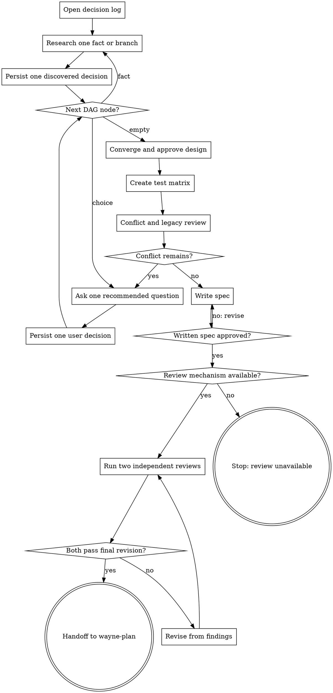

# Wayne Mind Explode

Turn an unresolved idea into approved design inputs for `wayne-plan`.

## Boundary

Own discovery, decision convergence, design approval, test-design delegation,
conflict resolution, spec writing, independent design review, and handoff. Never
implement code or write an implementation plan. Do not commit, branch, push, or
publish unless separately requested.

`decision locked`, `design approved`, or an equivalent milestone freezes design
state; it never authorizes execution. Continue only this Flow, hand off to
`wayne-plan`, and stop. Never execute the plan or invoke `wayne-work`.

Create only design artifacts, and only two kinds.

**Run-scoped, in `.wayne/runs/<topic>/`** — working state, gitignored, absorbed or
promoted before handoff:

- `decision-log.md`
- `test-matrix.md` through `wayne-test-design`
- `review-{product|engineering}.md` as immutable evidence for the duration of the run
- `spec.md` while it is still `draft`
- the handoff packet owned by `wayne-checkpoint`

**Durable, in `docs/`** — one living page per topic, the sole artifact that outlives
the run:

- `docs/specs/<topic>.md` — amended in place, never re-dated

`docs/specs/` holds only specs that are in force. A spec enters it exactly once, by
being moved there when node V approves it, and leaves only by becoming
`deprecated`. Until then it is a draft in the run directory.

Nothing else goes in `docs/`. A run abandoned mid-design is the normal case, not the
exception, and anything it left in `docs/` would sit there forever looking exactly
like a shipped design. Keeping the whole working set outside the tracked tree
removes that failure instead of scheduling a cleanup for it.

## Flow

```dot
digraph mind_explode {
    rankdir=TB;
    A [label="Open decision log", shape=box];
    B [label="Research one fact or branch", shape=box];
    P [label="Persist one discovered decision", shape=box];
    C [label="Next DAG node?", shape=diamond];
    D [label="Ask one recommended question", shape=box];
    Q [label="Persist one user decision", shape=box];
    E [label="Converge and approve design", shape=box];
    F [label="Create test matrix", shape=box];
    G [label="Conflict and legacy review", shape=box];
    H [label="Conflict remains?", shape=diamond];
    I [label="Write spec", shape=box];
    V [label="Written spec approved?", shape=diamond];
    J [label="Run two independent reviews", shape=box];
    K [label="Both pass final revision?", shape=diamond];
    R [label="Revise from findings", shape=box];
    U [label="Review mechanism available?", shape=diamond];
    X [label="Stop: review unavailable", shape=doublecircle];
    L [label="Handoff to wayne-plan", shape=doublecircle];

    A -> B;
    B -> P;
    P -> C;
    C -> B [label="fact"];
    C -> D [label="choice"];
    D -> Q;
    Q -> C;
    C -> E [label="empty"];
    E -> F;
    F -> G;
    G -> H;
    H -> D [label="yes"];
    H -> I [label="no"];
    I -> V;
    V -> I [label="no: revise"];
    V -> U [label="yes"];
    U -> J [label="yes"];
    U -> X [label="no"];
    J -> K;
    K -> R [label="no"];
    R -> J;
    K -> L [label="yes"];
}
```

## Process

### A. Open or resume the decision log

Read `../_shared/pipeline-id-contract.md` completely. Before anything else, resolve
whether this topic already has a living spec at `docs/specs/<topic>.md`.

- **No spec.** New topic. Create the log with `Status: in-progress` and start
  decision IDs at `D1`.
- **Spec exists.** This run amends that spec; it never opens a second one. Read the
  whole file — every row of its `## Decisions` table, and every spec named in a
  `Depends on` cell. Create the log with `Status: in-progress`, and **continue that
  spec's decision numbering**. Restarting at `D1` puts two `D1`s in one spec and
  destroys the uniqueness its namespaced IDs depend on. An already-recorded
  decision is reversed only by a new row naming it in `Supersedes`; never edit or
  delete the existing row, and never silently re-decide it because it was absent
  from this run's context.

Create the run-scoped log from [the decision-log template](templates/decision-log.md),
which carries the numbered table, the Decision DAG, and the rules governing both.
Read it completely before appending the first row. That file is working state: it
dies once section I absorbs its content into the living spec, so nothing durable
may exist only there.

### B. Research project and lessons

On the initial pass, research enough to seed known root and dependent nodes. The
topic's living spec and every spec it declares a `Depends on` edge to are read
first: they are the current design, not background reading.

A spec is only trustworthy as current if it says so and nothing contradicts it. Run
both checks before believing any of them — they are pure date comparisons and need
no understanding of the content:

- `today >= stale_after` — past its own re-reconciliation date;
- `max(verified[].at) < generated.at` — edited after it was last confirmed, so the
  review gate that approved it no longer covers the current bytes.

A spec that passes both seeds the nodes it answers as `resolved`, citing that spec
as the source rather than re-litigating them. A spec that fails either check is
**not** seeded resolved: it is a claim to verify, so route the nodes it touches to
G's three-way triage against the code. No spec ever silently self-certifies just
because it exists.

Then select the next reachable open `fact` and process at most one
before returning to P.
Read repository instructions, relevant code, docs, architecture,
active plans, other specs, and recent history. Scan Wayne's KB for semantically
matching lessons, prior decisions, research, how-tos, and project notes; surface
matches and log whether the user applies or skips them. Search the web only when
current external facts could change a design choice, and preserve the source URL
in the log.

An evidence-backed `fact` auto-resolves without user confirmation; append its
numbered evidence row before marking it resolved. Never seed a fact as resolved.
Every design-relevant source fact belongs in both the numbered log and the DAG;
never leave it only in a prose context, notes, or summary section.
A `choice` requires the user when it concerns intent, priority, risk, scope, or a
trade-off. Ambiguous or conflicting evidence cannot resolve a fact: keep the node
open and route it as a choice.

After every resolved node, expand consequences before choosing the next node: what
new purpose/scope, owner, interface, data/control flow, failure/concurrency,
compatibility, operations, verification, or rollback decision becomes reachable?
Persist each real child. A broad parent answer never resolves its consequences.

### P. Persist one discovered decision

Append the single discovered fact or constraint as one new row. In that same write,
mark its node resolved and persist every child it opened as `open` or `blocked`;
verify both row and frontier before selecting another node. Do not carry an unlogged
fact or unpersisted child into the next branch.

### D. Ask one recommended question

Interview the user relentlessly until both sides share the same design. Select the
next reachable open `choice` from the durable DAG. Ask exactly one question and
offer three concrete options for that decision, with `My recommendation:` naming
the option you would choose and why. For a genuinely binary decision, offer two
and state why no third distinct option exists; never pad the list with a fake
variant. Then wait for the user's answer before moving on. One question means one
open decision node; punctuation, sentence count, and whether the options are
phrased interrogatively do not define cardinality. Never repeat the same decision
as a second question in a heading or closing. Look up facts in the environment;
put decisions to the user. Log each answer immediately. Treat `whatever`, `I don't
care`, or any non-decision as unresolved: explain the consequence, repeat one
recommendation, and wait. Never infer precedence between conflicting inputs.

The recommendation is advice, never a default or a disguised approval request.
Ground all options in current evidence and decisions. For the recommendation name
its key assumption and reversal condition; for each alternative name its distinct
advantage or trade-off. Ask for the user's choice neutrally; silence, agreement
with the framing, or acceptance of a parent node never approves this node or its
children.

### Q. Persist one user decision

Append only the answered decision as one new row and verify it is durable before
researching or asking the next branch. In the same write, mark that node resolved
and persist all children opened by the answer. If the answer did not resolve the
choice, leave it open and return to D without writing a resolved decision.

### E. Converge and approve design

Converge only when every DAG node is `resolved` or `not-applicable` and a coverage
audit finds no missing branch across purpose, scope, ownership, interfaces,
data/control flow, failure/concurrency, observability, verification, rollback, and
legacy impact. Decision count, turn count, context length, or an apparently complete
summary never empties the frontier; 40+ resolved decisions with one open node must
continue. Grilling has no question cap; only the user may explicitly stop or request
a partial wrap-up. After the user confirms shared understanding, compare three
genuinely distinct viable approaches against the log, lead with the recommendation,
and record the choice. If the approved constraints leave only two viable approaches,
state the eliminated third direction and why it is not viable instead of padding it.
Present architecture, components, state/data ownership, flows, failure behavior,
boundaries, and verification in reviewable sections. Wait for approval of each
material section and log every revision. Do not advance on assumed approval.
Keep units single-purpose with explicit interfaces and dependencies, follow existing
patterns, and exclude unrelated refactors.

Apply a cybernetics lens when the design involves state/lifecycle, a control plane,
multiple readers or writers, streaming, observability, source-of-truth drift,
feedback/retry, or workflow orchestration. Name Plant, Controller, Setpoint,
Disturbance, and Feedback; record only relevant observability, controllability,
ownership, stability, and minimum-control-effort findings. Skip it for a small
single-file pure-logic change with no persistent state or integration.
Give every finding a severity and proposed intervention. Present them one at a time;
the user chooses which interventions apply, and each accepted or declined choice is
logged before test-matrix or spec work.

### F. Create test matrix

After design approval, invoke `wayne-test-design` with the decision log and settled
design. It solely owns the unit/integration matrix and E2E Verification Contract.
All design-stage E statuses remain `⬜`. Record the returned matrix path.

### G. Conflict and legacy review

Re-read all existing plans, specs, architecture, and repository instructions
against the settled design. Route any contradiction to D and repeat this review.

When the contradiction is between a living spec and the code, the spec is not
presumed stale. Classify it and route accordingly:

| Finding | Meaning | Action |
|---|---|---|
| Spec is right, code diverged | An unapproved implementation drift | Do not touch the spec; report it as a defect |
| Spec is stale, code is right | The design moved and was never written back | Update the spec in place, appending one decision row that records why it moved |
| The new design overrides the spec | A real design change | Obtain a user decision, then update the spec in place |

Only the user chooses between these. Defaulting to "the spec is stale" launders an
unapproved deviation into approved design, which is the one failure of this
mechanism that causes real damage. A spec updated here has its `generated.at`
advanced, which invalidates every earlier `verified` entry and re-arms the review
gate.
Trace replaced functionality and classify it `Dead`, `Legacy`, or `Shared`; obtain
its direct callers and indirect consumers such as jobs, scripts, APIs, and external
repositories. Obtain and log a user decision for every deletion, deprecation, or
migration. Proceed only with zero unresolved conflicts.

### I. Write spec

Write the approved design following [the spec template](references/spec-template.md),
and set `generated` to this run's actor and time. Where it is written depends on
whether the topic is already in force:

- **Topic already has `docs/specs/<topic>.md`.** Edit that file in place — sections
  revised, `## Decisions` appended to, `generated.at` advanced. Advancing
  `generated.at` past every `verified.at` is what re-arms the review gate, so V, U,
  and J run again on the amended bytes. Never open a second dated file.
- **New topic.** Write `.wayne/runs/<topic>/spec.md` with `status: draft`. It stays
  in the run directory until node V approves it; `docs/specs/` holds only specs in
  force, so an abandoned run leaves nothing behind.

Absorb into `## Decisions` the decisions that justify this design. A fact resolved
by reading the codebase dies with the run; a choice, and a constraint that
eliminated an option, is carried. The run-scoped decision log is working state, not
the durable record: whatever only it holds is lost at ship.

Include scope/non-goals, architecture and ownership, data/control flow, failure and
concurrency semantics, observability, rollback, legacy decisions, and requirement
trace. Absorb the matrix's E2E layer into `## Verification` — the matrix is produced
before this step and is run-scoped, so the spec is where that contract survives.
Carry no pass/fail status: run state stays in the matrix, and the durable fact that
this spec was verified is a `verified` frontmatter entry. Never author a second E2E
contract. Remove every unresolved TBD/TODO before review.

### V. Approve the written spec

Show the canonical spec path and ask the user to approve that exact written
revision. A prior section-by-section approval is not approval of the file bytes.
On rejection, log one decision, revise the spec, and ask again. Start no reviewer
until the written revision is explicitly approved.

On approval of a new topic's draft, **move** `.wayne/runs/<topic>/spec.md` to
`docs/specs/<topic>.md` and set `status: stable`. Move, never copy: two copies would
immediately begin to disagree. From this point the reviewers in J read the file at
its `docs/` path, and every later run amends it there.

### U. Require an independent-review mechanism

Discover the mechanism available to the current agent and repository for launching
isolated reviewers from heterogeneous model families, and record each reviewer
identity. The review criteria are provider-neutral and live in the two templates
below; only the dispatch mechanism is host-specific. In Pi, dispatch is the saved
workflow `wayne-dual-review`: pass `subject`, the `artifacts` set (the approved spec
revision, the decision log, and the test matrix), `reviewerATemplate`
`references/product-review.md`, and `reviewerBTemplate`
`references/engineering-review.md`. It freezes those bytes outside the repository,
runs both voices in parallel, and computes the gate without editing anything.
Another host substitutes its own mechanism with the same two templates. If two
isolated heterogeneous executions cannot be started, if either voice fails or
returns nothing, or if both voices collapse onto one model family, return
`REVIEW_UNAVAILABLE` with the missing capability and stop. Never simulate two voices
in one local analysis or silently downgrade to a single review. A requested model is
not a routed model: after the run, read each reviewer execution's actual model from
the host's run metadata, and void the run the same way if either voice fell back to
the session default or both resolved to one family.

### J. Run two independent reviews

Dispatch the same spec revision to two separate reviewer executions:

- product voice, carrying [the product protocol](references/product-review.md):
  challenge premise, necessity, whether this is the right problem, the 10-star
  alternative, user value, assumptions, scope, and non-goals;
- engineering voice, carrying
  [the engineering protocol](references/engineering-review.md): challenge
  architecture, ownership, interfaces, data/control flow, failures, edge and
  concurrency paths, tests, performance/capacity, observability, rollback, and
  execution readiness.

Preserve each run as immutable review evidence. The decision log alone owns finding
resolutions and final outcomes; append each outcome as one `review` row. Resolve
findings in the spec, obtain approval of the revised bytes, then rerun both voices.
Both must pass the same final bytes; any later edit makes both passes stale. Never
write review notes into the spec after those passes.

### L. Handoff to wayne-plan

Set the decision log to `Status: design-approved` and link the spec and matrix.
Tell the user their paths and that `wayne-plan` is the next agent. Invoke
`wayne-checkpoint` in handoff mode with those artifacts and `next agent:
wayne-plan`; return the packet without auto-advancing. End here.

## Red lines

- No code, scaffolding, implementation plan, or unrequested commit.
- No question whose answer exists in the repository or approved sources.
- No spec before all required decisions and conflicts are resolved.
- No duplicated E2E contract or second test-matrix owner.
- No claimed dual review without two real executions on the final revision.
