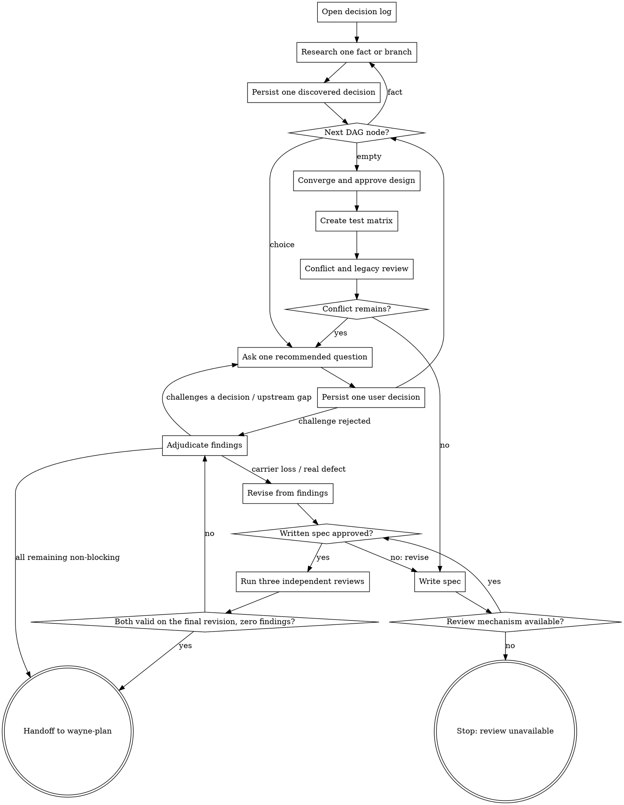

# Wayne Mind Explode

Turn an unresolved idea into approved design inputs for `wayne-plan`.

## Boundary

Own discovery, decision convergence, design approval, test-design delegation, conflict resolution, spec writing, independent design review, and handoff. Never implement code or write an implementation plan. Do not commit, branch, push, or publish unless separately requested.

`decision locked`, `design approved`, or an equivalent milestone freezes design state; it never authorizes execution. Continue only this Flow, hand off to `wayne-plan`, and stop. Never execute the plan or invoke `wayne-work`.

Create only design artifacts, and only two kinds.

**Run-scoped, in `.wayne/runs/<topic>/`** — working state, gitignored, absorbed or promoted before handoff:

- `decision-log.jsonl`
- `test-matrix.md` through `wayne-test-design`
- `review-{product|engineering}.md` — each voice's latest report; the log carries the rounds
- `spec.md` — the candidate, until the user approves its exact bytes
- the handoff packet owned by `wayne-checkpoint`

**Durable, in `docs/`** — one living page per topic, the sole artifact that outlives the run:

- `docs/specs/<topic>.md` — replaced in place from an approved candidate, never re-dated

`docs/specs/` holds only bytes the user has approved. Each revision enters it by being moved there at node V and leaves only by becoming `deprecated`. Until then the candidate lives in the run directory, which is why an abandoned run leaves nothing behind and why the living page never shows unapproved design.

Nothing else goes in `docs/`. A run abandoned mid-design is the normal case, not the exception, and anything it left in `docs/` would sit there forever looking exactly like a shipped design. Keeping the whole working set outside the tracked tree removes that failure instead of scheduling a cleanup for it.

## Flow

```dot
digraph mind_explode {
    rankdir=TB;
    A [label="Open decision log", shape=box];
    B [label="Research one fact or branch", shape=box];
    P [label="Persist one discovered decision", shape=box];
    C [label="Next DAG node?", shape=diamond];
    D [label="Ask one recommended question", shape=box];
    Q [label="Persist one user decision", shape=box];
    E [label="Converge and approve design", shape=box];
    F [label="Create test matrix", shape=box];
    G [label="Conflict and legacy review", shape=box];
    H [label="Conflict remains?", shape=diamond];
    I [label="Write spec", shape=box];
    V [label="Written spec approved?", shape=diamond];
    J [label="Run three independent reviews", shape=box];
    K [label="Both valid on the final revision, zero findings?", shape=diamond];
    ADJ [label="Adjudicate findings", shape=box];
    R [label="Revise from findings", shape=box];
    U [label="Review mechanism available?", shape=diamond];
    X [label="Stop: review unavailable", shape=doublecircle];
    L [label="Handoff to wayne-plan", shape=doublecircle];

    A -> B;
    B -> P;
    P -> C;
    C -> B [label="fact"];
    C -> D [label="choice"];
    D -> Q;
    Q -> C;
    Q -> ADJ [label="challenge rejected"];
    C -> E [label="empty"];
    E -> F;
    F -> G;
    G -> H;
    H -> D [label="yes"];
    H -> I [label="no"];
    I -> U;
    U -> V [label="yes"];
    U -> X [label="no"];
    V -> I [label="no: revise"];
    V -> J [label="yes"];
    J -> K;
    K -> L [label="yes"];
    K -> ADJ [label="no"];
    ADJ -> R [label="carrier loss / real defect"];
    ADJ -> D [label="challenges a decision / upstream gap"];
    ADJ -> L [label="all remaining non-blocking"];
    R -> V;
}
```

## Process

### A. Open or resume the decision log

Read `../_shared/pipeline-id-contract.md` completely. Before anything else, resolve whether this topic already has a living spec at `docs/specs/<topic>.md`.

- **No spec.** New topic. Create the log with `meta.status` `in-progress` and start decision IDs at `D1`.
- **Spec exists.** This run amends that spec; it never opens a second one. Read the whole file — every entry of its `## Decisions` section, and every spec named in a `Depends on` line. Create the log with `meta.status` `in-progress`, and **continue that spec's decision numbering**. Restarting at `D1` puts two `D1`s in one spec and destroys the uniqueness its namespaced IDs depend on. An already-recorded decision is reversed only by a new record naming it in `supersedes`; never edit or delete the existing entry, and never silently re-decide it because it was absent from this run's context.

Seed the run-scoped log from [the template](templates/decision-log.jsonl) — one `meta` line, replacing `topic-slug` with this run's topic; leaving the placeholder makes `meta.topic` disagree with the run directory, which fails loud rather than quietly mislabelling the log. The record schema, the field semantics, and the append-versus-rewrite rule are all in the pipeline contract you just read; they are not restated here and cannot live inside a JSONL file. That log is working state: it dies once section I absorbs its content into the living spec, so nothing durable may exist only there.

### B. Research project and lessons

On the initial pass, research enough with parallel subagents for all direction to seed known root and dependent nodes. The  
topic's living spec and every spec it declares a `Depends on` edge to are read first: they are the current design, not background reading.

ALSO a web research for similar topic implementation method is a must for sw stack picking and no remaking wheels!!!

A spec is only trustworthy as current if it says so and nothing contradicts it. Run both checks before believing any of them — they are pure date comparisons and need no understanding of the content:

- `today >= stale_after` — past its own re-reconciliation date;
- it carries `verified` entries and the latest is older than `generated.at` — it was edited after it was last confirmed, so the gate that approved it no longer covers the current bytes.

No `verified` entry at all is not staleness. `verified` records a runtime confirmation that only `wayne-verify` writes after ship, so a design this pipeline just approved has none; it is trustworthy design that has never been run.

A spec that passes both seeds the nodes it answers as `resolved`, setting their `resolved_by` to that spec's `<slug>:D<number>` rather than re-litigating them. A spec that fails either check is **not** seeded resolved: it is a claim to verify, so route the nodes it touches to G's three-way triage against the code. No spec ever silently self-certifies just because it exists.

Then select the next reachable open `fact` and process at most one before returning to P. Read repository instructions, relevant code, docs, architecture, active plans, other specs, and recent history. Scan Wayne's KB for semantically matching lessons, prior decisions, research, how-tos, and project notes; surface matches and log whether the user applies or skips them. Search the web only when current external facts could change a design choice, and preserve the source URL in the decision's `reference`. A web fact whose source cannot be reopened is not evidence.

An evidence-backed `fact` auto-resolves without user confirmation; append its numbered evidence record before marking it resolved. Never seed a fact as resolved on your own reading; only a trusted living spec's `<slug>:D<number>` may do that. Every design-relevant source fact belongs in both a `decision` record and the DAG; never leave it only in a prose context, notes, or summary section. A `choice` requires the user when it concerns intent, priority, risk, scope, or a trade-off. Ambiguous or conflicting evidence cannot resolve a fact: keep the node open and route it as a choice.

After every resolved node, expand consequences before choosing the next node: what new purpose/scope, owner, interface, data/control flow, failure/concurrency, compatibility, operations, verification, or rollback decision becomes reachable? Persist each real child. A broad parent answer never resolves its consequences.

### P. Persist one discovered decision

Append the single discovered fact or constraint as one new `decision` record. In that same write, rewrite its node's line to `resolved` with `resolved_by` set, and append every child it opened as `open` or `blocked`; verify both the record and the frontier before selecting another node. Do not carry an unlogged fact or unpersisted child into the next branch.

### D. Ask one recommended question

Interview the user relentlessly until both sides share the same design. Select the next reachable open `choice` from the durable DAG. Ask exactly one question  &lt;MUST&gt; with plain text, explanatory style&lt;/MUST&gt; and  
offer three concrete options for that decision, with `My recommendation:` naming the option you would choose and why. For a genuinely binary decision, offer two and state why no third distinct option exists; never pad the list with a fake variant. Then wait for the user's answer before moving on. One question means one open decision node; punctuation, sentence count, and whether the options are phrased interrogatively do not define cardinality. Never repeat the same decision as a second question in a heading or closing. Look up facts in the environment; put decisions to the user. Log each answer immediately. Treat `whatever`, `I don't care`, or any non-decision as unresolved: explain the consequence, repeat one recommendation, and wait. Never infer precedence between conflicting inputs.

The recommendation is advice, never a default or a disguised approval request. Ground all options in current evidence and decisions. For the recommendation name its key assumption and reversal condition; for each alternative name its distinct advantage or trade-off. Ask for the user's choice neutrally; silence, agreement with the framing, or acceptance of a parent node never approves this node or its children.

sw stack is a must ask, to make sure you have a good start and avoid remaking wheels.

ENTER frontend design skill, if change require the big UI change including new page add, legacy UX redesign.

### Q. Persist one user decision

Append only the answered decision as one new `decision` record and verify it is durable before researching or asking the next branch. In the same write, rewrite that node's line to `resolved` with `resolved_by` set, and append all children opened by the answer. If the answer did not resolve the choice, leave the node `open` and return to D without writing a decision record.

### E. Converge and approve design

Converge only when every DAG node is `resolved` or `not-applicable` and a coverage audit finds no missing branch across purpose, scope, ownership, interfaces, data/control flow, failure/concurrency, observability, verification, rollback, and legacy impact. Decision count, turn count, context length, or an apparently complete summary never empties the frontier; 40+ resolved decisions with one open node must continue. Grilling has no question cap; only the user may explicitly stop or request a partial wrap-up. After the user confirms shared understanding, compare three genuinely distinct viable approaches against the log, lead with the recommendation, and record the choice. If the approved constraints leave only two viable approaches, state the eliminated third direction and why it is not viable instead of padding it. Present architecture, components, state/data ownership, flows, failure behavior, boundaries, and verification in reviewable sections. Wait for approval of each material section and log every revision. Do not advance on assumed approval. Keep units single-purpose with explicit interfaces and dependencies, follow existing patterns, and exclude unrelated refactors.

When the user freezes the decision frontier, set `frontier_locked` to `true` in the log's `meta` line. An empty frontier is convergence, not a lock: only the user locks, and the flag is what a resumed run reads to know which gate it stands at.

Apply a cybernetics lens when the design involves state/lifecycle, a control plane, multiple readers or writers, streaming, observability, source-of-truth drift, feedback/retry, workflow orchestration, or a gate, validator, or classifier judging another component's output. Name Plant, Controller, Setpoint, Disturbance, and Feedback; record only relevant observability, controllability, ownership, stability, and minimum-control-effort findings. Skip it for a small single-file pure-logic change with no persistent state or integration. Give every finding a severity and proposed intervention. Present them one at a time; the user chooses which interventions apply, and each accepted or declined choice is logged before test-matrix or spec work.

### F. Create test matrix

After design approval, invoke `wayne-test-design` with the decision log and settled design. It solely owns the unit/integration matrix and E2E Verification Contract. All design-stage E statuses remain `⬜`. Record the returned matrix path.

### G. Conflict and legacy review

Re-read all existing plans, specs, architecture, and repository instructions against the settled design. Route any contradiction to D and repeat this review.

When the contradiction is between a living spec and the code, the spec is not presumed stale. Classify it and route accordingly:

| Finding | Meaning | Action |
| --- | --- | --- |
| Spec is right, code diverged | An unapproved implementation drift | Do not touch the spec; report it as a defect |
| Spec is stale, code is right | The design moved and was never written back | Update the spec in place, appending one decision entry that records why it moved |
| The new design overrides the spec | A real design change | Obtain a user decision, then update the spec in place |

Only the user chooses between these. Defaulting to "the spec is stale" launders an unapproved deviation into approved design, which is the one failure of this mechanism that causes real damage. A spec updated here has its `generated.at` advanced, which invalidates every earlier `verified` entry and re-arms the review gate. Trace replaced functionality and classify it `Dead`, `Legacy`, or `Shared`; obtain its direct callers and indirect consumers such as jobs, scripts, APIs, and external repositories. Obtain and log a user decision for every deletion, deprecation, or migration. Proceed only with zero unresolved conflicts.

### I. Write spec

Write the approved design into [the spec skeleton](templates/spec.md), following [the spec contract](references/spec-contract.md), and set `generated` to this run's actor and time.

Every run — new topic or amendment — stages its candidate at `.wayne/runs/<topic>/spec.md`, carrying the final `status: stable` it will hold in force. An amendment starts from the current `docs/specs/<topic>.md` bytes and revises them there: sections rewritten, `## Decisions` appended to, `generated.at` advanced. Nothing is written into `docs/specs/` at this node. The living page must never hold bytes the user has not approved, and staging the candidate is what makes the promotion in V a byte-for-byte move rather than an edit-after-approval.

Write the narrative first, then derive the appendix from it. The order matters: a spec assembled by transcribing decision-log records into `R` and `D` entries and adding prose afterwards produces a traceability database with a summary on top. Explain the design in `## Background`, `## Architecture`, and `## Flows` until a reader who stops before `## Requirements` understands it, then extract the falsifiable form of each behavior into the appendix.

Number that approved behavior as `R<number>` in `## Requirements`, each with its `Current`, `Target`, and `Acceptance`. That section is the only place in the pipeline where a requirement is minted, and `wayne-plan` maps every one of them to an implementation unit, so behavior the narrative describes but never numbers is behavior no downstream stage can trace. The narrative keeps the explanation and cites `[R<n>]`; the R keeps the pass/fail edge. Both are required, and they are not duplicates of each other.

Describe the architecture at every level this feature reaches, all of them in this file. Open with the system and what crosses its boundaries, then give its own level — prose plus diagram — to each part the feature introduces, changes, or leans on through behavior its interface does not reveal, as [the spec contract](references/spec-contract.md) sets out. Stop at a stable external interface, describing what crosses it rather than what is inside it, and stop when the remaining detail is build sequencing. One diagram holding every component at once hides the levels instead of showing them, and deferring a level to a document that does not exist yet hides it too: this spec covers one feature and carries that feature's levels. Use a mermaid `flowchart` per architectural level, a `sequenceDiagram` per non-obvious flow, an interface block carrying signatures plus one illustrative call, and a `## Technology and frameworks` row per committed choice with the constraint it imposes. Bodies and algorithms belong to the plan.

Absorb every decision the specified behavior depends on. A reader meets each one in the narrative — in `## Architecture` where it shaped a boundary, or in `## Alternatives considered` where it beat something — and `## Decisions` records it with its rationale, its consequences, and a `Governs R5, R7` line where it constrains specific requirements. The narrative carries the design in full, thresholds and caps included; a reader must never have to open the appendix to learn what a component actually does. `## Requirements` restates each one as a pass/fail check for downstream stages, and the two must agree exactly.

The run-scoped decision log is working state: whatever only it holds is lost at ship, and — because the voices in J judge these bytes — a load-bearing decision left behind reaches them as an unanswered question they are right to raise. A rule transcribed twice is a different failure, and worse: the copies drift, and the weakened one is what a downstream stage reads.

Then read the draft against `## Prose` in the contract and rewrite the LLM writing habits out of it. The generated text will have them, and they survive review unless this step is done deliberately.

Sweep for presence before review: walk the log record by record and either name where the spec carries each decision or state why the specified behavior does not depend on it. That is a cheap omission check and the limit of what this node can judge about its own transcription — whether each home carries the _same obligation_ is the carriage voice's job at J, because the sentence you just wrote reads to you as obviously meaning what you meant.

Absorb the matrix's E2E layer into `## Verification` — the matrix is produced before this step and is run-scoped, so the spec is where that contract survives. Carry no pass/fail status: run state stays in the matrix, and the durable fact that this spec was verified is a `verified` frontmatter entry. Never author a second E2E contract. Run the contract's four fresh-eyes checks and remove every unresolved TBD/TODO before review.

### U. Require an independent-review mechanism

Establish that the mechanism exists before a page goes in force; this node discovers capability and does not review anything. Find how the current agent launches isolated read-only subagents, and record what it is. The review criteria are provider-neutral and live in the three templates below; only the dispatch mechanism is host-specific. J launches one subagent per voice, in parallel, each carrying exactly one protocol path — `references/product-review.md`, `references/engineering-review.md`, and `references/decision-carriage.md` — over the same artifact set: the approved spec revision, the decision log, and the test matrix. No voice edits anything, and the gate is computed only after all three return. Product and engineering must land on different model families — they argue about the same bytes, so one family collapses them into one opinion. Carriage compares two artifacts against each other rather than arguing, so its independence comes from a fresh isolated context; it may share a family. If the isolated executions cannot be started, if any voice fails or returns nothing, or if product and engineering collapse onto one model family, return `REVIEW_UNAVAILABLE` with the missing capability and stop, before anything is promoted. If the failure only surfaces when J actually runs, move the page back to `.wayne/runs/<topic>/spec.md`, clear `written_spec_approved` and `approved_spec_sha256`, and return `REVIEW_UNAVAILABLE` from there: an in-force page no voice could read is worse than no page. Never simulate a voice in one local analysis or silently downgrade to fewer reviews. A requested model is not a routed model: after J runs, read each reviewer execution's actual model from the host's run metadata, and void the run the same way if any voice fell back to the session default or product and engineering resolved to one family.

### V. Approve the written spec

The review mechanism is already known by this point; a page must not go in force before it is certain that anyone can review it. Show the candidate at `.wayne/runs/<topic>/spec.md` and ask the user to approve that exact written revision. A prior section-by-section approval is not approval of the file bytes. On rejection, log one decision, revise the candidate, and ask again. Start no reviewer until the written revision is explicitly approved.

On approval, set `written_spec_approved` to `true` and `approved_spec_sha256` to the digest of the approved bytes in the log's `meta` line, then **move** the candidate onto `docs/specs/<topic>.md` byte for byte — replacing the previous revision on an amendment, creating the page on a new topic. Move, never copy: two copies would immediately begin to disagree. Never edit during or after the move; the bytes the reviewers in J read are the bytes the user approved, and changing so much as the status line would make that untrue.

### J. Run three independent reviews

Dispatch the same spec revision to three separate reviewer executions:

- product voice, carrying [the product protocol](references/product-review.md): challenge premise, necessity, whether this is the right problem, the 10-star alternative, user value, assumptions, scope, and non-goals;
- engineering voice, carrying [the engineering protocol](references/engineering-review.md): challenge architecture, ownership, interfaces, data/control flow, failures, edge and concurrency paths, tests, performance/capacity, observability, rollback, and execution readiness;
- carriage voice, carrying [the carriage protocol](references/decision-carriage.md): compare the decision log against the spec obligation by obligation, and report every narrowing, widening, normalization, omission, or qualifier change — plus any rule the spec asserts that no decision authorizes.

The third voice exists because node I's transcription is the one hop in this pipeline with no independent check. Its author cannot audit it: a self-check reads its own sentence as obviously carrying what it meant. The other two voices treat the spec as the artifact and the log as context, so neither is looking at the hop at all.

Keep each voice's latest report at `.wayne/runs/<topic>/review-{product|engineering|carriage}.md`, naming its role, verdict, and the digest of the bytes it read. The decision log carries the history: append one `decision` record per round with `"source":"review"` and that report path in `reference`, and never rewrite an earlier round's record.

On `REVISE`, the page in force is no longer the design being worked on, so move `docs/specs/<topic>.md` back to `.wayne/runs/<topic>/spec.md`, clear `written_spec_approved` and `approved_spec_sha256`, and revise the candidate there. Return to V for approval of the revised bytes, which promotes them again, then rerun every voice against the promoted page. `docs/specs/` therefore only ever holds bytes that are both approved and under review, never a half-resolved revision. All three must pass the same final digest, and that digest is `approved_spec_sha256`. Any later edit to the design content makes those passes stale; `wayne-verify` appending its `verified` entry after ship is a runtime record of that same design, not a revision of it, and is the one write to the page that does not re-arm this gate. Never write review notes into the spec after those passes, and never let a reviewer write its own pass into the bytes it reviewed.

**Three valid rounds is the cap.** A round is one dispatch of all three voices against one promoted page, and it counts only if every voice actually executed on its own routed model and returned a report naming the digest it read. An execution that failed, terminated before its report, came back empty, or collapsed onto another voice's model family produced no judgement: rerun it and count nothing. Three voices in one round are not three rounds.

Round three is the last. Take its findings through ADJ as usual, then proceed. Anything still open is appended to the decision log as non-blocking with the round cap named as its reason, and it does not send the page back to the run directory a fourth time. What survives three valid rounds is detail, and another promote-and-redispatch cycle costs more than the design gains.

The cap relaxes the verdict gate and nothing else. All three voices must still have executed against the same final bytes, and that digest is still `approved_spec_sha256` — shipping bytes no reviewer read is the failure this gate exists to prevent, and a round limit is not a reason to weaken it. A cap reached with a voice that never ran is not a cap reached.

### ADJ. Adjudicate findings against the decision log

Read [the adjudication contract](../_shared/finding-adjudication.md) completely; it owns the dispositions, the challenge route, and the gate. A reviewer judges the spec's bytes and has no standing over the decisions behind them, so this node is the only place a locked decision is defended. Classify every finding here before any candidate byte changes. Any non-empty findings set arrives here whatever verdict the voices returned; only two valid executions reporting zero findings skip this node.

Number the round's findings `F<number>` and append one `decision` record with `"source":"review"` whose `decision` field carries each finding's disposition and the `D<number>` it rests on, and whose `reference` is the report path.

A `CHALLENGES_DECISION` needs a durable node before it can be asked: append one `open` `choice` node naming the challenged `D<number>`, then route to D, which selects it like any other. The question carries that `D<number>`, the finding, and the evidence the reviewer has that was not on the table when the decision was made. Q resolves that node either way:

- **Stands.** One `user` decision recording the rejection, `supersedes` empty — a defended decision is not reversed by defending it. Return here with that finding permanently non-blocking.
- **Reopened.** One record naming the original in `supersedes`; its descendants are re-audited and the design re-enters the frontier at C.

Promotion proceeds once every finding is either resolved by a revision or non-blocking. A finding the user already rejected never re-blocks, however many rounds raise it again.

### L. Handoff to wayne-plan

Rewrite the log's `meta` line: `status` to `design-approved`, `spec` and `test_matrix` to their paths. `design-approved` requires `frontier_locked` and `written_spec_approved` to already be `true`; it records that both gates were passed, and never stands in for either. Tell the user their paths and that `wayne-plan` is the next agent. Invoke `wayne-checkpoint` in handoff mode with those artifacts and `next agent: wayne-plan`; return the packet without auto-advancing. End here.

## Red lines

- No code, scaffolding, implementation plan, or unrequested commit.
- No question whose answer exists in the repository or approved sources.
- No spec before all required decisions and conflicts are resolved.
- No duplicated E2E contract or second test-matrix owner.
- No claimed review round without three real executions on the final revision.
- No self-check substitutes for the carriage voice: the author of a transcription cannot audit it.
- No reviewer finding may reverse a decision; only a new record naming it in `supersedes` does, and only the user asks for one.
