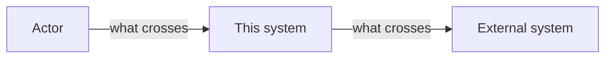
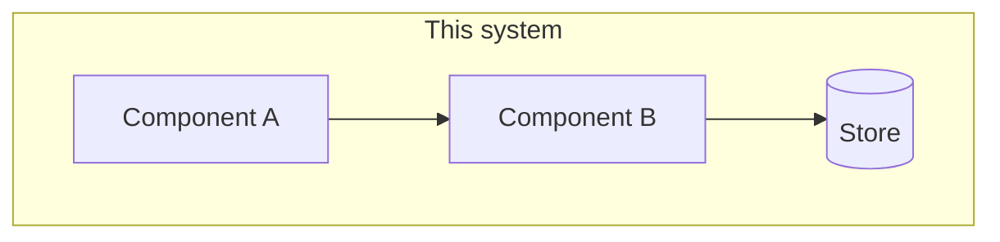
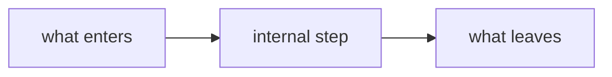
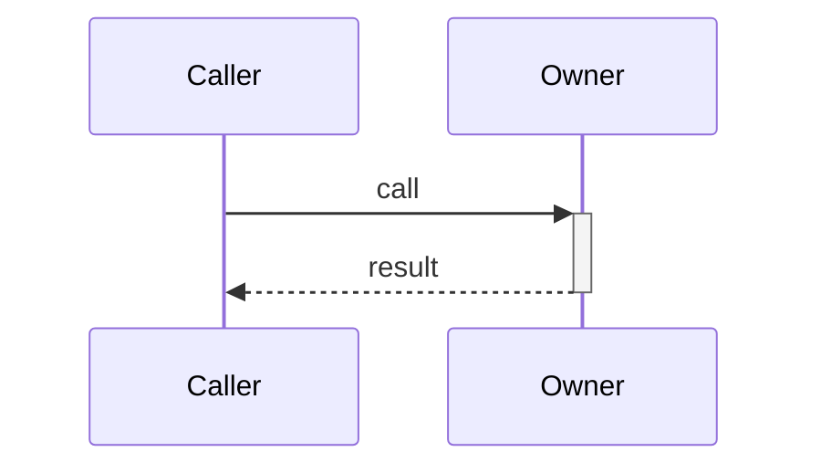

# <Title>

<!--
Everything above `# Appendices` is prose, read start to finish by a person, and
carries the design in full including its thresholds and caps. Everything below is
the numbered source that prose cites. No requirement field, decision card, or
traceability row appears in the narrative.
-->

## Abstract

<3-5 sentences, written last. What this specifies, the approach it adopts, and the principal trade-off it accepts. A reader decides here whether the rest concerns them.>

## Background

<Prose. The current state this design changes: what exists in the code now, how it behaves, and which earlier decision or constraint is in the way. Name modules and current behavior. Factual and uncontested — no proposal, no requirement.

Bounded by what an implementer needs in order to judge the sections below. Not a history of the system, not an introduction to the domain. If a paragraph does not change how the reader evaluates a later section, cut it.

Where a fact also anchors a requirement, state it here once and let `R<n>` name only the single fact it changes.>

## Problem statement

<Prose. What breaks, for whom, quantified where it can be, and the cost of leaving it alone. No solution language.>

## Goals

- <The end state, from the user's perspective. Measurable. Still no mechanism.>

## Non-goals

- <Explicitly out of scope.> — <why, and whether it is "not now" or "never">

## Architecture

<Prose plus diagrams, one level at a time, every level this feature reaches. These are progressive views of one architecture at a finer grain each time, not a beginner version followed by an expert version — the only reader is the implementer.

Give its own `###` to each part this feature introduces, changes, or leans on through behavior its interface does not reveal, and add one heading per such part, however many that is. Stop at a stable external interface: say what crosses it and what is relied on, not what is inside someone else's system. Stop also when the remaining detail is the order to build things in. A level this feature introduces or changes and does not describe has been hidden.

State the specified behavior here in full, thresholds and numbers included, and cite `[R<n>]` for its falsifiable form. A reader who finishes this section understands the design without having opened the appendix.>

### System context

<Prose. This system, who uses it, what it depends on, and what crosses each boundary. Name the trust boundaries here if there are any.>



### Components

<Prose. What is inside, what each part is answerable for, and why the boundaries fall here rather than somewhere else.>



| State       | Owner       | Storage          |
| ----------- | ----------- | ---------------- |
| <the thing> | <component> | <where it lives> |

<Every piece of state gets exactly one row. If two answers exist, the design is not finished.>

### <First component or mechanism>

<Prose. What it is answerable for, how it works inside, what it owns, and how it behaves when it fails. Enough that an implementer could build this part from this subsection plus the interfaces below. Add a diagram below when this level has parts, direction, or ordering a diagram can carry; a level that is one boundary needs only the prose, and a diagram there would just restate it.>



### <Second component or mechanism>

<Same treatment. Keep adding a `###` for every part this feature introduces, changes, or leans on through behavior its interface does not reveal. Two is not a target and neither is five — the feature's actual surface decides the count.

Stop descending at a stable external interface, and stop when the next level down is the order in which to build things rather than how the thing is built. File length is not a reason to stop; leaving this feature's surface is.>

## Alternatives considered

<Prose. For each: what it was, why it lost, and what would change our mind. Include the option a reasonable skeptic would raise. Each entry is a decision the appendix records as `D<n>`; this is where a reader meets it.>

## Interfaces

<The boundary a reviewer argues with. Signatures, then one illustrative call — no bodies, no algorithms.>

```<language>
<signature>
```

<How it is used, as a call site, request/response, or event payload:>

```<language>
<illustrative usage — fake values, real shape>
```

## Flows

### <Flow name>



1. <Step the diagram cannot carry — a precondition, an invariant, a why.>

## Failure and concurrency

<Prose. Each mode: what a caller observes, and how the system recovers. Never silent degradation.>

## Observability

<What is logged, at what level, and what a reader can conclude from it.>

## Rollback

<How this is undone if it goes wrong, and what becomes unrecoverable.>

---

# Appendices

<The numbered source for the narrative above. A reader arrives here to check a citation, not to read it through, so these sections are atomic, repetitive, and greppable by design. Downstream stages consume them directly.>

## Requirements

<Every `R<number>` the narrative cites, in falsifiable form. The narrative owns the explanation; these own the pass/fail edge. Use MUST / MUST NOT / SHALL for normative force, so each line converts to exactly one check.>

### R1 — <the requirement as a declarative statement>

- **Current** — <the one specific fact this changes. The current-state account is `## Background`; do not restate it here.>
- **Target** — <what it becomes>
- **Acceptance** — <the concrete pass/fail check that proves it>

## Verification

<Every `R<number>` maps to a proof. No status column.>

| Requirement | Scenario                  | Proof                            |
| ----------- | ------------------------- | -------------------------------- |
| R1          | <the observable behavior> | [<test>](../../tests/e2e/<file>) |

## Decisions

<Append-only across runs. Each entry is a provenance index: the decision, the force that made it the answer, and what it cost. `## Architecture` is where a reader meets these; this is where they are recorded.>

### D1 — <the decision itself, as a declarative statement>

<Why. One short paragraph: the force that made this the answer, and the alternative it beat.[^<source-id>]>

- **Governs** — <`R5, R7` — omit for a framing decision that governs no requirement>
- **Consequences** — <the cost this accepts: what it makes harder, slower, or irreversible. Never a restatement of the rationale.>
- **Depends on** — [`<slug>:D<n>`](./<slug>.md)
- **Supersedes** — <`D<n>`, or `<slug>:D<n>`, comma-separated>
- **Decided** — <YYYY-MM-DD, by user | codebase | web | constraint | default | review>

## Technology and frameworks

| Choice | Origin | Role | Why | Constraint / trade-off |
| --- | --- | --- | --- | --- |
| <library, framework, service, or format> | inherited \| new | <what it does here> | <what it beat, or what it was inherited from> | <version floor, platform limit, or cost it imposes> |

<Every technology a reader needs in order to understand this design, whether this run chose it or inherited it. Omit only infrastructure the design does not touch.>

## Legacy

| Item | Class | Consumers | Decision |
| --- | --- | --- | --- |
| <path or component> | Dead \| Legacy \| Shared | <direct callers + jobs, scripts, APIs, other repos> | <delete \| deprecate \| migrate \| keep> |

<Drop this section once the migration has landed.>
