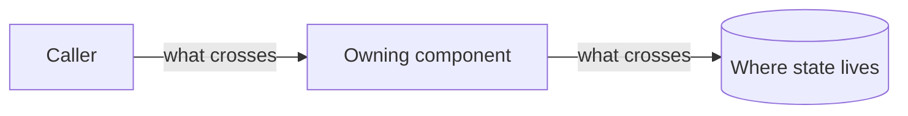
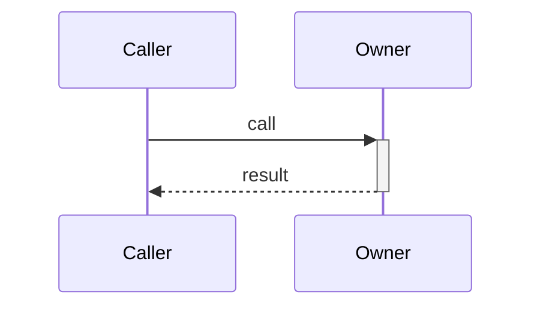

# <Title>

## TL;DR

<2-4 sentences. A reader decides in 15 seconds whether this concerns them.>

## Problem

<What breaks without this, from the user's or operator's perspective. No solution
language here.>

## Goals

- <The end state, from the user's perspective. Still no mechanism.>

## Non-goals

- <Explicitly out of scope, and why.> — <reason>

## Requirements

<Each is falsifiable: a verifier can write a check that passes or fails.>

### R1 — <the requirement as a declarative statement>

- **Current** — <what exists, or does not exist, today>
- **Target** — <what it becomes>
- **Acceptance** — <the concrete pass/fail check that proves it>

## Architecture



<One paragraph the diagram cannot carry: why these boundaries.>

| State | Owner | Storage |
|---|---|---|
| <the thing> | <component> | <where it lives> |

<Every piece of state gets exactly one row. If two answers exist, the design is
not finished.>

## Technology and frameworks

| Choice | Origin | Role | Why | Constraint / trade-off |
|---|---|---|---|---|
| <library, framework, service, or format> | inherited \| new | <what it does here> | <what it beat, or what it was inherited from> | <version floor, platform limit, or cost it imposes> |

<Every technology a reader needs in order to understand this design, whether this
run chose it or inherited it. Omit only infrastructure the design does not touch.>

## Interfaces

<The boundary a reviewer argues with. Signatures, then one illustrative call —
no bodies, no algorithms.>

```<language>
<signature>
```

<How it is used, as a call site, request/response, or event payload:>

```<language>
<illustrative usage — fake values, real shape>
```

## Flows

### <Flow name>



1. <Step the diagram cannot carry — a precondition, an invariant, a why.>

## Failure and concurrency

| Failure | Behavior | Recovery |
|---|---|---|
| <mode> | <observable behavior — never silent degradation> | <retry, idempotency, ordering> |

## Observability

<What is logged, at what level, and what a reader can conclude from it.>

## Rollback

<How this is undone if it goes wrong, and what becomes unrecoverable.>

## Legacy

| Item | Class | Consumers | Decision |
|---|---|---|---|
| <path or component> | Dead \| Legacy \| Shared | <direct callers + jobs, scripts, APIs, other repos> | <delete \| deprecate \| migrate \| keep> |

<Drop this section once the migration has landed.>

## Verification

<Every `R<number>` maps to a proof. No status column.>

| Requirement | Scenario | Proof |
|---|---|---|
| R1 | <the observable behavior> | [<test>](../../tests/e2e/<file>) |

## Decisions

### D1 — <the decision itself, as a declarative statement>

<Why. One short paragraph: the force that made this the answer, and the
alternative it beat.[^<source-id>]>

- **Consequences** — <the cost this accepts: what it makes harder, slower, or
  irreversible. Never a restatement of the rationale.>
- **Depends on** — [`<slug>:D<n>`](./<slug>.md)
- **Supersedes** — <`D<n>`, or `<slug>:D<n>`, comma-separated>
- **Decided** — <YYYY-MM-DD, by user | codebase | web | constraint | default | review>
