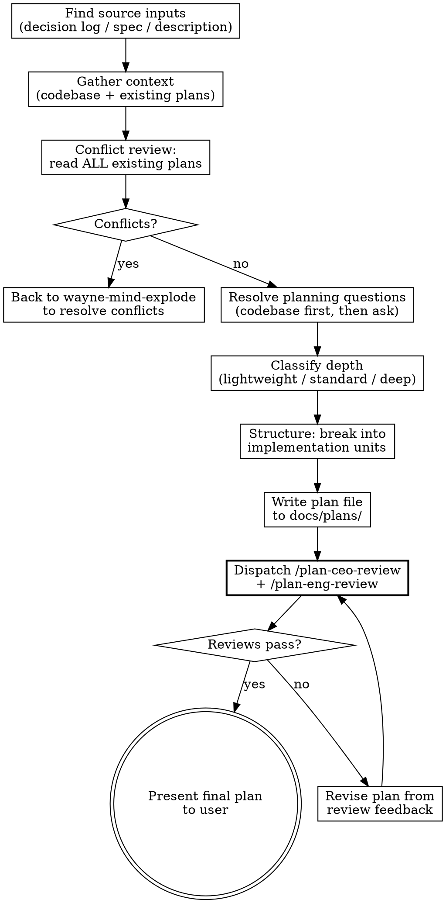

# Wayne Plan

`wayne-mind-explode` defines **WHAT** to build. `wayne-plan` defines **HOW** to build it.

This skill produces a durable implementation plan. It does **not** write code, run tests,
or execute anything. If the answer depends on changing code and seeing what happens,
that belongs in implementation, not here.

## Language Rules

**Chinese (output to user):** ALL communication shown to the user — questions, explanations,
recommendations, summaries, status reports, warnings, synthesis, critical findings.
This includes AskUserQuestion text, inline explanations, and any prose the user reads.

**English (written to files):** ALL files saved to disk — plans, specs, decision logs,
code comments. No exceptions.

**English (structural labels):** Headers, severity tags, table headers stay English
even in Chinese prose.

## Checklist

You MUST create a task for each and complete in order:

1. **Find source inputs** — decision log, spec, or feature description
2. **Recall lessons from KB** — see "Lesson Recall" section below; collect
   relevant lessons to inject into the plan's risk section
3. **Gather context** — explore codebase, read existing plans/docs
4. **Conflict review** — check ALL existing plans for contradictions
5. **Resolve planning questions** — ask user only when answer is unknowable from code
6. **Structure the plan** — break into implementation units
7. **Write plan file** — save to `docs/plans/`, with relevant lessons cited in risk section
8. **Dispatch plan reviews** — `/plan-ceo-review` + `/plan-eng-review`
9. **Final plan** — incorporate review feedback, present to user

## Lesson Recall (Step 2)

Before structuring the plan, scan the KB for past lessons with `type: lesson`
whose `trigger` field matches the planned work.

```bash
grep -rl "^type: lesson" /mnt/share/kb/ --include="*.md" 2>/dev/null
```

For each candidate, read the `trigger` field. Use semantic matching (a quick
LLM judgment) — not just keyword grep — to decide relevance.

**Inject relevant lessons into the plan's risk section:**

In the plan file under a "Known Risks (from past lessons)" section, list each
relevant lesson with:
- Title and KB path
- The `trigger` (what scenario this lesson applies to)
- The anti-pattern or prevention summary
- A specific mitigation step in the plan that addresses it

If no lessons match, write `Known Risks (from past lessons): none found` so the
absence is intentional rather than forgotten.

If the user dismissed a recall in `wayne-mind-explode`, the decision log will
have `Lesson recall skipped` — respect that, but still note in the plan that
the dismissal happened, so reviewers can challenge it if needed.

## Process Flow



---

## Phase 1: Find Source Inputs

Look for upstream artifacts in this priority order:

1. **Decision log** from `wayne-mind-explode` — `docs/decisions/YYYY-MM-DD-*-decisions.md`
2. **Spec/design doc** — `docs/specs/YYYY-MM-DD-*-design.md`
3. **User's direct description** — if no upstream docs exist

If a decision log exists, it is the **primary source of truth**. Read every row.
Every plan item must trace back to a logged decision.

If a spec exists, carry forward:
- Problem frame and requirements
- Scope boundaries
- Key decisions and rationale
- Dependencies and assumptions

If neither exists, run a short bootstrap:
- Establish problem frame, intended behavior, scope, success criteria
- Recommend `wayne-mind-explode` first if major product questions are unresolved

---

## Phase 2: Gather Context

### 2.1 Codebase Research

Before asking the user anything, explore:

- **Architecture:** Project structure, patterns, conventions
- **Relevant files:** What exists today that this plan will touch
- **Related code:** Similar features already implemented (follow their patterns)
- **Test patterns:** How existing tests are structured
- **Tech stack:** Frameworks, versions, tooling

### 2.2 Read ALL Existing Plans and Docs

```bash
find docs/ -name "*.md" -type f 2>/dev/null | head -50
```

Read each existing plan in `docs/plans/` and `docs/specs/`. Note:
- Active plans that touch related areas
- Architectural decisions that constrain this work
- Patterns or conventions established in prior plans

---

## Phase 3: Conflict Review + Dead Code Scan

### 3.1 Conflict Check

Check the proposed work against ALL existing plans and docs:

1. Does this plan break assumptions made in other plans?
2. Does it duplicate functionality already planned elsewhere?
3. Does it conflict with stated architectural decisions?
4. Does it change interfaces that other plans depend on?

If conflicts found: **stop and recommend `wayne-mind-explode`** to resolve them as
new decision branches. Do not proceed with a conflicting plan.

### 3.2 Dead Code Scan

Scan for code that would become dead or obsolete if this plan is implemented:

1. **Identify replaced functionality** — grep for functions, classes, routes, configs
   that the new plan supersedes
2. **Trace callers** — for each candidate, check if anything else still calls it
3. **Check external consumers** — APIs, scheduled jobs, other repos
4. **Classify:** Dead (safe to delete) / Legacy (still has callers, needs migration) / Shared (keep)
5. **Ask user (in Chinese)** for each Dead or Legacy item:
   - A) 删除 (delete)
   - B) 保留做 legacy 支持 (keep for legacy)
   - C) 标记 deprecated + 设迁移期限 (deprecate with deadline)
6. **Add cleanup tasks to the plan** — dead code deletion becomes an implementation unit
   with its own files list, or gets deferred with explicit timeline

If the spec from `wayne-mind-explode` already has dead code decisions logged,
carry those forward instead of re-asking.

---

## Phase 4: Resolve Planning Questions

For each open question, decide:
- **Resolve now** — answer is knowable from code, docs, or user choice
- **Defer to implementation** — depends on runtime behavior or code changes

Rules:
- **Explore codebase first.** If the answer is in the code, don't ask.
- **Ask in Chinese.** One question at a time, with your recommendation.
- **Log decisions.** If a decision log exists from brainstorming, append to it.

---

## Phase 5: Classify Depth

| Depth | Signal | Units |
|-------|--------|-------|
| **Lightweight** | Small, bounded, low ambiguity | 2-4 |
| **Standard** | Normal feature, some technical decisions | 3-6 |
| **Deep** | Cross-cutting, high-risk, ambiguous | 4-8+ |

High-risk signals that push toward deeper plans:
- Auth, security, payments, compliance
- Data migrations or schema changes
- External APIs or third-party integrations
- Cross-interface parity or multi-surface behavior

---

## Phase 6: Structure the Plan

### 6.1 Implementation Units

Break work into logical units. Each unit = one meaningful atomic change.

Good units are:
- Focused on one component, behavior, or integration seam
- Ordered by dependency
- Concrete enough to execute without pre-writing code
- Marked with checkbox syntax `- [ ]` for progress tracking

### 6.2 Per-Unit Requirements

For each unit, include:

| Field | Required | Description |
|-------|----------|-------------|
| **Goal** | Yes | What this unit accomplishes |
| **Requirements** | Yes | Which requirements it advances |
| **Dependencies** | Yes | What must exist first |
| **Files** | Yes | Repo-relative paths to create/modify/test |
| **Approach** | Yes | Key decisions, data flow, boundaries |
| **Patterns to follow** | Yes | Existing code or conventions to mirror |
| **Test scenarios** | Yes | Specific cases: input → action → expected outcome |
| **Verification** | Yes | How to know the unit is complete |
| **Technical design** | Optional | Pseudo-code or diagram when approach is non-obvious |
| **Decision trace** | If available | Which decision log entries drive this unit |

### 6.3 Test Scenarios

For each feature-bearing unit, enumerate test cases from applicable categories:

- **Happy path** — core functionality with expected inputs/outputs
- **Edge cases** — boundary values, empty inputs, null states
- **Error paths** — invalid input, service failures, timeouts
- **Integration** — cross-layer behaviors that mocks alone won't prove

Each scenario should name the input, action, and expected outcome.
For non-feature units (config, scaffolding): `Test expectation: none — [reason]`

---

## Phase 7: Write Plan File

### 7.1 File Naming

```
docs/plans/YYYY-MM-DD-NNN-<type>-<descriptive-name>-plan.md
```

- Type: `feat`, `fix`, or `refactor`
- Sequence: check existing files for today's date, increment
- Name: 3-5 words, kebab-case

Create `docs/plans/` if it doesn't exist.

### 7.2 Plan Template

```markdown
---
title: [Plan Title]
type: [feat|fix|refactor]
status: active
date: YYYY-MM-DD
origin: docs/specs/YYYY-MM-DD-<topic>-design.md
decisions: docs/decisions/YYYY-MM-DD-<topic>-decisions.md
---

# [Plan Title]

## Overview

[What is changing and why — 2-3 sentences]

## Problem Frame

[User/business problem and context. Reference origin doc.]

## Requirements Trace

- R1. [Requirement this plan must satisfy]
- R2. [Requirement this plan must satisfy]

## Scope Boundaries

- [Explicit non-goal or exclusion]

## Context

### Relevant Code and Patterns

- [Existing file, class, pattern to follow]

### Constraints from Existing Plans

- [Any constraints from other active plans]

## Key Technical Decisions

- [Decision]: [Rationale] (see decision log #N)

## Open Questions

### Resolved During Planning

- [Question]: [Resolution]

### Deferred to Implementation

- [Question]: [Why deferred]

## Implementation Units

- [ ] **Unit 1: [Name]**

  **Goal:** [What this accomplishes]
  **Requirements:** [R1, R2]
  **Dependencies:** [None / Unit N / external]
  **Decision trace:** [Decision log #N, #M]

  **Files:**
  - Create: `path/to/new_file`
  - Modify: `path/to/existing_file`
  - Test: `path/to/test_file`

  **Approach:**
  - [Key design or sequencing decision]

  **Patterns to follow:**
  - [Existing code or convention]

  **Test scenarios:**
  - Happy path: [input → action → expected outcome]
  - Edge case: [boundary → action → expected outcome]
  - Error path: [failure → action → expected outcome]

  **Verification:**
  - [Outcome that holds when this unit is complete]

## Dead Code / Legacy Cleanup

- [Dead] `path/to/old_file` — action: delete / decision log #N
- [Legacy] `path/to/legacy_file` — action: deprecate by YYYY-MM-DD / decision log #N
- [Shared] `path/to/shared_file` — action: keep, used by both old and new

## System-Wide Impact

- **Interaction graph:** [What callbacks, middleware, observers affected]
- **Error propagation:** [How failures travel across layers]
- **State lifecycle risks:** [Partial-write, cache, duplicate concerns]
- **Unchanged invariants:** [Existing APIs/behaviors explicitly not changed]

## Risks & Dependencies

| Risk | Mitigation |
|------|------------|
| [Risk] | [How addressed] |

## Sources & References

- **Origin spec:** [path](path)
- **Decision log:** [path](path)
- Related code: [path or symbol]
```

### 7.3 Planning Rules

- **All file paths repo-relative** — never absolute paths
- **No implementation code** — no imports, exact signatures, framework syntax
- Pseudo-code sketches OK when they communicate design direction (frame as "directional guidance")
- Mermaid diagrams encouraged for multi-component relationships
- No git commands, commit messages, or test command recipes
- Don't pretend execution-time unknowns are settled

---

## Phase 8: Plan Review via gstack

After the plan file is written and committed:

1. **Invoke `/plan-ceo-review`** — challenges premises, looks for the 10-star version, questions scope
2. **Invoke `/plan-eng-review`** — locks in architecture, data flow, edge cases, test coverage

Process:
- Invoke each skill via the Skill tool
- Collect feedback from both reviews
- Present combined feedback to user (in Chinese)
- If either review surfaces issues requiring plan changes:
  - Revise the plan
  - Re-run reviews until both pass
- Update the decision log with review outcomes

---

## Phase 9: Final Handoff

After reviews pass:

1. Present the final plan to the user (in Chinese summary, English plan file)
2. Update decision log status to `plan-complete`
3. Link the plan file in the decision log

The plan is now ready for implementation.

---

## Full Wayne Workflow

```
wayne-mind-explode  →  wayne-plan  →  ce-work  →  wayne-code-review  →  ship
   (WHAT)              (HOW)        (BUILD)      (GATE)               (PR)
```

| Stage | Skill | What it does |
|-------|-------|--------------|
| Brainstorm | `wayne-mind-explode` | Grill, decide, log decisions, write spec |
| Plan | `wayne-plan` (this skill) | Structure implementation from decisions + spec |
| Execute | `compound-engineering:ce-work` | Build the plan (use CE's work skill as-is) |
| Review gate | `wayne-code-review` | Dual-voice review — must pass before PR |
| Ship | User's choice | Commit, PR, merge |

### From wayne-mind-explode

When a decision log exists, every plan item traces back to logged decisions.
The `Decision trace` field in each implementation unit references specific decision numbers.

### To ce-work

After plan approval, invoke `compound-engineering:ce-work` to execute.
CE's work skill handles implementation with its own incremental review subagents during build.

### To wayne-code-review (pre-PR gate)

After implementation is complete, `wayne-code-review` runs as the **final gate before PR**.
It cross-references the diff against this plan:
- What was planned vs actually built
- Plan items missing from the diff
- Diff changes not in the plan
- Dual-voice adversarial review (Claude + Codex)

**`wayne-code-review` must pass before shipping.** CE's `ce-review` subagents may run
during `ce-work`, but they don't replace the final dual-voice gate.

### Standalone Use

Can be used without `wayne-mind-explode` when:
- The feature is well-understood and doesn't need grilling
- You're planning from a clear bug report or feature request
- The user provides enough context directly

---

## Key Principles

- **Decisions, not code** — capture approach, boundaries, risks. Don't pre-write implementation
- **Research before structuring** — explore codebase and existing plans before writing
- **Right-size the artifact** — small work gets compact plans, large work gets more structure
- **Every unit traces to a decision** — if it wasn't decided, why is it in the plan?
- **Conflict-free by design** — no plan ships contradicting existing plans
- **Chinese for discussion, English for artifacts**
