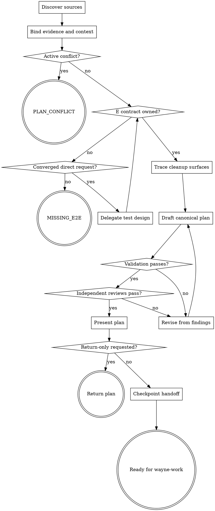

# Wayne Plan

Produce an English implementation plan that a fresh `wayne-work` agent can execute without reopening product design.

## Boundary

- Preserve the ownership chain: `wayne-test-design` owns E rows, this skill owns U rows and the plan, `wayne-work` owns `☐` transitions, `wayne-verify` owns `⬜` transitions, and `wayne-checkpoint` owns handoff packaging.
- Stop on unresolved product behavior or compatibility policy; do not silently choose it. Do not brainstorm, design the test matrix, implement code, run the feature, commit, or ship.
- Never invoke or depend on `gstack` or a `gstack`-named skill. Reviews must be provider-agnostic and independent of the authoring context.
- On either blocked terminal, pass successful `check-blocked` stdout through byte-for-byte as the entire user-visible response; do not regenerate, wrap, or announce it.

## Flow

## Process

### A. Discover sources

- Select inputs in priority order: decision log, spec, then an already-converged direct request. When present, the decision log is the WHAT-level source of truth; HOW detail belongs to the plan.
- A small, unambiguous direct request is a complete standalone Plan input; it does
  not require Mind Explode, a decision log, or a spec. Route upstream only when a
  missing WHAT choice would change scope, behavior, risk, or compatibility.
- Read `_shared/pipeline-id-contract.md` completely. Preserve upstream bytes: map
  legacy numeric decision rows to `D<number>` only in the temporary ledger. Use
  source meaning and artifact ownership—not headings, prefixes, keywords, or
  regex—to distinguish requirements, decisions, and review findings.
- Follow references to the original test matrix. Read its complete E contract and the structurally bounded `## U-SEED` table, relevant repository files and tests, all active plans that touch the work, and applicable project or Wayne lessons.
- Read [the plan contract](references/plan-contract.md) completely before building validation inputs or authoring. It is the single schema owner.

### B. Bind evidence and context

- Before repository mutation, create the pre-run manifest with [the validator](scripts/validate_plan.py). Keep the manifest and all working ledgers in a temporary directory outside the repository root.
- Build a temporary source ledger in the contract’s format from the actual decision log, spec, and matrix. Read every source completely and classify its obligations in context; never use lexical scanning to claim source completeness. Freeze hashes, exact requirements and decisions, every U-SEED row, the complete E block, ownership claims, exact literals, and forbidden alternatives. Canonical aliases never authorize editing their source rows. Compare clauses governing the same field; stop upstream if they accept different outputs.
- Trace each requirement and decision forward to planned units. Inspect architecture, real files and symbols, similar implementation and test patterns, and active-plan assumptions. Do not ask for information discoverable from these sources.

### C. Gate active conflicts

- Compare the requested change with every relevant active plan and recorded decision. A contradiction, duplicate ownership, or unresolved product choice is an active conflict; implementation uncertainty is not.
- On conflict, create no plan. Render the five-line `PLAN_CONFLICT` artifact defined by the contract, run `check-blocked`, and on success pass the command stdout through as the entire response.

### D. Gate E ownership

- Require the source matrix to contain either an owned E table or the approved literal `E2E: none — <reason>`. Do not invent, drop, normalize, reorder, or status-change E content.
- For a converged standalone direct request with no matrix, invoke
  `wayne-test-design` as a nested owner and resume here with its returned artifact;
  do not invoke Mind Explode or author the matrix yourself. For other inputs, or if
  test design cannot establish E ownership, create no plan. Render the five-line
  `MISSING_E2E` artifact, run `check-blocked`, and return its stdout unchanged.

### E. Trace cleanup surfaces

- Identify replaced functions, routes, jobs, configuration, and public interfaces; trace their callers and external consumers. Classify each surface as dead, legacy, or shared.
- Carry approved cleanup into units. If compatibility behavior has no upstream decision, return to C instead of selecting delete, preserve, or deprecate policy.

### F. Draft the canonical plan

- Copy [the plan template](templates/plan-template.md) and fill it under the contract. Choose the next unused filename for the current date; keep paths repository-relative and the prose English.
- Order units by dependency. Give every unit closed inputs/outputs, files and symbols, concrete control logic, test ownership, E coverage, verification, and source traces so another agent can implement it from the plan plus repository.
- Carry the E block byte-for-byte. Re-author every source seed against a real `path::symbol` without changing its semantic obligations, map or drop each seed exactly once, add U rows only as `added`, and bind every U row to one unit. Keep both statuses under their downstream owners.

### G. Run deterministic validation

- Run `check` from [the validator](scripts/validate_plan.py) with the plan, repository root, pre-run manifest, matrix, source ledger, and every available decision log/spec argument. Artifact-only validation is not source-fidelity evidence.
- For each finding, name the directly observed structural invariant before changing
  the plan. Hash, schema, exact carry, ID closure, repository-relative structured
  paths, mutation scope, and event order are valid deterministic gates. A lexical
  pattern over prose that claims vagueness, completeness, intent, causality, or
  scenario quality is an evaluator defect, not a plan defect.
- Require every valid deterministic gate to pass. Do not hand-edit the E block,
  weaken the ledger, remove a source, or reshape clear prose to satisfy an evaluator
  defect. Record the defective finding and let the independent AI review own its
  claimed semantic question until the checker is fixed.

### H. Revise from findings

- Fix the smallest owning surface: upstream gap, plan content, template use, or ledger transcription. Never change an upstream source inside this procedure.
- A validator finding authorizes no semantic rewrite. Preserve the intended
  owner/member and repair the incorrect field; never weaken or rename a surface
  solely to make two strings equal.
- Re-run deterministic validation after every real plan revision. Do not loop on an
  unchanged evaluator defect. If a finding exposes an unresolved product decision
  or absent E ownership, follow C or D rather than continuing the loop.

### I. Run independent reviews

- Dispatch two provider-agnostic reviews in fresh contexts. Source-fidelity reads the decision log, spec, matrix, ledger, plan, and [source-fidelity review protocol](references/source-fidelity-review.md); it reports the preserved obligations for every exact seed row and fails any mapped scenario or drop reason that changes them. It also checks requirement/decision coverage, scope, rationale, and byte-exact E carry in both directions.
- Execution-readiness is an independent agent review. It reverse-checks every source obligation through ledger and plan before checking dependency closure, interfaces, files/symbols, U ownership and seed accounting, E advancement, placeholders, cleanup, and whether each unit is executable without product redesign. Fail when implementation would require any behavior, scope, ownership, failure, compatibility, migration, or public-interface choice not covered by the decision log, spec, or plan. If repository evidence cannot close that choice, ask the user and revise the plan; never invent a default. Neither reviewer may substitute heading, keyword, substring, regex, script output, or validator status for contextual reading.
- Revise on any finding, return to G, and repeat both reviews. Provider/tool termination before an observable report is invalid and must be rerun, not treated as a pass or failure.

### J. Present the plan

- Present only after deterministic validation and both reviews pass. Then set plan
  frontmatter from `active` to `approved` and rerun deterministic validation before
  handoff. Report the plan path and concise evidence; delete temporary ledgers and
  the pre-run manifest after the gate record no longer needs them.

### L. Checkpoint handoff

- Unless the caller explicitly requested return-only or no-checkpoint evaluation, invoke `wayne-checkpoint` in handoff mode with the plan and Test Matrix; set the next agent to `wayne-work`.
- Carry the exact authoritative `docs/test-matrix/` path. The E block inside the
  plan is a read-only `⬜` snapshot; no downstream stage may use it as E Status SoT.
- Plan approval and `Ready for wayne-work` are handoff states, not implementation
  authorization. Return the plan or checkpoint and stop; never invoke `wayne-work`.
- Return-only ends after presentation and must not auto-advance implementation.
