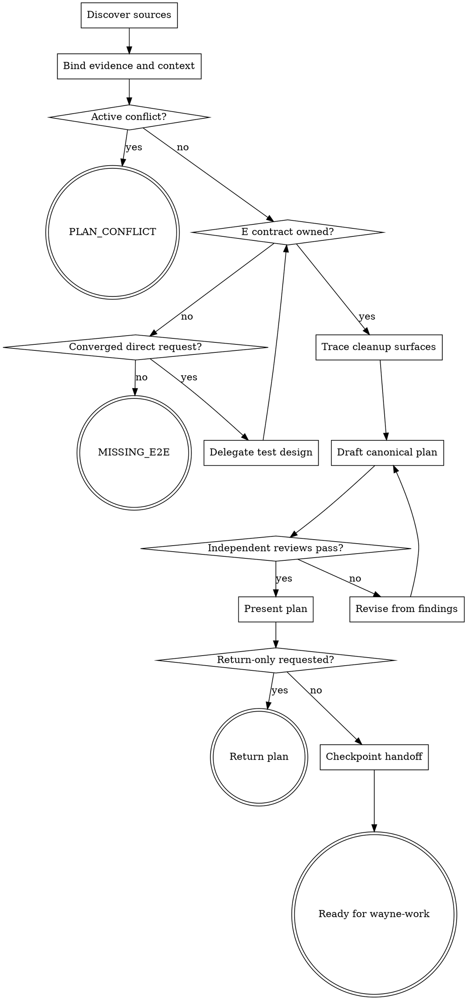

# Wayne Plan

Produce an English implementation plan that a fresh `wayne-work` agent can execute without reopening product design.

## Boundary

- Preserve the ownership chain: `wayne-test-design` owns E rows, this skill owns U rows and the plan, `wayne-work` owns `☐` transitions, `wayne-verify` owns `⬜` transitions, and `wayne-checkpoint` owns handoff packaging.
- An approved decision log is upstream read-only. Do not restore the retired
  `plan-complete` writeback or add a plan link there; the plan and checkpoint carry
  that relationship without creating a second state writer.
- Stop on unresolved product behavior or compatibility policy; do not silently choose it. Do not brainstorm, design the test matrix, implement code, run the feature, commit, or ship.
- Never invoke or depend on `gstack` or a `gstack`-named skill. Reviews must be provider-agnostic and independent of the authoring context.
- Before the final checkpoint handoff, planning may change only the new plan file.
  `wayne-checkpoint` separately owns its checkpoint artifacts. If source artifacts
  or unrelated files need edits, stop and ask the user to fix or expand scope first.

## Flow

## Process

### A. Discover sources

- Select inputs in priority order: decision log, spec, then an already-converged direct request. When present, the decision log is the WHAT-level source of truth; HOW detail belongs to the plan.
- A small, unambiguous direct request is a complete standalone Plan input; it does
  not require Mind Explode, a decision log, or a spec. Route upstream only when a
  missing WHAT choice would change scope, behavior, risk, or compatibility.
- Read `_shared/pipeline-id-contract.md` completely. Preserve upstream bytes: map
  legacy numeric decision rows to `D<number>` only in the working coverage map. Use
  source meaning and artifact ownership—not headings, prefixes, keywords, or
  regex—to distinguish requirements, decisions, and review findings.
- Follow references to the original test matrix. Read its complete E contract and
  provisional U-SEED information regardless of headings or table layout, plus
  relevant repository files and tests, all active plans that touch the work, and
  applicable project or Wayne lessons.
- Read each candidate lesson's trigger and decide applicability semantically. For
  every match, carry its title/path, trigger, prevention, and a concrete mitigation
  into `Applicable Lessons`; do not turn a non-match into a constraint. Record an
  explicit reason when none apply or an upstream decision dismissed the recall.
- Read [the plan contract](references/plan-contract.md) completely before authoring.
  It defines semantic ownership and review expectations, not a Markdown grammar.

### B. Bind evidence and context

- Record the starting `git rev-parse HEAD` and `git status --short`. Use them at
  review time to prove that only the new plan file changed; do not inventory,
  recursively read, or hash the repository tree.
- Build a temporary working coverage map from the actual decision log, spec, and
  matrix. Its shape is free: it exists to help the agent trace requirements,
  decisions, U-SEED rows, E ownership, exact literals, and forbidden alternatives.
  Read every source completely and classify obligations in context; never use a
  parser, headings, IDs, keywords, or regex to claim semantic completeness.
- Trace each requirement and decision forward to planned units. Inspect architecture,
  real files and symbols, similar implementation and test patterns, and active-plan
  assumptions. Compare clauses governing the same behavior and stop upstream when
  they conflict. Do not ask for information discoverable from these sources.

### C. Gate active conflicts

- Compare the requested change with every relevant active plan and recorded decision. A contradiction, duplicate ownership, or unresolved product choice is an active conflict; implementation uncertainty is not.
- On conflict, create no plan. Return the `PLAN_CONFLICT` blocker described by the
  contract with the conflicting artifacts, owner, and concise Chinese explanation.

### D. Gate E ownership

- Require the source matrix to contain either an owned E table or the approved literal `E2E: none — <reason>`. Do not invent, drop, normalize, reorder, or status-change E content.
- For a converged standalone direct request with no matrix, invoke
  `wayne-test-design` as a nested owner and resume here with its returned artifact;
  do not invoke Mind Explode or author the matrix yourself. For other inputs, or if
  test design cannot establish E ownership, create no plan. Return the
  `MISSING_E2E` blocker with the affected artifacts, owner, and explanation.

### E. Trace cleanup surfaces

- Identify replaced functions, routes, jobs, configuration, and public interfaces; trace their callers and external consumers. Classify each surface as dead, legacy, or shared.
- Carry approved cleanup into units. If compatibility behavior has no upstream decision, return to C instead of selecting delete, preserve, or deprecate policy.

### F. Draft the canonical plan

- Use [the plan template](templates/plan-template.md) as a readable starting point,
  not a grammar. Choose the next unused filename for the current date; keep paths
  repository-relative and the prose English. Adapt headings or grouping when that
  makes the plan clearer without losing required information.
- Right-size detail to the actual dependency graph and risk. A small standalone
  change may use one or a few compact units; cross-cutting or high-risk work needs
  enough detail to close its real interfaces and failure paths. Never add units,
  prose, or review work to satisfy a size/depth quota.
- Order units by dependency. Give every unit closed inputs/outputs, files and symbols, concrete control logic, test ownership, E coverage, verification, and source traces so another agent can implement it from the plan plus repository.
- Preserve the complete E contract without changing its meaning, rows, IDs, or
  status. Re-author every source seed against a real `path::symbol` without changing
  its semantic obligations, map or drop each seed once with evidence, add any new U
  coverage explicitly, and bind every U scenario to one unit. Keep both statuses
  under their downstream owners.

### G. Run independent reviews

- Dispatch two provider-agnostic reviews in fresh contexts.
- Source-fidelity reads every decision log, spec, matrix, the working coverage map,
  plan, and [source-fidelity protocol](references/source-fidelity-review.md). It
  reverse-checks every source obligation and U seed, E ownership, scope, decisions,
  rationale, and intended behavior in both directions.
- Execution-readiness independently checks dependency closure, interfaces, real
  files/symbols, unit ownership, U coverage, E advancement, cleanup, placeholders,
  and whether a fresh `wayne-work` agent could execute each unit without product
  redesign or inventing behavior.
- Both reviews compare the starting HEAD/status, the agent's write history, and the
  current diff before checkpoint handoff. Any mutation beyond the new plan file
  fails the scope review. Git evidence is sufficient; do not scan unrelated files.
- Neither reviewer may substitute headings, section order, table shape, keywords,
  substring checks, regex, a script, or template agreement for contextual reading.
  Provider/tool termination before a report is invalid and must be rerun.

### H. Revise from findings

- Fix the smallest owning surface: upstream gap, plan content, template guidance, or
  coverage-map transcription. Never change an upstream source inside this procedure.
- Preserve the intended owner/member and semantic obligation; do not weaken a
  requirement or rename a surface merely to make text look consistent.
- Repeat both reviews after every plan revision. If a finding exposes an unresolved
  product decision or absent E ownership, follow C or D instead of inventing a
  default. Ask the user when repository evidence cannot close a required choice.

### J. Present the plan

- Present only after both reviews pass. Then set plan status from `active` to
  `approved` and confirm the final scope diff before handoff. Unless the caller
  supplied an exact response contract, summarize the
  approved plan and evidence concisely in Chinese while the plan file remains
  English. Report its path; discard temporary working notes after the review record
  no longer needs them.

### L. Checkpoint handoff

- Unless the caller explicitly requested return-only or no-checkpoint evaluation, invoke `wayne-checkpoint` in handoff mode with the plan and Test Matrix; set the next agent to `wayne-work`.
- Carry the exact authoritative `docs/test-matrix/` path. The E block inside the
  plan is a read-only `⬜` snapshot; no downstream stage may use it as E Status SoT.
- Plan approval and `Ready for wayne-work` are handoff states, not implementation
  authorization. Return the plan or checkpoint and stop; never invoke `wayne-work`.
- Return-only ends after presentation and must not auto-advance implementation.
