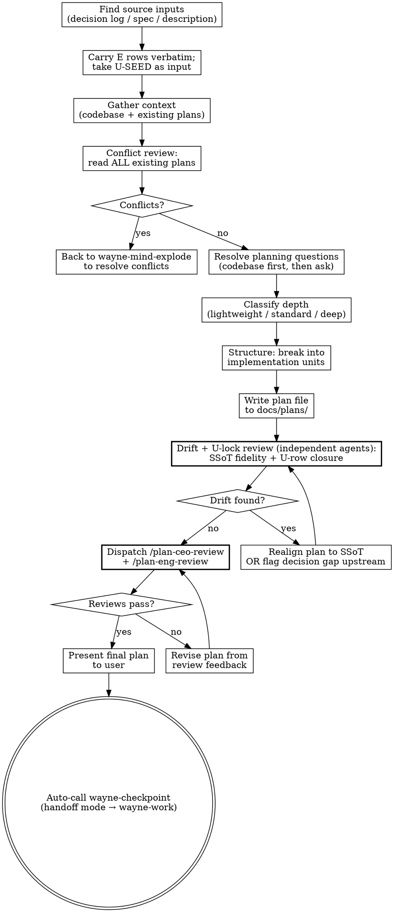

# Wayne Plan

`wayne-mind-explode` defines **WHAT** to build. `wayne-plan` defines **HOW** to build it.

This skill produces a durable implementation plan. It does **not** write code, run tests,
or execute anything. If the answer depends on changing code and seeing what happens,
that belongs in implementation, not here.

## Inherits from ~/.claude/CLAUDE.md

This skill inherits the Wayne control-plane invariants and does not redeclare them. The following are assumed and MUST NOT be repeated below:

- Language Rules (Chinese to user, English to files)
- Engineering Principles (KISS / YAGNI / DRY / SSoT / Fail-Loud / Push-Don't-Poll / Delete>Add)
- Code Standards (uv run python, markdown tables)
- Behavior Baselines (Think Before / Simplicity / Surgical / Goal-Driven)
- Skill invocation rule (proportional effort)

This skill only specifies the planning / implementation-unit decomposition workflow.

## Files Written

plans, specs, decision logs, code comments. Headers / severity tags / table headers stay English in Chinese prose.

## Checklist

You MUST create a task for each and complete in order:

1. **Find source inputs** — decision log, spec, or feature description; from the test matrix (referenced by the spec): carry the **e2e layer (E rows, `⬜`) verbatim**, and take the **U-layer SEED as input to re-author** (U rows are plan-owned — see step 6)
2. **Recall lessons from KB** — see "Lesson Recall" section below; collect
   relevant lessons to inject into the plan's risk section
3. **Gather context** — explore codebase, read existing plans/docs
4. **Conflict review** — check ALL existing plans for contradictions
5. **Resolve planning questions** — ask user only when answer is unknowable from code
6. **Structure the plan** — break into implementation units; for each unit author its **Interfaces** (Consumes/Produces), concrete **Approach**, **Files-with-symbol**, and **U rows** (re-authored from the seed against the unit's real surface, locked to this unit); tag the **E rows** (`E#`) it advances
7. **Write plan file** — save to `docs/plans/`, with relevant lessons cited in risk section; E rows carried verbatim (`⬜`), U rows authored & locked here (`☐`)
8. **Dispatch plan reviews** — the drift review (SSoT fidelity) + the U-lock closure gate (both independent agents) FIRST, then `/plan-ceo-review` + `/plan-eng-review`
9. **Final plan** — incorporate review feedback, present to user, then auto-call wayne-checkpoint in handoff mode to emit the handoff packet for wayne-work

## Lesson Recall (Step 2)

Before structuring the plan, scan the KB for past lessons with `type: lesson`
whose `trigger` field matches the planned work.

```bash
grep -rl "^type: lesson" /mnt/share/wayne-note/ --include="*.md" 2>/dev/null
```

For each candidate, read the `trigger` field. Use semantic matching (a quick
LLM judgment) — not just keyword grep — to decide relevance.

**Inject relevant lessons into the plan's risk section:**

In the plan file under a "Known Risks (from past lessons)" section, list each
relevant lesson with:
- Title and KB path
- The `trigger` (what scenario this lesson applies to)
- The anti-pattern or prevention summary
- A specific mitigation step in the plan that addresses it

If no lessons match, write `Known Risks (from past lessons): none found` so the
absence is intentional rather than forgotten.

If the user dismissed a recall in `wayne-mind-explode`, the decision log will
have `Lesson recall skipped` — respect that, but still note in the plan that
the dismissal happened, so reviewers can challenge it if needed.

## Process Flow



---

## Phase 1: Find Source Inputs

Look for upstream artifacts in this priority order:

1. **Decision log** from `wayne-mind-explode` — `docs/decisions/YYYY-MM-DD-*-decisions.md`
2. **Spec/design doc** — `docs/specs/YYYY-MM-DD-*-design.md`
3. **User's direct description** — if no upstream docs exist

If a decision log exists, it is the **primary source of truth**. Read every row.
Every plan item must trace back to a logged decision.

If a spec exists, carry forward:
- Problem frame and requirements
- Scope boundaries
- Key decisions and rationale
- Dependencies and assumptions
- **The Test Matrix** (at `docs/test-matrix/...` — the spec references it). The two layers
  are handled differently because they were authored against different structure:
  - **E layer (E rows, the E2E Verification Contract) — carry VERBATIM.** Copy unchanged,
    Status `⬜`. The plan must preserve it, not author or modify it; e2e Status stays `⬜`
    until `wayne-verify` runs it. Format SSoT: `_shared/e2e-contract.md` (do not redeclare).
  - **U layer (U rows) — the SEED is INPUT, the plan re-authors.** `wayne-test-design` could
    only seed behavior-level candidates because units didn't exist yet. wayne-plan re-expresses
    each against its unit's real files/functions, locks it to exactly one owning unit, and adds
    rows for unit behaviors the seed missed. Status `☐` until `wayne-work` ticks it.
  - If the spec references no matrix doc and the matrix has no E rows and no `E2E: none —
    <reason>` line, that is a Fail-Loud gap — flag it and recommend back to `wayne-test-design`
    rather than inventing the E contract here (U rows the plan may author; the E contract it may not).

If neither exists, run a short bootstrap:
- Establish problem frame, intended behavior, scope, success criteria
- Recommend `wayne-mind-explode` first if major product questions are unresolved

---

## Phase 2: Gather Context

### 2.1 Codebase Research

Before asking the user anything, explore:

- **Architecture:** Project structure, patterns, conventions
- **Relevant files:** What exists today that this plan will touch
- **Related code:** Similar features already implemented (follow their patterns)
- **Test patterns:** How existing tests are structured
- **Tech stack:** Frameworks, versions, tooling

### 2.2 Read ALL Existing Plans and Docs

```bash
find docs/ -name "*.md" -type f 2>/dev/null | head -50
```

Read each existing plan in `docs/plans/` and `docs/specs/`. Note:
- Active plans that touch related areas
- Architectural decisions that constrain this work
- Patterns or conventions established in prior plans

---

## Phase 3: Conflict Review + Dead Code Scan

### 3.1 Conflict Check

Check the proposed work against ALL existing plans and docs:

1. Does this plan break assumptions made in other plans?
2. Does it duplicate functionality already planned elsewhere?
3. Does it conflict with stated architectural decisions?
4. Does it change interfaces that other plans depend on?

If conflicts found: **stop and recommend `wayne-mind-explode`** to resolve them as
new decision branches. Do not proceed with a conflicting plan.

### 3.2 Dead Code Scan

Scan for code that would become dead or obsolete if this plan is implemented:

1. **Identify replaced functionality** — grep for functions, classes, routes, configs
   that the new plan supersedes
2. **Trace callers** — for each candidate, check if anything else still calls it
3. **Check external consumers** — APIs, scheduled jobs, other repos
4. **Classify:** Dead (safe to delete) / Legacy (still has callers, needs migration) / Shared (keep)
5. **Ask user (in Chinese)** for each Dead or Legacy item:
   - A) 删除 (delete)
   - B) 保留做 legacy 支持 (keep for legacy)
   - C) 标记 deprecated + 设迁移期限 (deprecate with deadline)
6. **Add cleanup tasks to the plan** — dead code deletion becomes an implementation unit
   with its own files list, or gets deferred with explicit timeline

If the spec from `wayne-mind-explode` already has dead code decisions logged,
carry those forward instead of re-asking.

---

## Phase 4: Resolve Planning Questions

For each open question, decide:
- **Resolve now** — answer is knowable from code, docs, or user choice
- **Defer to implementation** — depends on runtime behavior or code changes

Rules:
- **Explore codebase first.** If the answer is in the code, don't ask.
- **Ask in Chinese.** One question at a time, with your recommendation.
- **Log decisions.** If a decision log exists from brainstorming, append to it.

---

## Phase 5: Classify Depth

| Depth | Signal | Units |
|-------|--------|-------|
| **Lightweight** | Small, bounded, low ambiguity | 2-4 |
| **Standard** | Normal feature, some technical decisions | 3-6 |
| **Deep** | Cross-cutting, high-risk, ambiguous | 4-8+ |

High-risk signals that push toward deeper plans:
- Auth, security, payments, compliance
- Data migrations or schema changes
- External APIs or third-party integrations
- Cross-interface parity or multi-surface behavior

---

## Phase 6: Structure the Plan

### 6.1 Implementation Units

Break work into logical units. Each unit = one meaningful atomic change.

Good units are:
- Focused on one component, behavior, or integration seam
- Ordered by dependency
- Concrete enough to execute without pre-writing code
- Marked with checkbox syntax `- [ ]` for progress tracking

### 6.2 Per-Unit Requirements

For each unit, include:

| Field | Required | Description |
|-------|----------|-------------|
| **Goal** | Yes | What this unit accomplishes |
| **Requirements** | Yes | Which requirements it advances |
| **Dependencies** | Yes | What must exist first |
| **Interfaces** | Yes | `Consumes:` exact signatures/types this unit takes from earlier units; `Produces:` function names + param/return types later units rely on. This is how a unit's implementer learns its neighbours' surface without seeing their code |
| **Files** | Yes | Repo-relative paths, each as `path → which symbol / what changes` (not bare paths). Include the test file path |
| **Approach** | Yes | Concrete: control logic, branches, data flow, boundaries. Multi-paragraph when the logic warrants. NOT a single hand-wave bullet |
| **Technical design** | Yes when non-obvious | Pseudo-code or diagram when prose alone leaves the shape ambiguous (DSL→grammar, multi-component→mermaid, state→state diagram). Frame as directional guidance |
| **Patterns to follow** | Yes | Existing code or conventions to mirror |
| **Test scenarios (U rows)** | Yes for feature units | Plan-authored, locked to this unit, written against its **real** inputs/functions. Categorized: Happy / Edge / Error / Integration. Feature-bearing unit left blank = incomplete (rejected by lock gate). Pure config/scaffolding/styling → `none — <reason>` |
| **E rows** | Yes | Which carried e2e rows (e.g. `E1`) this unit advances, or `none — <reason>`. Carried verbatim, never authored here |
| **Verification** | Yes | How to know the unit is complete |
| **Decision trace** | If available | Which decision log entries drive this unit (WHAT-level; HOW detail needs no decision) |

**Two layers, two authorships.** The U rows (`Status ☐`) prove the unit's own logic in
isolation — **the plan authors them** against the unit's real surface (re-expressing the
`wayne-test-design` U-SEED and adding what the seed missed), and `wayne-work` ticks them as
tests pass. The E rows (`E#`, Status `⬜`) are **carried verbatim** and point to the real-usage
rows in `## Test Matrix` that `wayne-verify` will RUN along the user path. A green unit suite
ticks `☑` U boxes and has **zero** bearing on the `⬜` E rows — only `wayne-verify` flips those.

### 6.3 U rows — authored here, locked to units (the lock three-piece)

Because implementation units do not exist until this skill runs, the plan is the only place
U rows can be bound to real code. wayne-plan **authors** the U layer (seed-in, locked-out):

1. **Bidirectional coverage** — every U row has exactly one owning unit (no orphan rows);
   every feature-bearing unit has ≥1 U row (no untested feature unit).
2. **Expressed against the unit's surface** — each U row names the unit's real file/function
   and concrete input → action → expected, not a generic behavior-level placeholder.
3. **Seed completeness** — every `wayne-test-design` U-SEED candidate is either re-authored
   into an owning unit or explicitly dropped with a reason (so the seed isn't silently lost).

The E layer is **not** authored here — if planning reveals an e2e gap, flag it back to
`wayne-test-design`; do not add an E row in the plan. (U-level gaps, by contrast, the plan
fills directly — it is the U author.)

---

## Phase 7: Write Plan File

### 7.1 File Naming

```
docs/plans/YYYY-MM-DD-NNN-<type>-<descriptive-name>-plan.md
```

- Type: `feat`, `fix`, or `refactor`
- Sequence: check existing files for today's date, increment
- Name: 3-5 words, kebab-case

Create `docs/plans/` if it doesn't exist.

### 7.2 Plan Template

**Read first, then write:** `${HOME}/.claude/skills/wayne-plan/templates/plan-template.md`

The template is the canonical structure. Do not improvise sections. Required to fill:
- frontmatter: `title`, `type`, `status`, `date`, `origin`, `decisions`
- `## Overview` (2-3 sentences max)
- `## Problem Frame`
- `## Requirements Trace` (R1-Rn list, one line each)
- `## Scope Boundaries`
- `## Context` (subsections: Relevant Code and Patterns; Constraints from Existing Plans)
- `## Key Technical Decisions`
- `## Open Questions` (subsections: Resolved During Planning; Deferred to Implementation)
- `## File Structure` (every file the plan creates/modifies, one line each: `path — responsibility`)
- `## Implementation Units` (each with Goal, Requirements, Dependencies, Interfaces, Files-with-symbol, Approach, Technical design when non-obvious, Patterns, Test scenarios (U rows), E rows, Verification, Decision trace)
- `## Test Matrix` (E layer carried verbatim from the `wayne-test-design` doc, Status `⬜`, the E2E Verification Contract, format SSoT `_shared/e2e-contract.md`, never redeclared, or `E2E: none — <reason>`; U layer authored & locked here, Status `☐`)
- `## Dead Code / Legacy Cleanup`
- `## System-Wide Impact`
- `## Risks & Dependencies` (table)
- `## Sources & References`

Use the template verbatim — do not invent new sections. If the template feels insufficient, escalate to spec revision (separate task) before writing.

### 7.3 Planning Rules

- **All file paths repo-relative** — never absolute paths
- **No framework code** — no imports, exact runnable signatures, framework syntax. But logic,
  interfaces (names + types), and test scenarios MUST be concrete (see No-Placeholders below)
- Pseudo-code sketches OK when they communicate design direction (frame as "directional guidance")
- Mermaid diagrams encouraged for multi-component relationships
- No git commands, commit messages, or test command recipes
- Don't pretend execution-time unknowns are settled

**No-Placeholders ban (hard rule — a placeholder is a plan failure, rejected by the lock gate):**
The following must NEVER appear in a unit's Approach, Interfaces, or Test scenarios:
- `TBD`, `TODO`, "implement later", "fill in details"
- "add error handling" / "add validation" / "handle edge cases" (name the actual case)
- "write tests for the above" (without the actual scenario: input → action → expected)
- "similar to Unit N" (state it explicitly — units may be read out of order)
- referencing a type, function, or method not defined in any unit's Interfaces
A vague bullet that *technically* fills a required field still counts as a placeholder.

---

## Phase 8: Plan Review

After the plan file is written, run reviews in two stages. The **drift review runs
first** — no point asking CEO/Eng to critique a plan that doesn't faithfully
implement the decisions it claims to descend from.

### 8.0 Drift review — plan vs decision log + spec (independent agent, runs FIRST)

The CEO/Eng/design reviews judge whether the plan is *good*. None of them check the
prior question: does the plan still match the **decision log and spec it was built
from**? A plan silently diverges — a logged decision dropped, scope crept past the
spec's boundaries, a unit with no decision trace, a test-matrix row lost in the
carry. That drift is the bug class Wayne cares about most (SSoT): the upstream
artifact and the plan now disagree, and nobody noticed.

Run this as an **independent agent** (fresh eyes — not the same context that wrote
the plan, which is blind to its own omissions). Dispatch via the Agent tool with a
self-contained brief; it reads the three artifacts and reports drift only.

The agent checks, in both directions:

| Drift class | Question |
|---|---|
| **Dropped decision** | every logged decision (`docs/decisions/...`) is reflected in some unit, or explicitly noted as deferred/dropped with reason |
| **Untraced WHAT-scope** | every unit's *WHAT-level scope* traces to a decision — a unit doing undecided product/behavior work is creep. HOW detail (logic, Interfaces, U rows) needs NO decision and is **not** flagged — it is the plan's own job |
| **Scope creep** | the plan stays inside the spec's Scope Boundaries; nothing added beyond what was decided |
| **Requirement loss** | every spec requirement (R1-Rn) maps to ≥1 unit |
| **E-row drift** | the carried **E layer** matches the `wayne-test-design` doc verbatim — no E row added, dropped, or status-mutated. (The **U layer** is plan-authored; it is NOT checked for verbatim match — it is checked by the 8.0b lock gate instead) |
| **Rationale contradiction** | no unit's Approach contradicts the rationale logged for its decision |

Output: a drift report tagged per finding — **drift** (plan disagrees with SSoT,
must realign) vs **gap** (the SSoT itself is missing/wrong, flag upstream). On any
drift: realign the plan to the SSoT and re-run. On a gap: do NOT paper over it in
the plan — recommend back to `wayne-mind-explode` / `wayne-test-design` to fix the
upstream artifact, then re-carry. Loop until the agent reports clean.

→ verify: agent returns zero **drift** findings (gaps may remain, flagged upstream).

### 8.0b U-lock closure gate (independent agent, runs with 8.0)

The drift agent checks the plan against its upstream SSoT. This gate checks the one thing the
plan itself authors — the U layer — for closure. The plan owns U rows, so nothing upstream can
catch a U row that floats free of any unit or a feature unit with no test. Run as an
independent agent (fresh eyes); it reads the plan only and checks the lock three-piece:

| Lock check | Question |
|---|---|
| **Bidirectional coverage** | every U row has exactly one owning unit (no orphan); every feature-bearing unit has ≥1 U row (no untested feature unit) |
| **Expressed against surface** | every U row names its owning unit's real file/function + concrete input → action → expected — no generic behavior-level placeholder |
| **Seed completeness** | every `wayne-test-design` U-SEED candidate is re-authored into a unit OR explicitly dropped with reason |
| **No-placeholder** | no unit field contains a banned placeholder (see Phase 7.3 ban list) |
| **E-row coverage preserved** | every carried E row is pointed at by ≥1 unit's `E rows` field |

Output: per-finding **unlocked** (must fix in the plan before proceeding). Loop until clean.

→ verify: agent returns zero **unlocked** findings.

### 8.1 Quality reviews via gstack (after drift + lock are clean)

1. **Invoke `/plan-ceo-review`** — challenges premises, looks for the 10-star version, questions scope
2. **Invoke `/plan-eng-review`** — locks in architecture, data flow, edge cases, test coverage

Process:
- Invoke each skill via the Skill tool
- Collect feedback from both reviews
- Present combined feedback to user (in Chinese)
- If either review surfaces issues requiring plan changes:
  - Revise the plan
  - **Re-run the 8.0 drift review** if the revision touched units/scope/matrix — a
    quality fix can itself introduce drift
  - Re-run reviews until both pass
- Update the decision log with review outcomes

---

## Phase 9: Final Handoff

After reviews pass:

1. Present the final plan to the user (in Chinese summary, English plan file)
2. Update decision log status to `plan-complete`
3. Link the plan file in the decision log
4. **Auto-call `wayne-checkpoint` in handoff mode.** wayne-plan does not wait to be asked —
   it invokes `wayne-checkpoint` (handoff mode) to emit a handoff packet whose `next agent`
   is `wayne-work`, carrying the plan and the Test Matrix (unit `☐` + e2e `⬜`) forward.
   The handoff mechanism itself is defined in `wayne-checkpoint`; this skill only triggers it.
   **Mode A (return-only):** the packet is RETURNED to the user, it does **not** auto-advance
   to wayne-work. The user manually triggers wayne-work when ready.

The plan is now ready for implementation.

---

## Full Wayne Workflow

```
wayne-mind-explode  →  wayne-plan  →  wayne-work  →  wayne-code-review  →  wayne-ship
   (WHAT)              (HOW)         (BUILD)         (GATE)                (PR)
```

| Stage | Skill | What it does |
|-------|-------|--------------|
| Brainstorm | `wayne-mind-explode` | Grill, decide, log decisions, write spec |
| Plan | `wayne-plan` (this skill) | Structure implementation from decisions + spec |
| Execute | `wayne-work` | Build the plan task-by-task with test-as-you-go |
| Review gate | `wayne-code-review` | Dual-voice review — must pass before commit |
| Ship | `wayne-ship` | Commit per-feature with Wayne format, push, PR |

### From wayne-mind-explode

When a decision log exists, every plan item traces back to logged decisions.
The `Decision trace` field in each implementation unit references specific decision numbers.

### To wayne-work

After plan approval, invoke `wayne-work` to execute. wayne-work reads this plan,
follows the decision log, builds task-by-task with test-as-you-go, and hands off
to wayne-code-review.

### To wayne-code-review (pre-commit gate)

After implementation is complete, `wayne-code-review` runs as the **final gate before commit**.
It cross-references the diff against this plan:
- What was planned vs actually built
- Plan items missing from the diff
- Diff changes not in the plan
- Dual-voice adversarial review (Claude + Codex)

**`wayne-code-review` must pass before `wayne-ship`.**

### Standalone Use

Can be used without `wayne-mind-explode` when:
- The feature is well-understood and doesn't need grilling
- You're planning from a clear bug report or feature request
- The user provides enough context directly

---

## Key Principles

- **Decisions traceable, detail required** — WHAT-level scope traces to the decision log;
  HOW-level detail (control logic, Interfaces, Files-with-symbol, U rows) is plan-authored
  and mandatory, NOT scope creep. No framework code, but logic/interfaces/scenarios concrete
  enough to execute blind (No-Placeholders ban)
- **Research before structuring** — explore codebase and existing plans before writing
- **Right-size the artifact** — small work gets compact plans, large work gets more structure
- **WHAT traces to a decision; HOW is the plan's job** — a unit doing undecided *product* work
  is creep; a unit adding *implementation detail* is doing exactly what a plan is for
- **The plan owns U rows; test-design owns E rows** — U rows are authored & locked here against
  real units (units don't exist until now); the E contract is carried verbatim, never authored here
- **No drift from the SSoT** — the plan must match the decision log + spec + E contract it
  descends from; independent drift + U-lock agents gate this before quality review
- **Conflict-free by design** — no plan ships contradicting existing plans
- **Chinese for discussion, English for artifacts**
