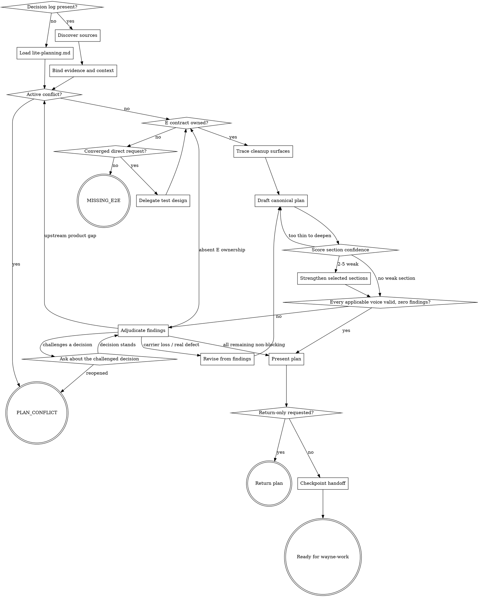

# Wayne Plan

Produce an English implementation plan that a fresh `wayne-work` agent can execute without reopening product design.

## Boundary

- Preserve the ownership chain: `wayne-test-design` owns E rows, this skill owns U rows and the plan, `wayne-work` owns `☐` transitions, `wayne-verify` owns `⬜` transitions, and `wayne-checkpoint` owns handoff packaging.
- An approved decision log is upstream read-only. Do not restore the retired `plan-complete` writeback or add a plan link there; the plan and checkpoint carry that relationship without creating a second state writer.
- Stop on unresolved product behavior or compatibility policy; do not silently choose it. Do not brainstorm, design the test matrix, implement code, run the feature, commit, or ship.
- Never invoke or depend on `gstack` or a `gstack`-named skill. Review criteria and reviewer templates stay provider-agnostic and independent of the authoring context; only the dispatch mechanism may be host-specific.
- Before the final checkpoint handoff, planning may change only the new plan file. `wayne-checkpoint` separately owns its checkpoint artifacts. If source artifacts or unrelated files need edits, stop and ask the user to fix or expand scope first.

## Flow

```dot
digraph wayne_plan {
    rankdir=TB;
    S [label="Decision log present?", shape=diamond];
    LT [label="Load lite-planning.md", shape=box];
    A [label="Discover sources", shape=box];
    B [label="Bind evidence and context", shape=box];
    C [label="Active conflict?", shape=diamond];
    X [label="PLAN_CONFLICT", shape=doublecircle];
    D [label="E contract owned?", shape=diamond];
    O [label="Converged direct request?", shape=diamond];
    T [label="Delegate test design", shape=box];
    Y [label="MISSING_E2E", shape=doublecircle];
    E [label="Trace cleanup surfaces", shape=box];
    F [label="Draft canonical plan", shape=box];
    DP [label="Score section confidence", shape=diamond];
    DS [label="Strengthen selected sections", shape=box];
    G [label="Every applicable voice valid, zero findings?", shape=diamond];
    ADJ [label="Adjudicate findings", shape=box];
    N [label="Ask about the challenged decision", shape=diamond];
    H [label="Revise from findings", shape=box];
    J [label="Present plan", shape=box];
    K [label="Return-only requested?", shape=diamond];
    R [label="Return plan", shape=doublecircle];
    L [label="Checkpoint handoff", shape=box];
    W [label="Ready for wayne-work", shape=doublecircle];

    S -> A [label="yes"];
    S -> LT [label="no"];
    LT -> C;
    A -> B;
    B -> C;
    C -> X [label="yes"];
    C -> D [label="no"];
    D -> O [label="no"];
    O -> T [label="yes"];
    O -> Y [label="no"];
    T -> D;
    D -> E [label="yes"];
    E -> F;
    F -> DP;
    DP -> G [label="no weak section"];
    DP -> DS [label="2-5 weak"];
    DP -> F [label="too thin to deepen"];
    DS -> G;
    G -> J [label="yes"];
    G -> ADJ [label="no"];
    ADJ -> H [label="carrier loss / real defect"];
    ADJ -> N [label="challenges a decision"];
    ADJ -> C [label="upstream product gap"];
    ADJ -> D [label="absent E ownership"];
    ADJ -> J [label="all remaining non-blocking"];
    N -> ADJ [label="decision stands"];
    N -> X [label="reopened"];
    H -> F;
    J -> K;
    K -> R [label="yes"];
    K -> L [label="no"];
    L -> W;
}
```

## Process

### S. Pick the path

- Read `../_shared/pipeline-id-contract.md` completely, then answer one structural question before reading anything expensive: **does this run carry a decision log?**
- **Yes** — a design run just handed off. Continue at A: there are `R<number>`s, decisions, and U-SEED rows that must be traced forward, and the standard path exists to carry them.
- **No** — a converged direct request. Load [lite planning](references/lite-planning.md) and follow it; it replaces A, B, E, and F, and rejoins at C. Do not read the standard template or build a working coverage map — there are no upstream obligations to map.
- This is a fact about the run's inputs, not a size judgment, so it cannot be argued either way. A living spec with no decision log is still the lite path: read the spec as context, cite it, amend nothing.
- Either way, if the WHAT is unsettled, neither path applies — stop and route to `wayne-mind-explode`.

### A. Discover sources

- Select inputs in priority order: decision log, spec, then an already-converged direct request. When present, the decision log is the WHAT-level source of truth; HOW detail belongs to the plan.
- A small, unambiguous direct request is a complete standalone Plan input; it does not require Mind Explode, a decision log, or a spec. Route upstream only when a missing WHAT choice would change scope, behavior, risk, or compatibility.
- Read `../_shared/pipeline-id-contract.md` completely. Preserve upstream bytes: map legacy numeric decision rows to `D<number>` only in the working coverage map. Use source meaning and artifact ownership—not headings, prefixes, keywords, or regex—to distinguish requirements, decisions, and review findings.
- Follow references to the original test matrix. Read its complete E contract and provisional U-SEED information regardless of headings or table layout, plus relevant repository files and tests, all active plans that touch the work, and applicable project or Wayne lessons.
- Read each candidate lesson's trigger and decide applicability semantically. For every match, carry its title/path, trigger, prevention, and a concrete mitigation into `Applicable Lessons`; do not turn a non-match into a constraint. Record an explicit reason when none apply or an upstream decision dismissed the recall.
- Read [the plan contract](references/plan-contract.md) completely before authoring. It defines semantic ownership and review expectations, not a Markdown grammar.

### B. Bind evidence and context

- Record the starting `git rev-parse HEAD` and `git status --short`. Use them at review time to prove that only the new plan file changed; do not inventory, recursively read, or hash the repository tree.
- Build a temporary working coverage map from the actual decision log, spec, and matrix. Its shape is free: it exists to help the agent trace requirements, decisions, U-SEED rows, E ownership, exact literals, and forbidden alternatives. Read every source completely and classify obligations in context; never use a parser, headings, IDs, keywords, or regex to claim semantic completeness.
- Trace each requirement and decision forward to planned units. Inspect architecture, real files and symbols, similar implementation and test patterns, and active-plan assumptions. Compare clauses governing the same behavior and stop upstream when they conflict. Do not ask for information discoverable from these sources.

### C. Gate active conflicts

- Compare the requested change with every relevant active plan and recorded decision. A contradiction, duplicate ownership, or unresolved product choice is an active conflict; implementation uncertainty is not.
- On conflict, create no plan. Return the `PLAN_CONFLICT` blocker described by the contract with the conflicting artifacts, owner, and concise Chinese explanation.

### D. Gate E ownership

- Require the source matrix to contain either an owned E table or the approved literal `E2E: none — <reason>`. Do not invent, drop, normalize, reorder, or status-change E content.
- For a converged standalone direct request with no matrix, invoke `wayne-test-design` as a nested owner and resume here with its returned artifact; do not invoke Mind Explode or author the matrix yourself. For other inputs, or if test design cannot establish E ownership, create no plan. Return the `MISSING_E2E` blocker with the affected artifacts, owner, and explanation.

### E. Trace cleanup surfaces

- Identify replaced functions, routes, jobs, configuration, and public interfaces; trace their callers and external consumers. Classify each surface as dead, legacy, or shared.
- Carry approved cleanup into units. If compatibility behavior has no upstream decision, return to C instead of selecting delete, preserve, or deprecate policy.

### F. Draft the canonical plan

- Use [the plan template](templates/plan-template.md) as a readable starting point, not a grammar. Choose the next unused filename for the current date; keep paths repository-relative and the prose English. Adapt headings or grouping when that makes the plan clearer without losing required information.
- Right-size detail to the actual dependency graph and risk. A small standalone change may use one or a few compact units; cross-cutting or high-risk work needs enough detail to close its real interfaces and failure paths. Never add units, prose, or review work to satisfy a size/depth quota.
- Order units by dependency. Give every unit closed inputs/outputs, files and symbols, concrete control logic, test ownership, E coverage, verification, and source traces so another agent can implement it from the plan plus repository.
- When a unit adds or changes a gate, validator, or classifier, close the producer-to-judge boundary inside that unit: the author's instructions generated from the judge's own constant, the rule's literal example round-tripped through the judge, and a pinned snapshot of what the judge receives. See `../_shared/cybernetics-lens.md` §4a.
- Preserve the complete E contract without changing its meaning, rows, IDs, or status. Re-author every source seed against a real `path::symbol` without changing its semantic obligations, map or drop each seed once with evidence, add any new U coverage explicitly, and bind every U scenario to one unit. Keep both statuses under their downstream owners.

### DP/DS. Score and strengthen before review

- Standard path only; a lite plan skips this and goes straight to G. Read [deepening](references/deepening.md), which owns the scoring, the section checklists, and the post-strengthening check.
- Review asks what is wrong and only fires on a finding. This asks what is **thin** — a decision with no rationale, an Approach that restates its Goal, a test scenario that names no input. None of those breaks a rule, so no voice reports them.
- Score every section, then take one of three exits: no weak section goes straight to G; two to five go to DS; **more than five, or one critical section failing most of its checklist, returns to F.** A plan too thin to deepen is too thin to review — do not spend three review dispatches confirming what the author already knows.
- Strengthening dispatches read-only subagents per selected section, and may cut as well as add. Its output is **not** a finding: it never enters ADJ or `## Review Adjudication`, because nothing here came from a reviewer.
- It runs on this edge and nowhere else. After G, any edit invalidates all three passes.

### G. Run independent reviews

- Dispatch three reviews in fresh, isolated contexts. Voice A carries the [source-fidelity protocol](references/source-fidelity-review.md); voice B carries the [execution-readiness protocol](references/execution-readiness-review.md); voice C carries the [design-conformance protocol](references/design-conformance-review.md). Those three files own the review criteria and stay provider-agnostic.
- A and B must land on different model families — they argue about the same plan, so a shared family collapses them into one opinion. C asks a question neither of them asks, against a source neither of them compares to, so its independence comes from a fresh isolated context rather than a different family; it may share a family with A or B.
- The dispatch mechanism is one native read-only subagent per voice, each carrying exactly one protocol path and nothing else, over the same frozen artifact set: every decision log, spec, matrix, the working coverage map, and the plan. No reviewer may edit the repository. A strict reviewer verdict is input to ADJ, not the gate: a findings list that is not empty routes to adjudication, never straight to a revision.
- Source-fidelity reverse-checks every source obligation and U seed, E ownership, scope, decisions, rationale, and intended behavior in both directions.
- Execution-readiness independently checks dependency closure, interfaces, real files/symbols, unit ownership, U coverage, E advancement, cleanup, placeholders, and whether a fresh `wayne-work` agent could execute each unit without product redesign or inventing behavior.
- Design-conformance independently checks that the plan builds the approved architecture: component realization, state ownership, interface signatures, flow order, carried technology constraints, and whether every deviation is declared. A plan can satisfy every obligation and still build a different system, and neither other voice sees that — one reads clauses, the other judges the plan as written. It applies only when the origin has a living spec to compare against; a converged direct request with no spec records `Design conformance: none — <reason>` in the plan and dispatches two voices.
- Every review compares the starting HEAD/status, the agent's write history, and the current diff before checkpoint handoff. Any mutation beyond the new plan file fails the scope review. Git evidence is sufficient; do not scan unrelated files.
- No reviewer may substitute headings, section order, table shape, keywords, substring checks, regex, a script, or template agreement for contextual reading. Provider/tool termination before a report is invalid and must be rerun.
- Every **applicable** voice must actually execute, and A and B must not collapse onto one model family. A missing mechanism, a failed or empty voice, or that collapse returns `REVIEW_UNAVAILABLE`; never claim a review that did not run, simulate a voice locally, or drop an applicable voice. A declared not-applicable voice is not a downgrade: it is written into the plan with its reason, where a reader can challenge it. Silently omitting one is.
- A requested model is not a routed model. After the run, read the actual model of each reviewer execution from the host's run metadata. If a voice fell back to the session default, or A and B resolved to one family, the run is void: return `REVIEW_UNAVAILABLE` rather than reporting its gate.

### ADJ. Adjudicate findings

- Read [the adjudication contract](../_shared/finding-adjudication.md) completely; it owns the dispositions, the challenge route, and the gate. A reviewer judges the plan's bytes and has no standing over the decisions behind them, so classifying findings against the decision log is this node's job and no reviewer's. Any non-empty findings set arrives here whatever verdict the voices returned; only two valid executions reporting zero findings skip this node.
- Classify every finding before any plan byte changes. `CARRIER_LOSS` and `REAL_DEFECT` go to H; an undecided product question goes to C; absent E ownership goes to D; a finding contradicting a decision still in force goes to N.
- Record each finding's disposition, its owning `D<number>`, the evidence, the action, and the user outcome in the plan's review record. Create no separate artifact.
- Proceed to J once every finding is resolved by a revision or non-blocking. A finding the user already rejected never re-blocks, however many rounds raise it.

### N. Ask about the challenged decision

- Ask the user one question carrying the `D<number>` and what it decided, the finding verbatim, and what evidence or risk the reviewer has that was not on the table when the decision was made. Never edit the plan to make the finding go away.
- If the decision stands, record the rejection and return to ADJ with that finding permanently non-blocking.
- If the user reopens it, stop. Reversal is a new decision record naming the old one in `supersedes`, and this skill may not write the decision log: return `PLAN_CONFLICT` naming the decision and route the reversal upstream.

### H. Revise from findings

- Only findings ADJ classified `CARRIER_LOSS` or `REAL_DEFECT` reach this node.
- Fix the smallest owning surface: upstream gap, plan content, template guidance, or coverage-map transcription. Never change an upstream source inside this procedure.
- Preserve the intended owner/member and semantic obligation; do not weaken a requirement or rename a surface merely to make text look consistent.
- Repeat every review after every plan revision. If a finding exposes an unresolved product decision or absent E ownership, follow C or D instead of inventing a default. Ask the user when repository evidence cannot close a required choice.

### J. Present the plan

- Present only after all three reviews pass adjudication. Then set plan status from `active` to `approved` and confirm the final scope diff before handoff. Unless the caller supplied an exact response contract, summarize the approved plan and evidence concisely in Chinese while the plan file remains English. Report its path; discard temporary working notes after the review record no longer needs them.

### L. Checkpoint handoff

- Unless the caller explicitly requested return-only or no-checkpoint evaluation, invoke `wayne-checkpoint` in handoff mode with the plan and Test Matrix; set the next agent to `wayne-work`.
- Carry the exact authoritative run-scoped test-matrix path. The E block inside the plan is a read-only `⬜` snapshot; no downstream stage may use it as E Status SoT.
- Plan approval and `Ready for wayne-work` are handoff states, not implementation authorization. Return the plan or checkpoint and stop; never invoke `wayne-work`.
- Return-only ends after presentation and must not auto-advance implementation.
