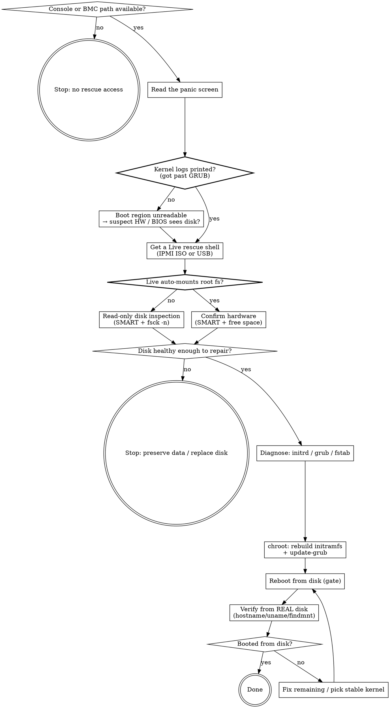

# Wayne Rescue Boot

> 先证盘，再修软。panic 屏幕分不出"盘死了"和"驱动没了"——别猜，去证。

Take a box that won't boot with only remote BMC access, get a rescue shell, prove
disk-health vs software-fault on evidence, chroot-fix the real cause, verify from
the real disk.

## Boundary vs neighbors

| Skill | Input | Output |
|---|---|---|
| **wayne-rescue-boot** | a box that won't boot + BMC/console access | booted-from-disk system + root cause + fix applied |
| wayne-triage | anything broken (log dump, failing test, ticket) | root-cause classification + a route — does NOT touch hardware/BMC or fix |
| trace-db-probe | a ticket id | read-only DB status — never mutates, never SSHes into a box |

Triage classifies a failure from evidence handed to you and routes it. This skill
goes to the actual machine, drives its BMC, opens a rescue shell, and **writes the
fix**. If you don't have the box (only a log paste) → that's triage.

If the box boots but a service is broken, route to triage/verify. If no BMC,
physical console, or on-site operator can provide a rescue shell, stop blocked;
do not pretend a log-only diagnosis can execute this workflow.

## Flow



## Process Flow

### Phase 1 — Read the panic, resist "the disk is dead"

The panic screen looks the same for a dying disk and a missing driver. Decide
which on evidence, not vibes (Occam: check the boot chain before exotic HW death).

- If the kernel printed a screenful of logs, **GRUB + kernel + initramfs already
  loaded off the disk** → the disk's boot region reads fine → disk-dead is now
  unlikely. → verify: you can point to kernel log lines on screen.
- `VFS: Cannot open root device ... available partitions: (empty)` = the kernel
  enumerated **zero block devices** → storage driver missing from initramfs, NOT
  a dead platter. → verify: the "available partitions" list is empty, not "sdb1".
- Inconsistent behavior across kernels (one panics, one drops to initramfs) is a
  *per-kernel initramfs* difference, not a flaky disk. → verify: note which
  kernels differ.
- Only if logs never appear (stuck at GRUB / "no bootable device") → check BIOS
  sees the disk before assuming software. → verify: BIOS/RAID lists the disk.

### Phase 2 — Get a Live rescue shell

- **Physical USB is fastest if anyone can reach the box** — Rufus/Etcher an
  Ubuntu ISO, boot it. Skips every BMC obstacle below. → verify: Live desktop up.
- **IPMI virtual media (remote)** — mount an ISO over the BMC. Supermicro gotchas,
  in order (each cost real time — see Anti-patterns):
  - `SFT-DCMS-SINGLE license` popup → virtual media is license-gated; no license =
    use physical USB or get the key from IT.
  - The "Virtual CD-ROM" form is **SMB, not NFS**, regardless of the field labels
    (tcpdump shows it hitting port 445). Serve the ISO over Samba.
  - Modern Samba disables SMB1; old BMC only speaks SMB1(NT1) → connection is
    reset instantly. Add `server min protocol = NT1` + `ntlm auth = yes`, restart
    smbd. → verify: `smbclient //host/share -N -m NT1 -c ls` lists the ISO.
  - Password field rejects `@`/special chars → use a guest/anonymous share
    (`map to guest = bad user`, `guest ok = yes`), leave user/pass blank.
- SOL (`ipmitool ... sol activate`) is often blank because the OS console isn't
  redirected to serial — use the graphical KVM to watch, not SOL. → verify: you
  can see boot output somewhere.

### Phase 3 — Prove disk health FIRST (this flips the diagnosis)

- If the Live env **auto-mounts the root partition**, the filesystem is healthy —
  that alone rules out a dead disk. → verify: `lsblk` shows the root part mounted
  under `/media/...`.
- Confirm hardware: `smartctl -H /dev/sdX` (add `-d ...` for RAID/HBA if blank);
  key attrs `Reallocated_Sector`, `Current_Pending`, `Offline_Uncorrect`. Non-zero
  → real bad sectors, plan a swap. → verify: overall-health PASSED + those at 0.
- Only if mount fails: `fsck -n /dev/sdX` read-only first, never blind `-y`.
  → verify: fsck reports clean or names the exact damage.
- Check free space — a full disk is why initramfs generation silently failed last
  time. → verify: `df -h` on the root fs.

### Phase 4 — Diagnose the software boot fault

- Missing/dangling initrd is the #1 cause: `test -e $ROOT/boot/initrd.img` +
  `ls -la $ROOT/boot/initrd.img-<ver>`. A dangling symlink = kernel boots with no
  initramfs = no storage driver = the Phase-1 panic. → verify: you know if the
  initrd file for the default kernel actually exists.
- Inspect GRUB: `grep -E 'linux|initrd|root=' $ROOT/boot/grub/grub.cfg`. Watch for
  `root=/dev/sdX` (device-name drift) vs `root=UUID=` (stable), and a menuentry
  with no `initrd` line. → verify: you can state the default entry's root= and
  initrd.
- Cross-check `fstab` uses UUIDs and network mounts carry `nofail` (a hanging NFS
  mount can stall boot). → verify: you read `$ROOT/etc/fstab`.

### Phase 5 — chroot and fix

Mount, bind, chroot, rebuild. Each verify before moving on.

```sh
R=/media/ubuntu/<root-uuid>
mount /dev/sdX1 $R/boot/efi           # EFI, if separate
for m in dev dev/pts proc sys run; do mount --bind /$m $R/$m; done
chroot $R /bin/bash -c 'update-initramfs -c -k <ver>'   # rebuild the missing one
chroot $R /bin/bash -c 'update-grub'                    # fixes initrd line + root=UUID
```

- → verify (initramfs): `initrd.img-<ver>` now exists, ~50–120MB, and
  `lsinitramfs` lists `ahci`/`nvme`/`libata` modules.
- → verify (grub): `update-grub` prints `Found initrd image: ...<ver>`; grub.cfg
  no longer has `root=/dev/sdX`.
- Unmount nested-first (`dev/pts` before `dev`; lazy `-l` if `/sys` is busy from
  efivarfs). → verify: `mount | grep $R` shows only the root mount left.

### Phase 6 — Verify from the REAL disk (never "looks booted")

- **Human gate:** set next-boot to disk (`ipmitool ... chassis bootdev disk`) or
  fix BIOS order, then reboot. State the action before doing it.
- Confirm you're on the DISK, not still in Live: `hostname` = the real host (not
  `ubuntu`), `uname -r` = the fixed kernel, `findmnt -no SOURCE /` = the real
  partition, `test -e /rofs` = absent. → verify: all four match the real system.
- A `Connection refused` on SSH to the old rescue creds is *expected* — it proves
  you left the Live env. Don't read it as failure. → verify: creds differ.

## Anti-patterns

- Jumping to "the disk is dying" while the kernel is printing logs — the boot
  region demonstrably reads. Occam: a missing driver explains it with fewer
  assumptions than a platter that dies but still serves GRUB.
- Blind `fsck -y` on the first pass — inspect read-only (`-n`) before you let it
  rewrite metadata; a wrong `-y` can turn a recoverable fs into a lost one.
- Trusting SOL's blank screen as "hung" — the OS console usually isn't on serial;
  watch the graphical KVM.
- Burning an hour on IPMI virtual-media symptoms (`@` rejected, NFS "connect
  failure") without checking the two roots first: SFT license gate, and SMB1
  disabled. tcpdump the BMC once — it tells you the port/protocol in seconds.
- Declaring victory on "Ubuntu came up" — you may have hand-picked a *different*
  kernel in GRUB; the broken one is still the default. Verify hostname/uname from
  the real disk and confirm the fixed kernel actually boots.
- Rebuilding initramfs without checking free space — a full `/` is why generation
  failed in the first place; it'll fail again silently.

> Hand-authored by wayne-skill-forge from a live 2026-07-13 Supermicro rescue
> (kernel panic → dangling 6.11 initrd → chroot rebuild → booted).
