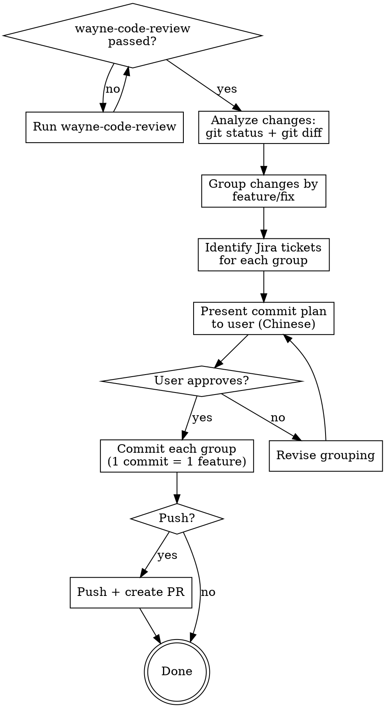

# Wayne Ship

Commit and ship changes with strict commit conventions.
Every commit is atomic (1 feature / 1 fix / 1 request), signed-off, and Jira-tagged.

<HARD-GATE>
`wayne-code-review` MUST pass before any commit. If review hasn't run this session,
invoke it first. No exceptions.
</HARD-GATE>

## Language Rules

**Chinese (output to user):** ALL communication shown to the user — questions, explanations,
commit plan presentation, status reports, warnings. This includes AskUserQuestion text
and any prose the user reads.

**English (written to files):** ALL files saved to disk — commit messages, PR descriptions,
code comments. No exceptions.

**English (structural labels):** Commit prefixes (`SWDEV-1234`, `feat:`, `fix:`), `[why]`/`[how]`
section headers stay English even in Chinese prose.

## Checklist

1. **Pre-flight check** — verify wayne-code-review has passed
2. **Analyze changes** — group by feature/fix, identify Jira tickets
3. **Present commit plan** — show user what will be committed and how
4. **Commit per feature** — one atomic commit per logical change
5. **Push + PR** — if user wants, push and create PR

## Process Flow



---

## Phase 1: Pre-Flight Check

Before any commit work, verify `wayne-code-review` has passed:

1. Check if review was run in this session
2. If not, invoke `wayne-code-review` skill first
3. Only proceed after review passes

---

## Phase 2: Analyze Changes

```bash
git status
git diff --stat
git diff --cached --stat
git log --oneline -5
```

Understand:
- What files changed and why
- Whether changes are staged or unstaged
- Recent commit history for context

---

## Phase 3: Group by Feature

Split changes into atomic groups. Each group = 1 commit.

Rules:
- **1 commit = 1 feature / 1 fix / 1 request.** No bundles.
- Related files go together (e.g., model + migration + test = 1 commit)
- Unrelated changes get separate commits
- If a single change touches many files but serves one purpose, that's still 1 commit

---

## Phase 4: Identify Jira Tickets

For each commit group, find the Jira ticket:

1. Check `TASKS.md` for active tickets related to this work
2. Check the decision log or plan if they reference a ticket
3. Check branch name for ticket prefix (e.g., `SWDEV-1234-feature-name`)
4. If no ticket applies, use `feat:` or `fix:` prefix

---

## Phase 5: Present Commit Plan

Show the user the proposed commits in Chinese:

```
我准备这样提交：

Commit 1: SWDEV-1234 - add user auth middleware
  文件: src/middleware/auth.py, tests/test_auth.py
  [why]: 需要 API 认证
  [how]: JWT middleware + 测试

Commit 2: fix:/dashboard - fix chart rendering on empty data
  文件: dashboard/dashboard.html
  [why]: 空数据时图表崩溃
  [how]: 加了空状态检查

确认吗？还是要调整分组？
```

Wait for user approval. If they want changes, revise grouping.

---

## Phase 6: Commit Per Feature

For each approved group, commit with this exact format:

```bash
git add <specific files for this group>
git commit -s -m "$(cat <<'EOF'
SWDEV-1234 - short descriptive title

[why]
- reason for this change

[how]
- what was done technically

EOF
)"
```

### Commit Message Rules

| Field | Rule |
|-------|------|
| **Line 1** | `<JIRA-TICKET> - short title` (or `feat:/topic` / `fix:/topic` if no ticket) |
| **[why]** | Business/user reason, not technical detail |
| **[how]** | Technical approach, brief |
| **Flag** | Always `git commit -s` (signed-off-by) |
| **Scope** | 1 commit = 1 logical change |

### Examples

```
SWDEV-5678 - add email notification on task completion

[why]
- users miss task status changes when not watching dashboard

[how]
- added SendGrid integration in notification_service.py
- trigger on task transition to "Implemented" or "Closed"
```

```
fix:/sync - handle API timeout in Jira sync

[why]
- sync_jira.py hangs when OnTrack is slow

[how]
- added 30s timeout + retry with backoff
```

---

## Phase 7: Push + PR (Optional)

Only if user explicitly asks to push or create PR.

```bash
git push origin <branch>
```

For PR creation:
```bash
gh pr create --title "<same as commit title>" --body "$(cat <<'EOF'
## Summary
- <bullet points from commit [why] and [how]>

## Review
- wayne-code-review: PASSED
- Sources: Claude structured + Claude adversarial + Codex

## Test Plan
- [ ] <verification items from the plan>
EOF
)"
```

---

## Integration with Wayne Workflow

```
wayne-mind-explode  →  wayne-plan  →  ce-work  →  wayne-code-review  →  wayne-ship
     (WHAT)              (HOW)       (BUILD)        (GATE)              (COMMIT)
```

This is the final step. It only runs after:
1. Implementation is complete (`ce-work`)
2. Dual-voice review has passed (`wayne-code-review`)

---

## Key Principles

- **1 commit = 1 feature** — never bundle unrelated changes
- **Always signed-off** — `git commit -s`, no exceptions
- **Jira ticket first** — every commit traces to a ticket when possible
- **Review before commit** — `wayne-code-review` is a hard gate
- **User approves the plan** — never commit without showing the grouping first
- **Chinese for discussion, English for commits**
