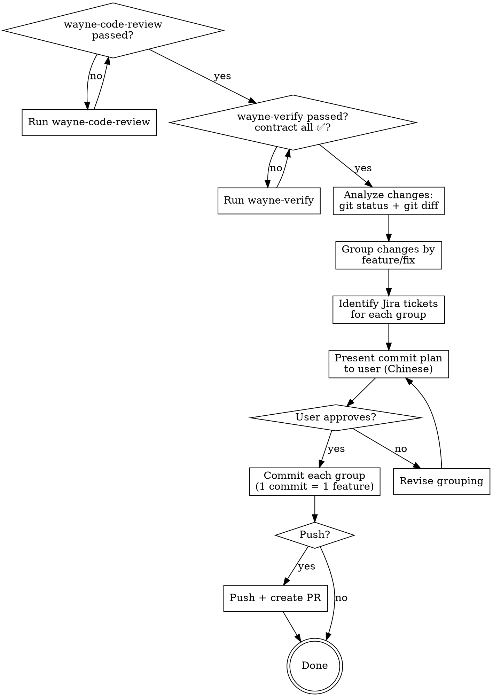

# Wayne Ship

Commit and ship changes with strict commit conventions.
Every commit is atomic (1 feature / 1 fix / 1 request), signed-off, and Jira-tagged.

<HARD-GATE>
BOTH gates MUST pass before any commit. No exceptions.

1. `wayne-code-review` (static) MUST pass. If review hasn't run this session, invoke
   it first.
2. `wayne-verify` (runtime) MUST pass: the E2E Verification Contract table must be
   all ✅ — no remaining ⬜ (unverified), no ❌ (broken) — OR the work legitimately
   declared `E2E: none — <reason>` (no user-observable path to verify). If
   wayne-verify hasn't run this session, invoke it first.
</HARD-GATE>

## Inherits from ~/.claude/CLAUDE.md

This skill inherits the Wayne control-plane invariants and does not redeclare them. The following are assumed and MUST NOT be repeated below:

- Language Rules (Chinese to user, English to files)
- Engineering Principles (KISS / YAGNI / DRY / SSoT / Fail-Loud / Push-Don't-Poll / Delete>Add)
- Code Standards (uv run python, markdown tables)
- Behavior Baselines (Think Before / Simplicity / Surgical / Goal-Driven)
- Skill invocation rule (proportional effort)
- Commit format (CLAUDE.md `## Commit Format` section)

This skill only specifies the per-feature commit + push + PR workflow.

## Files Written

commit messages, PR descriptions, code comments. Commit prefixes (`SWDEV-1234`, `feat:`, `fix:`), `[why]`/`[how]` headers stay English in Chinese prose.

## Checklist

1. **Pre-flight check** — verify wayne-code-review has passed AND wayne-verify has passed (E2E contract all ✅, or `E2E: none` declared)
2. **Analyze changes** — group by feature/fix, identify Jira tickets
3. **Present commit plan** — show user what will be committed and how
4. **Commit per feature** — one atomic commit per logical change
5. **Push + PR** — if user wants, push and create PR

## Process Flow



---

## Phase 1: Pre-Flight Check

Before any commit work, verify `wayne-code-review` has passed:

1. Check if review was run in this session
2. If not, invoke `wayne-code-review` skill first
3. Only proceed after review passes

---

## Phase 2: Analyze Changes

```bash
git status
git diff --stat
git diff --cached --stat
git log --oneline -5
```

Understand:
- What files changed and why
- Whether changes are staged or unstaged
- Recent commit history for context

---

## Phase 3: Group by Feature

Split changes into atomic groups. Each group = 1 commit.

Rules:
- **1 commit = 1 feature / 1 fix / 1 request.** No bundles.
- Related files go together (e.g., model + migration + test = 1 commit)
- Unrelated changes get separate commits
- If a single change touches many files but serves one purpose, that's still 1 commit

---

## Phase 4: Identify Jira Tickets

For each commit group, find the Jira ticket:

1. Check `TASKS.md` for active tickets related to this work
2. Check the decision log or plan if they reference a ticket
3. Check branch name for ticket prefix (e.g., `SWDEV-1234-feature-name`)
4. If no ticket applies, use `feat:` or `fix:` prefix

---

## Phase 5: Present Commit Plan

Show the user the proposed commits in Chinese:

```
我准备这样提交：

Commit 1: SWDEV-1234 - add user auth middleware
  文件: src/middleware/auth.py, tests/test_auth.py
  [why]: 需要 API 认证
  [how]: JWT middleware + 测试

Commit 2: fix:/dashboard - fix chart rendering on empty data
  文件: dashboard/dashboard.html
  [why]: 空数据时图表崩溃
  [how]: 加了空状态检查

确认吗？还是要调整分组？
```

Wait for user approval. If they want changes, revise grouping.

---

## Phase 6: Commit Per Feature

For each approved group, commit with this exact format:

```bash
git add <specific files for this group>
git commit -s -m "$(cat <<'EOF'
SWDEV-1234 - short descriptive title

[why]
- reason for this change

[how]
- what was done technically

EOF
)"
```

### Commit Message Rules

| Field | Rule |
|-------|------|
| **Line 1** | `<JIRA-TICKET> - short title` (or `feat:/topic` / `fix:/topic` if no ticket) |
| **[why]** | Business/user reason, not technical detail |
| **[how]** | Technical approach, brief |
| **Flag** | Always `git commit -s` (signed-off-by) |
| **Scope** | 1 commit = 1 logical change |

### Examples

```
SWDEV-5678 - add email notification on task completion

[why]
- users miss task status changes when not watching dashboard

[how]
- added SendGrid integration in notification_service.py
- trigger on task transition to "Implemented" or "Closed"
```

```
fix:/sync - handle API timeout in Jira sync

[why]
- sync_jira.py hangs when OnTrack is slow

[how]
- added 30s timeout + retry with backoff
```

---

## Phase 7: Push + PR (Optional)

Only if user explicitly asks to push or create PR.

```bash
git push origin <branch>
```

For PR creation:
```bash
gh pr create --title "<same as commit title>" --body "$(cat <<'EOF'
## Summary
- <bullet points from commit [why] and [how]>

## Review
- wayne-code-review: PASSED
- Sources: Claude structured + Claude adversarial + Codex

## Test Plan
- [ ] <verification items from the plan>
EOF
)"
```

---

## Phase 8: Handoff

As the final step, after the commit (and push/PR, if requested) succeeds, call
**`wayne-checkpoint` in handoff mode** to emit a handoff packet pointing to
`wayne-compound` as the next agent (the pipeline's lessons-capture stage). The
handoff-packet mechanism is defined in `wayne-checkpoint` — this skill only invokes
it; it does not implement or advance it.

**Mode A — return-only.** The packet is returned/surfaced only; it does NOT
auto-invoke `wayne-compound`. The user manually triggers the next step (say "下一步"
/ "继续" / "go").

---

## Integration with Wayne Workflow

```
wayne-mind-explode → wayne-plan → wayne-work → wayne-code-review → wayne-verify → wayne-ship → wayne-compound
     (WHAT)            (HOW)        (BUILD)      (STATIC GATE)      (RUNTIME GATE)  (COMMIT)     (LESSONS)
```

This is the commit step. It only runs after:
1. Implementation is complete (`wayne-work`)
2. Dual-voice review has passed (`wayne-code-review`)
3. Runtime verification has passed (`wayne-verify` — E2E contract all ✅, or `E2E: none` declared)

Its own final step hands off to `wayne-compound` (see Phase 8).

---

## Key Principles

- **1 commit = 1 feature** — never bundle unrelated changes
- **Always signed-off** — `git commit -s`, no exceptions
- **Jira ticket first** — every commit traces to a ticket when possible
- **Both gates before commit** — `wayne-code-review` (static) AND `wayne-verify` (runtime, contract all ✅) are hard gates
- **User approves the plan** — never commit without showing the grouping first
- **Chinese for discussion, English for commits**
