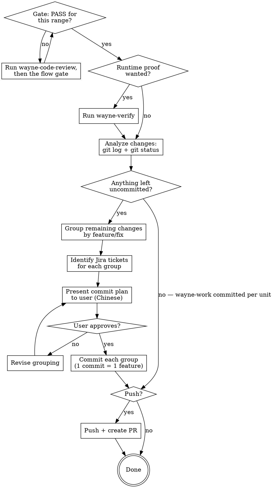

# Wayne Ship

Commit and ship changes with strict commit conventions. Every commit is atomic (1 feature / 1 fix / 1 request), signed-off, and Jira-tagged.

<HARD-GATE>
The review gate MUST pass before anything is pushed. No exceptions.

1. `wayne-code-review-flow` MUST return `GATE: PASS` for the exact range being pushed — the same `BASE_SHA..HEAD_SHA` that `wayne-code-review` fixed. If it is absent, or stale against that range, invoke it first.
2. `wayne-verify` is deliberate, not a gate. Run it when the change has a runtime path worth proving. When it was not run, say so in the ship report rather than implying a runtime pass, and never fabricate an `E2E: none` on Verify's behalf.
</HARD-GATE>

This skill only specifies the per-feature commit + push + PR workflow.

## Files Written

commit messages, PR descriptions, code comments. Commit prefixes (`SWDEV-1234`, `feat:`, `fix:`), `[why]`/`[how]` headers stay English in Chinese prose.

## Checklist

1. **Pre-flight check** — `wayne-code-review-flow` returned `GATE: PASS` for the range being pushed. Runtime proof through `wayne-verify` is deliberate, not automatic: run it when the change has a runtime path worth proving, and record why when it is not run
2. **Analyze changes** — separate what `wayne-work` already committed per unit from anything still uncommitted
3. **Present commit plan** — show the user what remains to commit and how it groups
4. **Commit what is left** — one atomic commit per logical change; never re-commit or rewrite the unit commits
5. **Push + PR** — for a multi-unit feature this is the real output: push the branch and open the PR

## Process Flow


```dot
digraph ship {
    rankdir=TB;

    "Gate: PASS for\nthis range?" [shape=diamond];
    "Run wayne-code-review,\nthen the flow gate" [shape=box];
    "Runtime proof\nwanted?" [shape=diamond];
    "Run wayne-verify" [shape=box];
    "Analyze changes:\ngit log + git status" [shape=box];
    "Anything left\nuncommitted?" [shape=diamond];
    "Group remaining changes\nby feature/fix" [shape=box];
    "Identify Jira tickets\nfor each group" [shape=box];
    "Present commit plan\nto user (Chinese)" [shape=box];
    "User approves?" [shape=diamond];
    "Revise grouping" [shape=box];
    "Commit each group\n(1 commit = 1 feature)" [shape=box];
    "Push?" [shape=diamond];
    "Push + create PR" [shape=box];
    "Done" [shape=doublecircle];

    "Gate: PASS for\nthis range?" -> "Run wayne-code-review,\nthen the flow gate" [label="no"];
    "Gate: PASS for\nthis range?" -> "Runtime proof\nwanted?" [label="yes"];
    "Run wayne-code-review,\nthen the flow gate" -> "Gate: PASS for\nthis range?";
    "Runtime proof\nwanted?" -> "Run wayne-verify" [label="yes"];
    "Runtime proof\nwanted?" -> "Analyze changes:\ngit log + git status" [label="no"];
    "Run wayne-verify" -> "Analyze changes:\ngit log + git status";
    "Analyze changes:\ngit log + git status" -> "Anything left\nuncommitted?";
    "Anything left\nuncommitted?" -> "Push?" [label="no — wayne-work committed per unit"];
    "Anything left\nuncommitted?" -> "Group remaining changes\nby feature/fix" [label="yes"];
    "Group remaining changes\nby feature/fix" -> "Identify Jira tickets\nfor each group";
    "Identify Jira tickets\nfor each group" -> "Present commit plan\nto user (Chinese)";
    "Present commit plan\nto user (Chinese)" -> "User approves?";
    "User approves?" -> "Commit each group\n(1 commit = 1 feature)" [label="yes"];
    "User approves?" -> "Revise grouping" [label="no"];
    "Revise grouping" -> "Present commit plan\nto user (Chinese)";
    "Commit each group\n(1 commit = 1 feature)" -> "Push?";
    "Push?" -> "Push + create PR" [label="yes"];
    "Push?" -> "Done" [label="no"];
    "Push + create PR" -> "Done";
}
```

---

## Phase 1: Pre-Flight Check

Before pushing anything, consume the exact upstream gate artifacts:

1. Validate the `wayne-code-review-flow` result: `GATE: PASS`, two provider identities, and a frozen patch `sha256` over the exact `BASE_SHA..HEAD_SHA` being pushed. Ship does not re-judge review semantics.
2. Runtime evidence is required only when `wayne-verify` was run. When it was not, say so and name why the change does not need a runtime pass; never fabricate an `E2E: none` on Verify's behalf.
3. If the gate result is missing, invalid, or stale against that range, run `wayne-code-review` and then the flow, and stop unless the new result is `GATE: PASS`.

Never accept a `PASS`/`PASSED` word in chat or report prose as gate evidence.

---

## Phase 2: Analyze Changes

```bash
git status
git diff --stat
git diff --cached --stat
git log --oneline -5
```

Understand:

- What files changed and why
- Whether changes are staged or unstaged
- Recent commit history for context

---

## Phase 3: Group by Feature

Split changes into atomic groups. Each group = 1 commit.

Rules:

- **1 commit = 1 feature / 1 fix / 1 request.** No bundles.
- Related files go together (e.g., model + migration + test = 1 commit)
- Unrelated changes get separate commits
- If a single change touches many files but serves one purpose, that's still 1 commit

---

## Phase 4: Identify Jira Tickets

For each commit group, find the Jira ticket:

1. Check `TASKS.md` for active tickets related to this work
2. Check the decision log or plan if they reference a ticket
3. Check branch name for ticket prefix (e.g., `SWDEV-1234-feature-name`)
4. If no ticket applies, use `feat:` or `fix:` prefix

---

## Phase 5: Present Commit Plan

Show the user the proposed commits in Chinese:

```
我准备这样提交：

Commit 1: SWDEV-1234 - add user auth middleware
  文件: src/middleware/auth.py, tests/test_auth.py
  [why]: 需要 API 认证
  [how]: JWT middleware + 测试

Commit 2: fix:/dashboard - fix chart rendering on empty data
  文件: dashboard/dashboard.html
  [why]: 空数据时图表崩溃
  [how]: 加了空状态检查

确认吗？还是要调整分组？
```

Wait for user approval. If they want changes, revise grouping.

---

## Phase 6: Commit Per Feature

For each approved group, commit with this exact format:

```bash
git add <specific files for this group>
git commit -s -m "$(cat <<'EOF'
SWDEV-1234 - short descriptive title

[why]
- reason for this change

[how]
- what was done technically

EOF
)"
```

### Commit Message Rules

| Field | Rule |
| --- | --- |
| **Line 1** | `<JIRA-TICKET> - short title` (or `feat:/topic` / `fix:/topic` if no ticket) |
| **[why]** | Business/user reason, not technical detail |
| **[how]** | Technical approach, brief |
| **Flag** | Always `git commit -s` (signed-off-by) |
| **Scope** | 1 commit = 1 logical change |

### Examples

```
SWDEV-5678 - add email notification on task completion

[why]
- users miss task status changes when not watching dashboard

[how]
- added SendGrid integration in notification_service.py
- trigger on task transition to "Implemented" or "Closed"
```

```
fix:/sync - handle API timeout in Jira sync

[why]
- sync_jira.py hangs when OnTrack is slow

[how]
- added 30s timeout + retry with backoff
```

---

## Phase 7: Push + PR (Optional)

Only if user explicitly asks to push or create PR.

```bash
git push origin <branch>
```

### Determine the base branch — NEVER hardcode `main`

The PR target (and the branch a fix is cut from / rebased onto) is often a long-lived integration branch, **not** `main`. Detect it; do not assume.

Resolution order (first hit wins):

1. **User said it** — honor an explicit "target/base `feature/backend-integration`" verbatim. This overrides everything below.
2. **This branch's upstream** — `git rev-parse --abbrev-ref --symbolic-full-name @{u}` gives `origin/<base>` when the working branch was cut from a remote branch.
3. **Fork point** — the remote branch this one diverged from:
   ```bash
   git log --decorate --oneline --first-parent -20   # eyeball the branch it forked off
   # or the repo's configured default target:
   gh repo view --json defaultBranchRef -q .defaultBranchRef.name
   ```
4. **Only then** fall back to the repo default — and say so out loud so the user can correct it.

State the resolved base in the commit plan (Phase 5) and confirm before opening the PR. When in doubt, ask — a PR opened against the wrong base is a visible, annoying mistake to unwind.

For PR creation, pass the resolved base explicitly — do not let `gh` default it:

```bash
gh pr create --base "<resolved-base-branch>" \
  --title "<same as commit title>" --body "$(cat <<'EOF'
## Summary
- <bullet points from commit [why] and [how]>

## Review
- wayne-code-review-flow: GATE: PASS over <BASE_SHA>..<HEAD_SHA>
- Sources: one independent Claude voice + one independent Codex voice

## Test Plan
- [ ] <verification items from the plan>
EOF
)"
```

### Cutting / rebasing a fix branch off a non-main base

When the request is "checkout a branch based on remote `<base>` and fix it" or "rebase to latest remote":

```bash
git fetch origin
git switch -c <fix-branch> origin/<resolved-base>   # cut from the REMOTE tip, not local stale
# … work …
git fetch origin && git rebase origin/<resolved-base>   # rebase onto latest remote before PR
```

Rebase onto the remote base (not a local copy) so the PR is against the current tip. Cherry-picking a specific PR onto this branch is the same base discipline: `git cherry-pick <sha>` after confirming the branch is current.

---

## Phase 8: Handoff

As the final step, after the commit (and push/PR, if requested) succeeds, retire the run-scoped artifacts, then call **`wayne-checkpoint` in handoff mode** to emit a handoff packet pointing to `wayne-compound` as the next agent (the pipeline's lessons-capture stage). The handoff-packet mechanism is defined in `wayne-checkpoint` — this skill only invokes it; it does not implement or advance it.

**Retiring the run directory.** `.wayne/runs/<topic>/` is working state for one run and this skill owns clearing it. Because that tree is gitignored, this is hygiene rather than a correctness gate: a run abandoned before ship leaves nothing tracked either way, which is why the working set lives there instead of in `docs/`.

Before clearing it, confirm the run's content actually reached the spec:

1. every E row is freshly green,
2. `docs/specs/<topic>.md` carries the absorbed E2E contract in `## Verification` and the justifying reasoning in `## Decisions`,
3. `wayne-verify` has appended its `verified` event to that spec.

If any one fails, keep the directory and report which condition blocked it. The matrix is still the authoritative live state, and clearing it would destroy evidence the spec does not yet hold — but never block the commit on this: the code shipping and the working set being tidy are separate concerns.

**Mode A — return-only.** The packet is returned/surfaced only; it does NOT auto-invoke `wayne-compound`. The user manually triggers the next step (say "下一步" / "继续" / "go").

---

## Integration with Wayne Workflow

```
wayne-mind-explode → wayne-plan → wayne-work → wayne-code-review → wayne-ship → wayne-compound
     (WHAT)            (HOW)       (BUILD +        (REVIEW)         (PUSH + PR)   (LESSONS)
                                commit per unit)

wayne-verify — deliberate runtime pass, run when the change has a runtime path worth proving
```

This is the push-and-PR step. `wayne-work` already committed each unit, so it runs after:

1. Implementation is complete (`wayne-work`), with its unit commits in place
2. `wayne-code-review` has reviewed that committed range and `wayne-code-review-flow` returned `GATE: PASS` over it

Runtime verification is not a precondition. Run `wayne-verify` when the change has a runtime path worth proving, and say so when it was not run.

Its own final step hands off to `wayne-compound` (see Phase 8).

---

## Key Principles

- **1 commit = 1 feature** — never bundle unrelated changes
- **Always signed-off** — `git commit -s`, no exceptions
- **Jira ticket first** — every commit traces to a ticket when possible
- **Gate before push** — `wayne-code-review-flow` must return `GATE: PASS` for the range being pushed; `wayne-verify` is a deliberate runtime pass, never an automatic one
- **User approves the plan** — never commit without showing the grouping first
- **Chinese for discussion, English for commits**
