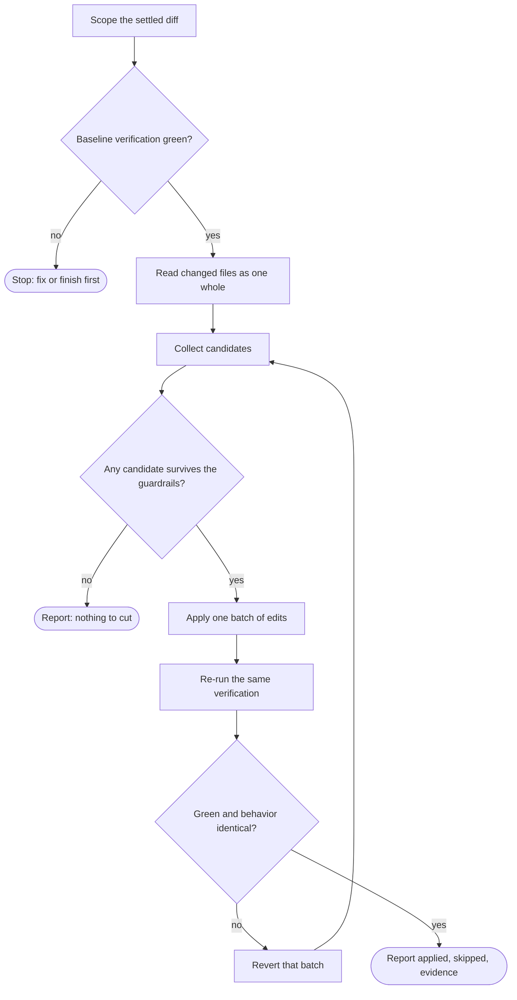

# Wayne Simplify

Make a diff that already works smaller, without changing what it does.

## Boundary

This is a refinement pass over code that is already written and already green. It edits and verifies; it does not review-and-report only, and it does not design. `wayne-code-review` judges a finished diff for quality, security, and correctness and reports findings — this pass acts, on a narrower question, before review is worth running. `wayne-neat` reduces docs, not code. `CLAUDE.md` owns the values (Simplicity First, Delete > Add, Surgical Changes) and is not restated here.

Behavior is frozen. Anything requiring a change to a public interface, error semantics, state ownership, or approved scope is out of this pass and returns to the plan or the user.

## Flow



## Process

### A. Scope the settled diff

The scope is the code just written and now settled: the wave's diff inside `wayne-work`, otherwise `git diff` plus untracked new files, or the files the user named. Settled means no unit is still mid-implementation — a diff being actively extended is refined too early, because a pattern that looks duplicated at unit 2 often diverges by unit 4.

Pre-existing code outside the diff is out of scope. Read it freely for context; do not clean it up.

### B. Require a green baseline

Run the verification that owns this code — the plan's unit or wave command, or the repository's typecheck, lint, and test commands — and record the exact command and result. If it is red, stop: on a red tree no later run can separate this pass's edits from the failure that was already there. If the code has no runnable check at all, say so; the pass may proceed on read-only reasoning but its report must state that behavior preservation is unproven.

### C. Read the changed files as one whole

Read the full diff and the files around it in one pass. Cross-unit duplication is the highest-value finding and the one nobody else can see: an implementer working a single unit, and especially a subagent with isolated context, cannot know that unit 4 rebuilt the helper unit 2 already added.

### D. Collect candidates

Three lenses, applied to the diff:

- **Reuse** — the same shape written twice, a helper the repository already has, a hand-rolled routine the stdlib or an installed dependency covers, a new dependency for a few lines of work.
- **Complexity** — nesting that early return removes, a conditional chain simpler as a lookup, a name that makes a comment redundant, a data structure richer than its actual use, commented-out code.
- **Speculation** — an interface with one implementation, a factory for one product, a config for a value that never changes, an extensibility point with no caller, a "just in case" branch.

Rank candidates by the judgment ladder, and take the highest rung that holds: does this need to exist at all → does the codebase already have it → stdlib → native platform feature → already-installed dependency → one line → minimum code. Two candidates the same size: take the one that stays correct on edge cases. Fewer lines is never a reason to pick the flimsier algorithm or the denser expression — a nested ternary and a clever one-liner are complexity moved, not removed.

### E. Filter through the guardrails

Drop any candidate that would remove:

- validation at a trust boundary, error handling that prevents data loss, security, or accessibility basics;
- a signal. Collapsing a handled failure into `try/except: pass`, a sentinel default, or a swallowed warning is not simplification — it is a deferred, more expensive bug;
- a single source of truth. Introducing a second encoding of state that already exists is never the smaller change, however short the diff;
- anything the user or plan explicitly asked for. The full version was requested → keep it and do not re-argue;
- a test's strength. A test is never edited, skipped, or weakened to let a simplification pass.

A simplification with a real, known ceiling — a global lock, an O(n²) scan, a naive heuristic — keeps one comment naming the ceiling and the upgrade path, and only when the ceiling will actually be hit:

```python
# simplify: global lock; per-account locks if throughput matters
```

### F. Apply one batch

Edit directly; this pass owns the change, not a recommendation list. Group edits into coherent batches — one duplication consolidated, one abstraction inlined — so a failure names its own cause.

Edit only files inside the scope from A. One addition is allowed: a new file that receives code moved out of those files, when consolidating in place would create a false dependency between them — a new module is an addition inside the change, while editing a pre-existing file the change never touched is the drive-by this rule forbids. Prefer reusing what the diff already has; reach for a new destination only when no file in scope is the honest owner. Inside a `wayne-work` wave this addition is unavailable: a path outside the plan's allowed set is **not** approved scope, and widening that set is Plan's decision, so the consolidation returns as a scope question instead.

### G/H. Re-verify and revert on failure

Re-run the exact command from B, unchanged. Green plus unchanged public behavior is the only pass condition.

If it fails, revert that batch. Do not fix forward: a simplification that needs a follow-up fix was a behavior change wearing a smaller diff, and the information it carries is that the code it touched was load-bearing. Record it as skipped with that reason and continue with the next candidate.

### I. Report

- Applied: file, what was consolidated or removed, net line delta.
- Skipped: candidate and the guardrail or reverted failure that killed it.
- Evidence: the verification command and its before/after results, verbatim.

Keep it short. If the explanation is longer than the diff it defends, delete the explanation.

## Inside wayne-work

Run at a wave boundary — after wave verification is green, before the unit audit — and run it in the main agent, never inside a worker: a worker sees one unit and is exactly the context that cannot spot cross-unit duplication. Do not run it after every single unit.

Scope is the wave's diff and the plan's allowed paths; the verification command is the plan's. Approved scope is frozen: a unit's goal, named interfaces, and U scenarios are not simplification candidates, and a unit that looks over-built returns to Plan as a scope question rather than shrinking quietly. The pass changes no U or E row.

## Red lines

- No refinement on a red baseline, and no substituted or weakened verification command.
- No behavior, interface, error-semantics, or scope change; no edit to a pre-existing file the change never touched, and no new file except as the destination of code moved out of the settled diff.
- No fix-forward after a failed batch.
- No completion claim without the before/after verification evidence, or without stating that no runnable check existed.
