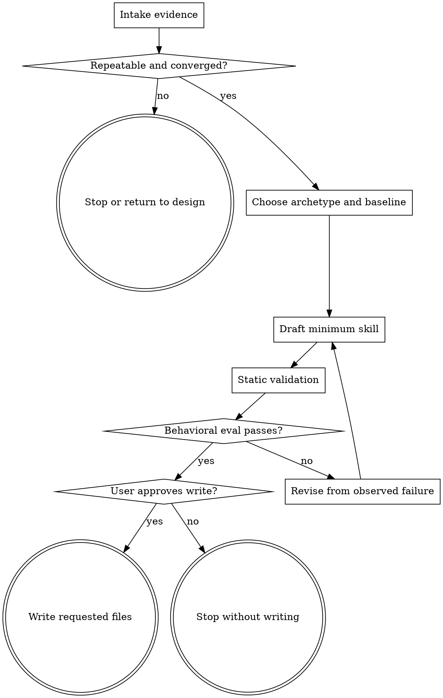

# Wayne Skill Forge

Turn one repeatable pattern into the smallest skill that reliably changes agent behavior.

## Boundary

`wayne-distill` supplies evidence; `skill-creator` owns the format floor;
`wayne-mind-explode` converges raw ideas. This forge writes validated skill files.
Read `skill-creator` completely. Do not forge one-offs, unconverged ideas, or
guidance already owned by global `AGENTS.md` / `CLAUDE.md`.

### Start from the strongest-model baseline

Assume the model already knows general software practice, reasoning, code review,
planning, and tool use. Add a line only when it carries at least one of:

- a local fact, schema, path, command, ownership rule, or approval boundary;
- a repeatable workflow the base model does not reliably reproduce;
- an observed failure and the smallest instruction that prevents it;
- an output contract or verification gate whose omission breaks the task.

If no evidence or local fact justifies a line, cut it. Do not encode generic advice
such as “read first”, “think carefully”, “follow existing patterns”, or “run tests”.

### Keep one owner for every instruction

- Put durable repository behavior in `AGENTS.md` / `CLAUDE.md`, not in each skill.
- Put routing terms in frontmatter `description`, not in a body “When to Run” section.
- Put control flow in the Flowchart; expand node details below without restating edges.
- Put detailed schemas, variants, examples, and long checklists in one-level references.
- Put repeated or deterministic operations in scripts; execute them instead of rewriting them.
- Keep a fact in the body or a resource, never both.

### Use lean defaults

| Surface | Target | Hard boundary |
|---|---:|---:|
| `description` | 180–400 characters | 1,024 characters |
| `SKILL.md` | 80–180 lines, 800–1,500 words | fewer than 500 lines |
| reference | one focused topic | add a TOC above 100 lines |
| reference depth | direct from `SKILL.md` | no nested reference chain |

Exceed a target only when an eval shows the additional context prevents a real
failure. Size reduction alone is not success; behavior must remain correct.

Match form to failure: skipped rule → gate plus reason; wrong shape → template;
omitted field → required slot plus validator; conditional behavior → predicate;
repeated fragile logic → script. Add anti-patterns only from observed mistakes.

### Protect the contract before compressing

Build a temporary coverage map from every approved requirement to exactly one
owner: body, reference, template, validator, or eval. Compression starts only when
the map has no orphan requirement. Do not ship the map.
Freeze quoted literals, table headers, sentinels, cardinalities, verbatim clauses,
and forbidden alternatives in a temporary literal ledger. Copy them exactly into
the schema/template/validator; do not normalize a local contract into a nicer one.

If an output has exact grammar, verbatim carry, cross-field references, unique
ownership, dependency order, or machine statuses, read
[contract protection](references/contract-protection.md) completely. These are
low-freedom signals: keep the schema in one reference, provide a canonical template,
and add a deterministic validator when correctness can be checked mechanically.
A strong model may know the domain; it cannot infer a deleted local contract.

Cut in this order: decoration → copied global rules → generic advice → redundant
examples → duplicated explanation. Never cut an approval/stop gate, state owner,
input/output contract, retry/error semantic, cross-record invariant, or verification
proof merely to meet a size target.

## Archetypes

| Archetype | Use when | Core | Template |
|---|---|---|---|
| **Procedure** | order, gates, or retries matter | branching Flow; node-aligned process | [procedure](templates/skill-template-procedure.md) |
| **Lens** | value is judgment across varied cases | applicability; reasons; contrasting cases | [lens](templates/skill-template-lens.md) |
| **Router** | ≥3 playbooks selected by signals | table; Flow; direct references; no-match | [router](templates/skill-template-router.md) |

If a router has fewer than three playbooks, use a procedure with a branch. If a
procedure has no meaningful branch, omit the Flowchart and keep one numbered process.

## Flowchart contract

Flowchart is Wayne’s control-flow language. Add it when the skill has a decision,
loop, route, retry, approval gate, or
multiple terminal states. The Flowchart owns sequence and branching. The process
sections own node inputs, actions, outputs, and verification.

- Use a `dot` fence and stable node IDs (`A`, `B`, `C`) with short labels.
- Use `box` for action, `diamond` for decision, and `doublecircle` for terminal.
- Label every outgoing decision edge; include the no-match or failure path.
- Keep commands, schemas, and explanations out of node labels.
- Match process headings to action node IDs, such as `### D. Draft`.
- Do not maintain a second checklist that restates the same sequence.
- Keep one main Flowchart per skill; move mode-specific flows to direct references.

## Flow



## Process

### A. Intake evidence

- the user phrases that should and should not trigger the skill;
- the local facts and hard constraints the model cannot infer;
- the baseline failures the skill must correct;
- the closest existing skill and why this is new rather than an extension.
- For an existing skill, preserve its current files as the A/B control.

### B. Confirm it earns a skill

Require recurrence, a costly failure, or specialized local knowledge. Return a
changing idea to design; update the global owner when it already owns the rule.
Build the literal ledger early. If two clauses define different accepted outputs
and no precedence resolves them, stop and return the exact conflict upstream; never
pick the more convenient clause.

### C. Choose archetype and baseline

Choose the archetype from observable task shape. Define the eval baseline first:
- new skill: strongest model without the skill;
- existing skill: current skill versus candidate;
- trigger change: current metadata versus candidate metadata.
Use the same model, reasoning effort, tools, task, and input artifacts on both sides.

### D. Draft the minimum skill

Start from the archetype template. Write discovery metadata, then only the core
workflow or judgment. Put conditional detail in resources. Use direct,
conclusion-first language; never copy persona or global invariant blocks.
When Flow exists, expand node IDs instead of duplicating its sequence.
Complete the requirement coverage map and run the contract-density gate before
cutting. For low-freedom outputs, make the reference the schema owner and align its
template and validator to that owner; do not encode three independent schemas.
Audit the drafted schema back against the approved intent, not merely against its
own template.
Classify checks as artifact-local or source-relative. A validator for verbatim
carry, source completeness, or real repository surfaces must accept those upstream
artifacts explicitly; an artifact-only validator cannot claim that coverage.
When source content is discovered only at skill runtime, require a temporary
runtime ledger for exact literals, ownership, and cross-record relationships; trace
each row into the generated artifact and its validator proof. Map every independent
machine-checkable invariant to its own check and mutation, not one broad family test.

### E. Run static validation

```bash
uv run <wayne-skill-forge-dir>/scripts/validate_skill.py <skill-directory>
```
Review warnings deliberately; do not silence them with padding or relocated
duplication. For a deeper manual pass, use
[the review checklist](references/skill-review-checklist.md).
Execute every bundled script. A validator needs a valid fixture that exits zero,
one minimal invalid fixture per independent invariant from the coverage map, and a
lint pass. Each mutation must exit non-zero with its expected finding; one negative
case does not prove a sibling relationship or the reverse direction.
If the environment prevents execution, report static validation as incomplete.

### F. Run behavioral eval

Follow [the eval protocol](references/eval.md):
- Use at least three representative cases; use five or more for trigger-sensitive
  or high-risk skills.
- Run control and candidate in fresh contexts without revealing the expected fix.
- Score success, boundaries, output, Flow, context, and resource discovery.
- Accept only without required-behavior regression; prefer smaller when equal.
Turn each failure into one minimal instruction, resource, or validator check.
When the child output has a deterministic contract, run its validator before a
subjective judge. Keep invalid artifacts as evidence; never repair them by hand.
Also run a frozen acceptance checker derived before generation; a child-authored
validator can be self-consistent while drifting from the approved intent.
Every checker finding must trace to a published intent/task clause; an untraceable
expectation invalidates the evaluator, not the candidate. Treat provider, timeout,
or tool-use termination before an observable result as an invalid trial, not a loss.

When evaluating this forge, run the required meta-eval: old and candidate forge
each generate a child skill from the same evidence, then fresh downstream agents
use those child skills on identical real tasks. Judge downstream execution, not
the prose quality of the generated `SKILL.md`.

### G. Gate and write

Show files and eval result in plain Chinese. Write only after approval unless the
edit was explicitly requested. Revalidate and report changed files, proof, and
uncertainty. Do not install, sync, commit, or publish unless asked.

## Red lines

- Do not require decorative sections such as an epigraph, Inherits block, boundary
  table, or anti-pattern list when they add no task information.
- Do not duplicate routing terms in the body.
- Do not duplicate Flowchart sequence in a checklist or prose phase list.
- Do not hardcode one agent’s home-directory path in a cross-agent skill.
- Do not call a shorter file “better” without behavioral evidence.
- Do not remove a template or validator whose contract remains low-freedom.
- Do not claim a bundled script passes when it was only inspected.
- Do not call schema/template/validator agreement proof of intent fidelity.
- Do not auto-forge every repeated prompt; extend an existing owner when possible.
