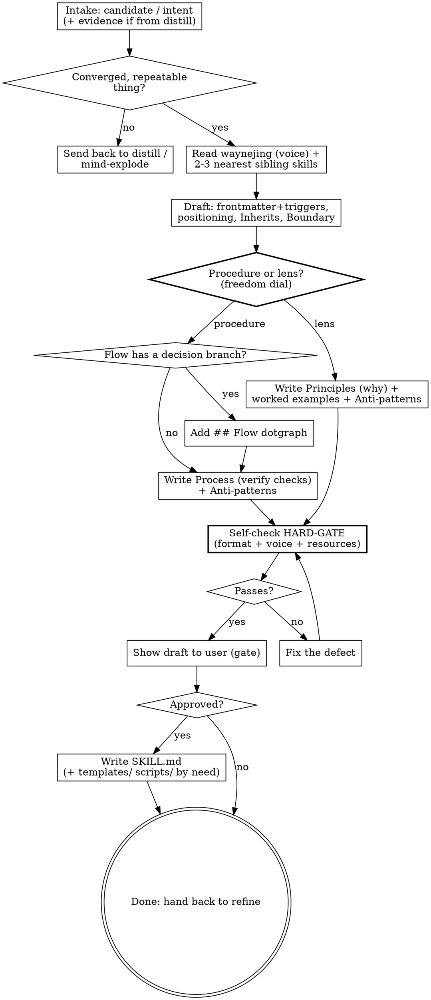

# Wayne Skill Forge · intent → a Wayne-style skill

> "写不进 SKILL.md 的，就不算方法论。能写进去的，就要能跑。"

The one place that owns *how a wayne-* skill is written*. Every other skill is
built through here, so the house style lives in **one** file, not copied into
each generator's template. `wayne-distill` finds candidates; `wayne-skill-forge`
turns the approved ones into conforming `SKILL.md` files.

## Inherits from ~/.claude/CLAUDE.md

Inherits the Wayne control-plane invariants; does NOT redeclare them:

- Language Rules (Chinese to user, English to files / paths / labels)
- Engineering Principles (KISS / YAGNI / DRY / SSoT / Fail-Loud / Delete>Add)
- Code Standards, Behavior Baselines, proportional-effort skill rule

This skill only specifies the *skill-authoring* workflow + the house-style spec.

## Boundary vs neighbors (read before running)

| Skill | Input | Output |
|---|---|---|
| **wayne-skill-forge** | one approved candidate / intent | a conforming Wayne-style `SKILL.md` |
| wayne-distill | the WHOLE session history | candidate skills (the "distill pattern") — hands approved here |
| waynejing | Wayne's instruction corpus | the **voice** (this skill cites it, does not re-derive it) |
| wayne-mind-explode | a raw idea | a converged design — not a skill file |

If the thing isn't yet a converged, repeatable procedure, it's not ready to
forge — send it back to distill (recurrence proof) or mind-explode (design).

## Format floor — Anthropic skill-creator (authoritative)

The mechanical format rules are NOT Wayne's to invent — they're Anthropic's.
Source of truth on disk:
`~/.claude/plugins/marketplaces/claude-plugins-official/plugins/skill-creator/skills/skill-creator/SKILL.md`.
Read it for the full spec. The non-negotiable floor:

| Rule | Constraint |
|---|---|
| **Anatomy** | `<name>/SKILL.md` required; optional `scripts/` (executable), `references/` (docs loaded as needed), `assets/` (files used in output). Wayne also uses `templates/` for scaffolds |
| **Frontmatter** | only `name` + `description` required; `name` is kebab AND equals the dir name; `allowed-tools` / `compatibility` rarely needed |
| **Progressive disclosure** | metadata (~100 words, always in context) → SKILL.md body (<500 lines ideal) → bundled resources (as-needed). Approaching 500 lines → add hierarchy + pointers; reference file >300 lines → give it a TOC |
| **Description = the trigger** | it is the PRIMARY trigger mechanism; put ALL "when to use" here, not in the body; be slightly **pushy** to fight undertriggering |
| **Imperative + why** | prefer imperative; explain the *why*. Anthropic flags caps-`ALWAYS`/`NEVER` as a yellow flag |

**Tension with Wayne voice (state it, don't hide it):** Wayne's house style runs
high `MUST`/HARD-GATE density; Anthropic says explain why over caps-MUST.
Reconcile: keep HARD-GATE for the *few load-bearing gates* (the user-approval
gate, the self-check), explain the *why* everywhere else — Wayne already does
this via 证据 / 局限. Don't caps-MUST every line.

**Heavyweight eval loop is Anthropic's, not forge's.** forge is the lightweight
Wayne path — no benchmark/eval machinery (no wayne-* skill carries one; YAGNI).
When the user wants quantitative trigger-eval / description optimization, invoke
the Anthropic `skill-creator` directly; don't reimplement it here.

## Authoring science — superpowers:writing-skills (inherited, not copied)

The *format* floor is Anthropic's (above); the *what-guidance-form-actually-works*
floor is `superpowers:writing-skills`. Cite it, don't re-derive it. Two findings are
load-bearing for forge:

**Match the form to the failure.** Before writing any guidance line, name the
baseline failure it targets — the form that fixes one type backfires on another:

| Baseline failure | Right form | Wrong form |
|---|---|---|
| Knows the rule, skips it under pressure | prohibition + rationalization table + red-flags | soft "prefer / consider" |
| Complies, but output is wrong-shaped (bloated / buried / restated) | positive recipe: state what the output IS, in order | prohibition list ("don't restate") |
| Omits a required element it already produces | structural REQUIRED slot in the template | prose reminder near the template |
| Behavior should depend on a condition | conditional keyed to an observable predicate | unconditional rule + exemption clauses |

Prohibitions measurably BACKFIRE on wrong-shape problems (agents negotiate with
"don't X"); a recipe leaves nothing to negotiate. So Wayne's high-`MUST` voice is
right for discipline gates, wrong for shaping — pick the form per failure, not per
habit. No nuance clauses ("don't X unless…") — express a real exception as its own
predicate.

**Baseline before guidance (cheap version).** No guidance line earns its place
until you've seen the failure it prevents. From distill, the evidence sessions ARE
the baseline. Hand-authored → micro-test the core wording against a no-guidance
control (5+ reps, read every flagged match) before shipping. Forge stays
lightweight — this is NOT the Anthropic eval harness; it's one sanity pass.

## Resource & complexity decisions

Where content lives is a design choice, not an afterthought. Decide per the
table (criteria from Anthropic's `skill-development` skill):

| Put it in… | When | Wayne note |
|---|---|---|
| **SKILL.md body** | core concept, the workflow, quick-ref tables, decision gates, pointers, the common case | the always-loaded layer — keep it lean |
| **`references/<x>.md`** | detailed patterns / schemas / API docs / edge cases / long checklists / multi-domain variants — loaded only when needed | a fact lives in body OR a ref, NEVER both; >300 lines → add a TOC; >10k words → put grep patterns in SKILL.md |
| **`scripts/<x>.py`** | the same code gets rewritten every run, or you need deterministic reliability (collectors, validators, transforms) | can execute without loading into context; stdlib-only if it must run anywhere — e.g. wayne-distill `scan_sessions.py` |
| **`assets/<x>`** | files used IN the output (templates, boilerplate, fonts, icons) | Wayne uses `templates/` for SKILL scaffolds |

**Complexity gate (before building at all):** proportional effort (CLAUDE.md).
Trivial / one-off → no skill. A skill earns its file only if the procedure
*recurs* and saves real future effort — that's distill's ≥3-session bar; for a
hand-authored intent, apply the same smell test. When in doubt, don't forge.

**Sizing:** body target 1,500–2,000 words; <3,000 good; **5k words / 500 lines
is the hard ceiling**. Approaching it → move the detail to `references/` and
leave a one-line pointer. Bloat in the always-loaded layer taxes every trigger.

## Three archetypes — pick the freedom dial + dispatch first

Not every skill is a procedure. Anthropic frames the axis as **degrees of
freedom** (best-practices: "match specificity to task fragility"). A wayne-* skill
sits at one of three poles; the archetype decides the 6th required element and which
template to start from. Decide this in Phase 1 — it changes the whole draft.

| | **Procedure** (low freedom) | **Lens / philosophy** (high freedom) | **Router** (dispatch) |
|---|---|---|---|
| Anthropic type | "encoded preference" — sequence steps the team's way | "capability uplift" — reproduce judgment prompting won't | "conditional details" — index routes to the right playbook |
| Use when | operation is fragile, consistency-critical, fixed sequence | multiple approaches valid, decisions depend on context | ≥3 divergent playbooks selected by an observable situation |
| Core body | `## Process` phased, each step `→ verify:` | `## Principles` written **Explain-the-Why** + worked examples | `## Playbooks` selection table → thin dispatch; each playbook in `references/` |
| Flow dotgraph | yes if ≥1 branch | usually none — no linear flow | yes — diamonds are routing decisions, terminals read `references/X` |
| Teaching device | the steps + validation loops | **example reasoning chains** (not output samples) | the selection signals (what tells you which playbook) |
| Gate | human gate before each side-effect | applicability boundary (when the lens does NOT apply) | "no playbook fits" → fail loud, stop |
| Anti-patterns | the corrected *mistakes* | the *misapplications* of the lens | routing on vibes not signal; playbook internals in the index |
| Corpus examples | skill-forge, plan, work, ship, distill, cybernetics | waynejing; the cybernetics-lens file itself | Anthropic bigquery-skill is the reference shape |
| Template | `templates/skill-template-procedure.md` | `templates/skill-template-lens.md` | `templates/skill-template-router.md` |

**Explain-the-Why (the lens core):** state the rule, then *why* — the why becomes
the rubric for cases the skill never spelled out. "Use constructor injection;
field injection breaks testability because we can't mock without Spring context"
beats "ALWAYS constructor, NEVER field." A high-freedom skill that's all rules and
no why is a vague essay — it can't generalize.

Most skills are procedures; reach for a lens only when the value is *judgment*,
not a sequence. When unsure, it's probably a procedure.

**Router is a real third pole, not a procedure with an `if`.** It earns its own
archetype ONLY at ≥3 playbooks chosen by situation — below that, use a procedure
with a branch. The index has ONE job (route), zero playbook internals; each
playbook is one file in `references/`, exactly ONE level deep (nested refs get
partial-read by agents). Route on an observable signal, never on vibes; if nothing
matches, fail loud and stop. Reference shape: Anthropic's bigquery-skill (a nav
table → per-domain reference files).

## House style — the SSoT (what every wayne-* skill MUST carry)

Mined from the 18-skill corpus. **5 are always required; the 6th depends on the
archetype above. A forged skill missing a required element is a defect.**

| # | Element | Rule | Required |
|---|---|---|---|
| 1 | **Frontmatter** | `name` (kebab = the slash command) + dense `description`; description ENDS with bilingual trigger phrases ("MUST trigger on …", "do not under-trigger") | ✅ always |
| 2 | **Title + positioning** | `# Wayne X` then ONE line: a Chinese aphorism in `>` blockquote, or an English contrast vs a sister skill ("mind-explode defines WHAT, plan defines HOW"). Never a paragraph | ✅ always |
| 3 | **Inherits block** | `## Inherits from ~/.claude/CLAUDE.md`; list what's inherited + "MUST NOT repeat"; end with "This skill only specifies <X>" | ✅ always |
| 4 | **Boundary table** | name the closest sister skills, each row = Input / Output (or Owns / Don't double-do); define THIS skill by what it is NOT | ✅ always |
| 5 | **Anti-patterns** | procedure → the corrected *mistakes*; lens → the *misapplications* of the judgment | ✅ always |
| 6a | **Process** (procedure only) | phased / numbered steps, each `→ verify: <check>`; human gates explicit; never auto-do a side-effect without a gate | ✅ if procedure |
| 6b | **Principles + worked examples** (lens only) | `## Principles` in Explain-the-Why form (rule + why) + an applicability boundary (when it does NOT apply) + **≥2 example reasoning chains** (not output dumps) | ✅ if lens |
| 6c | **Playbooks selection table** (router only) | `## Playbooks` table keyed on an observable signal → one `references/<x>.md` per playbook (≥3, one level deep) + a no-match escape (fail loud) | ✅ if router |
| 7 | **Flow dotgraph** | `## Flow` with a `dot` digraph (11/18 carry it; see guide below). Add it whenever the flow has ≥1 decision branch — typical for procedures and routers, rare for lenses | strong (procedure/router) |
| 8 | **Origin / Files Written / Why this matters** | `## Origin` when adapted from someone (attribute, MIT); `## Files Written` when it writes artifacts; `templates/` + `scripts/` only when the workflow needs them | by-need |

## Voice — inherit from `waynejing`, don't re-derive

Voice is owned by `waynejing` (§表达 DNA + §输出格式硬约束). Read it before
forging. The SKILL.md-authoring subset:

| Rule | Concretely |
|---|---|
| **Bullet HARD-GATE** | one bullet ≤120 chars (CJK by char); ≤1 sentence-stop per bullet; never cram 「定义+反模式+证据」 in one bullet → split into title-bullet + sub-bullets, a table, or a `####` subsection |
| **Conclusion-first** | verdict then evidence; no preamble, no meta, no "好的我来帮你" |
| **Dense, imperative** | `MUST` / `MUST NOT` / `NEVER` / `Don't` on load-bearing words (caps for emphasis); tables for any comparison; `→` `、` `/` `—` for rhythm; near-zero `!` |
| **Define by negation** | "X, NOT Y" / "don't conflate" / "do not under-trigger" — boundary stated as a red line |
| **Bilingual split** | epigraph may be Chinese; body English; triggers bilingual; keep keywords untranslated (commit / skill / pattern / verify) |
| **禁忌词** | no 客服开场 / 鸡汤结尾 / 网络称谓 / 商业黑话 (全方位·赋能·抓手) / 削弱词三连 (其实·不过·嗯) |

## Flow dotgraph — authoring guide

The convention 11/18 skills follow. Copy it exactly:

- Fence with ```` ```dot ````; one `digraph <skillname> { rankdir=TB; … }`.
- Node shapes: `[shape=box]` = action; `[shape=diamond]` = decision (yes/no
  branch); `[shape=doublecircle]` = terminal / done; `[style=bold]` = the one
  load-bearing dispatch step (gate, review fan-out).
- Edge labels: every diamond's out-edges labelled `[label="yes"]` / `[label="no"]`.
- Node labels: `\n` to wrap; keep each node a short verb phrase.
- Declare all nodes first, then all edges. Balance braces. One terminal min.



## Process Flow

### Phase 1 — Intake

Source the candidate one of two ways:

- **From `wayne-distill`:** read the pattern file it wrote
  (`/tmp/wayne-distill-patterns/<name>.md`) — name, trigger phrases, evidence
  sessions + sample prompts, closest existing skill (why *New* not *Extend*),
  rough step sequence, verdict.
- **From the user:** a raw intent stated in conversation.

- **Gate:** is it a *converged, repeatable thing*? If not → back to
  `wayne-distill` (needs recurrence proof) or `wayne-mind-explode` (needs
  design). Do NOT forge a one-off.
- **Archetype gate (decides the 6th required element + template):** is the value
  a fixed *sequence* (procedure), a *judgment* (lens), or *selecting among ≥3
  situation-specific playbooks* (router)? → verify: procedure = you can state it
  "do X → Y → Z"; lens = you can state ≥2 principles each with a *why*, and name
  when it does NOT apply; router = a selection table keyed on an observable
  signal, ≥3 playbooks, a no-match escape. When unsure between procedure and
  router, it's a procedure (router needs ≥3 divergent playbooks).

### Phase 2 — Study the style

- Read `waynejing` (the voice SSoT). → verify: you can name the bullet HARD-GATE.
- Read the 2-3 nearest sibling skills in full. → verify: you can name the one
  line that keeps the new skill separate from each (this seeds the Boundary
  table, and is why distill ruled it *New* not *Extend*).

### Phase 3 — Draft (from the archetype's template)

Start from the template the Phase-1 archetype chose:
`templates/skill-template-procedure.md` or `templates/skill-template-lens.md`.
Fill elements 1–4 the same way for both; element 5/6 branches.

1. Frontmatter — `name`, dense `description`, **trigger phrases** (bilingual,
   mined from the evidence prompts). → verify: a stranger reading only the
   description knows when to reach for it.
2. Positioning epigraph (one line). → verify: not a paragraph.
3. Inherits block (don't redeclare invariants). → verify: ends with "only
   specifies X".
4. Boundary table (carry the closest sibling from intake). → verify: each row
   distinguishable.
5. **If procedure:** `## Flow` dotgraph if ≥1 decision branch (use the guide) →
   verify: braces balance, every diamond has yes+no edges; then `## Process`
   (numbered, each `→ verify:`) + Anti-patterns → verify: every step has a check,
   human gates marked.
   **If lens:** `## Principles` in Explain-the-Why form (rule + why) +
   applicability boundary (when it does NOT apply) + **≥2 worked examples as
   reasoning chains** + Anti-patterns (misapplications) → verify: every principle
   carries a why; examples show judgment in motion, not output dumps.
   **If router:** `## Playbooks` selection table keyed on an observable signal +
   one `references/<x>.md` per playbook (≥3, one level deep) + a no-match escape;
   `## Flow` dotgraph whose diamonds are the routing decisions; Anti-patterns
   (routing failures) → verify: signals are checkable not vibes, references one
   level deep, no-match branch fails loud.
6. Provenance line: `> Distilled from N sessions on <date> by wayne-distill,
   forged by wayne-skill-forge.` (drop the distill clause for hand-authored).

### Phase 4 — Self-check (HARD-GATE, before showing the user)

Run the checklist. Any miss = rewrite, don't ship:

Anthropic format floor:

- [ ] Frontmatter has ONLY `name` + `description`; `name` is kebab AND = the
      dir name.
- [ ] `description` carries ALL the when-to-use (none hidden in the body) and is
      slightly pushy against undertriggering.
- [ ] SKILL.md < 500 lines (body 1,500–2,000 words ideal); any reference file
      > 300 lines has a TOC.
- [ ] Resource placement: detail → `references/`, repeated code → `scripts/`,
      output files → `assets/`/`templates/`; SKILL.md points to each.

Wayne house style + voice:

- [ ] The 5 always-required present (frontmatter+triggers, positioning, Inherits,
      Boundary, Anti-patterns) + the archetype's 6th:
      procedure → `Process`-with-verify (+Flow if branching);
      lens → `Principles` Explain-the-Why + applicability boundary + ≥2 reasoning-
      chain examples;
      router → `Playbooks` selection table + ≥3 one-level-deep references + no-match escape.
- [ ] Archetype fit: a procedure isn't masquerading as a vague lens, a lens isn't
      bolted onto a `→ verify:` Process it doesn't have, and a router isn't a
      procedure-with-an-`if` (<3 playbooks). Anti-patterns match the archetype
      (mistakes vs misapplications vs routing failures).
- [ ] Lens only: every principle carries a *why* (the rubric), and ≥2 examples are
      reasoning chains, not output samples.
- [ ] Router only: selection table keyed on an observable signal (not vibes);
      ≥3 playbooks or it's a procedure; references one level deep; no-match escape
      fails loud.
- [ ] Guidance form matches the failure type (Match the Form to the Failure):
      discipline miss → prohibition+table; wrong-shape → positive recipe; omitted
      element → REQUIRED slot; conditional → predicate. No prohibition on a
      shaping problem; no nuance clauses.
- [ ] Baseline named: every load-bearing guidance line traces to an observed
      failure (distill evidence, or a micro-test vs no-guidance control).
- [ ] `description` carries triggers / when-to-use only — does NOT summarize the
      workflow (a workflow-summary description makes agents skip the body).
- [ ] Triggers are bilingual and mined from real evidence, not invented.
- [ ] Boundary names the closest sibling — reader can tell this vs neighbor.
- [ ] Voice gate: scan every `- ` / `1. ` line — any >120 chars (CJK) or ≥2
      sentence-stops → split. No 禁忌词. HARD-GATE only the load-bearing gates;
      explain the why elsewhere (not caps-MUST every line).
- [ ] If a Flow dotgraph: braces balance, shapes correct, all diamonds labelled.
- [ ] Net value: this earns its file against the closest sibling (Delete>Add).

For a thorough pass — or to review an existing skill on request — run the
severity-tagged `references/skill-review-checklist.md`.

### Phase 5 — Gate + write (never auto-write)

- Show the full draft to the user; explain the call in plain Chinese. STOP.
- On approval: `mkdir -p ~/.claude/skills/<name>/` (+ `templates/` / `scripts/`
  only if needed), write `SKILL.md`. → verify: file lands, `name` = dir name.
- Report what was written; hand back to refine. Do NOT wire triggers /
  automation unless asked.

## Anti-patterns

- Re-deriving the voice here instead of citing `waynejing` (that's the SSoT).
- Copying this house-style spec into another skill's template (one owner only).
- Forging a one-off that never recurs — that's bloat (Delete>Add).
- Forcing a judgment/lens skill into a fake `→ verify:` Process — high-freedom
  value is principles + why, not steps (e.g. waynejing has no Process).
- A lens whose principles are all rules and no *why* — it can't generalize, it's
  a vague essay. Each rule states the reason that becomes its rubric.
- Skipping the Phase-4 HARD-GATE because the draft "looks fine".
- Auto-writing the SKILL.md without the Phase-5 user gate.
- Trigger phrases invented rather than mined from the evidence sessions.
