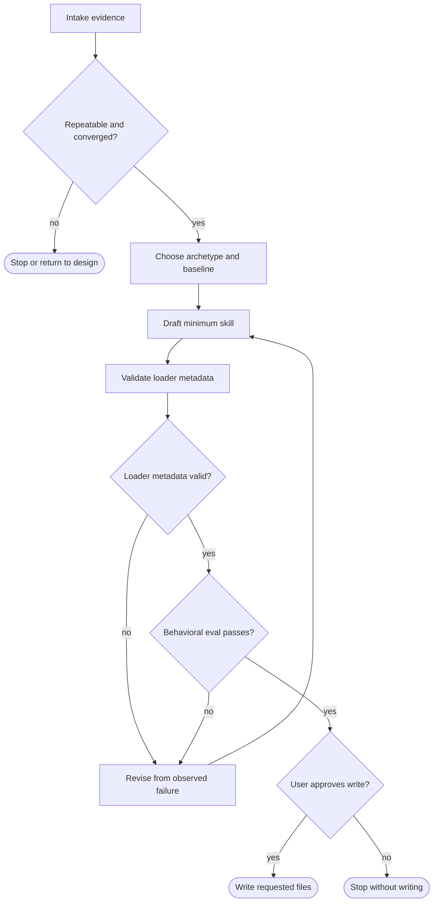

# Wayne Skill Forge

Turn one repeatable pattern into the smallest skill that reliably changes agent behavior.

## Boundary

`wayne-distill` supplies evidence; `wayne-mind-explode` converges raw ideas. This forge owns Wayne skill authoring, loader metadata, and behavioral evaluation. Do not forge one-offs, unconverged ideas, or guidance already owned by global `AGENTS.md` / `CLAUDE.md`.

Every skill is one kebab-case directory containing `SKILL.md`. Its YAML frontmatter requires `name` and `description`, uses only loader-supported keys, and has `name` match the directory; `description` owns all triggering language. Add only resources the runtime needs: repeated operational work in `scripts/`, conditional knowledge in one-level `references/`, and output material in `assets/` or `templates/`.

### Start from the strongest-model baseline

Assume the model already knows general software practice, reasoning, code review, planning, and tool use. Add a line only when it carries at least one of:

- a local fact, schema, path, command, ownership rule, or approval boundary;
- a repeatable workflow the base model does not reliably reproduce;
- an observed failure and the smallest instruction that prevents it;
- an output contract or verification gate whose omission breaks the task.

If no evidence or local fact justifies a line, cut it. Do not encode generic advice such as “read first”, “think carefully”, “follow existing patterns”, or “run tests”.

### Keep one owner for every instruction

- Put durable repository behavior in `AGENTS.md` / `CLAUDE.md`, not in each skill.
- Put routing terms in frontmatter `description`, not in a body “When to Run” section.
- Put control flow in the Flowchart; expand node details below without restating edges.
- Put detailed schemas, variants, examples, and long checklists in one-level references.
- Put repeated or deterministic operations in scripts; execute them instead of rewriting them.
- Keep a fact in the body or a resource, never both.

### Use lean defaults

| Surface         |                 Target |             Hard boundary |
| --------------- | ---------------------: | ------------------------: |
| `description`   |     180–400 characters |          1,024 characters |
| `SKILL.md`      |        800–1,500 words |    fewer than 4,000 words |
| reference       |      one focused topic | add a TOC above 800 words |
| reference depth | direct from `SKILL.md` | no nested reference chain |

Budgets are in words, never lines. A line count measures how the file was wrapped, not how much an agent has to read, and this repository writes one line per paragraph.

Exceed a target only when an eval shows the additional context prevents a real failure. Size reduction alone is not success; behavior must remain correct.

Match form to failure: skipped rule → gate plus reason; wrong shape → example; omitted information → explicit instruction; conditional behavior → predicate; repeated fragile logic → script. Add anti-patterns only from observed mistakes.

### Protect the contract before compressing

Build a temporary coverage map from every approved requirement to exactly one owner: body, reference, template, or eval. Compression starts only when the map has no orphan requirement. Do not ship the map. Preserve quoted literals only when an upstream source or real machine consumer makes their exact bytes normative; do not invent exactness for an AI-readable document. Read [contract protection](references/contract-protection.md) when an actual parser, API, loader, or executable consumes the output. AI-to-AI Markdown handoffs use semantic ownership and behavioral review, not a fabricated schema/validator pair.

Compression is two operations, in order: **move**, then **cut**. Move evidence-backed, branch-conditional, long detail into `references/`; move repeated deterministic operations into `scripts/`; move output material into `templates/`. Repeated control flow that still needs judgment or branching stays in Flow and the body — scripting it moves the decision away from the agent that must make it. Only content that survives none of those moves is a cut candidate. The `SKILL.md` budget bounds always-loaded context, not the knowledge the skill is allowed to carry — treating overflow as deletion is how a skill loses what it was built to know.

A reference is **optionally loaded, never optionally correct**. Moving material does not make it advisory, so the body keeps the load condition and a direct link — the reader must be able to tell, without opening it, when it is required.

Then cut in this order: decoration → copied global rules → generic advice → redundant examples → duplicated explanation. Never cut an approval/stop gate, state owner, input/output contract, retry/error semantic, cross-record invariant, or verification proof merely to meet a size target.

## Archetypes

| Archetype | Use when | Core | Template |
| --- | --- | --- | --- |
| **Procedure** | order, gates, or retries matter | branching Flow; node-aligned process | [procedure](templates/skill-template-procedure.md) |
| **Lens** | value is judgment across varied cases | applicability; reasons; contrasting cases | [lens](templates/skill-template-lens.md) |
| **Router** | ≥3 playbooks selected by signals | table; Flow; direct references; no-match | [router](templates/skill-template-router.md) |

If a router has fewer than three playbooks, use a procedure with a branch. If a procedure has no meaningful branch, omit the Flowchart and keep one numbered process.

## Flowchart contract

Flowchart is Wayne’s control-flow language. Add it when the skill has a decision, loop, route, retry, approval gate, or multiple terminal states. The Flowchart owns sequence and branching. The process sections own node inputs, actions, outputs, and verification.

- Use a `mermaid` fence with `flowchart TB` (or `LR`) and stable node IDs (`A`, `B`, `C`) with short quoted labels.
- Use `["action"]` for action, `{"decision"}` for decision, and `(["terminal"])` for terminal.
- Use only native Mermaid shapes: no `style`, `classDef`, `linkStyle`, `%%{init}%%`, or theming, so the diagram renders identically in any Markdown viewer.
- Label every outgoing decision edge; include the no-match or failure path.
- Keep commands, schemas, and explanations out of node labels.
- Match process headings to action node IDs, such as `### D. Draft`.
- Do not maintain a second checklist that restates the same sequence.
- Keep one main Flowchart per skill; move mode-specific flows to direct references.

## Flow


```mermaid
flowchart TB
    A["Intake evidence"]
    B{"Repeatable and converged?"}
    X(["Stop or return to design"])
    C["Choose archetype and baseline"]
    D["Draft minimum skill"]
    E["Validate loader metadata"]
    V{"Loader metadata valid?"}
    F{"Behavioral eval passes?"}
    R["Revise from observed failure"]
    G{"User approves write?"}
    W(["Write requested files"])
    S(["Stop without writing"])
    A --> B
    B -->|"no"| X
    B -->|"yes"| C
    C --> D
    D --> E
    E --> V
    V -->|"no"| R
    V -->|"yes"| F
    F -->|"no"| R
    R --> D
    F -->|"yes"| G
    G -->|"yes"| W
    G -->|"no"| S
```

## Process

### A. Intake evidence

- the user phrases that should and should not trigger the skill;
- the local facts and hard constraints the model cannot infer;
- the baseline failures the skill must correct;
- the closest existing skill and why this is new rather than an extension.
- For an existing skill, preserve its current files as the A/B control.

### B. Confirm it earns a skill

Require recurrence, a costly failure, or specialized local knowledge. Return a changing idea to design; update the global owner when it already owns the rule. Build the literal ledger early. If two clauses define different accepted outputs and no precedence resolves them, stop and return the exact conflict upstream; never pick the more convenient clause.

### C. Choose archetype and baseline

Choose the archetype from observable task shape. Define the eval baseline first:

- new skill: strongest model without the skill;
- existing skill: current skill versus candidate;
- trigger change: current metadata versus candidate metadata. Use the same model, reasoning effort, tools, task, and input artifacts on both sides. For a revision, create or reuse the versioned harness at `eval/<skill-name>/` before drafting; a `/tmp`-only evaluator is not durable evidence.

### D. Draft the minimum skill

Start from the archetype template. Write discovery metadata, then only the core workflow or judgment. Put conditional detail in resources. Use direct, conclusion-first language; never copy persona or global invariant blocks. When Flow exists, expand node IDs instead of duplicating its sequence. Complete the requirement coverage map before cutting. Validate only the skill loader's real contract: parseable YAML frontmatter, required `name` and `description`, naming rules, directory agreement, and a non-empty body.

Before declaring the draft done, extend the coverage map into a resource placement decision: name the owner of every piece of detail material — body, one-level `references/`, `scripts/`, or `templates/`. Material that is both branch-conditional and long — schemas, variant tables, worked examples, full command recipes, per-case checklists — MUST move to a reference; the body then keeps the gate itself and a direct link saying when to load it. Short gates, verify conditions, and single commands stay inline. Record `No reference: <reason>` when nothing qualifies. Keep this decision in the working map and the eval evidence, never in the shipped skill. This prevents a real default failure: pressure to cut is explicit and repeated here while permission to add a resource is passive, so conditional detail gets inlined or silently dropped.

For any proposed runtime schema or validator, name the non-AI consumer that parses it and the failure it prevents. If the next consumer is an agent reading Markdown, reject the mechanism and use source-grounded AI review plus behavioral eval. Regex, headings, keywords, counts, templates, and similarity may be evaluator observations; they never become a prose correctness gate by themselves.

### E. Validate loader metadata and formatting

```bash
uv run <wayne-skill-forge-dir>/scripts/validate_skill.py <skill-directory>
npx prettier --check <skill-directory>
```

The validator checks only the same loader-level metadata expected by the official skill creator. It does not judge Markdown organization, Flowchart style, prose, or behavior. Execute and test every bundled operational script against its real job. If the environment prevents execution, report the incomplete proof.

`prettier --check` enforces the repository's `.prettierrc`: one line per paragraph, no hard wrapping. Fix a failure with `--write` rather than by hand. Hard-wrapped prose is the default an LLM reaches for and nobody chose it here; it makes a one-word change reflow a whole paragraph and puts a single sentence across three edit anchors.

### F. Run behavioral eval

Follow [the eval protocol](references/eval.md):

- Freeze the repository harness before candidate generation. An observed failure earns an anti-pattern only when the control fails its exact case and the candidate passes.
- Use at least three representative cases; use five or more for trigger-sensitive or high-risk skills.
- Run control and candidate in fresh contexts without revealing the expected fix.
- Score success, boundaries, output, Flow, context, and resource discovery.
- Accept only without required-behavior regression; prefer smaller when equal. Turn each failure into one minimal instruction, resource, or operational script. Use deterministic checks only for a real machine-consumed interface, and use an independent AI semantic judge for agent-readable artifacts. Keep invalid artifacts as evidence; never repair them by hand. Freeze eval observations before generation and give their results to the blind AI judge as evidence, not as an automatic semantic verdict. Every finding must trace to a published intent/task clause; an untraceable expectation invalidates the evaluator, not the candidate. Treat provider, timeout, or tool-use termination before an observable result as an invalid trial, not a loss.

When evaluating this forge, run the required meta-eval: old and candidate forge each generate a child skill from the same evidence, then fresh downstream agents use those child skills on identical real tasks. Judge downstream execution, not the prose quality of the generated `SKILL.md`.

### G. Gate and write

Show files and eval result in plain Chinese. Write only after approval unless the edit was explicitly requested. Recheck loader metadata and report changed files, proof, and uncertainty. Do not install, sync, commit, or publish unless asked.

## Red lines

- Do not require decorative sections such as an epigraph, Inherits block, boundary table, or anti-pattern list when they add no task information.
- Do not duplicate routing terms in the body.
- Do not duplicate Flowchart sequence in a checklist or prose phase list.
- Do not hardcode one agent’s home-directory path in a cross-agent skill.
- Do not call a shorter file “better” without behavioral evidence.
- Do not invent a schema or validator for an AI-to-AI Markdown handoff.
- Do not claim a bundled script passes when it was only inspected.
- Do not call loader validity or template agreement proof of intent fidelity.
- Do not let a lexical rule decide prose meaning. Adding an AI judge does not make a semantic-proxy regex a runtime gate; eval may report it only as reviewer input.
- Keep mechanical validation only where an actual non-AI consumer requires it.
- Do not auto-forge every repeated prompt; extend an existing owner when possible.
- Do not ship a skill that inlines long branch-conditional material with no placement decision; leanness pressure makes this the default failure, not an unlikely one.
