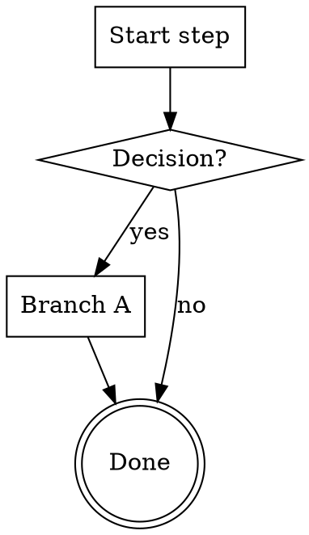

# Wayne <Title>

> <ONE line: a Chinese aphorism in this blockquote, OR an English contrast vs a
> sister skill ("mind-explode defines WHAT, plan defines HOW"). Never a paragraph.>

<one-line statement of what this skill guarantees / does.>

## Inherits from ~/.claude/CLAUDE.md

Inherits the Wayne control-plane invariants; does NOT redeclare them
(Language / Engineering Principles / Code Standards / Behavior / proportional
effort). This skill only specifies <the workflow> below.

## Boundary vs neighbors

<Name the closest sibling skill(s) and the one line that keeps THIS skill
separate. If a reader can't tell from this table when to reach for this vs the
neighbor, the boundary is wrong — it should have been an Extend, not a New.>

| Skill | Input | Output |
|---|---|---|
| **<kebab-name>** | <what it takes> | <what it produces> |
| <closest neighbor> | <its input> | <its output> |

## When to Run

- **Manual:** `/<kebab-name>` [optional args].
- **Auto-trigger phrases:** <from evidence, bilingual>.

**Skip when:** <the cheap-path case where the skill is overkill>.

## Flow

<!-- Keep this section ONLY if the flow has ≥1 decision branch. Convention:
     ```dot fence; digraph <name> { rankdir=TB; … }
     [shape=box]=action  [shape=diamond]=decision  [shape=doublecircle]=terminal
     [style=bold]=the one load-bearing dispatch/gate step
     every diamond's out-edges labelled [label="yes"] / [label="no"]
     declare all nodes first, then all edges; balance braces; ≥1 terminal -->



## Process Flow

<Draft from the actual step sequence observed in the evidence sessions.
Each step: action → verify check. Mark human gates explicitly.>

1. <Step> → verify: <check>
2. <Step> → verify: <check>
3. <Step> → verify: <check>

## Anti-patterns

- <the mistake the evidence sessions show being corrected>
