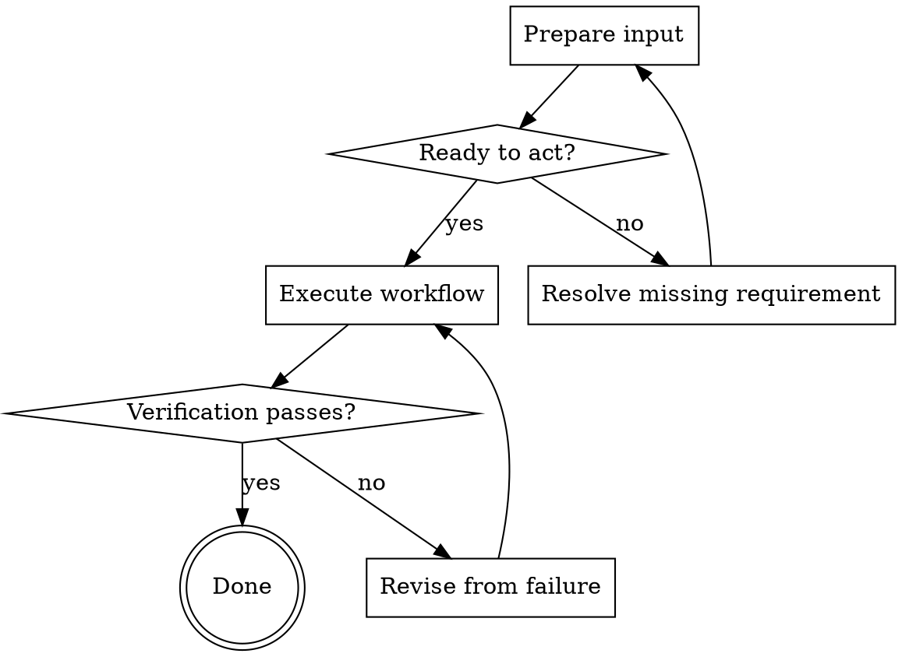

# <Skill title>

<One sentence: the unique result this skill guarantees.>

<!-- Add a compact Boundary section only when a neighboring skill can be confused
     with this one. Do not add an Inherits block or a body When-to-Run section. -->

<!-- Before compressing, map every approved requirement to body / reference /
     template / validator / eval. If the output has two or more of: exact grammar,
     cross-field references, unique ownership, verbatim carry, ordered dependencies,
     or machine terminals, add one schema reference, one aligned template, and a
     deterministic validator. Freeze exact literals/sentinels/cardinalities before
     drafting. For runtime source inputs, rebuild that literal/relationship ledger
     from the actual sources. Link resources directly and run one valid fixture plus
     one minimal mutation per independent invariant; self-consistency is not intent
     fidelity. Stop on contradictory clauses. Source-relative checks read their source. -->

## Flow

<!-- Keep Flow only when there is a branch, loop, retry, approval gate, or multiple
     terminals. Otherwise delete this section and use one numbered Process. Flow
     owns sequence and branching; Process expands node details without restating it. -->

## Process

### A. Prepare input

- Input: <exact artifact or state>.
- Action: <skill-specific action>.
- Verify: <observable condition>.

### C. Resolve missing requirement

- Ask or fail only when the missing fact cannot be discovered safely.
- Verify: <required fact now exists>.

### D. Execute workflow

- Action: <the non-obvious sequence or local rule>.
- Output: <artifact or state transition>.
- Verify: <observable condition>.

<!-- For a machine-checkable output, D creates from the canonical template and E
     runs the bundled validator. Do not replace execution with manual inspection. -->

### F. Revise from failure

- Use the failed check as evidence; change one variable at a time.
- Return to D after the cause is addressed.

<!-- Add Red lines or Anti-patterns only for observed, recurring failures. -->
