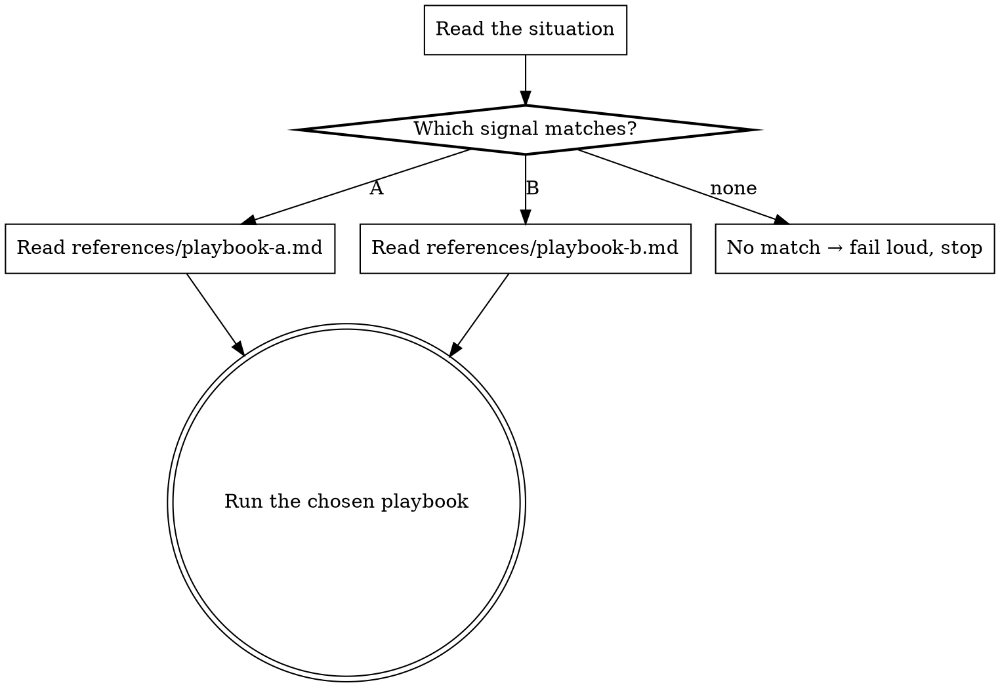

# Wayne <Title>

> <ONE line: a Chinese aphorism in this blockquote, OR an English contrast vs a
> sister skill. Never a paragraph.>

<one-line statement: this skill routes <situation family> to one of N playbooks;
it selects, it does not execute.>

## Inherits from ~/.claude/CLAUDE.md

Inherits the Wayne control-plane invariants; does NOT redeclare them
(Language / Engineering Principles / Code Standards / Behavior / proportional
effort). This skill only specifies <the routing + the playbook set> below.

## Boundary vs neighbors

<A router defines itself by the DISPATCH it owns — it holds no playbook internals.>

| Skill | Owns | Does NOT |
|---|---|---|
| **<kebab-name>** | selecting the right playbook for the situation | the playbook internals (each lives in references/) |
| <closest neighbor> | <its job> | <…> |

## Playbooks — the selection table (this IS the router)

<The core. Route on an OBSERVABLE signal, never on vibes. ≥3 rows or this should
have been a procedure with a branch. Each playbook is ONE file in references/,
exactly one level deep. A playbook >100 lines gets its own TOC.>

| Signal you observe | Playbook | What it does |
|---|---|---|
| <the concrete, checkable condition> | `references/<playbook-a>.md` | <one line> |
| <…> | `references/<playbook-b>.md` | <one line> |
| <…> | `references/<playbook-c>.md` | <one line> |
| **none of the above** | — | STOP, say no playbook fits, ask (fail loud) |

## Flow

<!-- Router flow: the diamond IS the routing decision; terminals read a playbook.
     ```dot fence; digraph <name> { rankdir=TB; … }
     [shape=box]=action  [shape=diamond]=decision  [shape=doublecircle]=terminal
     [style=bold]=the routing dispatch step
     declare all nodes first, then all edges; balance braces; ≥1 terminal -->



## Anti-patterns

<For a router, anti-patterns are ROUTING failures — not "skipped a step".>

- Routing on vibes instead of an observable signal — the table must be checkable.
- Playbook internals leaking into the index (SKILL.md does routing, nothing else).
- Nested references (a playbook linking to another playbook) — agents partial-read
  and lose content; keep every playbook one level deep from SKILL.md.
- <3 playbooks — that's a procedure with an `if`, not a router (Delete>Add).
- Forcing the nearest playbook when none fits, instead of failing loud.
