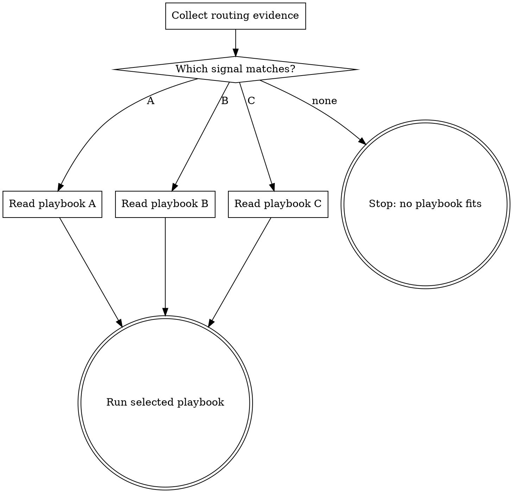

# <Skill title>

<One sentence: select one playbook from observable evidence; do not execute every playbook.>

<!-- Map every routing requirement to one owner before compressing. When routing
     inputs or outputs have an exact schema, keep that schema in one direct
     reference and validate it; do not duplicate it across playbooks. -->

## Playbooks

<!-- Require at least three genuinely different playbooks. Each reference is one
     level below SKILL.md and owns its complete procedure. -->

| Observable signal | Playbook | Result |
|---|---|---|
| <checkable condition A> | `references/<playbook-a>.md` | <one line> |
| <checkable condition B> | `references/<playbook-b>.md` | <one line> |
| <checkable condition C> | `references/<playbook-c>.md` | <one line> |
| none match | — | stop, report missing coverage, ask only if needed |

## Flow

## Process

### A. Collect routing evidence

- Gather only fields used by the selection table.
- Verify: every routing claim traces to an observed value.

### C. Read playbook A

- Read `references/<playbook-a>.md` completely, then follow it.

### D. Read playbook B

- Read `references/<playbook-b>.md` completely, then follow it.

### E. Read playbook C

- Read `references/<playbook-c>.md` completely, then follow it.

<!-- Do not repeat playbook internals here. Add routing anti-patterns only when
     an eval shows a recurring misroute. -->
