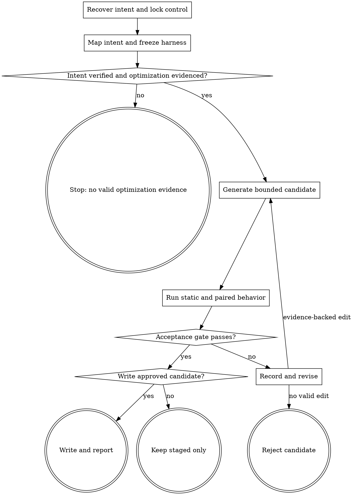

# Wayne Skill Optimize

Improve one existing skill only when frozen behavioral evidence proves the change.

## Boundary

- `wayne-distill` discovers patterns; `wayne-skill-forge` authors candidates; this
  skill owns target lock, harness, A/B execution, acceptance, and rejected edits.
- One run changes one skill and `eval/<skill-name>/` only. Never create or edit
  parent `eval/` files, including `.gitignore`, to support the run; return
  shared-owner changes separately.

Read `wayne-skill-forge` and its `references/eval.md` completely before building
the harness or candidate. Do not restate their authoring and scoring contracts.

## Flow

## Process

### A. Recover intent and lock control

- Name the target and goal; from its repository root capture status, control-tree
  hash, model, effort, tools, permissions, and harness. Preserve unrelated dirt.
- Recover the target's approved design before treating its current text as the
  contract. Inspect creation and pre-optimization commits, direct resources,
  durable design/eval docs, repository policy, current behavior, and available
  user corrections. Record a missing source as absent; do not replace history with
  the current file.
- Treat the reported failure as a seed, not the coverage boundary. Separate each
  recovered fact into intended behavior, a defect already present in control, or
  incidental implementation detail. Preserve intended behavior, target intended
  control defects, and do not fossilize incidental mechanisms.
- When a raw failure trace exists, preserve the durable pre-state, the user's exact
  transition, and the first wrong action. Otherwise build the smallest replay from
  the correction and say the trace is absent.
- For a transition failure, recover the affected milestone's precondition, setter,
  allowed next action, forbidden next action, and mutable artifact. A milestone is
  not implicit execution permission.
- For a cross-skill failure, inspect the affected producer, consumer, and shared
  owner. A local validator pass cannot prove pipeline compatibility; do not copy a
  shared schema into the target.
- Before preserving any validator as historical intent, name the actual non-AI
  consumer that parses or executes the artifact. If the downstream consumer is an
  agent reading Markdown, classify heading/table/regex/schema enforcement as an
  incidental mechanism or defect unless an approved source explicitly requires a
  real machine interface.

### B. Map intent and freeze the harness

- Create or reuse `eval/<skill-name>/`; keep generated state only under the
  gitignored `eval/.runs/<skill-name>/`. Map each recovered behavior to source,
  classification, owner, oracle, case, and status. Cover applicable flow, state,
  timing, approval, error, retry, routing, dependency, and mutation behavior.
  `UNVERIFIED` intended behavior blocks generation.
- Source cells cite the exact artifact path and commit when available; `history`,
  `feedback`, or `policy` alone are not traceable sources.
- Split compound requirements; each row needs its own real structural, behavioral,
  or AI semantic oracle and mutation, not a sibling's check.
- For an affected milestone, start its case from the durable pre-state and assert
  both the allowed transition and the first forbidden mutation. For an affected
  shared field, cover producer output, consumer input, owner, and end-to-end use.
- Reverse-map every normative source clause to a row or incidental rationale.
- Use both proof layers, with separate jobs:
  - deterministic gates check directly observable low-freedom facts such as schema,
    hashes, exact literals, IDs, closure, file mutation, and event order;
  - an AI source-fidelity gate reads the complete sources and judges intent,
    classification, completeness, equivalence, causality, and normativity.
  When a requirement has both parts, both gates must pass.
- Never keep a lexical semantic proxy merely because an AI gate was added. Regex,
  headings, keywords, substrings, counts, and similarity may locate a bounded
  structure or validate its grammar; they cannot decide what prose means. If such
  a check has no independently useful structural invariant, remove it from the
  gate. If machine validation is required, change the owned data shape to expose a
  real field instead of parsing prose.
- Audit prompt-level policing as well as scripts: inspect `SKILL.md`, references,
  templates, examples, and eval prompts for exact headings, section order, phrase
  bans, counts, arrow shape, or table grammar that pretends to decide AI-readable
  meaning. Move useful observations to the AI reviewer; remove them from runtime.
- Calibrate this boundary in both directions: a paraphrase with the same meaning
  must pass the AI gate, while same-shaped text with weaker scope, ownership,
  modality, timing, or meaning must fail it. Separately mutate each structural
  invariant and require the deterministic gate to fail.
- A failure case preserves the raw task, minimum artifact, causal mechanism, exact
  oracle, neighboring regression, and held-out transfer. For temporal behavior,
  observe each required write before the next transition and include a wrong-order
  mutation with the same final state; final-state equality is not timing proof.
- When policy forbids a dependency, inventory the capabilities it owned. Freeze
  positive replacement cases and a negative use check; deleting only its name is
  not a replacement.
- Run control first; a preserved historical trace counts. If only a user correction
  exists and stochastic control passes, retain it as a stability regression but do
  not claim a target flip. Provider/tool failure cannot justify a skill rule.
- Calibrate every deterministic checker with a valid fixture and one mutation per
  independent invariant. Freeze task, fixtures, checker, and hashes before D.
- Audit validation cost: each runtime gate must prevent a named failure through a
  direct observable. Delete redundant gates and checks whose false-rejection/token
  cost exceeds the invariant they protect. Consolidate structural checks into one
  pass and rerun only after an owning input or artifact changes.
- Treat a full-repository walker, unrelated-file read, or permission repair needed
  only by an evaluator as an evaluator defect. Git start state, agent write history,
  and final diff are enough for AI-authored document scope unless a named machine
  consumer requires more.

### D. Generate a bounded candidate

- Give `wayne-skill-forge` only the control, goal, evidence, and frozen harness;
  generate under the run directory only after every intended row is verified.
- Change one failure family minimally. Preserve ownership, exact literals, approval,
  mutation semantics, and portability; never rewrite broadly for one miss.

### E. Run static and paired behavior

- Run Forge static validation, lint, and every bundled script with its positive and
  mutation fixtures.
- Run control and candidate in fresh isolated contexts with identical inputs. For
  a cross-agent skill, run every required case with both Claude and Codex.
- Run the frozen deterministic gate and a blind AI semantic judge as separate
  gates. For generator skills, also execute the generated artifact through a fresh
  downstream agent.
- Mark provider, timeout, or tool-use termination without an observable artifact
  as `invalid`; do not convert it to a behavioral loss or repair output manually.

Accept only when all applicable gates pass:

- targeted failure: control fails and candidate passes;
- regression: every control-pass case remains passing;
- original intent: every intended row in the frozen matrix passes;
- held-out: no task-success, safety, approval, mutation, ownership, or routing loss;
- pure slimming: behavior is equal and candidate context is smaller.

### R. Record rejected edit

- Record candidate hash, edit, case IDs, findings, and score drop. Change one
  evidence-backed variable per retry; never weaken or reveal the oracle.

### G. Write approved candidate

- Show the paired result, invalid cells, size delta, rejected edits, and residual
  uncertainty in plain Chinese.
- Write the candidate to the live skill only after the acceptance gate and user
  approval, unless the user explicitly requested the live edit.
- Re-run the repository harness from the live path. Do not commit, push, install,
  or sync unless separately asked.

## Red lines

- Static cleanliness or fewer lines alone never proves improvement.
- The current skill and one user-reported gap are evidence, not complete intent.
- Do not add an anti-pattern without a control-reproduced exact failure case.
- Do not let a lexical rule decide prose meaning. Adding an AI judge does not make
  a semantic-proxy regex valid; retain only a separately useful structural check.
- Do not create or preserve a runtime schema/validator for agent-to-agent Markdown.
- Do not treat repeated user correction of the same mechanism as an isolated case;
  add it to intent-regression recovery and search every prompt/resource owner.
- Do not spend an AI judge on a fact a hash or schema settles exactly. Use both
  gates when a requirement genuinely has independent structural and semantic parts.
- Do not infer temporal correctness from final-state equality.
- Do not remove a forbidden mechanism without proving replacement capabilities.
- Do not change a frozen checker after seeing candidate output; invalidate and
  restart the run if the evaluator itself is wrong.
- Do not let a candidate read the other side, hidden tests, identity map, or judge.
- Do not accept one agent's pass as proof for a cross-agent skill.
