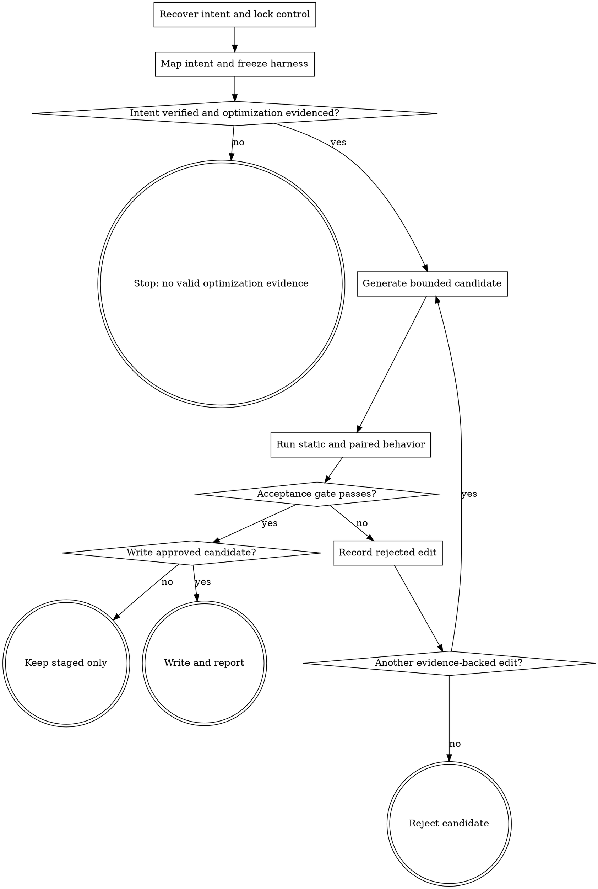

# Wayne Skill Optimize

Improve one existing skill only when frozen behavioral evidence proves the change.

## Boundary

- `wayne-distill` discovers recurring patterns across history.
- `wayne-skill-forge` authors the minimum candidate from approved evidence.
- This skill owns the optimization run: target lock, durable harness, control,
  bounded iterations, paired execution, acceptance, and rejected-edit history.
- Work on exactly one target skill per run. Mutate only its directory and
  `eval/<skill-name>/`; return shared-owner changes as a separate request.

Read `wayne-skill-forge` and its `references/eval.md` completely before building
the harness or candidate. Do not restate their authoring and scoring contracts.

## Flow

## Process

### A. Recover intent and lock control

- Require an existing skill directory and name the exact optimization goal.
- Capture repository status and hash the full control tree before editing.
- Record model, effort, tools, permissions, and agent harness for paired trials.
- Preserve unrelated dirty files. Never optimize several skills in one candidate.
- Recover the target's approved design before treating its current text as the
  contract. Inspect creation and pre-optimization commits, their messages, direct
  resources, durable design/eval docs, repository policy, current behavior, and
  every available user correction or session artifact. Record a missing source as
  absent; do not silently replace history with the current file.
- Resolve the repository owner from the target path before reading status or
  history, and run every Git query from that root. An enclosing harness or parent
  repository is not evidence that the target has no history.
- Treat the reported failure as a seed, not the coverage boundary. Separate each
  recovered fact into intended behavior, a defect already present in control, or
  incidental implementation detail. Preserve intended behavior, target intended
  control defects, and do not fossilize incidental mechanisms.

### B. Map intent and freeze the harness

- Create or reuse `eval/<skill-name>/`; generated state belongs only under the
  gitignored `eval/.runs/<skill-name>/`.
- Before candidate generation, write an intent coverage matrix with one row per
  recovered behavior and columns for source, classification, owner, exact oracle,
  case, and status. Cover output, control flow, state ownership, timing, approval,
  error, retry, routing, dependency, and mutation semantics when present. Every
  intended row needs an executable behavioral, static, or script oracle; any
  `UNVERIFIED` row blocks candidate generation and acceptance.
- Source cells cite the exact artifact path and commit when available; labels such
  as `history`, `feedback`, or `policy` alone are not traceable sources.
- Split compound requirements into independent rows, each with its own asserted
  oracle and mutation. A row stays `UNVERIFIED` when its checker tests only a
  sibling behavior named in that row.
- Reverse-audit every normative source clause into one matrix row or an explicit
  incidental rationale. A source clause with neither mapping blocks the matrix.
- For failure-driven work, preserve the raw task, minimum artifact, causal failure
  mechanism, exact oracle, neighboring regression, and held-out case.
- Prove temporal requirements with ordered transition or event evidence. Observe
  each required durable write before feeding the next turn or terminal boundary;
  a correct final file is not timing proof.
- A temporal case includes at least two transitions and one mutation with the same
  correct final state but the wrong event order; deleting the final state is not
  sufficient calibration for timing.
- When policy forbids a dependency, inventory every capability and review type it
  owned. Freeze positive replacement cases and a negative absence check for invoke,
  load, install, and reference behavior; deleting only its name is not a replacement.
- Run the control first. A failure that does not reproduce, lacks a causal
  mechanism, or is provider/tool infrastructure cannot justify a skill rule.
- For pure slimming, freeze common, boundary, and failure/no-match behavior; size
  becomes relevant only after behavioral parity.
- Calibrate every deterministic checker with a valid fixture and one mutation per
  independent invariant. Freeze task, fixtures, checker, and hashes before D.

### D. Generate a bounded candidate

- Give `wayne-skill-forge` only the control, approved goal, raw evidence, and frozen
  harness. Write the candidate under the run directory, never over the live skill.
- Do not generate while any intended row lacks its source or executable oracle.
- Apply the smallest add/delete/replace set for one failure family. Do not perform
  an uncontrolled rewrite or add a general essay for one miss.
- Preserve requirement ownership, exact literals, approval boundaries, mutation
  semantics, and agent portability unless the target is explicitly agent-specific.

### E. Run static and paired behavior

- Run OpenAI quick validation, Forge static validation, lint, and every bundled
  script with its positive and mutation fixtures.
- Run control and candidate in fresh isolated contexts with identical inputs. For
  a cross-agent skill, run every required case with both Claude and Codex.
- Apply frozen deterministic checks before blind judgment. For generator skills,
  execute the generated artifact through a fresh downstream agent.
- Mark provider, timeout, or tool-use termination without an observable artifact
  as `invalid`; do not convert it to a behavioral loss or repair output manually.

Accept only when all applicable gates pass:

- targeted failure: control fails and candidate passes;
- regression: every control-pass case remains passing;
- original intent: every intended row in the frozen matrix passes;
- held-out: no task-success, safety, approval, mutation, ownership, or routing loss;
- pure slimming: behavior is equal and candidate context is smaller.

### R. Record rejected edit

- Append the candidate hash, edit summary, case IDs, findings, and score drop to
  the run record.
- Change one evidence-backed variable before retrying. Do not weaken the oracle or
  expose its expected answer to make the candidate pass.

### G. Write approved candidate

- Show the paired result, invalid cells, size delta, rejected edits, and residual
  uncertainty in plain Chinese.
- Write the candidate to the live skill only after the acceptance gate and user
  approval, unless the user explicitly requested the live edit.
- Re-run the repository harness from the live path. Do not commit, push, install,
  or sync unless separately asked.

## Red lines

- Static cleanliness or fewer lines alone never proves improvement.
- The current skill and one user-reported gap are evidence, not complete intent.
- Do not add an anti-pattern without a control-reproduced exact failure case.
- Do not infer temporal correctness from final-state equality.
- Do not remove a forbidden mechanism without proving replacement capabilities.
- Do not change a frozen checker after seeing candidate output; invalidate and
  restart the run if the evaluator itself is wrong.
- Do not let a candidate read the other side, hidden tests, identity map, or judge.
- Do not accept one agent's pass as proof for a cross-agent skill.
