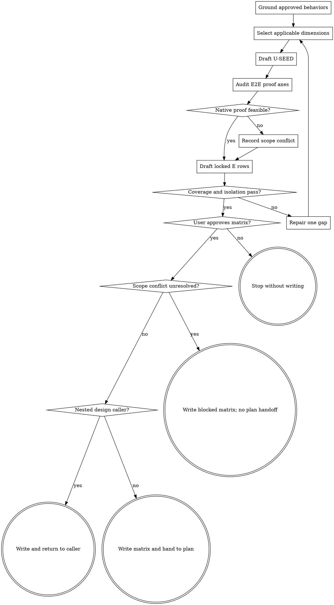

# Wayne Test Design

Define how an approved behavior will be proved before planning or implementation.

## Boundary and ownership

Produce one durable `docs/test-matrix/` artifact; never write test code, implement,
or execute tests. Read `_shared/pipeline-id-contract.md`, `_shared/e2e-contract.md`, and the canonical
[matrix template](templates/test-matrix-template.md) completely.

The matrix has two state owners:

- `wayne-test-design` authors E rows and initializes their locked Status to `⬜`;
  only `wayne-verify` later changes it to `✅/❌`.
- This skill proposes behavior-level `U-SEED` rows at `☐`; `wayne-plan` re-authors,
  binds, and locks them to implementation units before `wayne-work` may set `☑`.

If a spec already contains an E2E table or `E2E: none — <reason>`, absorb that
contract verbatim exactly once, extend any missing observable paths, declare the
matrix the new SSoT, and never maintain a second authored copy.

An explicit user-approved path wins. Otherwise write the next unused
`docs/test-matrix/YYYY-MM-DD-NNN-<descriptive-name>-test-matrix.md`.

## Dimension menu

| Dimension | Use only when the behavior has |
|---|---|
| positive / negative | success or valid-but-disallowed branches |
| edge / invalid / boundary | range edges, malformed types, or explicit limits |
| concurrency | multiple actors on shared mutable state |
| error-path | a reachable downstream/startup/partial failure |
| persistence | a real write/reload/restart boundary |

This is a considered menu, not a quota. Omit structurally impossible dimensions.
Write `none — <reason>` only when a competent reviewer would expect the dimension
and should be able to challenge its exclusion. Merge cases that prove the same branch.

## E2E isolation contract

Before writing E rows, classify each candidate by exactly one primary proof axis:
`functional`, `policy/capability attestation`, `aggregate/fan-out`, or
`resilience/cleanup`.

- Split a prerequisite that may terminate before the target behavior. Strict policy
  rejection cannot also prove later streaming, resume, hooks, or cleanup.
- Use provider-specific rows whenever behavior, limitations, or evidence differs by
  provider. Span providers only when aggregation itself is the requirement.
- A positive capability row must name the native runtime field, event, or provider
  record proving the effective capability. Flags, argv, help, and accepted config
  prove requested intent only.
- If a claimed capability has no native proof, record a capability/spec conflict and
  stop plan approval; do not author a knowingly unreachable positive row. A specified
  fail-loud rejection may have its own negative row.
- A supported weaker functional mode may bypass strict attestation only when its
  observable visibly requires the literal `POLICY UNVERIFIED`; it never satisfies
  the strict capability requirement.

## Flow

## Process

### A. Ground approved behaviors

Read the spec, decision log, plan, bug report, or converged direct request in that
order; route unconverged intent upstream. Map every named requirement and test-relevant
decision, non-goal, and failure semantic. For a bug, preserve the reproducing regression
case. Search matching KB lessons when available; cite each matched lesson in its row,
or record `Lessons: none matched`. Absorb any existing E2E contract before adding rows.

### B. Select applicable dimensions

Decompose by behavior, not speculative implementation units. Walk the menu for each
behavior, keep distinct reachable branches, and cut framework tests, impossible states,
and duplicate boundaries. Record only reviewer-surprising exclusions.

### C. Draft U-SEED

Always write the exact heading `U-SEED (wayne-plan re-authors + locks)`. Each row
must communicate a concrete input or precondition, action, and observable expected
result, including multiple branches when behavior requires them. This is a semantic
scenario contract, not a required arrow count or sentence shape. Use `unit` or
`integration` layer and Status `☐`; if none are sound, write
`U-SEED: none — <reason>` below the heading. Do not bind rows to implementation
units that do not exist yet.

### D/E. Audit E2E isolation and evidence

In the template's `E2E Proof-Axis Audit`, list functional, attestation, aggregate,
and cleanup rows by provider. For every capability claim, name its native evidence or
record the exact scope conflict. Check that no prerequisite prevents reaching the
behavior an E row claims to prove. The axis cell is a structured enum; whether the
scenario actually proves that axis is an AI judgment over the complete behavior and
evidence, never a keyword or substring classification.

### F. Draft locked E rows

Use the seven locked columns from `_shared/e2e-contract.md` exactly. Each row names
one real user path, concrete process/data/entrypoint, one user-visible observable,
one proof axis, and initial Status `⬜`. Transport proxies such as `200 OK` are not
observables. Always emit the locked header; when no user-observable path exists,
leave it empty and follow it with `E2E: none — <reason>`.
When a runtime exists only at a fixed host, port, database, cwd, or main worktree,
pin that location in `Env: process`; naming only the start command is insufficient.

### G. Cross-check

Require every requirement, test-relevant decision, and matched lesson to map to a U
or E row or an explicit non-testable rationale; every user path to map to E; every E
row to have one axis, reachable prerequisites, correct provider granularity, and
feasible evidence; and every status/column owner to remain intact.
Summarize coverage as `R1✓ R2✓ (E2E: E1,E2 | U-SEED: S1-S4)`.
Use deterministic checks for the table schema, IDs, enum values, statuses, and
ownership closure. Use AI review of the complete sources for semantic coverage,
axis correctness, reachability, observability, and capability claims; both layers
must pass, and a lexical semantic proxy is not an additional gate.

### H/I/J. Approve and route

Present dimensions kept, challengeable omissions, proof conflicts, and the matrix.
Write only after approval. An unresolved scope conflict produces a blocked matrix and
stops without a plan handoff. When invoked by `wayne-mind-explode` or `wayne-plan`,
return the written matrix to that caller so it can reference the SSoT; do not
auto-advance. Only a standalone, unblocked run emits a return-only handoff to
`wayne-plan`. Never plan, implement, or run it here.
