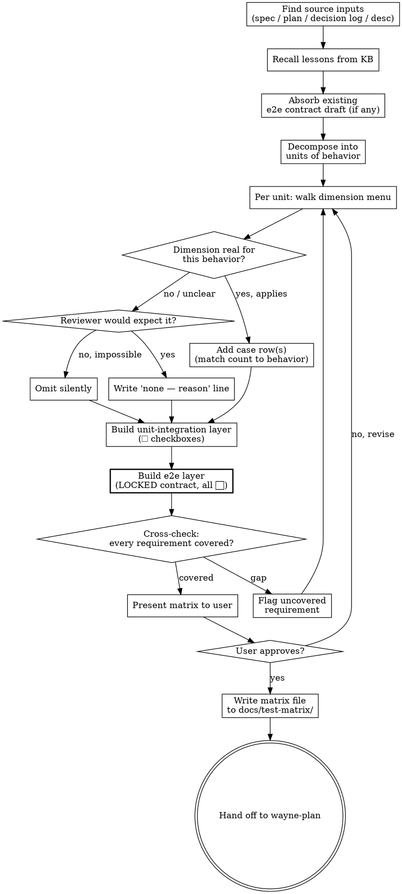

# Wayne Test Design

`wayne-mind-explode` defines **WHAT**. `wayne-plan` defines **HOW**. `wayne-test-design`
defines **HOW WE KNOW IT WORKS** — the full test matrix, before any test code is written.

This skill produces a durable **test-matrix doc**. It does **not** write test code, run
tests, or execute anything. Writing tests is `wayne-work`'s job; running the e2e proof is
`wayne-verify`'s job. This skill only decides *which cases must exist*.

## Inherits from ~/.claude/CLAUDE.md

This skill inherits the Wayne control-plane invariants and does not redeclare them. The
following are assumed and MUST NOT be repeated below:

- Language Rules (Chinese to user, English to files)
- Engineering Principles (KISS / YAGNI / DRY / SSoT / Fail-Loud / Push-Don't-Poll / Delete>Add)
- Code Standards (uv run python, markdown tables)
- Behavior Baselines (Think Before / Simplicity / Surgical / Goal-Driven)
- Skill invocation rule (proportional effort)

This skill only specifies the test-matrix design workflow.

## Where it sits in the workflow

```
wayne-mind-explode  →  wayne-test-design  →  wayne-plan  →  wayne-work  →  wayne-code-review  →  wayne-verify  →  wayne-ship
   (WHAT)               (HOW WE KNOW)         (HOW)          (BUILD)        (STATIC GATE)         (RUN e2e)        (PR)
```

- Runs **after** a spec exists (so behavior is settled) and **before** `wayne-plan`
  (so the plan's implementation units can each point at matrix rows they must satisfy).
- Is **invoked by** `wayne-mind-explode` at the end of design — mind-explode no longer
  authors the e2e contract itself; it delegates the whole matrix (e2e layer included) to
  this skill (see "Integration with mind-explode" below).
- Can also run **standalone** against an existing spec, plan, or just a clear feature
  description / bug report.

## The wrapper relationship (read this first — it's the core design)

This skill is a **wrapper around `_shared/e2e-contract.md`, not a replacement.**

- The test matrix has **two layers**: unit-integration and e2e.
- The **e2e layer IS the E2E Verification Contract** — same LOCKED columns, same Status
  lifecycle, same rules. This skill does not redefine that format; it embeds it. Read
  `_shared/e2e-contract.md` and reproduce its table exactly for the e2e layer.
- The **unit-integration layer** is plain checkbox rows the developer ticks themselves.
  It has its **own** status symbols (`☐` / `☑`) deliberately distinct from the e2e
  `⬜ / ✅ / ❌`, so the two never get confused.

**Status authority is split and absolute:**

| Layer | Symbols | Who may flip to "done" |
|---|---|---|
| unit-integration | `☐` → `☑` | developer / `wayne-work` (a passing unit test ticks it) |
| e2e | `⬜` → `✅` / `❌` | **`wayne-verify` ONLY** — a passing unit test NEVER flips it |

A green unit suite ticks `☑` boxes and has **zero** bearing on the `⬜` e2e rows. This is
the whole point of the wrapper: it keeps "code is tested" and "feature actually works in
real use" as two separate, non-substitutable facts.

## SSoT: split authorship — E layer owned here, U layer seeded here and locked in wayne-plan

Authorship is split by layer, because the two layers bind to structure that exists at
different times:

- **E layer (e2e contract) — `wayne-test-design` owns it outright.** It is user-path /
  behavior level and does not depend on implementation units, so it can (and must) be
  authored here. If a spec from `wayne-mind-explode` already contains an E2E Verification
  Contract draft, this skill **absorbs and extends** it — never a parallel copy. The matrix
  doc becomes the single source for E rows; the spec's draft is superseded. `wayne-plan`
  carries E rows **verbatim** and may not add, drop, or status-mutate them.
- **U layer (unit-integration) — `wayne-test-design` authors only SEED candidates.** The
  implementation units a U row binds to **do not exist until `wayne-plan`**. So this skill
  cannot lock U rows to units; it only proposes behavior-level candidates. **`wayne-plan` is
  the final author/owner of U rows** — it re-expresses each against its unit's real
  files/functions and locks it to exactly one owning unit (bidirectional-coverage gate).
- Never let the E contract live in two authored places. Two authors = drift = the exact
  bug class CLAUDE.md forbids. (U rows have one author too — wayne-plan — after the seed
  handoff.)

---

## Don't over-design tests (hard constraint)

The matrix is a **considered-dimensions checklist, not a fill-every-cell grid.** YAGNI
applies to tests as hard as it applies to code.

**Rules:**

1. **Only enumerate dimensions the behavior actually has.** A pure formatting function has
   no concurrency, no persistence, no error-path, no auth. Do **not** invent cases for
   structurally-absent dimensions, and do **NOT** even write a `none — reason` line for
   them. They simply don't appear. Forcing `none` rows for impossible dimensions is itself
   over-design and noise.

2. **Write `none — <reason>` ONLY for a dimension a reviewer would reasonably expect but
   you deliberately exclude.** Example: a write endpoint with no negative/auth case → that
   absence is suspicious, so it must be declared: `negative: none — endpoint is unauthenticated by design, see decision #4`. The `none` line exists to be *challenged*, so reserve it for genuinely challengeable gaps (Fail-Loud), not for dimensions that can't exist.

   Decision test: *"Would a competent reviewer be surprised this dimension is missing?"*
   - Yes → write the `none — reason` line so they can challenge it.
   - No (dimension is structurally impossible) → omit silently.

3. **One good case beats five redundant ones.** Three boundary values that exercise the
   same branch = one row, not three. Match case count to distinct behavior, not to a quota.

4. **A senior-engineer smell test:** would they say "this test matrix is bloated / testing
   the framework / testing impossible states"? If yes, cut.

The skill's value is *coverage of what matters*, never *maximal coverage*.

---

## The Dimensions

A standard menu. For each unit of behavior, walk the menu and keep only the dimensions that
**really apply** (per the over-design constraint above).

| Dimension | Asks | Typical layer |
|---|---|---|
| **positive** | Core happy path with expected inputs → expected outputs | both |
| **negative** | Valid-shape but wrong/disallowed input (unauthorized, forbidden, conflicting state) | both |
| **edge** | Boundary of the valid range: empty, single, max, first/last, off-by-one | mostly unit |
| **invalid** | Malformed / wrong-type / unparseable input rejected cleanly | mostly unit |
| **boundary** | Numeric / size / length / time limits exactly at and just past the threshold | unit |
| **concurrency** | Two+ actors on the same state: races, double-submit, lost update | both (only if shared mutable state exists) |
| **error-path** | Downstream failure: timeout, 5xx, disconnect, partial write → fail loud, no silent degrade | both |
| **persistence** | State survives the boundary: write-through, reload, restart, write-then-read consistency | mostly integration/e2e |

These map onto Wayne invariants: **error-path** ↔ Fail-Loud, **persistence** ↔ SSoT/Postgres
write-through, **concurrency** ↔ multi-writer drift. Use the invariant to judge whether the
dimension is real for this behavior.

---

## Checklist

You MUST create a task for each and complete in order:

1. **Find source inputs** — spec, decision log, plan, or feature description
2. **Recall lessons from KB** — past `type: lesson` entries whose `trigger` matches; a
   lesson often names a dimension that bit us before (a missed error-path, a race)
3. **Absorb any existing e2e contract** — if the spec has an E2E Verification Contract
   draft, pull it in as the seed of the e2e layer (do not duplicate it)
4. **Decompose into units of *behavior*** — NOT implementation units (those don't exist
   until `wayne-plan`). Decompose against the spec's requirements / behaviors.
5. **Walk the dimension menu per behavior** — keep only real dimensions; apply the
   no-over-design constraint; declare reviewer-surprising gaps as `none — reason`
6. **Build the U-layer SEED** — behavior-level checkbox candidates (`☐`), input → action →
   expected, **NOT yet bound to units**. Label the block `U-SEED (wayne-plan re-authors + locks)`.
   Skip if no behavior decomposition is stable yet — wayne-plan will author U rows from scratch.
7. **Build the e2e layer** — reproduce the LOCKED contract format from
   `_shared/e2e-contract.md`, all Status `⬜`; absorb the spec draft if present
8. **Cross-check coverage** — every spec requirement maps to ≥1 row in some layer; every
   user-observable path has an e2e `⬜` row; flag any requirement with no test
9. **Present matrix to user** — render both layers in Chinese, confirm dimensions kept vs
   declared-none are right
10. **Write matrix file** — `docs/test-matrix/`, then hand off (matrix is an input to
    `wayne-plan`)

---

## Process Flow



---

## Phase 1: Find Source Inputs

Look for upstream artifacts in priority order:

1. **Spec** — `docs/specs/YYYY-MM-DD-*-design.md` (primary; contains requirements + any e2e draft)
2. **Decision log** — `docs/decisions/YYYY-MM-DD-*-decisions.md` (rationale, dead-code calls)
3. **Plan** — `docs/plans/YYYY-MM-DD-*-plan.md` (if test-design runs after a plan exists,
   align units to the plan's Implementation Units)
4. **User's direct description** — a clear feature request or bug report

If a spec exists, read every requirement (R1..Rn). The matrix must cover each.

If only a bug report exists, the matrix MUST include a **regression row** — the case that
reproduces the bug — in whichever layer can prove it (per CLAUDE.md: write a test that
reproduces, make it pass).

---

## Phase 2: Recall Lessons from KB

Scan the KB for past lessons whose `trigger` matches this work:

```bash
grep -rl "^type: lesson" /mnt/share/wayne-note/ --include="*.md" 2>/dev/null
```

Lessons are especially load-bearing here: a past lesson usually encodes **a dimension that
bit us** (a missed error-path, a silent fallback, a race). For each relevant lesson, ensure
the matrix has a row covering the failure mode it describes. Cite the lesson in that row's
note. If none match, note `Lessons: none matched` so the absence is intentional.

---

## Phase 3: Absorb Existing E2E Contract

If the spec already carries an E2E Verification Contract (table or `E2E: none — reason`):

- Pull it in as the **seed** of this matrix's e2e layer, verbatim rows, Status untouched (⬜).
- From here on, the matrix doc is the SSoT for the contract. Do not leave an independently-
  authored copy in the spec to drift — note in the matrix that it absorbed and now supersedes
  the spec draft.
- Then **extend** it: walk the dimension menu against the e2e layer and add any
  user-observable negative / error-path / persistence path the original draft missed.

If the spec has no contract draft, build the e2e layer fresh in Phase 5.

---

## Phase 4: Decompose into Units of Behavior

Break the feature into the smallest units that have **distinct testable behavior**.

- If a **plan exists**: mirror its Implementation Units one-to-one, so each plan unit can
  later cite the matrix rows it must satisfy.
- If **no plan yet** (test-design before plan, the default): decompose by requirement /
  seam / endpoint / component. The plan will later align to these.

Each unit is one row-group in the matrix.

---

## Phase 5: Build the Matrix

### 5.1 Walk the dimension menu per unit

For each unit, go down the dimension menu (positive / negative / edge / invalid / boundary /
concurrency / error-path / persistence) and apply the decision logic:

```
for each dimension:
    does this behavior really have this dimension?
        no, structurally impossible        -> omit silently (no row, no `none` line)
        yes, applies                       -> add case row(s); count = distinct behaviors, not a quota
        unclear / a reviewer would expect it but I'm excluding it
                                           -> write `none — <reason>` line so it can be challenged
```

Keep the over-design constraint in front of you: **omit impossible dimensions entirely;
reserve `none — reason` for challengeable gaps only.**

### 5.2 Unit-Integration layer (own status symbols)

Plain checkbox table. The developer / `wayne-work` ticks `☐ → ☑` when the test passes.

| # | Unit | Dimension | Case (input → action → expected) | Layer | Status |
|---|------|-----------|----------------------------------|-------|--------|
| U1 | team status badge | positive | status=`supported` → render → green "Supported" badge | unit | ☐ |
| U2 | team status badge | invalid | status=`"banana"` → render → falls back to neutral badge, logs warning | unit | ☐ |
| U3 | teams repo update | persistence | set status → reload row → status persisted | integration | ☐ |

- **Status** here is `☐` (todo) / `☑` (passing). Distinct from e2e on purpose.
- `unit` = isolated, mocks OK. `integration` = crosses a real seam (real DB), mocks discouraged.
- A `none — reason` declaration sits as its own line under the unit's rows, e.g.
  `U-teams-update concurrency: none — single-admin writer, no shared-row contention by design`.

### 5.3 E2E layer (the wrapped contract — LOCKED format)

Reproduce the format from `_shared/e2e-contract.md` **exactly** — do not redefine columns.
All Status start `⬜`. Only `wayne-verify` ever flips them.

| # | User path | Env: process | Env: data | Env: entrypoint | Observable (pass = ?) | Status |
|---|-----------|--------------|-----------|-----------------|----------------------|--------|
| E1 | Admin opens Teams, sets a team to Unsupported, reloads | `make dev` :8006 + next :5800 | real Postgres | browser `/admin/teams` | team row shows Unsupported badge after reload; DB row reflects it | ⬜ |

- Same trigger rule as e2e-contract: every user-observable path → a row; non-observable →
  the `E2E: none — <reason>` line; when unsure, write the row.
- **Observable is a real outcome**, never "200 OK" / "no exception".
- The e2e layer can (and should) include negative / error-path user journeys when they're
  observable (e.g. "submit invalid team name → inline error shown, nothing saved").

---

## Phase 6: Cross-Check Coverage

Before presenting:

1. **Requirement coverage** — every spec requirement R1..Rn maps to ≥1 row in some layer.
   A requirement with no row is a Fail-Loud gap: flag it, don't bury it.
2. **Observable coverage** — every user-observable path has an e2e `⬜` row (or a declared
   `E2E: none`).
3. **Lesson coverage** — every matched KB lesson's failure mode has a row.
4. **No bloat** — re-read with the over-design lens: any row testing the framework,
   an impossible state, or duplicating another row's branch → cut it.

Produce a one-line coverage summary: `R1✓ R2✓ R3✓ (E2E: E1,E2 | unit: U1-U7)`.

---

## Phase 7: Present to User

Render both layers (Chinese intro, English tables):

```
测试矩阵草稿如下,分两层:

【unit / integration 层】dev 自己跑,跑过打 ☑:
{render unit table}

【e2e 层】只有 wayne-verify 能翻 ✅,看真实可见结果不是 200 OK:
{render e2e contract table}

我按"只测真实存在的维度"来的 —— 比如 {unit X} 没有 concurrency 因为是单写,
直接没列;{unit Y} 是写接口但故意没做权限,我写了 `negative: none — reason` 让 review 能挑。

覆盖: R1✓ R2✓ R3✓。维度取舍对吗?有没有该测没测的?
```

Confirm dimensions kept vs declared-none. Revise on feedback.

---

## Phase 8: Write Matrix File + Hand Off

### 8.1 File naming

```
docs/test-matrix/YYYY-MM-DD-NNN-<descriptive-name>-test-matrix.md
```

Check existing files for today's date, increment NNN. Create `docs/test-matrix/` if absent.

### 8.2 Template

Read first, then write: `${HOME}/.claude/skills/wayne-test-design/templates/test-matrix-template.md`.
Use it verbatim — do not invent sections.

### 8.3 Hand off

1. If a decision log exists, append a row noting the matrix was produced and where.
2. Tell the user (Chinese): "测试矩阵已落盘 at `<path>`。要做实现计划请调用 `wayne-plan`,
   它会像带 e2e contract 一样把整张矩阵 verbatim 带走;`wayne-work` 实现时照矩阵打勾;
   e2e 行留给 `wayne-verify` 翻 ✅。"
3. If `wayne-test-design` was invoked **by** `wayne-mind-explode`, return the matrix to that
   flow so the spec's contract section points at the matrix as SSoT (return-only; do not
   auto-advance).

This skill never writes test code and never runs tests. It ends at the matrix doc.

---

## Integration with mind-explode and plan

**Invoked by `wayne-mind-explode` (standard).** mind-explode's Phase 5 invokes this skill
at the end of design instead of authoring the E2E Verification Contract itself. The matrix's
e2e layer subsumes the contract; the matrix becomes the contract's SSoT and the spec
**references** it rather than holding an independent copy. mind-explode never writes the
contract table itself anymore — single author, no drift.

**Consumed by `wayne-plan`.** wayne-plan carries the matrix **verbatim**, exactly as it
carries the e2e contract today. Each Implementation Unit cites the matrix row #s
(`U2, U3, E1`) it must satisfy. wayne-plan never mutates the matrix — unit Status stays `☐`,
e2e Status stays `⬜` until the respective executors run.

**Status flow downstream:**

| Skill | Touches matrix? |
|---|---|
| `wayne-test-design` (this) | **AUTHORS** it; unit rows `☐`, e2e rows `⬜` |
| `wayne-plan` | **CARRIES** verbatim; units cite row #s |
| `wayne-work` | builds tests; ticks unit `☐ → ☑` as they pass; never touches e2e `⬜` |
| `wayne-code-review` | reads it as the coverage spec; does not flip any status |
| `wayne-verify` | **EXECUTES** e2e layer; flips `⬜ → ✅ / ❌` only |
| `wayne-ship` | **GATES**: no `❌`, no remaining `⬜` in e2e; unit `☑` per project bar |

---

## Key Principles

- **Wrapper, not replacement** — e2e layer IS `_shared/e2e-contract.md`, embedded not redefined
- **Two layers, two status authorities** — `☑` is the dev's; `✅` is verify's; never substitute
- **Only real dimensions** — omit impossible ones silently; declare challengeable gaps as `none — reason`
- **No over-design** — case count matches distinct behavior, never a quota; a senior eng shouldn't call it bloated
- **One author for the contract** — this skill owns the matrix + e2e contract; no parallel copy in the spec
- **Coverage you can challenge** — every requirement maps to a row; every suspicious gap is written down to be argued
- **Design only** — never writes test code, never runs tests
