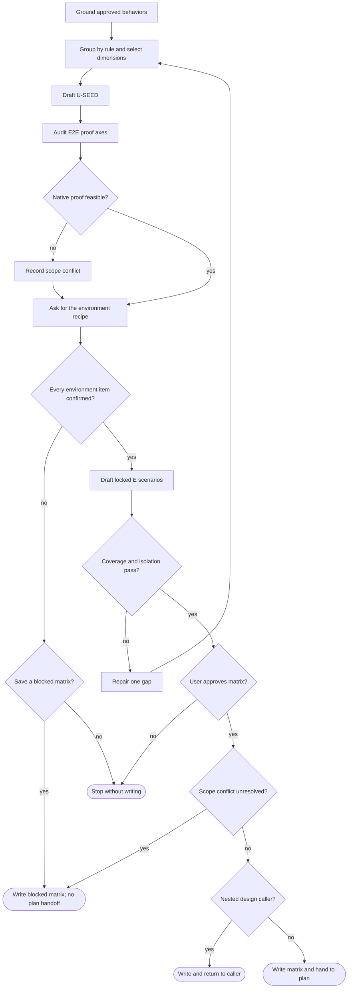

# Wayne Test Design

Turn an approved behavior into scenarios another agent can execute without reopening design or guessing the environment.

## Boundary and ownership

- Produce one run-scoped `.wayne/runs/<topic>/test-matrix.md`; never write test code, implement, or execute tests. An explicit user-approved path wins; otherwise the run directory already scopes the file, so the filename carries no date or sequence number.
- Read `../_shared/pipeline-id-contract.md`, `../_shared/e2e-contract.md`, and the [matrix template](templates/test-matrix-template.md) completely before authoring. They own the ID namespaces, the required E2E information, and a readable starting layout — none of them is a Markdown grammar.
- The matrix has two state owners: this skill authors E scenarios and initializes their locked Status to `⬜`, and only `wayne-verify` later changes it to `✅/❌`; this skill proposes behavior-level `S` rows at `☐`, and `wayne-plan` re-authors, binds, and locks them to implementation units before `wayne-work` may set `☑`.
- The matrix is working state for one run: it carries live Status through plan, work, and verify, and dies at ship. The durable home of the E contract is the living spec's `## Verification`, which `wayne-mind-explode` absorbs this matrix into. Author E scenarios so that absorption is lossless.
- If the topic's living spec already carries an E2E contract, absorb its complete meaning once and extend the missing observable paths. The spec remains the SSoT across runs; this matrix is the authoritative live copy only until ship. Never maintain a second authored copy.

## E2E scenario format

Each E entry is a Given/When/Then block under the requirement it proves, written so a fresh `wayne-verify` agent can run it with no other context.

- **The rule is the requirement.** `R<number>` from the approved spec is the rule and heads the group; the scenarios beneath it are its examples. An `edge` or `path` scenario illustrates exactly one rule — without its rule an example has no context, and one that needs two rules is two scenarios. A `goal-walk` crosses a whole user goal and may serve several, so it carries an explicit `source requirements:` trace instead. Never invent a second rule namespace: `../_shared/pipeline-id-contract.md` already makes `R<number>` the only owner.
- **Every block is self-contained.** No "same as E2", no "see above", no shared Background. The executing agent reads that block and nothing else, so repeating a step across three blocks is correct and cheaper than one lookup it can get wrong.
- **`Given` is the state before the action**, restating the three environment facts — process, data, entrypoint — as the literal command, port, worktree, and data location confirmed in node Q, plus the precondition state and how it was reached. Reject "in the test env", "the app", and "some data": vague setup is how verification silently mocks around the real path.
- **`When` is the action, one per line, in execution order**, named the way its user names it (`clicks "New run"`, `runs wayne sync-now`). Never a selector, XPath, or internal call: the executor finds the control on the live surface, and a control it cannot find is a `❌`, not a blocked test. An `edge` has exactly one action; a `goal-walk` carries the whole journey; two actions in an `edge` means it should have been two scenarios.
- **`Then` is the terminal state, one independently checkable assertion per line.** Reject a transport proxy (`201`, "no exception thrown"), an abstraction ("the run started successfully"), and an optimistic intermediate ("the dialog closed") — the last is indistinguishable from a failed submit. A `goal-walk` also asserts the surrounding surfaces it passed, because a panel rendering nothing and a panel saying "nothing yet" look identical to a smoke test and opposite to a reader.
- **`Teardown:` is a plain line after the block, never a `Then`.** Cleanup is operational, not an assertion about the behavior, and `wayne-verify` must run it on the failure path too.
- **The metadata line above each block owns kind, proof axis, proof layer, and Status.** Status lives there and nowhere else; never mirror it into an index table, where the two copies will disagree.
- Keep `When` around three to five actions. A goal-walk needing a dozen is not one goal: split the requirement, or the walk is hiding a second rule.

### Worked example

Literals below are illustrative. Never copy them into a real matrix — every value comes from the user's answer in node Q.

`R3` — a design run is bound to one selected repository.

**E1** · kind: `goal-walk` · axis: functional · proof layer: `browser` · source requirements: R3, R7 · Status: ⬜

```gherkin
Given the repository is checked out at /srv/app on the main worktree, and `uv sync` has been run there
  And .env.local exists at /srv/app/.env.local, copied from .env.example, defining WAYNE_DB_PATH and OPENAI_API_KEY
  And the server loads that file at startup via `uv run --env-file .env.local dashboard_server.py`
  And `uv run scripts/reset_demo.py` has seeded the real ./wayne.db and left repository "wayne-skills" cloned and listed
  And the server is ready, proven by the log line "Uvicorn running on http://127.0.0.1:8765"
  And no run exists with topic "retry-budget"
When  the engineer opens http://127.0.0.1:8765/ in a browser
  And clicks "New run" on the overview
  And ticks repository "wayne-skills" and clicks "Next"
  And types topic "retry-budget" and clicks "Start"
  And waits up to 10 minutes for the run to leave "running"
Then  the run detail page shows status "completed"
  And the file docs/specs/retry-budget.md exists and contains the heading "## Decisions"
  And the overview list row for "retry-budget" reads "completed"
  And the nav still highlights "Runs"
```

Teardown: stop the server, then confirm port 8765 has no listener (`lsof -i :8765` is empty).

## U-SEED format

U-SEED stays a table of behavior seeds, not BDD. These rows are cut along implementation seams that do not exist yet, and `wayne-plan` re-authors them against real `path::symbol` targets, so the declarative language rule that governs E scenarios does not apply and symbols, fields, and exceptions may be named directly.

| ID | Rule | Dimension | Case | Layer | Status |
| --- | --- | --- | --- | --- | --- |
| S1 | R1 | positive | concrete precondition, action, and observable result | unit | ☐ |

Each `Case` must still communicate a concrete input or precondition, an action, and an observable expected result, and must cover multiple branches when the rule requires them. That is a semantic obligation, not a required sentence shape or arrow count.

## Dimension menu

| Dimension                 | Use only when the rule has                       |
| ------------------------- | ------------------------------------------------ |
| positive / negative       | success or valid-but-disallowed branches         |
| edge / invalid / boundary | range edges, malformed types, or explicit limits |
| concurrency               | multiple actors on shared mutable state          |
| error-path                | a reachable downstream/startup/partial failure   |
| persistence               | a real write/reload/restart boundary             |

This is a considered menu, not a quota. Omit structurally impossible dimensions. Write `none — <reason>` only when a competent reviewer would expect the dimension and should be able to challenge its exclusion. Merge cases that prove the same branch.

## E2E isolation contract

Before drafting E scenarios, classify each candidate by exactly one primary proof axis: `functional`, `policy/capability attestation`, `aggregate/fan-out`, or `resilience/cleanup`.

- Split a prerequisite that may terminate before the target behavior. Strict policy rejection cannot also prove later streaming, resume, hooks, or cleanup.
- Use provider-specific scenarios whenever behavior, limitations, or evidence differ by provider. Span providers only when aggregation itself is the requirement.
- A positive capability scenario must name, in its `Then`, the native runtime field, event, or provider record proving the effective capability. Flags, argv, help text, and accepted config prove requested intent only.
- If a claimed capability has no native proof, record a capability/spec conflict and stop plan approval; do not author a knowingly unreachable positive scenario. A specified fail-loud rejection may have its own negative scenario.
- A supported weaker functional mode may bypass strict attestation only when its `Then` visibly requires the literal `POLICY UNVERIFIED`; it never satisfies the strict capability requirement.
- Declare every scenario's kind and proof layer per `../_shared/e2e-contract.md`. Axis and layer answer different questions: the axis says what the scenario proves, the layer says where the evidence is taken. A scenario whose `When` names a person doing something is never closable from below that layer, however green the service call is. Every user goal gets exactly one `goal-walk` at that user's own layer; prerequisite, attestation, aggregate, and cleanup scenarios stay `path`.

## UI control graph

When the behavior reaches a user interface, model it before drafting scenarios:

- **Nodes** — reachable states: a page, a tab, a dialog, one step inside a dialog.
- **Controls** — every visible control on each node: button, link, form submit, menu item.
- **Edges** — one `edge` scenario per control, whose `Then` is the state change it produces.

Coverage is then checkable in both directions: a control enumerated on a node and appearing in no `edge` scenario is a hole in the matrix, and a node no edge reaches is unreachable product. The `goal-walk` scenarios sit on top of that graph, crossing those nodes end to end, and they repeat those steps in full rather than referencing the edge scenarios.

A rendered component is a node property, never an edge. A DOM test with a mocked handler proves the handler is bound, not that it does anything. A screenshot cannot tell a dead control from a live one, because a dead control looks perfect. Only the state change after the action is evidence.

## Flow


```mermaid
flowchart TB
    A["Ground approved behaviors"]
    B["Group by rule and select dimensions"]
    C["Draft U-SEED"]
    D["Audit E2E proof axes"]
    E{"Native proof feasible?"}
    X["Record scope conflict"]
    Q["Ask for the environment recipe"]
    QD{"Every environment item confirmed?"}
    PB{"Save a blocked matrix?"}
    F["Draft locked E scenarios"]
    G{"Coverage and isolation pass?"}
    R["Repair one gap"]
    H{"User approves matrix?"}
    I{"Scope conflict unresolved?"}
    J{"Nested design caller?"}
    K(["Write blocked matrix; no plan handoff"])
    M(["Write and return to caller"])
    S(["Stop without writing"])
    W(["Write matrix and hand to plan"])
    A --> B --> C --> D --> E
    E -->|"no"| X
    E -->|"yes"| Q
    X --> Q
    Q --> QD
    QD -->|"no"| PB
    PB -->|"yes"| K
    PB -->|"no"| S
    QD -->|"yes"| F
    F --> G
    G -->|"no"| R
    R --> B
    G -->|"yes"| H
    H -->|"no"| S
    H -->|"yes"| I
    I -->|"yes"| K
    I -->|"no"| J
    J -->|"yes"| M
    J -->|"no"| W
```

## Process

### A. Ground approved behaviors

- Read the spec, decision log, plan, bug report, or converged direct request in that order; route unconverged intent upstream.
- Build a temporary ledger: every requirement `R<number>` with its exact clause, plus every test-relevant decision, non-goal, and failure semantic. For a bug, preserve the reproducing case as a regression row.
- Search matching KB lessons when available. Cite each match in the row or scenario it changed, or record `Lessons: none matched`.
- Absorb any existing E2E contract or `E2E: none — <reason>` completely before adding anything, preserving its literals.

### B. Group by rule and select dimensions

- Make each `R<number>` a rule heading in the matrix. Every E scenario will live under exactly one of them, or carry a `source requirements:` trace when it is a `goal-walk`; a behavior that fits no requirement is an ungrounded scenario, not a new rule.
- Decompose by behavior, not by speculative implementation units. Walk the dimension menu per rule, keep the distinct reachable branches, and cut framework tests, impossible states, and duplicate boundaries.
- Record only reviewer-surprising exclusions, as `none — <reason>` under their rule.

### C. Draft U-SEED

- Fill the U-SEED table with `S<number>` rows at Status `☐`, clearly labelled provisional so `wayne-plan` knows it must re-author and lock them. Do not bind a row to an implementation unit that does not exist yet.
- Use `unit` or `integration` as the layer. If no U-SEED row is sound, state that with a reviewable reason instead of padding.

### D/E. Audit proof axes and native evidence

- In the matrix's `E2E Proof-Axis Audit`, list functional, attestation, aggregate, and cleanup scenarios by provider.
- For every capability claim, name its native evidence or record the exact scope conflict.
- Check that no prerequisite can terminate before the behavior a scenario claims to prove; split it out as its own `path` scenario when it can.
- When a UI is involved, enumerate the control graph in that same audit: the nodes, the controls visible on each, and the `edge` scenario covering each control. Enumerating what exists is the limit of this audit — a control the product needs and nobody wrote cannot appear in it, which is why the `goal-walk` scenarios are audited against the user's goals instead.
- The axis is a structured enum, but whether a scenario actually proves that axis is an AI judgment over the complete behavior and evidence, never a keyword or substring classification.

### Q. Ask for the environment recipe

Ask every run, before drafting any E `Given`, even when the repository looks self-explanatory. This question is mandatory and it precedes approval.

- Read the repository first and propose concrete defaults, then ask exactly this: **"I found the following environment recipe. Confirm or correct every item — I cannot write the matrix until you do."** A README, Makefile, `docker-compose.yml`, or CI job is a candidate, never an answer: it is routinely stale, and a start command that was true for CI is the exact failure this node exists to prevent.
- Cover, in this order, because a later item is worthless without the earlier one:
  1. the working directory or worktree it must run from, and whether a copy is acceptable;
  2. the install or build command that must succeed first;
  3. the env-file path, the template it is copied from, and the **names** of the variables and secrets it must define — never the values, which must not enter the matrix;
  4. how the process loads that file (`--env-file`, `source`, framework autoload), since a file nobody reads is the same as no file;
  5. the migration, seed, or reset command that reaches the precondition state;
  6. the start command with its host and port, and the readiness signal that proves it is up — a log line, health endpoint, or port listener, never a blind sleep;
  7. where the user enters: the URL, or the exact CLI invocation;
  8. the teardown command, and the check proving the port, process, or resource is free again.
- Record the answers once in the matrix's `## Environment` section, then restate the relevant facts literally in every E `Given`. When a runtime exists only at a fixed host, port, database, cwd, or main worktree, pin that location; naming only the start command is insufficient.
- An unconfirmed item is a red card. Never guess a command to keep moving, and never proceed to `F` on a partial answer: present the missing items, ask whether to save a blocked matrix recording them, and stop without a plan handoff.

### F. Draft locked E scenarios

- Carry the information owned by `../_shared/e2e-contract.md`: one real user path, one kind, one proof layer, concrete process/data/entrypoint, one user-visible observable, one proof axis, and initial Status `⬜`.
- Write each as a self-contained block per the scenario format, with its `Teardown:` line. A `goal-walk`'s `Then` is the terminal state of the goal — an input box that emptied is not evidence; the message appearing in the transcript with an answer beside it is.
- When a requirement has no user-observable path, record `E2E: none — <reason>` instead of inventing a scenario. When unsure, write the scenario: a spurious one costs one check, a missing one ships unverified behavior.

### G. Cross-check

Repair one gap and return to B whenever any of these fails:

- every requirement, test-relevant decision, and matched lesson maps to an `S` row, an `E` scenario, or an explicit non-testable rationale;
- every `edge` and `path` scenario sits under exactly one rule, and every `goal-walk` carries its `source requirements:` trace;
- every user path maps to `E`, and every user goal has exactly one `goal-walk`;
- every control enumerated in the control graph appears as exactly one `edge` scenario;
- every E scenario has one axis, one declared proof layer no weaker than its claim, reachable prerequisites, correct provider granularity, and feasible native evidence;
- every E `Given` states the environment facts using the values confirmed in Q, with no inferred command and no secret value, and every block carries a `Teardown:` line;
- every `Then` is independently checkable and free of transport proxies, abstractions, and optimistic intermediates;
- every Status owner remains intact — `S` at `☐`, `E` at `⬜`, and no second copy of either.

Summarize requirement-to-proof coverage in any compact, readable form. Use AI review of the complete sources and matrix for ownership, coverage, axis correctness, reachability, observability, capability claims, IDs, and statuses. Tables, headings, enums, counts, and lexical proxies may help navigation but are not separate semantic gates.

### H/I/J. Approve and route

- Present the rules and their scenarios, the U-SEED rows, the dimensions kept, the challengeable omissions, the proof conflicts, and the confirmed environment recipe. Write only after approval.
- An unresolved scope conflict produces a blocked matrix and stops without a plan handoff.
- When invoked by `wayne-mind-explode` or `wayne-plan`, return the written matrix to that caller so it can reference the SSoT; do not auto-advance. Only a standalone, unblocked run emits a return-only handoff to `wayne-plan`. Never plan, implement, or run it here.
