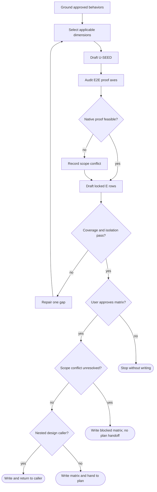

# Wayne Test Design

Define how an approved behavior will be proved before planning or implementation.

## Boundary and ownership

Produce one run-scoped `.wayne/runs/<topic>/test-matrix.md`; never write test code, implement, or execute tests. Read `../_shared/pipeline-id-contract.md`, `../_shared/e2e-contract.md`, and the [matrix template](templates/test-matrix-template.md) completely. The template is a readable starting point, not a Markdown grammar.

The matrix is working state for one run: it carries live Status through plan, work, and verify, and dies at ship. The durable home of the E2E contract is the living spec's `## Verification`, which `wayne-mind-explode` absorbs this matrix into at spec-writing time. Author the E layer so that absorption is lossless.

The matrix has two state owners:

- `wayne-test-design` authors E rows and initializes their locked Status to `⬜`; only `wayne-verify` later changes it to `✅/❌`.
- This skill proposes behavior-level `U-SEED` rows at `☐`; `wayne-plan` re-authors, binds, and locks them to implementation units before `wayne-work` may set `☑`.

If the topic's living spec already carries an E2E contract in `## Verification`, absorb its complete meaning once and extend missing observable paths. The spec remains the SSoT across runs; this matrix is the authoritative live copy only until ship. Never maintain a second authored copy.

An explicit user-approved path wins. Otherwise write `.wayne/runs/<topic>/test-matrix.md`, one per run — the run directory already scopes it, so the filename carries no date or sequence number.

## Dimension menu

| Dimension                 | Use only when the behavior has                   |
| ------------------------- | ------------------------------------------------ |
| positive / negative       | success or valid-but-disallowed branches         |
| edge / invalid / boundary | range edges, malformed types, or explicit limits |
| concurrency               | multiple actors on shared mutable state          |
| error-path                | a reachable downstream/startup/partial failure   |
| persistence               | a real write/reload/restart boundary             |

This is a considered menu, not a quota. Omit structurally impossible dimensions. Write `none — <reason>` only when a competent reviewer would expect the dimension and should be able to challenge its exclusion. Merge cases that prove the same branch.

## E2E isolation contract

Before writing E rows, classify each candidate by exactly one primary proof axis: `functional`, `policy/capability attestation`, `aggregate/fan-out`, or `resilience/cleanup`.

- Split a prerequisite that may terminate before the target behavior. Strict policy rejection cannot also prove later streaming, resume, hooks, or cleanup.
- Use provider-specific rows whenever behavior, limitations, or evidence differs by provider. Span providers only when aggregation itself is the requirement.
- A positive capability row must name the native runtime field, event, or provider record proving the effective capability. Flags, argv, help, and accepted config prove requested intent only.
- If a claimed capability has no native proof, record a capability/spec conflict and stop plan approval; do not author a knowingly unreachable positive row. A specified fail-loud rejection may have its own negative row.
- A supported weaker functional mode may bypass strict attestation only when its observable visibly requires the literal `POLICY UNVERIFIED`; it never satisfies the strict capability requirement.
- Declare every row's kind and proof layer per `../_shared/e2e-contract.md`. Axis and layer answer different questions: the axis says what the row proves, the layer says where the evidence is taken. A row whose claim names a person doing something is never closable from below that layer, however green the service call is. Every user goal gets exactly one `goal-walk` row at that user's own layer; prerequisite, attestation, aggregate, and cleanup rows stay `path`.

## UI control graph

When the behavior reaches a user interface, model it before writing rows:

- **Nodes** — reachable states: a page, a tab, a dialog, one step inside a dialog.
- **Controls** — every visible control on each node: button, link, form submit, menu item.
- **Edges** — one `edge` row per control, asserting the state change it produces.

Coverage then becomes checkable in both directions: a control enumerated on a node and appearing in no edge row is a hole in the matrix, and a node no edge reaches is unreachable product. The `goal-walk` rows sit on top of that graph, crossing those nodes end to end.

A rendered component is a node property, never an edge. A DOM test with a mocked handler proves the handler is bound, not that it does anything. A screenshot cannot tell a dead control from a live one, because a dead control looks perfect. Only the state change after the action is evidence.

## Flow

```mermaid
flowchart TB
    A["Ground approved behaviors"]
    B["Select applicable dimensions"]
    C["Draft U-SEED"]
    D["Audit E2E proof axes"]
    E{"Native proof feasible?"}
    X["Record scope conflict"]
    F["Draft locked E rows"]
    G{"Coverage and isolation pass?"}
    R["Repair one gap"]
    H{"User approves matrix?"}
    I{"Scope conflict unresolved?"}
    J{"Nested design caller?"}
    K(["Write blocked matrix; no plan handoff"])
    M(["Write and return to caller"])
    S(["Stop without writing"])
    W(["Write matrix and hand to plan"])
    A --> B --> C --> D --> E
    E -->|"no"| X
    E -->|"yes"| F
    X --> F
    F --> G
    G -->|"no"| R
    R --> B
    G -->|"yes"| H
    H -->|"no"| S
    H -->|"yes"| I
    I -->|"yes"| K
    I -->|"no"| J
    J -->|"yes"| M
    J -->|"no"| W
```

## Process

### A. Ground approved behaviors

Read the spec, decision log, plan, bug report, or converged direct request in that order; route unconverged intent upstream. Map every named requirement and test-relevant decision, non-goal, and failure semantic. For a bug, preserve the reproducing regression case. Search matching KB lessons when available; cite each matched lesson in its row, or record `Lessons: none matched`. Absorb any existing E2E contract before adding rows.

### B. Select applicable dimensions

Decompose by behavior, not speculative implementation units. Walk the menu for each behavior, keep distinct reachable branches, and cut framework tests, impossible states, and duplicate boundaries. Record only reviewer-surprising exclusions.

### C. Draft U-SEED

Clearly label provisional U-SEED coverage so `wayne-plan` knows it must re-author and lock it. Each scenario must communicate a concrete input or precondition, action, and observable expected result, including multiple branches when behavior requires them. This is a semantic scenario contract, not a required arrow count or sentence shape. Use `unit` or `integration` layer and Status `☐`; if none are sound, state that with a reason. Do not bind rows to implementation units that do not exist yet.

### D/E. Audit E2E isolation and evidence

In the template's `E2E Proof-Axis Audit`, list functional, attestation, aggregate, and cleanup rows by provider. For every capability claim, name its native evidence or record the exact scope conflict. Check that no prerequisite prevents reaching the behavior an E row claims to prove. The axis cell is a structured enum; whether the scenario actually proves that axis is an AI judgment over the complete behavior and evidence, never a keyword or substring classification.

When a UI is involved, enumerate the control graph in that same audit: the nodes, the controls visible on each, and the edge row covering each control. Enumerating what exists is the limit of this audit — a control the product needs and nobody wrote cannot appear in it, which is why the goal-walk rows are audited against the user's goals rather than against the graph.

### F. Draft locked E rows

Carry the information owned by `../_shared/e2e-contract.md`: one real user path, one kind, one proof layer, concrete process/data/entrypoint, one user-visible observable, one proof axis, and initial Status `⬜`. A Markdown table is recommended, not mandatory grammar. Transport proxies such as `200 OK` are not observables. When no user-observable path exists, record an explicit reason instead of inventing a row. When a runtime exists only at a fixed host, port, database, cwd, or main worktree, pin that location in `Env: process`; naming only the start command is insufficient.

A `goal-walk` row's observable is the terminal state of the goal, never an optimistic intermediate: an input box that emptied is not evidence, the message appearing in the transcript with an answer beside it is. Each stop along the walk also names the surrounding surfaces it checks — nav highlight, sidebar, status line — because a panel rendering nothing and a panel saying "nothing yet" are identical to a smoke test and opposite to a reader.

### G. Cross-check

Require every requirement, test-relevant decision, and matched lesson to map to a U or E row or an explicit non-testable rationale; every user path to map to E; every E row to have one axis, one declared proof layer no weaker than its claim, reachable prerequisites, correct provider granularity, and feasible evidence; every user goal to have exactly one `goal-walk` row; every control enumerated in the control graph to appear as exactly one `edge` row; and every status/column owner to remain intact. Summarize requirement-to-proof coverage in any compact, readable form. Use AI review of the complete sources and matrix for ownership, coverage, axis correctness, reachability, observability, capability claims, IDs, and statuses. Tables, headings, enums, counts, and lexical proxies may help navigation but are not separate semantic gates.

### H/I/J. Approve and route

Present dimensions kept, challengeable omissions, proof conflicts, and the matrix. Write only after approval. An unresolved scope conflict produces a blocked matrix and stops without a plan handoff. When invoked by `wayne-mind-explode` or `wayne-plan`, return the written matrix to that caller so it can reference the SSoT; do not auto-advance. Only a standalone, unblocked run emits a return-only handoff to `wayne-plan`. Never plan, implement, or run it here.
