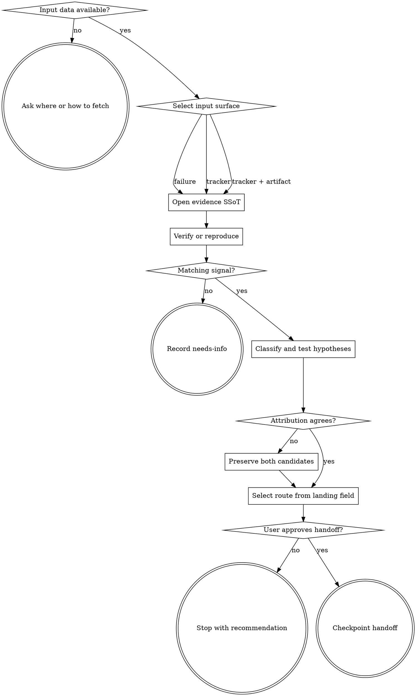

# Wayne Triage

Turn one failure or tracker item into one evidence-backed next route.

## Boundary

Triage is a read-only, single-pass decision layer: intake → verify → attribute →
route. It never implements the fix, loops until green, mutates tracker state, or
writes the KB. A customer-visible outage gets generic mitigation such as rollback,
drain, or capacity first; diagnosis follows.

Every claim and route must land in one evidence file. No root-cause evidence means
no fix route. A `fix-now` verdict describes the next action; triage still does not
edit product code.

## Routes

| Input signal | Load | Required route behavior |
|---|---|---|
| Raw crash, hang, wrong output, perf regression, flaky test, config/env failure | [symptom playbooks](references/symptom-playbooks.md) | Run every matching signal; never force one when none matches |
| Issue, external PR, Jira ID/body | [tracker triage](references/tracker-triage.md) | Recommend one category/state; never change labels, state, assignee, or status |
| Tracker item with attached failure artifact | both references | Complete tracker intake, then every matching symptom path |
| Large log, 2+ boundaries, or 2+ testable hypotheses | [dispatch contracts](references/subagent-dispatch.md) | Gather in parallel; main agent alone attributes and routes |
| Data absent and no fetch method | none | Ask one where/how question; stop without evidence or route |
| Data exists but no symptom signal matches | symptom playbooks | Record `unknown`, all signals false, route `needs-info`, ask for the smallest missing observable |

## Flow

## Process

### A. Require user-directed data

Use data already pasted, a supplied local path, or the exact fetch command/method
the user named. With only an ID or vague reference, ask exactly one direct question
for where the item lives or how to fetch it, then wait; an imperative request is
not a question. End the response with that single `?` or `？`; do not include a
second question. Do not infer a tracker or call an API. Open no evidence file until
data exists.

### B. Select the surface

Choose failure, tracker, or tracker-plus-failure from observable input and load
only the references named in the Routes table. For a tracker enhancement, no bug
repro is required; verify the request against the codebase and derive testable
acceptance criteria. A tracker bug still requires a failing repro before any fix
route.

### C. Open the evidence SSoT

Read [the evidence contract](references/evidence-file-template.md), then create
exactly one `<cwd>/.wayne/triage/<date>-<slug>.md`. Quote the symptom verbatim and
tag claims `[OBSERVED]`, `[INFERRED]`, or `[UNCERTAIN]`. Search relevant KB and
prior triage frontmatter by concept; reuse a prior verdict only after verifying it
still holds.

Even weak data is evidence of what is missing. If no symptom playbook matches,
fill `symptom_class: unknown`, `cause_category: unknown`, set every signal false,
record the missing observable in the repro section, and finish as `needs-info`.
Never select a nearby playbook merely to keep moving.

### D. Verify or reproduce

Run the supplied repro or verify the quoted tracker claim. Record the exact command,
rate, and observed result. A failed tracker repro routes `needs-info`. For heavy or
multi-component evidence, dispatch independent scouts/testers using the bundled
contracts; they write structured fields into the same SSoT and never choose a route.

### F. Classify and eliminate

Keep symptom pattern and cause category independent. Record all matching signals,
`est_lines`, and `blast_radius`: shared means a public/exported interface, schema,
migration, config default, cross-component contract, or a surface consumed in at
least two places. Run every matching playbook.

Build one falsifiable hypothesis per matrix column. Test one variable at a time in
cheapest-to-disprove order; `--` eliminates. Trace the bad value backward to its
source and cite every matrix verdict.

### G. Attribute without hiding conflict

Compare symptom layer with confirmed cause layer. When they agree, name the owner,
confidence, and a cited reasoning chain. When they disagree and evidence cannot
decide, keep both candidates and select `uncertain`; never rank one away silently.

### H. Select one route

`route.justified_by` must name the checkable landing field that forces the verdict:

| Verdict | Predicate |
|---|---|
| `fix-now` | cause certain; failing repro exists; ≤10 lines; one file; internal |
| `test-then-fix` | small certain bug but failing test is still missing |
| `iterate-in-a-loop` | internal; ≤100 lines; pass/fail eval exists |
| `needs-plan` | >100 lines or shared blast radius |
| `escalate-architecture` | 3+ failed fixes or each fix creates another break |
| `escalate-incident` | customer-visible, cross-team, or unsolved about one hour |
| `route-to-owner` | confirmed cause belongs to another owner |
| `uncertain` | symptom and cause candidates remain unresolved |
| `needs-info` | data/repro insufficient or no signal matches |

### I. Gate and hand off

Present the route and stop for approval. On approval, invoke `wayne-checkpoint`
handoff with the evidence file as snapshot and the selected next stage. The next
prompt is behavioral, names interfaces/contracts and acceptance criteria, excludes
stale line numbers, and states out-of-scope. For an external owner/incident/tracker,
render [the triage report](templates/triage-report.md). Never auto-run the next stage.

## Red lines

- No product fix, implementation plan, tracker mutation, KB write, or unrequested commit.
- No route from a hunch, missing repro, feel-word, or uncited field.
- No raw large-log dump returned into main context; structured fields only.
- No bespoke handoff format and no line-number-dependent next prompt.
