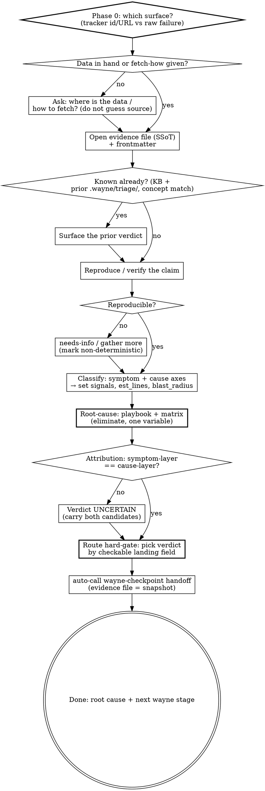

# Wayne Triage

> 先分诊,再确诊,最后开刀 —— 三件事,别混成一件。

Take anything broken, isolate root cause on evidence, decide where it goes next.
This skill does the FIRST job only: classify, root-cause far enough to route with
confidence, then hand off on a human gate. It is the **entry point to the Wayne
pipeline**, not a stage inside it — it diagnoses and dispatches, it does not
implement, fix, or ship.

## Inherits from ~/.claude/CLAUDE.md

Inherits the Wayne control-plane invariants; does NOT redeclare them (Language /
Engineering Principles — SSoT, Fail-Loud, Delete>Add, single responsibility /
Code Standards / Behavior / proportional effort). This skill only specifies the
triage workflow below.

## Triage is not debug, not fix, not fetch

The distinctions this skill exists to enforce. Conflating them is the failure mode.

| Job | Question | This skill? |
|---|---|---|
| **triage** | what broke, why (root cause), where does it go next | ✅ yes |
| debug | prove the root cause down to the exact line | only far enough to route |
| fix | make it green | ❌ route it out (≤10-line obvious fix is the sole exception) |
| fetch data | pull the issue / ticket / log from a source | ❌ user-driven only (see Phase 0) |
| write KB | persist the lesson | ❌ route to wayne-compound / wayne-manner |

- **Single-pass**: classify → root-cause on evidence → route. Never a fix→eval→fix loop.
- **Single responsibility**: triage decides + routes. Fetching, fixing, testing, and KB-writing are other owners' jobs — triage hands to them, never absorbs them.
- Customer-visible outage → a **generic mitigation** (rollback / drain / add capacity) to stop the bleeding comes FIRST, then triage. Mitigation is not a fix; it buys time.

## The Iron Law

```
NO ROUTING, NO FIX WITHOUT ROOT CAUSE ON EVIDENCE FIRST.
```

"Probably X, let me patch it" = STOP, go to Phase 4. Symptom fixes are failure.
Evidence = a log line / artifact / repro you can cite — never a hunch.

## Two surfaces, one spine

Triage takes input from two surfaces. Same spine (evidence-on-disk SSoT →
verify → root-cause → human-gate route); the middle phases differ.

| Surface | Input looks like | Middle deep-dive |
|---|---|---|
| **failure** | a log / stacktrace / crash / hang / flaky test / perf number | `references/symptom-playbooks.md` |
| **tracker** | `#42` / issue URL / an external PR / `SWDEV-123` / "triage my issues" | `references/tracker-triage.md` |

Pick the surface in Phase 0 from the input: a tracker id/URL → tracker; raw
failure data or "why is X broken" → failure. When both (a bug report WITH a log
attached) → run tracker intake, then dive with the symptom playbook.

## When to Run

- **Manual:** `/wayne-triage <log path | failure description | #id | ticket>`.
- **Auto-trigger:** the bilingual phrases in the description.

**Skip when:** cause is obvious AND fix is ≤10 lines (proportional effort — just
fix it), or you already know the root cause and only need the patch.

## Context discipline (HARD-GATE)

Triage eats context — logs run to tens of thousands of lines, multi-component
greps and hypothesis trials pile up. The main agent ORCHESTRATES and DECIDES; the
heavy reading is dispatched to subagents. This is a HARD-GATE, not a suggestion —
a soft "prefer to dispatch" gets negotiated away the moment reading it yourself
looks faster.

```
HARD-GATE: the main agent MUST NOT Read / cat a log or artifact > ~2000 lines.
To see it → dispatch a subagent and take back only the structured fields.
Catch yourself reading a big log → STOP, write a dispatch instead.
```

| Phase | Who | Dispatch when |
|---|---|---|
| 0 Intake · 1 Reproduce · 2 Classify | main | — (light; classification IS the routing decision, keep on main) |
| 3 Boundary evidence | **subagent, parallel** | log > ~2k lines OR ≥2 component boundaries |
| 4 Hypothesis matrix | **subagent, one per hypothesis** | ≥2 hypotheses need log-grep / trial |
| 5 Route | main | — (human-gate decision) |

**Pre-phase self-check (run before Phase 3 and Phase 4):**

- Does this step need to read a log > 2k lines? → dispatch, don't read it on main.
- Are there ≥2 independent boundaries / hypotheses? → dispatch one subagent each, in ONE message (parallel).
- Am I about to open a file just to "glance"? → that's the rationalization; dispatch.

Contracts that keep context bounded (full prompt templates + output examples in
`references/subagent-dispatch.md` — use them so dispatching is cheaper than reading):

- **Subagents return only evidence-file fields** (boundary verdict, matrix row, attribution) — never raw log dumps, never narrative.
- **State flows through the evidence file (SSoT), not the prompt chain.** Subagent writes findings to the file AND returns the summary fields; main reads the file.
- **Independent work goes out in ONE message, in parallel** — separate boundaries / hypotheses share no state.

## Flow



## Process

### Phase 0 — Intake: pick surface, get data, open the evidence file (SSoT)

- **Pick the surface** (failure vs tracker) from the input — see "Two surfaces".
- **Get the data — user-driven, never guessed.**
  - Data already in hand (log pasted, path given, issue body quoted) → read it, proceed.
  - User told you HOW to fetch ("pull SWDEV-123 with cvs-jira-workflow", "`gh issue view 42`", "log is at /path") → do exactly that, then proceed.
  - Data not in hand AND no fetch method given → **do NOT assume a source or auto-call an API.** Ask the one question: "where is the data / how should I fetch it?" Then follow the answer.
- **Open ONE evidence file** — the SSoT for this triage. Fill `references/evidence-file-template.md` including its frontmatter.
  - Path: `<cwd>/.wayne/triage/<date>-<slug>.md` (gitignored). Findings live here, not in the prompt chain — structured artifacts on disk are recoverable, auditable, and far more stable than prose held in context.
- Capture: symptom as ONE **verbatim** line (quote log/error + `file:line`), when it started, artifact paths. Tag every claim `[OBSERVED]` / `[INFERRED]` / `[UNCERTAIN]`.
- → verify: surface chosen; data obtained the way the user specified; evidence file exists with frontmatter; symptom verbatim.

### Phase 1 — Check what's already known, then reproduce / verify

Before building anything from scratch, check whether this failure or its root
cause is already known — reading knowledge is triage's job; only *writing* it is
routed out (Delete>Add: don't re-derive a cause the KB already holds).

- **Read the KB first (concept, not keyword).** Grep the personal KB (`/work/kb/` — `how-to/`, `decisions/`, prior lessons) by concept: symptom class + component + cause. A hit → surface the known cause/fix. This may short-circuit the whole matrix: known root cause + a known ≤10-line fix → go straight to a `fix-now` route (still gated by Phase 5). Reading the KB never writes it.
- **Seen-before in `.wayne/triage/` (concept, not keyword).** Read the frontmatter of prior `.wayne/triage/*.md` entries; match by `symptom_class` + `cause_category` + `component`. A prior match → surface its verdict ("we triaged this on <date> → <route>"), bump `repro_count`, confirm it still holds before redoing work.
- **Reproduce / verify the claim.** Failure surface: reproduce from the steps. Tracker surface: reproduce the bug, or (PR) check out the diff and run its tests — see `references/tracker-triage.md`.
  - Not reproducible → mark `non-deterministic` (candidate flaky — see the flaky playbook); on the tracker surface this is a strong `needs-info` signal. Do NOT guess.
- → verify: KB + `.wayne/triage/` both consulted; a repro command in the evidence file, OR an explicit non-deterministic note + data-gathering plan.

### Phase 2 — Classify on two axes → set the landing fields

Two INDEPENDENT axes — the symptom you see is NOT the root-cause category.

- **Axis A — symptom pattern:** `crash | hang | wrong-output | perf-regression | flaky | config-env` (failure), or `bug | enhancement` (tracker).
- **Axis B — cause category:** `logic | config | dependency | environment | infra-hardware | test-artifact | architecture`. Rarely singular — note the web of factors.

Set the routing landing fields now, so Phase 5 can gate on them:

- `signals{}` — boolean flags that select the symptom playbook.
- `est_lines` — rough fix size.
- `blast_radius` — `internal` (self-contained, reversible) vs `shared` (touches an exported/public interface, a module imported in ≥2 places, a cross-component contract, a schema/migration, or a config default). Grep to decide — is this symbol imported elsewhere? — do not eyeball it.

- → verify: both axes + `signals` + `est_lines` + `blast_radius` recorded; symptom marked distinct from suspected cause.

### Phase 3 — Evidence at the boundaries (multi-component only)

- Instrument each boundary: log what data ENTERS and EXITS each layer. Dispatch one subagent per boundary (parallel) when the log is heavy.
- Run once to see WHERE it breaks (secrets→workflow ✓, workflow→build ✗), then dig only into that layer.
- Fail-Loud check: is a `try/except` / sentinel default (empty string, UTC, `[]`) swallowing the real signal? Name it.
- → verify: evidence pins the failing layer; subagents returned structured fields (not raw logs); no guesses.

### Phase 4 — Root-cause: playbook + hypothesis matrix (eliminate, one variable)

- Run the ONE matching playbook (`symptom-playbooks.md` / `tracker-triage.md`) to seed candidate causes.
- Each matrix row = ONE testable hypothesis. Advance by **elimination**, not confirmation. Mark `++` / `+` / `--` / `n/a`; any `--` kills that hypothesis.
- Test order: cheapest-to-disprove → most-diagnostic → least-invasive (read-only before any code change). One variable per test.
- Trace the bad value BACKWARD to its source; the fix-point is the source, not the symptom.
- → verify: matrix in the evidence file; each row has a verdict backed by an `[OBSERVED]` citation.

### Phase 5 — Attribution + Route (HARD-GATE)

**Attribution first — copy or flag, never judge.** Compare symptom layer (Phase 2)
vs confirmed cause layer (Phase 4):

- **Agree** → attribute to that component, record `confidence` + a `reasoning: step→observation→source` chain.
- **Disagree** → verdict `UNCERTAIN`. Carry BOTH candidates; never silently pick the higher-confidence one (a downstream ranker would re-select it and bury the conflict).

**Route hard rules — three gates, in order:**

1. **Eligibility gate.** Every route verdict MUST be triggered by a checkable landing field in the evidence file (a line count, a failure count, an attribution field comparison, an eval-command existence, a repro count). `route.justified_by` must point at that field. Can't cite a checkable field → you are NOT ready to route; return to Phase 4.
2. **Bug gate.** A bug routed toward a fix MUST carry a repro / failing-test skeleton in the evidence file. No repro → route is `needs-info` (tracker) or "keep gathering" (failure), never a fix route. No fix without a failing test.
3. **Verdict selection** — pick by the checkable predicate, not by feel:

| Route verdict | Checkable predicate | Next Wayne stage |
|---|---|---|
| **fix-now** | root cause certain AND `est_lines` ≤10 AND single file AND `blast_radius: internal` | do it → wayne-code-review → wayne-ship |
| **test-then-fix** | bug, cause certain, small, but no failing test yet | wayne-test-design → (fix) → wayne-ship |
| **iterate-in-a-loop** | not fix-now, `blast_radius: internal` AND `est_lines` ≤100 AND a pass/fail eval command exists | wayne-test-design (eval=the test) → wayne-work / autonomous loop |
| **needs-plan** | `est_lines` > 100 OR `blast_radius: shared` | wayne-test-design → wayne-plan → wayne-work |
| **escalate-architecture** | 3+ fixes already failed, OR each fix spawns a new break | wayne-mind-explode |
| **escalate-incident** | customer-visible OR needs a 2nd team OR unsolved after ~1h | declare incident, page owner (out of pipeline) |
| **route-to-owner** | root cause sits in another team's component (attribution) | hand them the handoff packet (out of pipeline) |
| **UNCERTAIN** | symptom-layer ≠ cause-layer, evidence can't decide | present both candidates, ask user |
| **needs-info** (tracker) | repro failed OR information insufficient | post triage notes, await reporter |

**Then hand off — reuse the pipeline conductor, don't invent a format.** Present
the route to the user and STOP (never auto-execute). On approval, auto-call
`wayne-checkpoint handoff`:

- **snapshot** = the evidence file path (root cause + matrix + attribution all inside).
- **next agent** = the Next-Wayne-stage from the table.
- **next prompt** = a durable brief (interfaces / contracts / behavioral acceptance criteria + explicit out-of-scope; **no file:line, no line numbers** — the handoff may sit for days and paths go stale). See `templates/triage-report.md` for the pipeline-external case (owner / incident / Jira).

- → verify: evidence file ends with an attribution block + a routing verdict whose `justified_by` cites a landing field; handoff packet emitted; the user holds the decision.

## Anti-patterns

- Writing a fix during triage — triage classifies and routes; it does not patch (≤10-line obvious case is the sole exception).
- Routing a bug toward a fix with no repro / failing test — violates "no fix without a failing test"; route `needs-info` instead.
- Routing on a feel-word ("it's a big change", "feels like architecture") — every verdict cites a checkable landing field, or you return to Phase 4.
- Assuming a data source or auto-calling an API to fetch — fetch is user-driven; ask where/how, don't guess.
- Main agent reading a whole 10k-line log itself — dispatch a subagent, take back only structured fields.
- Subagent returning raw log excerpts or narrative — it must return evidence-file fields, or the main context drowns.
- Paraphrasing the symptom instead of quoting it verbatim with `file:line` — paraphrase drifts, breaks grounding.
- Writing `file:line` into the handoff brief — the brief outlives the line numbers; describe interfaces/contracts instead.
- Inventing a bespoke handoff format — reuse `wayne-checkpoint handoff`; one conductor owns pipeline transitions (SSoT).
- Silently picking the higher-confidence cause when symptom-layer and cause-layer disagree — emit UNCERTAIN, fail loud.
- Collapsing symptom and cause into one label ("it's a timeout") — two axes; a timeout symptom can have a config root cause.
- Batching multiple hypotheses into one test — one variable at a time, or you can't attribute the result.
- Writing the lesson into the KB yourself — triage does not persist lessons; that's wayne-compound / wayne-manner, invoked separately, not a triage route.

## Files Written

- `<cwd>/.wayne/triage/<date>-<slug>.md` — the evidence file (SSoT for one triage), with frontmatter for indexing / seen-before. Under `.wayne/` so it is already gitignored (project convention: `.wayne/.gitignore` = `*`); `mkdir -p .wayne/triage` on first write.
- A handoff packet via `wayne-checkpoint handoff` → `.wayne/checkpoints/` (pipeline-internal), or a rendered `templates/triage-report.md` (pipeline-external owner / incident / Jira).

> Distilled 2026-07-08 from the local triage-agent pipeline, the autoresearch-x debug engine, superpowers systematic-debugging, mattpocock/skills triage, the Wayne KB schema, and Google SRE incident practice; forged by wayne-skill-forge.
