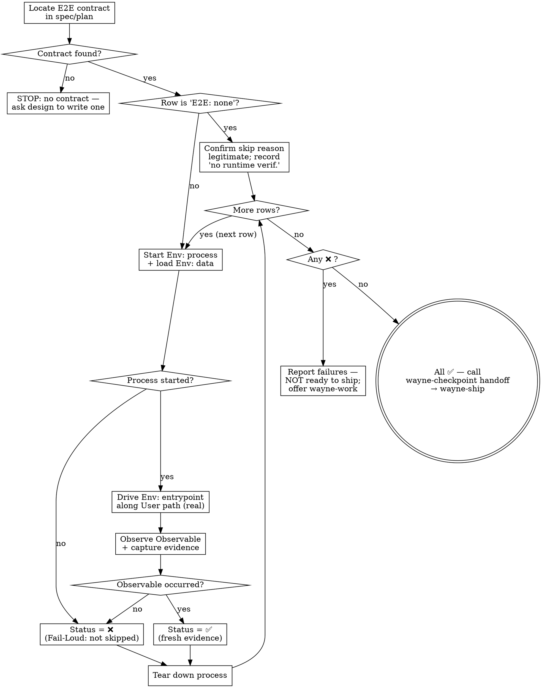

# Wayne Verify

Runtime end-to-end verification. The pipeline never otherwise RUNS the feature —
`wayne-code-review` reads the diff and never starts the app. This skill is the only
one that stands up the real environment, drives the real user path, and confirms the
feature works in actual use.

It executes the **E2E Verification Contract** carried in the spec/plan and is the
sole mutator of that contract's `Status` column.

<HARD-GATE>
Every contract row must be ✅ before `wayne-ship` may commit. A row that was never
run, a process that won't start, or an observable that didn't appear blocks shipping.
Unit tests passing does NOT satisfy this gate — it has zero bearing here.
</HARD-GATE>

## Inherits from ~/.claude/CLAUDE.md

This skill inherits the Wayne control-plane invariants and does not redeclare them. The following are assumed and MUST NOT be repeated below:

- Language Rules (Chinese to user, English to files)
- Engineering Principles (KISS / YAGNI / DRY / SSoT / Fail-Loud / Push-Don't-Poll / Delete>Add)
- Code Standards (uv run python, markdown tables)
- Behavior Baselines (Think Before / Simplicity / Surgical / Goal-Driven)
- Skill invocation rule (proportional effort)

This skill only specifies the runtime verification workflow.

## Contract Format — Single Source of Truth

The contract format is **not** redeclared here. Read it once:

**`_shared/e2e-contract.md`** — the locked column format
(`| # | User path | Env: process | Env: data | Env: entrypoint | Observable (pass = ?) | Status |`),
the three fixed environment sub-columns, the Observable-must-be-a-real-outcome rule,
the `E2E: none — <reason>` skip line, and the Status lifecycle.

`wayne-mind-explode` WRITES it, `wayne-plan` CARRIES it, `wayne-work` BUILDS against
it, `wayne-code-review` ignores it, **this skill EXECUTES it**, `wayne-ship` GATES on
it.

## Files Written

Updates the `Status` column of the E2E contract table in-place (the spec/plan file).
Writes evidence artifacts (captured output, response bodies, DB-state dumps,
screenshots, logs) under a run scratch dir. Status symbols (⬜/✅/❌), file:line
references, command output stay English in Chinese prose.

## Checklist

You MUST create a task for each and complete in order:

1. **Locate the contract** — find the E2E table in the spec/plan
2. **Validate skip declarations** — confirm any `E2E: none` reason is legitimate
3. **Per row: start the environment** — launch `Env: process`, load `Env: data`
4. **Per row: drive the user path** — go through `Env: entrypoint`, do `User path` for real
5. **Per row: check the observable** — confirm `Observable` happened, capture evidence
6. **Per row: flip Status + tear down** — ⬜ → ✅/❌ with fresh evidence, stop the process
7. **Gate + handoff** — any ❌ → not ready, offer wayne-work; all ✅ → handoff to wayne-ship

## Process Flow



---

## Phase 1: Locate the Contract

Find the E2E contract table in the design artifacts.

```bash
ls -t docs/specs/*.md docs/plans/*.md 2>/dev/null
grep -rln "Env: process" docs/specs/ docs/plans/ 2>/dev/null
```

Read the matching file and extract the contract table plus any `E2E: none — <reason>`
lines beneath it.

**Fail-Loud:** if no contract exists, do NOT invent verification and do NOT pass the
gate. Stop and report: "No E2E contract found — design (`wayne-mind-explode`) must
write one before runtime verification can run." A feature with no contract is
unverifiable, not verified.

---

## Phase 2: Validate Skip Declarations

For each `E2E: none — <reason>` line, confirm the reason is legitimately un-observable
(pure refactor, pure algorithm, pure internal config — no user-visible path).

- Legitimate → record "no runtime verification applicable" for that item and move on.
- Suspect (the "refactor" actually changes user-visible behavior) → reject the skip,
  flag it, and require a real contract row before proceeding.

Never invent verification for a legitimate skip. Never accept a skip that hides a real
user path.

---

## Phase 3: Execute Each Row

This is the core loop. Run it **per contract row**, in order. Nothing here is a unit
test, a mock, or a stub — it is the real environment driven the real way.

### 3a. Start the environment

Launch `Env: process` against `Env: data`.

```bash
# Example shapes — use the row's actual process/data/entrypoint.
# Server:
cd <project-dir> && nohup uv run python scripts/dashboard_server.py > /tmp/verify-proc.log 2>&1 &
# CLI: nothing to start as a daemon; the entrypoint IS the invocation in 3b.
```

**Fail-Loud rule:** a process that will not start is `❌`, never skipped. Capture the
startup log as evidence of the failure and move to teardown for that row. "Couldn't
start it" is a verification result, not a reason to omit the check.

Wait for readiness with a real signal (port open / health line in the log / DB
reachable) — do not poll blindly; watch for the readiness event.

### 3b. Drive the user path

Go through `Env: entrypoint` and perform `User path` the way a real user would:

| Entrypoint kind | How to drive it (real) |
|-----------------|------------------------|
| Browser `/` (UI) | Use the local `verify` / `run` skill capability or available browser-driving tools to click/type along the user path. Real DOM interaction, not an API shortcut. |
| HTTP API | Issue the real request(s) a client would send, in sequence. |
| CLI command | Invoke the real command with real args, as the user would type it. |

Do NOT substitute a unit test, a mocked dependency, or an internal function call for
the user path. If the user clicks a button, something must click the button.

### 3c. Check the observable

Confirm the `Observable (pass = ?)` actually happened — the real user-visible outcome,
never a transport proxy. **Evidence before claims.** Capture concrete proof:

| Observable kind | Evidence to capture |
|-----------------|---------------------|
| State change (DB/Jira/file) | Query the actual state and show the new value (e.g. ticket status now `Analyzed`) |
| UI change | Screenshot or rendered-DOM snapshot showing the new state |
| Output/artifact | The captured response body, generated file, or downloaded artifact |
| Disappearance/removal | Before/after listing showing the item is gone |

A `200 OK`, "no exception thrown", or "function returned True" is NOT evidence the
feature worked — it proves the wire moved. Record what you actually saw.

### 3d. Flip Status + tear down

- Observable occurred, with fresh evidence captured **this session** → `⬜ → ✅`.
- Observable did not occur (or process wouldn't start) → `⬜ → ❌`, attach the failure
  evidence.

Never claim `✅` from memory, from a prior run, or because the code "looks right" — only
from having driven it just now. Then tear down the process cleanly:

```bash
ps aux | grep verify-proc | grep -v grep | awk '{print $2}' | xargs -r kill -9 2>/dev/null
```

Update the `Status` cell in the contract table in the spec/plan file. **This skill is
the only mutator of that column.**

---

## Phase 4: Gate + Handoff

After all rows have run:

### If any ❌

The work is **NOT ready to ship**. Report (in Chinese discussion, English artifacts):

```
RUNTIME VERIFICATION: FAILED
═══════════════════════════════
Rows run: N   ✅ M   ❌ K
失败行:
  #3 — Observable 没出现: <what was expected> vs <what happened>
       证据: /tmp/verify-...  (log / screenshot / state dump)
下一步: 把失败行交回 wayne-work 修复，修完再跑 wayne-verify。
```

Offer to hand back to `wayne-work` to fix the failing rows. Do NOT emit a ship handoff
while any row is ❌.

### If all ✅

```
RUNTIME VERIFICATION: PASSED
═══════════════════════════════
All N contract rows ✅ (driven this session, evidence captured).
E2E: none rows confirmed legitimate: <list or none>
准备好 ship。
```

Then, as the final step, call **`wayne-checkpoint` in handoff mode** to emit a handoff
packet pointing to `wayne-ship` as the next agent. The handoff-packet mechanism is
defined in `wayne-checkpoint` — this skill only invokes it; it does not implement or
advance it.

---

## Integration with Other Skills

```
wayne-mind-explode → wayne-plan → wayne-work → wayne-code-review → wayne-verify → wayne-ship
     (WHAT)            (HOW)        (BUILD)      (STATIC GATE)      (RUNTIME GATE)  (COMMIT)
```

- **After `wayne-code-review`** — code-review is pure-static (reads the diff, never
  runs anything). This skill is the runtime counterpart: it is the first and only step
  that actually executes the feature.
- **Reads from `wayne-mind-explode` / `wayne-plan`** — the contract table in
  `docs/specs/` / `docs/plans/`. It does not author the contract; it executes it.
- **Hands back to `wayne-work`** — on any ❌, the failing rows return to build.
- **Gates `wayne-ship`** — ship's hard gate requires a fully-✅ contract (no ⬜, no ❌).
  This skill produces that state and the handoff packet to ship.

---

## Key Principles

- **Unit tests have zero bearing on this gate** — passing tests never flip ⬜; only a
  driven user path with a captured observable does.
- **Evidence before claims** — `✅` requires fresh, captured proof from this session;
  never claim it from memory or because the code looks right.
- **Fail-Loud** — a process that won't start is `❌`, not skipped. "Couldn't run it" is
  a result, not an omission.
- **Observable, not transport** — pass means the real user-visible outcome happened, not
  `200 OK` / no-exception / returned-True.
- **Sole mutator of Status** — no other skill touches the contract's Status column.
- **Don't invent verification** — a legitimate `E2E: none` is recorded as such; a missing
  contract stops the gate rather than being faked.
- **Chinese for discussion, English for artifacts** — reports discussed in Chinese, the
  contract and evidence stay English.
