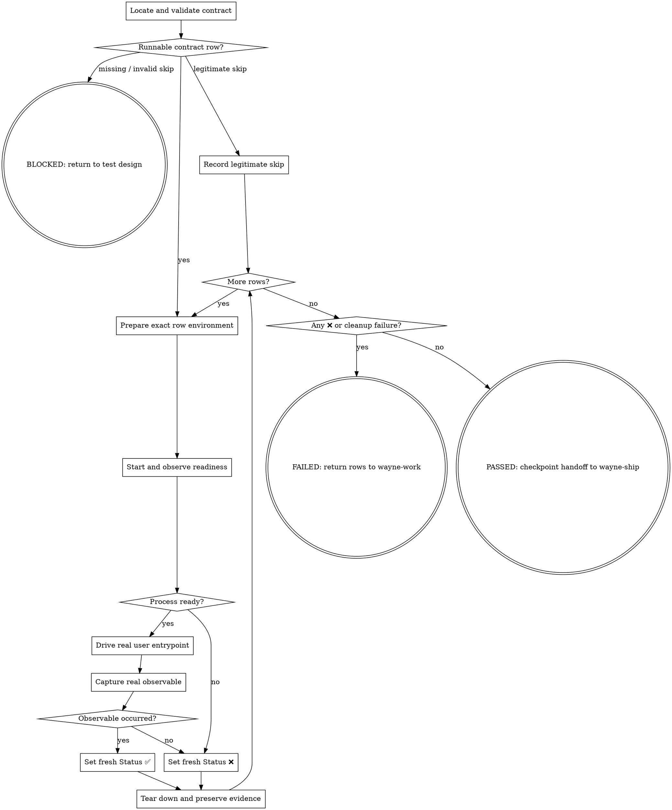

# Wayne Verify

Run the feature as its user runs it and decide the runtime gate from fresh evidence.

## Boundary and contract owner

Read `_shared/pipeline-id-contract.md` and `_shared/e2e-contract.md` completely. They own
the locked table, `E2E: none` declaration, and Status lifecycle. Use the exact
authoritative `docs/test-matrix/` path carried by the handoff or explicitly supplied
by the user; never select or mutate the read-only snapshot inside a plan. Do not
author or repair the matrix.

This skill alone may change the E2E `Status` cells (`⬜/✅/❌`). Never change a
unit-integration status, another contract cell, or product code. Unit tests and
static review have zero bearing on this gate.

## Flow

## Process

### A. Locate and validate the contract

Select the carried matrix for this run and read its E2E layer plus relevant
requirements. If no contract exists, stop without running or editing anything;
route to `wayne-test-design`. Never invent verification.

Validate each `E2E: none — <reason>` against the actual requirement. Accept a skip
only when no user-observable path exists. If it hides a real path, reject it and
require test design to author a row; do not write or execute a replacement yourself.

### K. Record a legitimate skip

Record the approved requirement and why it has no user-observable path, without
editing the contract or inventing a runtime command. Then continue through the row
loop and final gate; a legitimate skip is neither `❌` nor `BLOCKED`.

### C. Prepare the exact row environment

Run every row in table order, including incoming `✅` or `❌`: those statuses are
historical, not evidence for this session. Create a run scratch directory and
capture the pre-run contract. Use the exact host/worktree, process, data, and
entrypoint named by the row; never substitute your cwd, another worktree, a mock,
or a convenient environment.

### D. Start and observe readiness

Start the declared process against the declared data. Wait for its real readiness
event—port, health event, log line, or DB signal—not blind sleeps. Preserve startup
logs. If the process exits or cannot become ready, record fresh `❌`; do not skip it
or drive a dependent entrypoint as proof.

### F. Drive the real user entrypoint

Perform the row's `User path` through its declared entrypoint exactly as a user
would: browser interaction for UI, real client requests for HTTP, or the real CLI
command. A unit test, internal function, helper, mock, or direct API shortcut is not
an E2E substitute.

### G. Capture the real observable

Capture the declared user-visible result in the scratch directory: rendered UI,
response/artifact, or actual external/file/DB state. `200 OK`, no exception, and a
true return value are transport signals, not proof. Compare the observed value with
the contract literally and retain both expected and actual evidence.

### P/N. Mutate only fresh Status

Set `✅` only after the observable appears in this session. Set `❌` when startup,
the user path, or the observable fails. Change only the row's Status cell; preserve
the unit layer and every other contract cell byte-for-byte.

### T. Tear down and preserve evidence

Stop the exact process after every row, including failure paths, and prove it no
longer owns its port/process/resource. Preserve readiness, drive, observable,
failure, and teardown evidence. Cleanup failure keeps the gate failed; never report
ship-ready while the verification process remains live.

### Q. Gate and route

- Missing contract or invalid skip: `RUNTIME VERIFICATION: BLOCKED`; route to
  `wayne-test-design` without a fabricated row.
- Any `❌` or cleanup failure: `RUNTIME VERIFICATION: FAILED`; report expected vs
  actual evidence and return failing row IDs to `wayne-work`. No ship handoff.
- All rows freshly `✅` and legitimate skips confirmed: `RUNTIME VERIFICATION:
  PASSED`; report evidence, then call `wayne-checkpoint` in handoff mode with
  `wayne-ship` as the next stage.

`PASSED` authorizes only that return-only handoff. It never authorizes commit,
push, PR creation, or invoking `wayne-ship`; stop after surfacing the packet.

Never turn inability to run, stale status, prior evidence, or provider/tool failure
into a pass.
