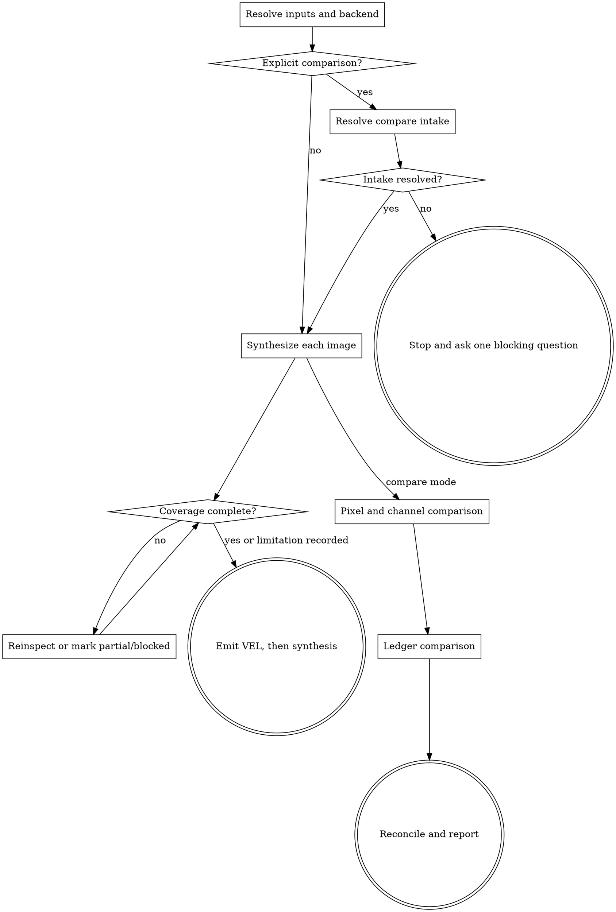

# Wayne Visual Synthesis

Turn inspectable images into traceable visual evidence. The Visual Element Ledger
(VEL) is the source of truth; every summary and comparison derives from it.

## Boundary and resources

- Single- and multi-image requests synthesize each image independently. Compare
  only when the user explicitly asks to compare, diff, or regression-test them.
- Measure and classify visual evidence; never issue a design-acceptance verdict.
- Missing images or observation backends stop the run with a loud, blocked result.
  Never infer content from a filename, alt text, or request.

Load only the direct resources required by the image or mode:

| Condition | Resource |
|---|---|
| every image | [VEL contract](references/vel-contract.md), [probe policy](references/synthesis-probes.md), [channel probe](references/channel_probe.py), and [hidden-signal probe](references/hidden_probe.py) |
| chart, table, diagram, document, map, equation, dense text/UI | [carrier contracts](references/carrier-contracts.md) |
| addressable object, layer, mask, DOM/SVG/OCR handle, or occlusion | [targetable structure](references/targetable-structure.md) |
| explicit comparison | [compare contract](references/compare-contract.md), [method catalog](references/compare-methods.md), and [render floor](references/compare_render.py) |

## Flow

## Process

### A. Resolve inputs and backend

Map every attachment, path, URL, or reference to one inspectable image. Use native
multimodal input, a vision tool, browser screenshot plus accessibility data, OCR,
or local image viewing. Supporting source text may verify a visual read; record any
conflict rather than silently choosing the prettier value.

Choose `image-reading`, `element-ledger`, `ui-ledger`, `text-ledger`,
`data-visual-ledger`, `diagram-ledger`, `document-ledger`,
`targetable-structure`, `multi-image-ledger`, or explicit `compare` from the request.
Multiple images alone never imply comparison.

### C. Synthesize each image

Run both scripts in [synthesis probes](references/synthesis-probes.md) on every
image. If a probe flags content, export and inspect the channel, bit-plane, or
spectrum; add confirmed hidden content to the VEL. State that DCT/DWT-coefficient
and deep/generative watermarks remain outside the probes' coverage.

Build the VEL in this order:

1. canvas limits and top-level regions;
2. leaf elements and exact visible text;
3. targetable structures when identity, geometry, layer, mask, or handle matters;
4. carrier semantic equivalents;
5. repeated groups, meaningful relationships, and quality issues;
6. coverage audit and confidence.

Follow [the VEL contract](references/vel-contract.md). Load carrier or targetable
contracts at their predicates above. Approximate only values that the image does
not print, label them approximate, and never invent unreadable content.

For OCR-only requests, still return a complete VEL. The verbatim reading-order
transcript is a `document` or `text-block` semantic equivalent, never the entire
result. Preserve punctuation, case, line breaks that carry meaning, and unreadable
ranges; do not translate, normalize, or paraphrase the transcript.

### D. Audit coverage

Every top-level region, text cluster, meaningful element, repeated group,
relationship, carrier, and quality issue must be accounted for or explicitly
partial/blocked. A carrier with missing required fields cannot be complete. Reinspect
an unexplained area; when evidence cannot resolve it, record the limitation.

The first user-visible conclusion or summary must appear after the VEL. Do not lead
with an executive summary, even when hidden content or a critical defect is found.

### E. Resolve compare intake

Before any metric runs, resolve all five gates from the request, repository config,
or one blocking question:

1. every reference maps 1:1 to a file;
2. the images show the same target;
3. the comparison is golden-baseline or symmetric;
4. a claimed golden and its declared copies are byte-consistent;
5. tolerance is fixed as byte identity, raw-pixel, perceptual, or explicit no-verdict.

Do not choose tolerance after seeing metrics. Golden deltas are framed as current
drift from truth; symmetric deltas remain neutral.

### G. Run pixel and channel comparison

Use the triage floor in [compare methods](references/compare-methods.md) and its
[script](references/compare_render.py): dimensions, exact hash, L1 map, changed
pixels, bbox/centroid, magnitude, color family, components, signed bias, and an
edge/SSIM cross-check when ambiguous. Run `channel_probe.py A B` for differences
hidden from the displayed composite. Name the method behind every number.

Exact hash may short-circuit further pixel metrics, but never per-image synthesis
or Level 2. Only hash equality proves byte identity.

### H. Run ledger comparison

Build a full VEL for every image even when bytes match. Follow
[the compare contract](references/compare-contract.md): report matched, added,
removed, and changed values for all VEL facets plus channel and hidden-signal
outputs. Cross-check every claimed semantic delta against pixel/channel evidence.
Unsupported disagreement is `read-noise`; supported content drift is `real-change`.

### I. Reconcile and report

Report pixel truth and semantic truth together. With no approved tolerance, state
the measurement and classification without pass/fail. With a tolerance, state its
form, value, producing method, and verdict. Never turn perceptual similarity into a
claim of byte identity.

## Red lines

- No summary before its VEL and no bare OCR transcript instead of a VEL.
- No comparison outside explicit compare mode.
- No guessed image set, same-target relation, golden, or tolerance.
- No eye-estimated pixel metric or silent fallback to a weaker method.
- No `complete` coverage with unexplained regions or missing carrier fields.
- No vague `etc.`, `various`, or uncounted repeated families.
